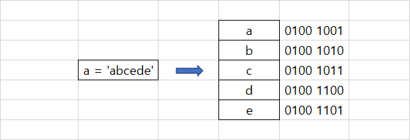

# Chapter 06. 문자열


## 01. 문자열


### 1.1 문자열의 개념

* 문자열은 시퀀스 자료형이다. 시퀀스 자료형은 리스트와 같이 데이터를 순차적으로 메모리에 저장하는 형식의 데이터이다.

  


### 1.2 문자열과 메모리 공간

* 컴퓨터는 문자를 직접 인식하지 못한다.
* 컴퓨터는 문자를 숫자로 변환하여 인식한다.
* 사람들은 문자를 숫자로 변환하기 위한 규칙을 만들었다. 이러한 규칙을 인코딩이라고 한다.
  * 대표적인 ASCII, 한글처리를 위한 CP949, MS949, UTF-8 등 이 있다.
* 일반적으로 이 규칙은 1개의 영문자를 1바이트, 즉 2의 8승 정도의 공간에 저장될 수 있도록 정하였다.
* 이러한 규칙을 이용하여 숫자와 문자를 맵핑하는 것이 바로 운영체제와 인터프리터의 역활 중 하나이다.


### 1.3 문자열의 인덱싱

* 문자열도 시퀀스 자료형이기에 리스트의 특징과 거의 같다.

```python
a = 'abced'

a[0] # a
a[-1] # d
```


### 1.4 문자열의 슬라이싱

```python
a = 'abced'

a[:2] #ab
a[-3:] #ced
```


### 1.5 문자열의 연산

```python
a = '1'
b = '2'

print(a+b)
```

```
12
```


### 1.6 문자열 관련 함수


### (예시)

```python
'abc'.upper()
```

```
ABC
```


### (정리)

|          함수명           |                             기능                             |
| :-----------------------: | :----------------------------------------------------------: |
|           len()           |                       문자열 개수 반환                       |
|          upper()          |                        대문자로 변환                         |
|          lower()          |                        소문자로 변환                         |
|          title()          |               각 단어의 앞글자만 대문자로 변환               |
|       capitalize()        |                    첫문자를 대문자로 변환                    |
|   count('찾을 문자열')    |         '찾을 문자열' 이 몇 개 들어 있는지 개수 반환         |
|    find('찾을 문자열')    | '찾을 문자열' 이 왼쪽 끝부터 시작하여 몇 번째에 있는지 반환  |
|   rfind('찾을 문자열')    | '찾을 문자열' 이 오른쪽 끝부터 시작하여 몇 번째에 있는지 반환 |
| startswith('찾을 문자열') |            '찾을 문자열' 로 시작하는지 여부 반환             |
|  endswith('찾을 문자열')  |             '찾을 문자열' 로 끝나는지 여부 반환              |
|          strip()          |                        좌우 공백 삭제                        |
|         rstrip()          |                       오른쪽 공백 삭제                       |
|         lstrip()          |                        왼쪽 공백 삭제                        |
|          split()          |      문자열을 공백이나 다른 문자로 나누어 리스트로 반환      |
|         isdigit()         |                 문자열이 숫자인지 여부 반환                  |
|         islower()         |                문자열이 소문자인지 여부 반환                 |
|         isupper()         |                문자열이 대문자인지 여부 반환                 |


### 1.7 문자열 표현과 이스케이프 문자


### (예시1)

* 다음과 같이 여러줄을 표현할 수 있다

```python
a = '''
It's Ok.
I'm Happy.
'''
```


### (예시2)

* 이스케이프 문자

```python
print('ABC\nDEF')
```

```
ABC
DEF
```


### (정리)

| 문자      | 기능                    | 특수문자 | 기능        |
| --------- | ----------------------- | -------- | ----------- |
| \\`enter` | 다음 줄과 연속임을 표현 | \\b      | 백 스페이스 |
| \         | \ 문자 자체             | \\n      | 줄 바꾸기   |
| \\'       | ' 문자                  | \\t      | `tab`키     |
| \\"       | " 문자                  | \\e      | `esc` 키    |


## 02. 문자열 서식지정

* 서식지정이란 어떤 형식을 가진 문자열을 말한다. 예를 들어 주민등록번호, 통화단위 등이 있다


### 2.1 f - string


### (예시)

* f'{}'

```python
year = 2022
month = 8
day = 5

a = f'{year}년 {month}월 {day}일'
print(a) 
```

```
2022년 08월 05일
```


### 2.2 % 서식


### (예시)

* '%자료형 %(값)'

```python
year = 2022
month = 8
day = 5

print('%d년 %d월 %d일' %(year,month,day)) 
```

```
2022년 08월 05일
```


### (정리)

* 변수의 자료형에 따른 서식

| 서식 |         설명         |
| :--: | :------------------: |
|  %s  |    문자열(string)    |
|  %c  | 문자 1개(character)  |
|  %d  |    정수(integer)     |
|  %f  | 실수(floating-point) |
|  %o  |        8진수         |
|  %x  |        16진수        |
|  %%  |     문자 % 자체      |


### 2.3 format()


### (예시)

* '{자료형}'.format(인수)

```python
year = 2022
month = 8
day = 5

print('{}년 {}월 {}일' .format(year,month,day)) 
```

```
2022년 08월 05일
```


### 2.5 패딩

* 패딩이란 데이터에 특정한 값을 채워서 데이터의 크기를 일괄적으로 조정하는 것


### (예시1)

```python
a = 'abcde'

print(f'{a:<10}') # 10칸을 주고 왼쪽 정렬
print(f'{a:^10}') # 10칸을 주고 가운데 정렬
print(f'{a:>10}') # 10칸을 주고 왼쪽 정렬

print(f'{a:@<10}') # 10칸을 주고 왼쪽 정렬, 빈칸은 @

```

```
abcde     
  abcde
     abcde
abcde@@@@@
```


### (예시2)

```python
print('%10d' %12) # 10칸을 주고 왼쪽 정렬
print('%-10d' %12) # 10칸을 주고 오른쪽 정렬

print('%10.3f' %1.2345) # 10칸을 주고 왼쪽 정렬, 소수점 셋째자리까지
print('%-10.3f' %1.2345) # 10칸을 주고 왼쪽 정렬, 소수점 셋째자리까지
```

```
        12
12        
     1.234
1.234     
```


### (예시3)

```python
print('{:>10s}'.format('apple')) # 10칸을 주고 오른쪽 정렬
print('{:<10.3f}'.format(1.23456)) # 10칸을 주고 왼쪽 정렬, 소수점 셋째자리까지
```

```
     apple
1.235     
```


### 2.6 네이밍


### (예시)

* 변수명을 서식에 할당할 수 있는 네이밍이라는 기능이 있다.

```python
print('%(name)s'%{'name':'summer'})
print('{name}'.format(name = 'summer'))
```

