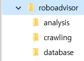
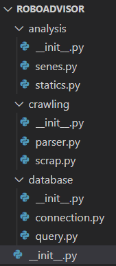
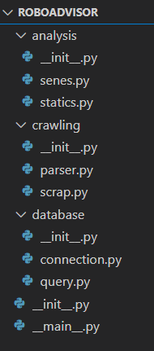

# Chapter 11. 모듈과 패키지


## 01. 모듈과 패키지


### 1.1 모듈의 개념

* .py  파일 하나를 모듈이라고 생각하면 된다.
* 모듈과 모듈 사이에 인터페이스를 연결하여 사용한다. 
* 인터페이스란 간단하게 표현하면 함수에서 매개변수를 입력하는 약속이다. 다시 말해 해당 모듈을 사용하기 위해서는 모듈 간의 연결을 위한 약속이 필요한데, 이것을 인터페이스라고 한다


### 1.2  패키지의 개념

* 패키지는 모듈의 묶음이다
* 모듈이 담긴 디렉터리를 하나의 패키지 개념이라고 생각하면 된다.
* 파이썬에서 라이브러리와 패키지는 같은 개념이라고 생각하면 된다.


## 02. 모듈 만들기


### 2.1 모듈 만들기

```python
# add_number.py

def add(a,b):
    return a+b
```

```python
import add_number

result = add_number.add(1,2)
print(result)
```

* 호출받는 모듈과 호출하여 사용하는 클라이언트 프로그램이 같은 디렉터리 안에 있어야 한다.


### 2.2 네임 스페이스

* 네임스페이스는 모듈의 호출 범위를 지정하는 것이다.
* 네임스페이스를 사용하는 이유는 클라이언트 프로그램의 함수 이름과 호출된 모듈의 함수이름이 같을 수 있다.  이 경우, 호출된 모듈의 사용 범위를 명확히 지정해야한다. 


#### 1. 알리아스(alias)

* 모듈의 이름이 너무 길거나 다른 코드와 헷갈리는 이름을 가졌을 때, as 키워드를 사용하여 모듈의 이름을 간단하게 바꿔 사용할 수 있다.

```python
import add_number as ad

print(ad.add(1,2))
```


#### 2. from

* from 은 꼭 모듈을 호출하기 위한 키워드는 아니다. 패키지를 호출하고, 해당 해키지 안에 있는 모듈을 호출할 때도 from 키워드를 사용할 수 있다.

```python
from add_number import add

print(add(1,2))
```


#### 3.  * 사용

* 해당 모듈 안에 있는 모든 함수, 클래스, 변수를 가져오는 것. 일반적으로 *는 곱셈의 의미도 있지만, 모든 것이라는 뜻도 있다.

```python
from add_nuber import *

print(add(1,2))
```


## 03. 패키지 만들기


### 3.1 패키지 만들기

* 인터넷에서 주식 정보를 받아와 데이터 베이스에 저장하고 필요한 정보를 계산하는 프로그램을 만든 다고 해보자


#### 1. 디렉터리 구성하기

* crawling(크롤링): 주식 관련 데이터를 인터넷에서 가져오는 기능
* database(데이터베이스): 가져온 데이터를 데이터베이스에 저장하는 기능
* analysis(분석): 해당 정보를 분석하여 의미 있는 값을 뽑는 기능




#### 2. 디렉터리 별로 필요한 모듈 만들기

* 하나의 패키지는 중첩된 구조로 만들 수 있으므로 패키지 안에 또 하나의 패키지들어갈 수 있다.
* 디렉터리를 하나의 패키지로 선언하기 위해서는 `__init__.py`라는 예약파일을 만들어야 한다.



```python
# sense.py (analysis 디렉터리)

def sense_test():
    print('sense')
```

```python
from ROBOADVISO.analysis import sense
sense.sense_test()
```

* 위 코드는 ROBOADVISOR의 상위 디렉터리에서 파이썬 셸을 실행해야 정상적으로 진행된다.
* 위 코드를 실행하면 ROBOADVISOR 디렉터리 안에는 `__pycache__` 라는 디렉터리가 생성되는데, 이는 파이썬의 언어적 특성으로 생기는 결과이다. 파이썬은 인터프리터 언어이므로 실행 전에 컴파일러를 실행하지 않지만, 실행 시점에서는 컴파일하고 컴파일된 파일을 프로그램에 사용한다. `__pycache__`디렉터리에는 해당 프로그램이 작동될 때 사용하기 위한 모듈들을 컴파일하고, 그 결과를 저장한다. 이렇게 한 번 `__pycache__`디렉터리가 생성되면 그 시점에서 해당 모듈을 수정해도 결과가 반영되지 않는다. 해당 프로그램 또는 파이썬 셸이 완전히 종료한 후 수정해야 해당 모듈의 결과를 반영할 수 있다. 인터프리터 언어이지만 내부적으로 컴파일도 하고, 효율적으로 사용하기 위한 여러 가지 작업이 있다.


#### 3. 디렉터리 별로 `__init__.py` 구성하기

* `__init__.py` 파일은 패키지 개발자, 설치 시 확인해야 할 내용 등 메타데이터라고 할 수 있는 내용을 담고있다. 하지만 가장 중요한 내용은 이 패키지 구조에 대한 정보가 담겨 있다.

```python
# __init__.py (ROBOADVISOR)

import analysis
import crawling
import database

__all__ = ['analysis', 'crawling', 'database']
```

* ROBOADVISOR 디렉터리에는 3개의 하위 패키지가 있는데 이 각각의 패키지는 `__init__.py` 안에 `__all__`과 import문을 사용해 선언해야 한다. 
* 하위 패키지의 `__init__.py` 파일도 다음과 같이 각 패키징[ 포함된 모듈명을 모두 작성해야 한다

```python
# __init__.py (analysis 디렉터리)

from . import sense
from . impot statics

__all__ = ['sense', 'statics']
```

* from . 을 import문 앞에 붙이는 이유는 현재 디렉터리인 analysis의 패키지를 호출하기 위함이다. from . 을 붙이지 않으면 상위 디렉터리인 ROBOADVISOR에서 sense나 statics 패키지를 찾게 되어 오류가 발생한다


#### 4.`__main__.py` 파일 만들기



* 패키지를 한 번에 사용하기 위해 ROBOADVISOR 디렉터리에 `__main__.py` 파일을 만든다. 
* `__main__.py` 파일의 구성은 간단하다. 기본적으로 호출해야 하는 여러 모듈을 from과 import문으로 호출한 후, `if __name__ == '__main__'` 구문 아래에 실제 실행 코드를 작성하면 된다.

```python
# __main__.py

from analysis.sense import sense_test
from crawling.parser import parser_test

if __name__ == '__main__':
    sense_test()
    parser_test()
```

* 만들어진 패키지를 실행하기 위해 해당 패키지의 최상위 디렉터리(본 예시에서는 ROBOADVISOR의 상위 디렉터리) 에서 호출하면 된다.


### 3.2 패키지 네임스페이스

* 패키지 내에서 모듈을 서로 호출할 때 사용하는 패키지 네임스페이스는 다음과 같이 2가지 방법이 있다. 절대 참조는 모듈의 경로를 모두 호출하는 것이고, 상대 참조는 호출하는 디렉터리를 기준으로 호출하는 것이다.


#### 1. 절대 참조

```python
from ROBOADVISOR.analysis import sense
```


* `__init__.py`파일을 만들 때도 절대 참조로 모듈을 호출하는 것이 좋다.
* 가장 상위에 있는 `__init__.py`파일도 상위 디렉터리 ROBOADVISOR를 넣는 것이 좋다 다음과 같이 작성해야 다른 서브 모듈에서도 모듈을 쉽게 호출할 수 있다.

```python
__all__ = ['analysis', 'crawling', 'database']

from ROBOADVISOR import analysis
from ROBOADVISOR import crawling
from ROBOADVISOR import database
```


#### 2. 상대 참조

* 상대 참도는 현대의 디렉터리를 기준으로 모듈을 호출하는 것이다. 

```python
from .sense import sense_test
from ..crawling.parser import parser_test
```

* 점 1개는 현재 디렉터리를, 점 2개는 부모 디렉터리를 뜻 한다.
* 패키지 내에서는 상대참조로 호출하는 것을 권하지 않는다. 코드를 간략히 사용할 수 있는 장점이 있지만, 패키지 전체를 보는 입장에서는 모든 패키지의 경로를 정확히 기록하는 것이 좀 더 이해하기 쉽기 때문이다


## 04. 가상환경 사용하기


### 4.1 가상환경의 개념

* 독립적인 프로그래밍 환경을 가상환경이라고 한다.

  |  가상환경 도구   |                             특징                             |
  | :--------------: | :----------------------------------------------------------: |
  | virtualenv + pip | 가장 대표적인 가상환경 관리 도구<br />래퍼런스와 패키지가 가장 많음 |
  |      conda       | 상용 가상환경 도구인 miniconda의 기본 가상환경 도구<br /> 설치가 쉬워 윈도에서 유용함 |

  

### 4.2 가상환경 설정하기

* conda를 사용하여 가상환경을 설정해보자


#### 1. 가상환경 만들기

```cmd
# cmd 창에 다음과 같이 입력한다.

conda create -n  my_project python=3.4

# conda create 가상환경 새로 만들기
# -n my_project 가상환경 이름
# python=3.4 파이썬 버젼
```


#### 2. 가상환경 실행과 종료

```cmd
# 실행하기
activate my_project

# 파이썬이 실행되는 위치 알기
where python

# 종료하기
deactivate
```

