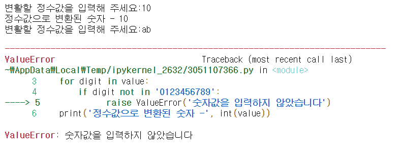

# Chapter 12. 예외 처리와 파일


##  01. 예외 처리


### 1.1 예외의 종류

* 예외의 종류는 많지만 대표적으로 아래의 예외들이 있다.

|       예외        |                  내용                  |
| :---------------: | :------------------------------------: |
|    IndexError     |    리스트의 인덱스 범위를 넘어갈 때    |
|     NameError     |     존재하지 않는 변수를 호출할 때     |
| ZeroDivisionError |          0으로 숫자를 나눌 때          |
|    ValueError     | 변환할 수 없는 문자나 숫자를 변환할 때 |
| FileNotFoundError |     존재하지 않는 파일을 호출할 때     |


### 1.2 예외 처리 구문


#### 1. try ~ except문

```python
try:
    예외 발생 가능 코드
except 예외 타입:
    예외 발생 시 실행되는 코드
```

```python
for i in range(10):
    try:
        print(10/i)
    except ZeroDivisionError:
        print('Not divided by 0')
```

```
Not divided by 0
10.0
5.0
#3.3333333333333335
2.5
2.0
1.6666666666666667
1.4285714285714286
1.25
1.1111111111111112        
```


* 예외 타입을 모를 경우, 다음과 같이 생략 가능하다

```python
try:
    예외 발생 가능 코드
except:
    예외 발생 시 실행되는 코드
```


#### 2. try ~ except ~ else 문

```python
try:
    예외 발생 가능 코드
except 예외 타입:
    예외 발생 시 실행되는 코드
else:
    예외가 발생하지 않을 때 실행되는 코드
```

```python
for i in range(10):
    try:
        result = 10 / i
    except ZeroDivisionError:
        print('Not divided by 0')
    else:
        print(10 / i)    
```

```
Not divided by 0
10.0
5.0
3.3333333333333335
2.5
2.0
1.6666666666666667
1.4285714285714286
1.25
1.1111111111111112    
```


#### 3. try ~ except ~ finally 문

```python
try:
    예외 발생 가능 코드
except:
    예외 발생 시 실행되는 코드
finally:
    예외 발생 여부와 상관없이 실행되는 코드
```

```python
try:
    for i in range(1,10):
        result = 10 // i
        print(result)
except ZeroDivisionError:
    print('Not divided by 0')
finally:
    print('종료되었다')
```

```
10
5
3
2
2
1
1
1
1
종료되었다    
```


#### 4. raise 문

* raise문은 필요할 때 예외를 발생시키는 코드이다

```python
raise 예외 타입(예외 정보)
```

```python
while True:
    value = input('변활할 정수값을 입력해 주세요:')
    for digit in value:
        if digit not in '0123456789':
            raise ValueError('숫자값을 입력하지 않았습니다')
    print('정수값으로 변환된 숫자 -', int(value))        
```




#### 5. assert 문

* assert문은 조건을 만족하지 않으면 예외를 발생시키는 구문이다.
* assert 문은 True 또는 False의 반환이 가능한 함수를 사용하면 된다.
* isinstance( ) 함수는 입력된 값이 뒤에 있는 클래스의 인스턴스인지 확인하는 함수이다

```python
assert 예외 조건
```

```python
def get_binary_number(number):
    assert isinstance(number, int)
    return bin(number)
print(get_binary_number(10))
print(get_binary_number('10'))
```


## 02. 파일 다루기


### 2.1 파일의 개념

* 파일은 컴퓨터에서 정보를 저장하는 가장 작은 논리적인 단위이다. 파일은 일반적으로 파일명과 확장자로 식별한다.
* 확장자는 그 파일의 쓰임을 구분하는 글자이다.
* 디렉터리는 파일을 담는 또 하나의 파일로, 여러 파일을 포함할 수 있는 그릇이다. 파일과 다른 디렉터리를 포함할 수 있으므로 직접 프로그램을 실행하지는 않지만, 다른 파일들을 구분하고 논리적인 단위로 파일을 묶을 수 있다.


### 2.2 파일의 종류

|                        바이너리 파일                         |                         텍스트 파일                          |
| :----------------------------------------------------------: | :----------------------------------------------------------: |
| 컴퓨터만 이해할 수 있는 형태인 이진 형식으로 저장된 파일<br /> 일반적으로 메모장으로 열면 내용이 깨져 보임<br /> 엑셀 파일, 워드 파일 등 | 사람도 이해할 수 있는 형태인 문자열 형식으로 저장된 파일<br /> 메모장으로 열면 내용 확인이 가능<br /> 메모장에서 저장된 파일, HTML 파일, 파이썬 코드 파일 등 |

* 텍스트 파일도 사실 컴퓨터가 처리하기 위해 바이너리 형태로 저장된 파일이다. 텍스트 파일은 우리 눈에 보이기 위해 컴퓨터가 이해할 수 있는 형태로 문자열로 변경하여 저장한다. 흔히 이렇게 변경하는 기준을 인코딩이라하며 대표적으로 아스키코드(ASCII)나 유니코드(Unicode)로 표준을 제정하고, 이 표준에 따라 텍스트 파일을 저장한다. 예를 들어 'A' 는 0100010 이라는 표준이 있다.


### 2.3 파일 읽기

```python
f = open('파일명', '파일 열기 모드')
f.close()
```

| 종류 |                           설명                           |
| :--: | :------------------------------------------------------: |
|  r   |           읽기 모드 : 파일을 읽기만 할 때 사용           |
|  w   |           쓰기 모드 : 파일에 내용을 쓸 때 사용           |
|  a   | 추가 모드 : 파일의 마지막에 새로운 내용을 추가할 때 사용 |


#### 1. 파일 읽기

```python
f = opne('파일명', 'r')
contents = f.read()
print(contents)
f.close()
```

* 때때로 텍스트 파일을 수정할 때 이미 수정하고 있는 파일을 다른 프로그램이 함께 호출하면 에러가 발생하는데, 이렇게 하나의 파이썬 프로그램이 하나의 파일을 쓰고 있을 때 사용을 완료하면 반드시 해당 파일을  f.close()를 사용하여 종료해야 한다.


#### 2. with문으로 읽기

```python
with open('파일명', 'r') as my_file:
    contents = my_file.read()
    print(contents)
```

* with문은 들여쓰기를 사용해 들여쓰기가 있는 코드에서는 open() 함수가 유지되고, 들여쓰기가 종료되면 open() 함수도 끝나는 방식이다.


#### 3. 한 줄씩 읽어 리스트형으로 반환하기

* readlines() 함수는 한줄씩 읽어서 리스트로 반환하는 함수이다

* 한 줄의 기준은 \n으로 나뉘며, 리스트로 반환하므로 for문 등 다양한 형태로 활용할 수 있다.

```python
with open('애국가.txt', 'r') as my_file:
    content_list = my_file.readlines() # 파일 전체를 리스트로 반환
    print(content_list) # 리스트값 출력
    
# ['동해물과 백두산이 마르고 닿도록 \n', '하느님이 보우하사 우리 나라만세 \n', '무궁화 삼천리 화려강산 \n']    
```


#### 4. 실행할 때마다 한 줄씩 읽어오기

* readline() 함수는 호출될  때마다 한 줄씩 읽어온다

```python
with open('애국가.txt', 'r') as my_file:
    i = 0
    while 1:
        line = my_file.readline()
        if not line:
            break
        print(str(i) + '===' + line.replace('\n','')) # 한 줄씩 값 출력
        i = i + 1
        
# 0 === 동해물과 백두산이 마르고 닿도록
# 1 === 하느님이 보우하사 우리 나라만세
# 2 === 무궁화 삼천리 화려강산
```


### 2.4 파일 쓰기

* 파일을 쓰기 위해서는 인코딩 지정해야하는데, 일반적으로 인코딩은 utf-8을 많이 사용하며, 파일을 윈도에서만 사용한다면 cp949도 많이 사용한다.

```python
f = open('count_log.txt', 'w', encoding = 'utf-8')
for i in range(1,11):
    data = '%d번째 줄이다.\n' %i
    f.write(data)
f.close()    
```


### 2.5. 파일 추가하기

* 쓰기 모드 w는 늘 새로운 파일을 생성한다. 예를 들면 기존의 파일이 있음에도 다시 한번 w로 파일을 부르면 기존 파일이 삭제되고 새로운 파일이 생겨 새로운 내용만 기록한다. 상황에 따라 파일을 계속 추가해야 하는 작업이 있을 수도 있으므로, 기존 파일에 추가 작업을 해야 하는 일이 있다. 이 경우 a를 사용하는 것이다.

```python
with open('count_log.txt', 'a', encoding = 'utf-8') as f:
    for i in range(1,11):
        data = '%d번째 줄이다.\n'%i
        f.write(data)
```


### 2.6 pickle 모듈

* 파이썬 프로그램을 실행할 때 생성되는 여러 변수와 객체는 순간적으로 메모리에 로딩되었다가 프로그램이 종료되면 사라진다. 하지만 변수와 객체를 저장하여 필요할 때 불러서 쓰고 싶다면 pickle 모듈을 사용하면 된다.

```python
import pickle

f = open('list.pickle', 'wb') # 바이너리 파일로 쓰기 모드
test = [1,2,3,4,5]
pickle.dump(test,f)
f.close
```

```python
f = open('list.pickle', 'rb') # 바이너리 파일로 읽기 모드
test_pickle = pickle.load(f)
print(test_pickle) # [1,2,3,4,5]
f.close
```


* pickle 모듈은 단순히 생성된 객체를 저장하는 기능도 있지만, 사용자가 직접 생성한 클래스의 객체도 저장한다.

```python
class Multiply(object):
    def __init__(self, multiplier):
        self.multiplier = multiplier
    def multiply(self, number):
        return number * self.multiplier

multiply = Mutiply(5)
multiply.multiply(10)
# 50
```

```python
import pickle

f = open('mutiply_object.pickle', 'wb')
pickle.dump(multiply, f)
f.close()

f = open('mutiply_object.pickle' 'rb')
multiply_pickle = pickle.load(f)
multiply_pickle.mutiply(5)
# 25
```

