# Chapter 03. DataFrame 객체


- DataFrame은 2개의 참조점이 있는 2차원 배열


## 01. DataFrame


### 1.1 DataFrame 생성


### (예시)

```python
random_data
```

```
array([[43, 18, 67, 90, 43],
       [58, 45, 22, 30, 54],
       [ 7, 51, 35, 19, 23]])
```

```python
row_labels = ['Morning', 'Afternoon', 'Morning']
column_labels = (
    'Monday',
    'Tuesday',
    'Wedneday',
    'Thursday',
    'Friday'
)

pd.DataFrame(
    data = random_data,
    index = row_labels,
    columns = column_labels
)
```

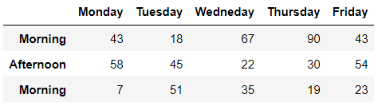


### (정리)

| 매개변수 |              설명              |
| :------: | :----------------------------: |
|   data   | 딕셔너리, ndarray 등 입력 가능 |
|  index   |         행 레이블 설정         |
| columns  |         열 레이블 설정         |


### 1.2 transpose 메서드


### (예시)


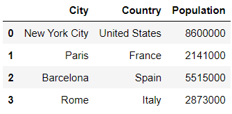

```python
# 다음 두 줄은 결과가 동일합니다
cities.transpose()
cities.T
```

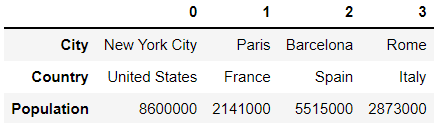


## 02. DataFrame 속성과 메서드


### 데이터셋

- 미국의 프로농구 선수 목록(nba)

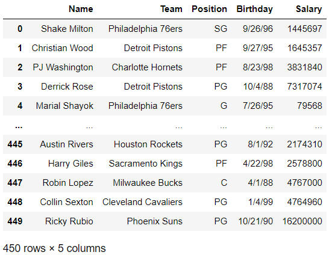


### 2.1 DataFrame의 속성


### (예시)

```python
nba.index
```

```
RangeIndex(start=0, stop=450, step=1)
```


### (정리)

|  속성   |        설명        |
| :-----: | :----------------: |
|  index  |   인덱스를 반환    |
| columns |  열 인덱스를 반환  |
| values  |     값을 반환      |
| dtypes  |  데이터 유형 반환  |
|  ndim   |   차원 수를 반환   |
|  size   |  값의 개수를 반환  |
|  shape  | 차원을 튜플로 반환 |


### 2.2 DataFrame 메서드


### (예시)

```python
nba.head()
```

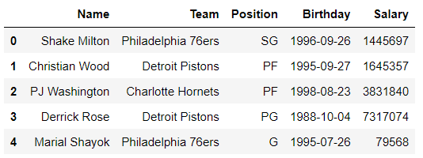


### (정리)

|   메서드    |            설명             |
| :---------: | :-------------------------: |
|   head()    |  맨 위에서 5개의 행을 반환  |
|   tail()    | 맨 아래에서 5개의 행을 반환 |
|  nunique()  |   고유한 값의 개수를 반환   |
|  sample()   |  임의의 값을 선택해서 반환  |
|    min()    |     가장 작은 값을 반환     |
|    max()    |      가장 큰 값을 반환      |
| nsmallest() |     가장 작은 값을 반환     |
| nlargest()  |      가장 큰 값을 반환      |
|    sum()    |       값을 모두 더함        |
|   mean()    |            평균             |
|  median()   |           중앙값            |
|   mode()    |           최빈값            |
|    std()    |          표준편차           |

|   매개변수   |   입력    |      설명      | 적용 가능 메서드        |
| :----------: | :-------: | :------------: | ----------------------- |
|   columns    | '열 이름' | 정렬한 열 선택 | nsmallest(), nlargest() |
| numeric_only |   True    | 숫자 열만 적용 | sum(), mean(), mode()   |


## 03. DataFrame 정렬


### 3.1 인덱스별 정렬


### (예시1)

* 행 인덱스 기준으로 정렬

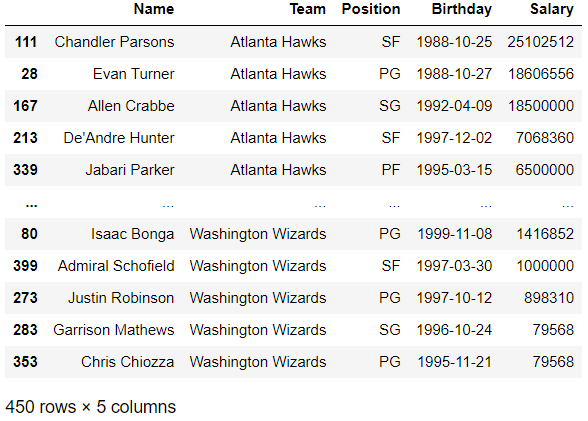

```python
# 다음 두 줄은 결과가 동일합니다.
nba.sort_index().head()
nba.sort_index(ascending = True).head()
```

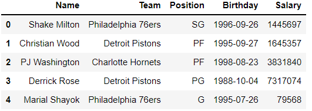


### (예시2)

* 열 인덱스 기준으로 정렬

```python
# 다음 두 줄은 결과가 동일합니다.
nba.sort_index(axis = 'columns').head()
nba.sort_index(axis = 1).head()
```

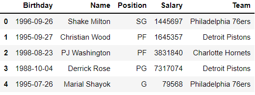


### (정리)

|    메서드    |          설명          |
| :----------: | :--------------------: |
| sort_index() | 인덱스를 기준으로 정렬 |

| 매개변수  |      입력       |        설명         |
| :-------: | :-------------: | :-----------------: |
| ascending | True (오름차순) |  정렬 순서를 설정   |
|   axis    | 'columns' or 1  | 열 인덱스 기준 정렬 |


### 3.2 값 정렬


### (예시1)

* 단일 열 기준으로 정렬

```python
# 다음 두 줄을 결과가 동일합니다.
nba.sort_values('Name')
nba.sort_values(by = 'Name')
```

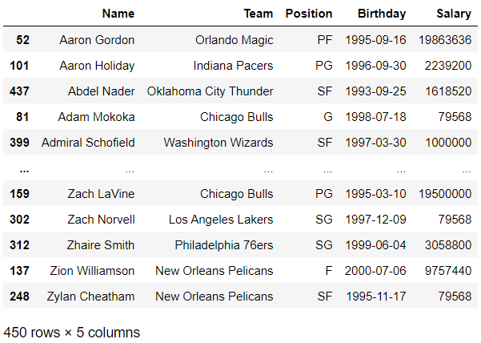


### (예시2)

* 다중 열 기준으로 정렬

```python
nba.sort_values(
    by = ["Team", "Salary"], 
    ascending = [True, False]
)
```

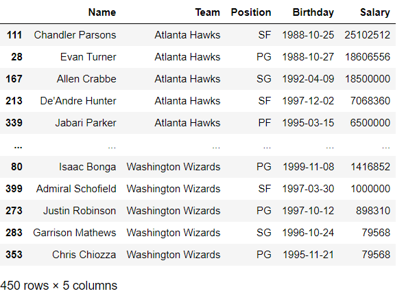


### (정리)

|    메서드     |        설명        |
| :-----------: | :----------------: |
| sort_values() | 값을 기준으로 정렬 |

| 매개변수  |   입력    |       설명        |
| :-------: | :-------: | :---------------: |
|    by     | '열 이름' |  정렬할 열 지정   |
| ascending |   True    | 오른차순으로 정렬 |


## 04. DataFrame 행과 열 선택


### 4.1 행 선택


### (예시1)

- 인덱스 레이블로 행 추출

```python
nba.loc['LeBron James']
```

```
Team         Los Angeles Lakers
Position                     PF
Birthday    1984-12-30 00:00:00
Salary                 37436858
Name: LeBron James, dtype: object
```


```python
nba.loc[['Kawhi Leonard', 'Paul George']]
```

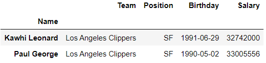


```python
nba.sort_index().loc['Otto Porter':'Patrick Beverley']
```

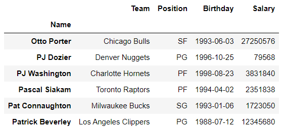


### (예시2)

- 인덱스 위치로 행 추출

```python
nba.iloc[300]
```

```
Team             Denver Nuggets
Position                     PF
Birthday    1999-04-03 00:00:00
Salary                  1416852
Name: Jarred Vanderbilt, dtype: object
```


```python
nba.iloc[[100, 200, 300, 400]]
```

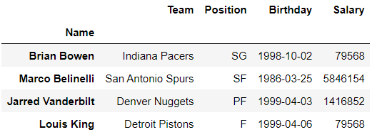


```python
nba.iloc[400:404]
```

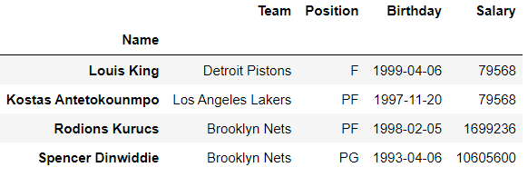


### (예시3)

- 특정 열에서 값 추출
- loc과 iloc 속성은 두번째 인수로 추출할 열을 받는다

```python
nba.loc['Giannis Antetokounmpo', 'Team']
```

```
'Milwaukee Bucks'
```


```python
nba.loc[
    ['Russell Westbrook', 'Anthony Davis'],
    ['Team', 'Salary']
]
```

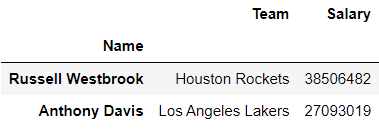


```python
nba.loc['Joel Embiid', 'Position':'Salary']
```

```
Position                      C
Birthday    1994-03-16 00:00:00
Salary                 27504630
Name: Joel Embiid, dtype: object
```


```python
nba.iloc[57,3]
```

```
796806
```


```python
nba.iloc[100:104, :3]
```

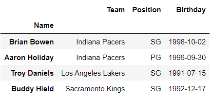


### (예시4)

- 단일 값을 추출할 때는 loc나 iloc 대신 at와 iat 속성을 사용할 수 있다. at와 iat가 속도면에서 빠르다

```python
nba.at['Austin Rivers', 'Birthday']
```

```
Timestamp('1992-08-01 00:00:00')
```


```python
nba.iat[263,1]
```

```
'PF'
```


### 4.2 열 선택


### (예시1)

- 단일 열 선택


- 속성으로 접근하는 방법

```python
nba.Salary
```

```
Name
Shake Milton       1445697
Christian Wood     1645357
PJ Washington      3831840
Derrick Rose       7317074
Marial Shayok        79568
                    ...   
Austin Rivers      2174310
Harry Giles        2578800
Robin Lopez        4767000
Collin Sexton      4764960
Ricky Rubio       16200000
Name: Salary, Length: 450, dtype: int64
```


- 대괄호로 접근하는 방법
- 대괄호 구문의 장점은 공백이 있는 열 이름을 지원한다

```python
nba['Position']
```

```
Name
Shake Milton      SG
Christian Wood    PF
PJ Washington     PF
Derrick Rose      PG
Marial Shayok      G
                  ..
Austin Rivers     PG
Harry Giles       PF
Robin Lopez        C
Collin Sexton     PG
Ricky Rubio       PG
Name: Position, Length: 450, dtype: object
```


### (예시2)

- 다중 열 선택


- 리스트 

```python
nba[['Salary', 'Birthday']].head()
```

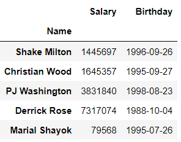


- select_dtypes 메서드를 사용하여 데이터 유형에 따라 열을 선택할 수 있다

```python
nba.select_dtypes(include = 'object')
```

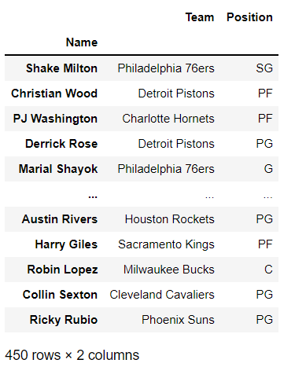

| 매개변수 |          입력           |     설명      |
| :------: | :---------------------: | :-----------: |
| include  | 단일 문자열 또는 리스트 | 포함하는 유형 |
| exclude  | 단일 문자열 또는 리스트 | 제외하는 유형 |


### 4.3 Series 행 선택


### (예시)

- loc, iloc, at, iat 접근자는 Series 객체에서도 사용할 수 있다

```python
nba['Salary'].loc['Damian Lillard']
```

```
29802321
```


## 05. 행 또는 열 이름 변경


### (예시1)

- rename 메서드로 행 또는 열 이름 변경 할 수 있다. 딕셔너리를 입력하면 된다

```python
nba.rename(index = {'Giannis Antetokounmpo':'Greek Freak'})
```

```python
nba.rename(columns = {'Date of Birth':'Birthday'})
```


### (예시2)

- columns 속성에 열의 새 이름을 담은 리스트를 할당하여 DataFrame의 일부 또는 전체 열의 이름을 바꿀 수 있다

```python
nba.columns = ['Team', 'Position', 'Date of Birth', 'Pay']
```


## 06. 인덱스 설정


### (예시1)

- set_index 메서드는 지정된 열이 인덱스로 설정된 새 DataFrame을 반환한다

```python
# 다음 두 줄은 결과가 동일합니다.
nba.set_index(keys = 'Name')
nba.set_index('Name')
```

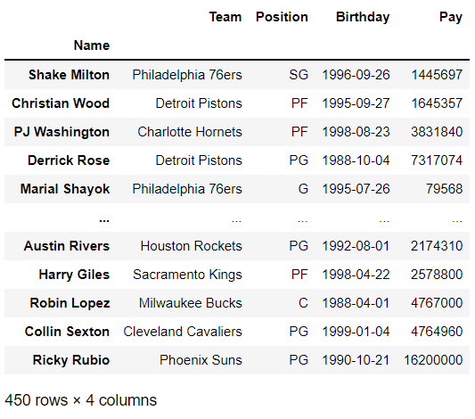


### (예시2)

- 다른 열을 DataFrame의 인덱스로 설정하고 싶을 때가 있다. set_index 메서드를 호출할 수 있지만 현재인덱스로 설정해 놓은 이름을 잃게 된다

```python
nba.set_index('Team').head()
```

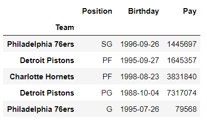


- reset_index 메서드는 현재 인덱스를 DataFrame 열로 이동하고 인덱스를 판다스의 숫자 인덱스로 변경한다

```python
nba.reset_index().head()
```

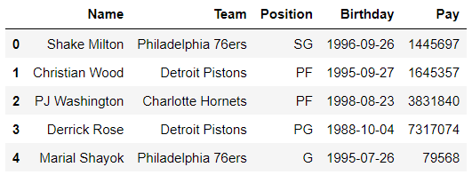