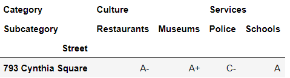
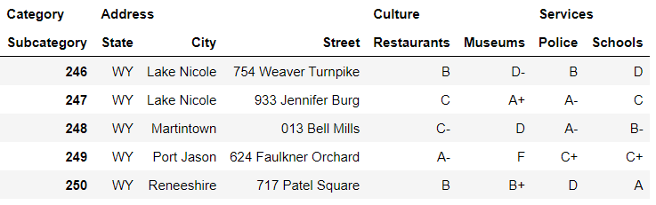

# Chapter 06. MultiIndex


## 01. MultiIndex 객체

- MultiIndex 다차원 인덱스이다


### 1.1 클래스 및 인스턴스화


### (예시)

- 같은 위치에 있는 튜플 값의 모음을 판다스 용어로 MultiIndex 레벨이라고 한다
  - 첫번째 레벨은 '8809 Flair Square',  '9901 Austin Street', '905 Hogan Quarter'
  - 두번째 레벨은 'Toddside',  'Toddside', 'Franklin'

```python
address = [
    ('8809 Flair Square', 'Toddside', 'IL', '37206' ),
    ('9901 Austin Street', 'Toddside', 'IL', '37206'),
    ('905 Hogan Quarter', 'Franklin', 'IL', '37206')
]

# 도로명, 도시, 주, 우편번호
```

```python
row_index = pd.MultiIndex.from_tuples(
    tuples = address,
    names = ['Street', 'City', 'State', 'Zip']
)
row_index
```

```
MultiIndex([( '8809 Flair Square', 'Toddside', 'IL', '37206'),
            ('9901 Austin Street', 'Toddside', 'IL', '37206'),
            ( '905 Hogan Quarter', 'Franklin', 'IL', '37206')],
           names=['Street', 'City', 'State', 'Zip'])
```


### (정리)

| 매개변수 |            설명             |
| :------: | :-------------------------: |
|  tuples  |     튜플 리스트를 입력      |
|  names   | MultiIndex 레벨에 이름 할당 |


### 1.2 DataFrame에 연결하기


### (예시1)

- 행 축에 연결하기

```python
data = [
    ['A', 'B+'],
    ['C+', 'C'],
    ['D-', 'A']
]

columns = ['Schools', 'Cost of Living']

area_grades = pd.DataFrame(
    data = data, index = row_index, columns = columns
)

area_grades
```


### (예시2)

- 열 축에 연결하기

```python
columns_index = pd.MultiIndex.from_tuples([
    ('Culture', 'Restaurants'),
    ('Culture', 'Museums'),
    ('Services', 'Police'),
    ('Services', 'Schools')
])
columns_index
```

```
MultiIndex([( 'Culture', 'Restaurants'),
            ( 'Culture',     'Museums'),
            ('Services',      'Police'),
            ('Services',     'Schools')],
           )
```

```python
data = [
    ['C-', 'B+', 'B-', 'A'],
    ['D+', 'C', 'A', 'C+'],
    ['A-', 'A', 'D+', 'F']
]
```

```python
pd.DataFrame(
    data = data, index = row_index, columns = columns_index
)
```


## 02. MultiIndex DataFrame


### 데이터셋

- neighborhoods

```python
# 원본 샘플
,,,Culture,Culture,Services,Services
,,,Restaurants,Museums,Police,Schools
State,City,Street,,,,
MO,Fisherborough,244 Tracy View,C+,F,D-,A+
```


### 2.1 MultiIndex DataFrame 가져오기

- CSV를 가져올 때 판다스는 파일의 첫 번째 행에 열 이름이 있겠다고 가정하며 이것을 헤더라고 한다. 헤더에 값이 없으면 판다스는 해당 열에 'Unnamed' 라는 이름을 할당한다
- 오른쪽에 있는 4개의 열은 이름이 중복되는 문제가 있다. 따라서 판다스는 Culture라는 이름을 할당하고 그 다음 열에 Culture.1이라는 이름을 할당한다
- 0행에서 처음 3개의 열은 모두 NaN값을 가진다. 1행의 마지막 4개 열도 모두 NaN 값을 가진다. CSV는 다중 레벨 행 인덱스와 다중 레벨 열 인덱스를 의도했지만 read_csv 함수의 매개변수에 지정된 기본 인수는 이를 인식하지 못했다


### (예시)

```python
neighborhoods = pd.read_csv(
    'neighborhoods.csv',
    index_col = [0, 1, 2],
    header = [0, 1]
)
neighborhoods.head()
```


### 2.2 인덱스 추출


### (예시1)

- 행 인덱스 추출

```python
# 다음 두 줄은 결과가 동일합니다
neighborhoods.index.get_level_values(1)
neighborhoods.index.get_level_values('City')
```


### (예시2)

- 열 인덱스 추출


- CSV가 이름을 제공하지 않았기 때문에 열의 MultiIndex 레벨에는 이름이 없다

```python
neighborhoods.columns.names = ['Category', 'Subcategory']
neighborhoods.head(3)
```


```python
# 다음 두 줄은 결과가 동일합니다
neighborhoods.columns.get_level_values(0)
neighborhoods.columns.get_level_values('Category')
```

```
Index(['Culture', 'Culture', 'Services', 'Services'], dtype='object', name='Category')
```


## 03. MultiIndex 정렬


### 3.1 행 인덱스 정렬


### (예시1)

- State, City,  Street 순서로 값을 정렬한다

```python
neighborhoods.sort_index()
```


### (예시2)

- 특정 열 기준으로 정렬한다

```python
# 다음 두 줄은 결과가 동일합니다
neighborhoods.sort_index(level = 1)
neighborhoods.sort_index(level = 'City')
```


### (예시3)

- ascending과 level 매개변수를 함께 사용할 수도 있다

```python
neighborhoods.sort_index(
    level = ['City', 'Street'], 
    ascending = [True, False]
). head()
```


### 3.2 열 인덱스 정렬


### (예시)

```python
# 다음 두 줄은 결과가 동일합니다
neighborhoods.sort_index(axis = 1).head(3)
neighborhoods.sort_index(axis = 'columns').head(3)
```


## 04. MultiIndex 행과 열 선택


### 4.1 loc로 행 추출


### (예시1)

- 각 레벨의 값을 알고있는 경우

```python
neighborhoods.loc[('TX', 'Kingchester', '534 Gordon Falls')]
```

```
Category  Subcategory
Culture   Restaurants     C
          Museums        D+
Services  Police          B
          Schools         B
Name: (TX, Kingchester, 534 Gordon Falls), dtype: object
```


### (예시2)

- 대괄호 안에 단일 레이블을 넣으면 판다스는 가장 바깥쪽 MutiIndex 레벨에서 해당 레이블을 찾는다

```python
neighborhoods.loc['CA']
```


### (예시3)

- 일반적으로 대괄호의 두 번째 인수는 추출하려는 열을 나타내지만 MultiIndex의 다음 레벨에서 찾을 값을 나타내기도 한다

```python
neighborhoods.loc['CA', 'Dustinmouth']
```




### (예시4)

- 특정 열 기준으로 값을 찾을 경우

```python
neighborhoods.loc[('CA', 'Dustinmouth'), ('Services',)]
```


### (예시5)

- 슬라이싱 구문도 사용할 수 있다

```python
start = ('NE', 'Shawnchester')
end = ('NH', 'North Latoya')
neighborhoods.loc[start:end]
```


### 4.2 iloc로 행 추출


### (예시1)

```python
neighborhoods.iloc[25]
```

```
Category  Subcategory
Culture   Restaurants    A+
          Museums         A
Services  Police         A+
          Schools        C+
Name: (CT, East Jessicaland, 208 Todd Knolls), dtype: object
```


### (예시2)

- 행 및 열 인덱스를 나타내는 2개의 인수를 iloc에 전달할 수 있다

```python
neighborhoods.iloc[25, 2]
```

```
'A+'
```


### (예시3)

- 특정 열 기준으로 값을 찾을 경우

```python
neighborhoods.iloc[25:30, 1:3]
```


### 4.3 열 추출


### (예시1)

- 대괄호 안에 하나의 값만 전달하면 판다스는 열 MultiIndex의 가장 바깥쪽 레벨에서 해당 값을 찾는다

```python
neighborhoods['Services']
```


### (예시2)

- 특정 Category를 선택한 다음 그 안에 있는 Subcategory를 선택하려면 튜플을 사용하면 된다

```python
neighborhoods[('Services', 'Schools')]
```

```python
State  City            Street              
AK     Rowlandchester  386 Rebecca Cove         C
       Scottstad       082 Leblanc Freeway     B+
                       114 Jones Garden         D
       Stevenshire     238 Andrew Rue          A-
AL     Clarkland       430 Douglas Mission     B+
                                               ..
WY     Lake Nicole     754 Weaver Turnpike      D
                       933 Jennifer Burg        C
       Martintown      013 Bell Mills          B-
       Port Jason      624 Faulkner Orchard    C+
       Reneeshire      717 Patel Square         A
Name: (Services, Schools), Length: 251, dtype: object
```


### (예시3)

- 여러 개의 열을 추출하려면 튜플의 리스트를 사용하자

```python
columns = [
    ('Services', 'Schools'),
    ('Culture', 'Museums')
]

neighborhoods[columns]
```


### 4.4 xs 메서드

- xs 메서드에 하나의 MultiIndex 레벨에 대한 값을 넘기면 행 또는 열을 추출할 수 있다


### (예시1)

- 행 추출

```python
# 다음 두 줄은 결과가 동일합니다
neighborhoods.xs(key = 'Lake Nicole', level = 1)
neighborhoods.xs(key = 'Lake Nicole', level = 'City')
```


### (예시2)

- 열 추출

```python
neighborhoods.xs(
    axis = 'columns', key = 'Museums', level = 'Subcategory'
).head()
```


### (예시3)

- xs 메서드를 사용하여 비연속적인 MultiIndex 레벨에 걸쳐 키를 찾을 수 있다. 키를 튜플로 전달하면 된다. City 값에 상관없이 Street 값이 '238 Andrew Rue'이고 State값이 'AK'인 행을 찾는다

```python
# 다음 두 줄을 결과가 동일합니다
neighborhoods.xs(
    key = ('AK', '238 Andrew Rue'), level = ['State', 'Street']
)

neighborhoods.xs(
    key = ('AK', '238 Andrew Rue'), level = [0, 2]
)
```


## 05. 인덱스 조작


### 데이터셋


### 5.1 인덱스 순서 변경

- reorder_levels 메서드는 MultiIndex 레벨을 지정된 순서로 정렬한다


### (예시)

```
new_order = ['City', 'State', 'Street']
neighborhoods.reorder_levels(order = new_order).head()
```


- 매개변수 order에 정수 리스트를 전달할 수도 있다. 각 숫자는 MultiIndex 레벨의 현재 인덱스 위치를 나타내야 한다

```python
neighborhoods.reorder_levels(order = [1, 0, 2]).head()
```


### 5.2 인덱스 초기화

- reset_index 메서드는 인덱스를 초기화한다


### (예시1)

```python
neighborhoods.reset_index().tail()
```


### (예시2)

- 3개의 열을 다른 MultiIndex 레벨에 추가할 수 있다

```python
# 다음 두 줄은 결과가 동일합니다
neighborhoods.reset_index(col_level = 1).tail()
neighborhoods.reset_index(col_level = 'Subcategory').tail()
```


### (예시3)

- 판다스는 Subcategory 레벨에 속하는 State, City, Street의 상위 레벨 Category에 빈 문자열을 할당한다. col_fill 매개변수에 인수를 전달하면 빈 문자열을 원하는 값으로 바꿀 수 있다

```python
neighborhoods.reset_index(
    col_fill = 'Address', col_level = 'Subcategory'
).tail()
```




### (예시4)

- 특정 인덱스 열을 리셋하기

```python
neighborhoods.reset_index(level = ['Street', 'City']).tail()
```


### (예시5)

- 특정 인덱스 제거하기

```python
neighborhoods.reset_index(level = 'Street', drop = True).tail()
```


### 5.3 인덱스 설정

- set_index 메서드는 하나 이상의 DataFrame 열을 새로운 인덱스로 설정한다. keys 매개변수에 사용할 열을 전달한다


### 데이터셋


### (예시1)

```python
neighborhoods.set_index(keys = 'City').head()
```


### (예시2)

- 하위 카테고리를 인덱스로 설정하기

```python
neighborhoods.set_index(keys = ('Culture', 'Museums')).head()
```


###  (예시3)

- MultiIndex를 생성하기

```python
neighborhoods.set_index(keys = ['State', 'City']).head()
```

