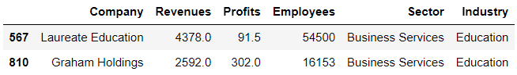

# Chapter 08. GroupBy 객체


## 01. GroupBy 객체 생성


### 데이터셋

- 슈퍼마켓 식재료(supermacket)
- Type에는 과일('Fruit')과 채소('Vegetable') 두 가지 항목이 있다


### (예시)

```
groups = supermacket.groupby('Type')
groups
```

```
<pandas.core.groupby.generic.DataFrameGroupBy object at 0x00000122A01E8BB0>
```


- 과일('Fruit')

```python
groups.get_group('Fruit')
```


- 채소('Vegetable')

```python
groups.get_group('Vegetable')
```


### (정리)

|   메서드    |              설명               |
| :---------: | :-----------------------------: |
|  groupby()  |       groupby객체를 생성        |
| get_group() | groupby객체에서 그룹을 가져온다 |


## 02. GroupBy 객체 장점


### 데이터셋

- 미국에서 가장 큰 1000개 기업(fortune)


### (예시1)

- 각 부문에 속한 기업의 평균 매출을 구해보자
- 기존 필터링하는 방식

```python
in_retailing = fortune['Sector'] == 'Retailing'
retail_companies = fortune[in_retailing]
retail_companies.head()
```


```python
retail_companies['Revenues'].mean()
```

```
21874.714285714286
```


### (예시2)

- GroupBy 객체로 해결하는 방식

```python
sectors = fortune.groupby('Sector')
sectors.mean()
```


### (정리)

- 필터링하는 방식은 한 부문의 평균 매출을 계산할때 적합하다. 그러나 포춘에 있는 다른 20개의 부문에도 동일한 논리는 적용하려면 코드를 추가로 많이 작성해야 한다. 


## 03. GroupBy 객체의 속성과 메서드


### 3.1 속성

|  속성  |                   설명                    |
| :----: | :---------------------------------------: |
| groups | 그룹과 행의 관계를 나타낸 딕셔너리를 반환 |


### 3.2 메서드

| 메서드  |                       설명                        |
| :-----: | :-----------------------------------------------: |
| first() |         각 그룹에 나열된 첫번째 행을 추출         |
| last()  |         각 그룹에 나열된 마지막 행을 추출         |
|  nth()  | 각 그룹 안에서 주어진 인덱스 위치로부터 행을 추출 |
| head()  |       각 그룹의  맨 위에서 5개의 행을 반환        |
| tail()  |      각 그룹의  맨 아래에서 5개의 행을 반환       |


## 04. 집계연산


### (예시1)

```python
sectors.sum().head()
```


### (예시2)

- agg 메서드는 딕셔너리를 인수로 받아서 여러 집계 연산을 서로 다른 열에 적용한다

```python
aggregations = {
    'Revenues' : 'min',
    'Profits' : 'max',
    'Employees' : 'mean'
}

sectors.agg(aggregations).head()
```


## 05. 사용자 정의 연산

- apply 메서드는 함수를 인수로 전달받아 각 그룹에 대해 함수를 한번씩 호출한다. 그런 다음 함수의 반환 값을 수집하여 새로운  DataFrame에 반환한다


### (예시)

- 각 그룹에서 가장 높은 매출을 올리는 기업찾자

```python
def get_largest_row(df):
    return df.nlargest(1, 'Revenues')
```

```python
sectors.apply(get_largest_row).head()
```


## 06. 다중 열 기반의 그룹화

- 여러 개의 열에 대한 값으로 GroupBy 객체를 만들 수 있다. 이 작업은 열 값의 조합으로 그룹을 나타내야 하는 경우에 적합한 솔루션이다


### (예시)

```python
sector_and_industry = fortune.groupby(by = ['Sector', 'Industry'])
```

```python
sector_and_industry.size()
```


```python
sector_and_industry.get_group(('Business Services', 'Education'))
```

