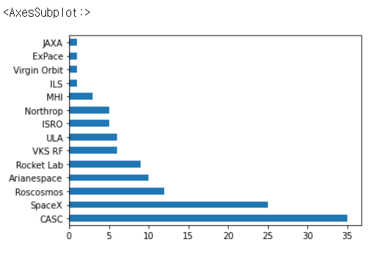

# Chapter 13. 시각화

- 판다스는 matplotlib, seaborn, ggplot을 포함하여 널리 사용되는 많은 파이썬 데이터 시각화 라이브러리와 원할하게 어우러 진다
- 주피터가 셀의 코드 바로 아래에 시각화를 렌더링하도록 하려면 %matplotlib inline 코드를 추가한다

```python
import pandas as pd
import matplotlib.pyplot as plt
%matplotlib inline
```


## 데이터셋

- 2019~2020년 100개 이상의 우주 비행 기록(space)


## 01. 선형차트


### (예시1)

- 기본적으로 x축에 인덱스 레이블(여기서는 날짜/시간)을 표시하고 y축에 Series의 값을 표시한다

```python
space['Cost'].head()
```

```
Date
2019-02-05    200.00
2019-02-22     50.00
2019-03-02     50.00
2019-03-09     29.15
2019-03-22     37.00
Name: Cost, dtype: float64
```


```python
space['Cost'].plot()
```


- space DataFrame 자체에서 plot 메서드를 호출할 수도 있다. 이 예제에서는 데이터셋에 숫자 열이 하나만 존재하기 때문에 판다스는 동일한 결과를 출력한다
- DataFrame에 숫자 열이 여러 개 있다면 matplotlib는 각 열에 대해 별도의 선을 그린다.

```python
space.plot()
```


### (예시2)

- y 매개변수는 값을 표시해야하는 열을 입력, colormap 매개변수는 그래프의 색상을 설정할 수 있다.

```python
space.plot(y = 'Cost', colormap = 'gray')
```


- 색상 인수가 궁금하다면 다음을 호출하자

```python
print(plt.colormaps())
```


## 02. 막대그래프


### (예시1)

```python
space['Company Name'].value_counts()
```

```
CASC            35
SpaceX          25
Roscosmos       12
Arianespace     10
Rocket Lab       9
VKS RF           6
ULA              6
ISRO             5
Northrop         5
MHI              3
ILS              1
Virgin Orbit     1
ExPace           1
JAXA             1
Name: Company Name, dtype: int64
```


```python
space['Company Name'].value_counts().plot(kind = 'bar')
```


### (예시2)

```python
space['Company Name'].value_counts().plot(kind = 'barh')
```




## 03. 파이차트


### (예시)

```python
space['Status'].value_counts()
```

```
Success    114
Failure      6
Name: Status, dtype: int64
```


```python
space['Status'].value_counts().plot(kind = 'pie')
```


- 범례 추가하기

```python
space['Status'].value_counts().plot(kind = 'pie', legend = True)
```


## (정리)

| 매개변수 |    설명     |
| :------: | :---------: |
|   kind   | 그래프 유형 |
| colormap | 그래프 색상 |
|  legend  |    범례     |
|    x     |   가로축    |
|    y     |   세로축    |

