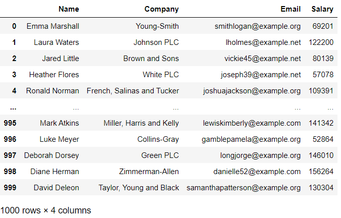

---

---

# 부록 C. 가짜 데이터 생성하기


## 01. faker 개요

- faker는 가짜 데이터를 생성하는 판다스 라이브러리이다. 이름, 전화번호, 주소, 이메일 등의 리스트를 생성할 수 있다 

```python
import faker
```


### (예시)

- faker 패키지에서 Faker 클래스를 사용할 수 있다. 이때 클래스 이름은 패키지 이름과 다르게 첫 문자가 대문자 'F'라는 점에 주의하자

```python
fake = faker.Faker()
```


```python
fake.name()
```

```
'Nicole Nguyen'
```


### (정리)

- https://faker.reathedocs.io/en/master 참고

|        메서드        |     설명      |
| :------------------: | :-----------: |
|        name()        |     이름      |
|     name_male()      |   남자 이름   |
|    name_female()     |   여자 이름   |
|     first_name()     |      성       |
|     last_name()      |     이름      |
|  first_name_male()   |    남자 성    |
| .first_name_female() |    여자 성    |
|      address()       |     주소      |
|   street_address()   |    집 주소    |
|        city()        |     도시      |
|       state()        |      주       |
|      postcode()      |   우편번호    |
|      company()       |     회사      |
|    catch_phrase()    |   광고문구    |
|        job()         |     직업      |
|        url()         |   홈페이지    |
|       email()        |    이메일     |
|    phone_number()    |  휴대폰 번호  |
| credit_card_number() | 신용카드 번호 |


## 02. 가상의 데이터셋 만들기

- 가상의 데이터셋을 만들어보자. 목표는 이름, 기업, 이메일, 연봉 4개 열이 있는 1000행짜리 DataFrame이다

```python
data = [
    { 'Name': fake.name(),
      'Company': fake.company(),
      'Email': fake.email(),
      'Salary': np.random.randint(50000, 200000)
    }
    for i in range(1000)
]
```

```python
df = pd.DataFrame(data = data)
df
```



