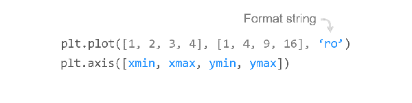

# Chapter 01. 기본 사용


## 01. 기본 그래프 그리기


### 예제1

```python
import matplotlib.pyplot as plt

plt.plot([1, 2, 3, 4])
plt.show()
```


### 예제2

```python
import matplotlib.pyplot as plt

plt.plot([1, 2, 3, 4], [1, 4, 9, 16])
plt.show()
```


## 02. 스타일 지정하기



### 예제

```python
import matplotlib.pyplot as plt

plt.plot([1, 2, 3, 4], [1, 4, 9, 16], 'ro')
plt.axis([0, 6, 0, 20])
plt.show()
```

x, y 값 인자에 대해 선의 색상과 형태를 지정하는 **포맷 문자열 (Format string)**을 세번째 인자에 입력할 수 있습니다.

포맷 문자열 ‘ro’는 빨간색 (‘red’)의 원형 (‘o’) 마커를 의미합니다.

또한, 예를 들어 ‘b-‘는 파란색 (‘blue’)의 실선 (‘-‘)을 의미합니다.

**matplotlib.pyplot** 모듈의 **axis()** 함수를 이용해서 축의 범위 [xmin, xmax, ymin, ymax]를 지정했습니다.


## 03. 여러 개의 그래프 그리기


### 예제

```python
import matplotlib.pyplot as plt
import numpy as np

# 200ms 간격으로 균일하게 샘플된 시간
t = np.arange(0., 5., 0.2)

# 빨간 대쉬, 파란 사각형, 녹색 삼각형
plt.plot(t, t, 'r--', t, t**2, 'bs', t, t**3, 'g^')
plt.show()

```

