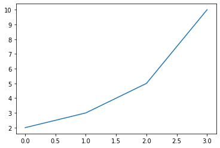
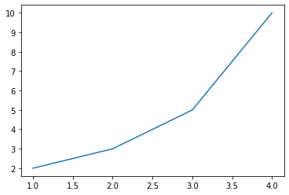
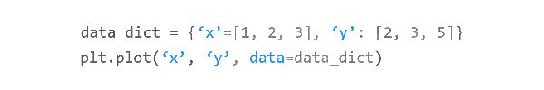
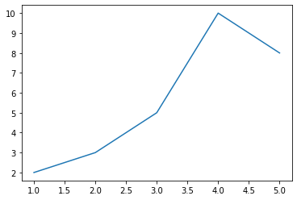

# Chapter 02. 숫자 입력하기


## 01. 기본 사용


### 예제

```python
import matplotlib.pyplot as plt

plt.plot([2, 3, 5, 10])
plt.show()
```

**plot([2, 3, 5, 10])**와 같이 하나의 리스트 형태로 값들을 입력하면 y 값으로 인식합니다.

**plot((2, 3, 5, 10))** 또는 **plot(np.array([2, 3, 5, 10])**와 같이 파이썬 튜플 또는 Numpy 어레이의 형태로도

데이터를 입력할 수 있습니다.

**x** 값은 기본적으로 **[0, 1, 2, 3]**이 되어서, **점 (0, 2), (1, 3), (2, 5), (3, 10)**를 잇는 아래와 같은 꺾은선 그래프가 나타납니다.




## 02. x, y 값 입력하기


### 예제

```python
import matplotlib.pyplot as plt

plt.plot([1, 2, 3, 4], [2, 3, 5, 10])
plt.show()
```




## 03. 레이블이 있는 데이터 사용하기



### 예제

```python
import matplotlib.pyplot as plt

data_dict = {'data_x': [1, 2, 3, 4, 5], 'data_y': [2, 3, 5, 10, 8]}

plt.plot('data_x', 'data_y', data=data_dict)
plt.show()
```

파이썬 딕셔너리와 같이 레이블이 있는 데이터를 그래프로 나타낼 수 있습니다.

예제에서와 같이, 먼저 **plot()** 함수에 데이터의 레이블 (딕셔너리의 키)을 입력해주고,

**data** 파라미터에 딕셔너리를 지정해줍니다.

 

