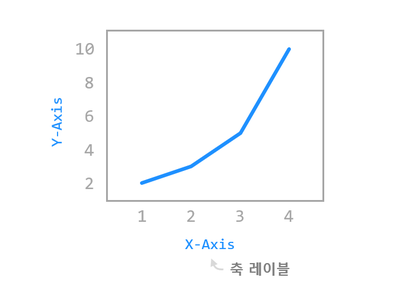
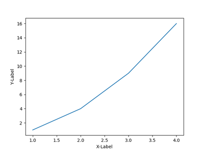
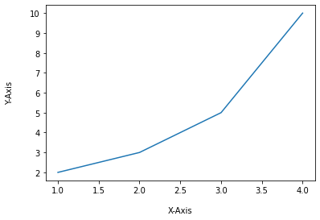
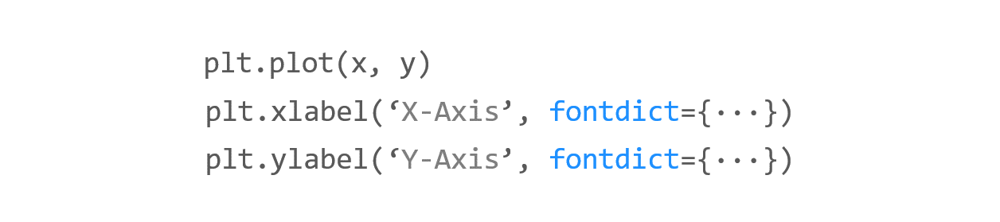
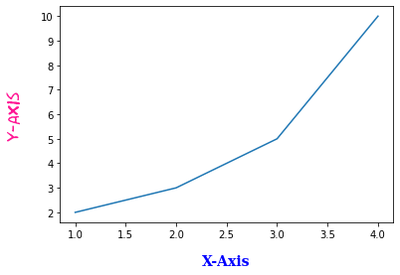
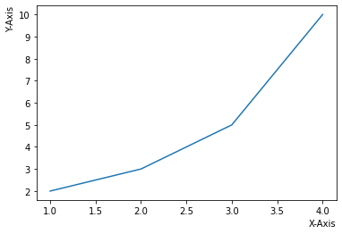

# Chapter 03. 축 레이블 설정하기



## 01. 기본 사용


### 예제

```python
import matplotlib.pyplot as plt

plt.plot([1, 2, 3, 4], [1, 4, 9, 16])
plt.xlabel('X-Label')
plt.ylabel('Y-Label')
plt.show()
```




## 02. 여백 지정하기


### 예제

```python
import matplotlib.pyplot as plt

plt.plot([1, 2, 3, 4], [2, 3, 5, 10])
plt.xlabel('X-Axis', labelpad=15)
plt.ylabel('Y-Axis', labelpad=20)
plt.show()
```

**xlabel(), ylabel()** 함수의 **labelpad** 파라미터는 축 레이블의 **여백 (Padding)**을 지정합니다.

예제에서는 X축 레이블에 대해서 15pt, Y축 레이블에 대해서 20pt 만큼의 여백을 지정했습니다.




## 03. 폰트 설정하기



### 예제

```python
import matplotlib.pyplot as plt

plt.plot([1, 2, 3, 4], [2, 3, 5, 10])
plt.xlabel('X-Axis', labelpad=15, fontdict={'family': 'serif', 'color': 'b', 'weight': 'bold', 'size': 14})
plt.ylabel('Y-Axis', labelpad=20, fontdict={'family': 'fantasy', 'color': 'deeppink', 'weight': 'normal', 'size': 'xx-large'})
plt.show()
```

**xlabel(), ylabel()** 함수의 **fontdict** 파라미터를 사용하면 축 레이블의 폰트 스타일을 설정할 수 있습니다.

예제에서는 ‘family’, ‘color’, ‘weight’, ‘size’와 같은 속성을 사용해서 축 레이블 텍스트를 설정했습니다.

아래와 같이 작성하면 폰트 스타일을 편리하게 재사용할 수 있습니다.

```python
import matplotlib.pyplot as plt

font1 = {'family': 'serif',
         'color': 'b',
         'weight': 'bold',
         'size': 14
         }

font2 = {'family': 'fantasy',
         'color': 'deeppink',
         'weight': 'normal',
         'size': 'xx-large'
         }

plt.plot([1, 2, 3, 4], [2, 3, 5, 10])
plt.xlabel('X-Axis', labelpad=15, fontdict=font1)
plt.ylabel('Y-Axis', labelpad=20, fontdict=font2)
plt.show()

```




## 04. 위치 지정하기

 

### 예제

```python
import matplotlib.pyplot as plt

plt.plot([1, 2, 3, 4], [2, 3, 5, 10])
plt.xlabel('X-Axis', loc='right')
plt.ylabel('Y-Axis', loc='top')
plt.show()
```

**xlabel()** 함수의 **loc** 파라미터는 X축 레이블의 위치를 지정합니다. ({‘left’, ‘center’, ‘right’})

**ylabel()** 함수의 **loc** 파라미터는 Y축 레이블의 위치를 지정합니다. ({‘bottom’, ‘center’, ‘top’})

이 파라미터는 **Matplotlib 3.3** 이후 버전부터 적용되었습니다.