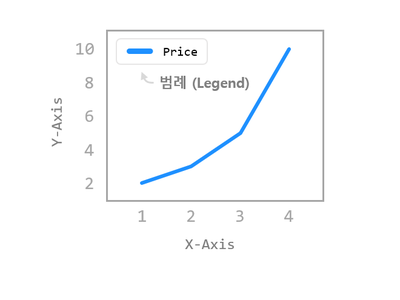
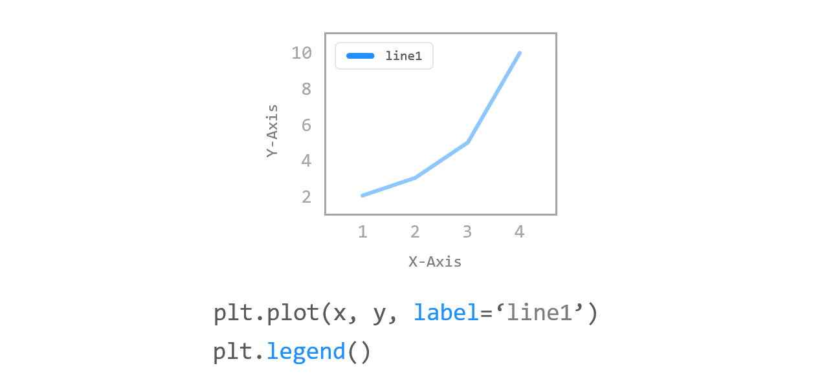

# Chapter 04. 범례 표시하기



**범례 (Legend)**는 그래프에 데이터의 종류를 표시하기 위한 텍스트입니다.


## 01. 기본 사용



### 예제

```python
import matplotlib.pyplot as plt

plt.plot([1, 2, 3, 4], [2, 3, 5, 10], label='Price ($)')
plt.xlabel('X-Axis')
plt.ylabel('Y-Axis')
plt.legend()

plt.show()
```

그래프 영역에 범례를 나타내기 위해서는 우선 **plot()** 함수에 **label** 문자열을 지정하고,

**matplotlib.pyplot** 모듈의 **legend()** 함수를 호출합니다.


## 02. 위치 지정하기


### 예제1

```python
import matplotlib.pyplot as plt

plt.plot([1, 2, 3, 4], [2, 3, 5, 10], label='Price ($)')
plt.xlabel('X-Axis')
plt.ylabel('Y-Axis')
# plt.legend(loc=(0.0, 0.0))
# plt.legend(loc=(0.5, 0.5))
plt.legend(loc=(1.0, 1.0))

plt.show()
```

**xlabel(), ylabel()** 함수의 **labelpad** 파라미터는 축 레이블의 **여백 (Padding)**을 지정합니다.

**legend()** 함수의 **loc** 파라미터를 이용해서 범례가 표시될 위치를 설정할 수 있습니다.

**loc** 파라미터를 숫자 쌍 튜플로 지정하면, 해당하는 위치에 범례가 표시됩니다.

**loc=(0.0, 0.0)**은 데이터 영역의 왼쪽 아래, **loc=(1.0, 1.0)**은 데이터 영역의 오른쪽 위 위치입니다.

**loc** 파라미터에 여러 숫자 쌍을 입력하면서 범례의 위치를 확인해보세요.


### 예제2

```python
import matplotlib.pyplot as plt

plt.plot([1, 2, 3, 4], [2, 3, 5, 10], label='Price ($)')
plt.xlabel('X-Axis')
plt.ylabel('Y-Axis')
plt.legend(loc='lower right')

plt.show()
```

**loc** 파라미터는 예제에서와 같이 문자열로 지정할 수도 있고, 숫자 코드를 사용할 수도 있습니다.

**loc=’lower right’**와 같이 지정하면 아래와 같이 오른쪽 아래에 범례가 표시됩니다.


## 03. 열 개수 지정하기


### 예제

```python
import matplotlib.pyplot as plt

plt.plot([1, 2, 3, 4], [2, 3, 5, 10], label='Price ($)')
plt.plot([1, 2, 3, 4], [3, 5, 9, 7], label='Demand (#)')
plt.xlabel('X-Axis')
plt.ylabel('Y-Axis')
# plt.legend(loc='best')          # ncol = 1
plt.legend(loc='best', ncol=2)    # ncol = 2

plt.show()
```

**legend()** 함수의 **ncol** 파라미터는 범례에 표시될 텍스트의 열의 개수를 지정합니다.

기본적으로 아래 첫번째 그림과 같이 범례 텍스트는 1개의 열로 표시되며,

**ncol=2**로 지정하면 아래 두번째 그림과 같이 표시됩니다.


Matplotlib 범례 표시하기 - 열 개수 지정하기 (ncol=1)


Matplotlib 범례 표시하기 - 열 개수 지정하기 (ncol=2)


## 04. 폰트 크기 지정하기


### 예제

```python
import matplotlib.pyplot as plt

plt.plot([1, 2, 3, 4], [2, 3, 5, 10], label='Price ($)')
plt.plot([1, 2, 3, 4], [3, 5, 9, 7], label='Demand (#)')
plt.xlabel('X-Axis')
plt.ylabel('Y-Axis')
# plt.legend(loc='best')
plt.legend(loc='best', ncol=2, fontsize=14)

plt.show()
```

**legend()** 함수의 **fontsize** 파라미터는 범례에 표시될 폰트의 크기를 지정합니다.

폰트 크기를 14로 지정했습니다.


## 05. 범례 테두리 꾸미기


### 예제

```python
import matplotlib.pyplot as plt

plt.plot([1, 2, 3, 4], [2, 3, 5, 10], label='Price ($)')
plt.plot([1, 2, 3, 4], [3, 5, 9, 7], label='Demand (#)')
plt.xlabel('X-Axis')
plt.ylabel('Y-Axis')
# plt.legend(loc='best')
plt.legend(loc='best', ncol=2, fontsize=14, frameon=True, shadow=True)

plt.show()
```

**frameon** 파라미터는 범례 텍스트 상자의 테두리를 표시할지 여부를 지정합니다.

**frameon=False**로 지정하면 테두리가 표시되지 않습니다.

**shadow** 파라미터를 사용해서 텍스트 상자에 그림자를 표시할 수 있습니다.


이 외에도 **legend()** 함수에는 **facecolor, edgecolor, borderpad, labelspacing**과 같은 다양한 파라미터가 있습니다.

더 자세한 내용은 공식 홈페이지의 설명 ([링크](https://matplotlib.org/stable/api/_as_gen/matplotlib.pyplot.legend.html))을 참고하세요.