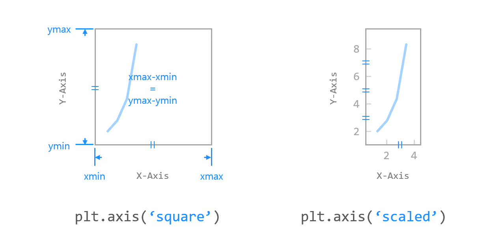

# Chapter 05. 축 범위 지정하기


**matplotlib.pyplot** 모듈의 **xlim(), ylim(), axis()** 함수를 사용하면 그래프의 X, Y축이 표시되는 범위를 지정할 수 있습니다.

- xlim() - X축이 표시되는 범위를 지정하거나 반환합니다.
- ylim() - Y축이 표시되는 범위를 지정하거나 반환합니다.
- axis() - X, Y축이 표시되는 범위를 지정하거나 반환합니다.


## 01. 기본 사용 - xlim(), ylim()


### 예제

```python
import matplotlib.pyplot as plt

plt.plot([1, 2, 3, 4], [2, 3, 5, 10])
plt.xlabel('X-Axis')
plt.ylabel('Y-Axis')
plt.xlim([0, 5])      # X축의 범위: [xmin, xmax]
plt.ylim([0, 20])     # Y축의 범위: [ymin, ymax]

plt.show()
```

**xlim()** 함수에 xmin, xmax 값을 각각 입력하거나 리스트 또는 튜플의 형태로 입력합니다.

**ylim()** 함수에 ymin, ymax 값을 각각 입력하거나 리스트 또는 튜플의 형태로 입력합니다.

입력값이 없으면 데이터에 맞게 자동으로 범위를 지정합니다.


## 02. 기본 사용 - axis()


### 예제

```python
import matplotlib.pyplot as plt

plt.plot([1, 2, 3, 4], [2, 3, 5, 10])
plt.xlabel('X-Axis')
plt.ylabel('Y-Axis')
plt.axis([0, 5, 0, 20])  # X, Y축의 범위: [xmin, xmax, ymin, ymax]

plt.show()
```

**axis()** 함수에 [xmin, xmax, ymin, ymax]의 형태로 X, Y축의 범위를 지정할 수 있습니다.

**axis()** 함수에 입력한 리스트 (또는 튜플)는 반드시 네 개의 값 (xmin, xmax, ymin, ymax)이 있어야 합니다.

입력값이 없으면 데이터에 맞게 자동으로 범위를 지정합니다.


## 03. 옵션 지정하기



### 예제

```python
import matplotlib.pyplot as plt

plt.plot([1, 2, 3, 4], [2, 3, 5, 10])
plt.xlabel('X-Axis')
plt.ylabel('Y-Axis')
# plt.axis('square')
plt.axis('scaled')

plt.show()
```

**axis()** 함수는 아래와 같이 축에 관한 다양한 옵션을 제공합니다.

```python
'on' | 'off' | 'equal' | 'scaled' | 'tight' | 'auto' | 'normal' | 'image' | 'square'
```

아래의 그림은 ‘square’로 지정했을 때의 그래프입니다.

축의 길이가 동일하게 표시됩니다.


아래의 그림은 ‘scaled’로 지정했을 때의 그래프입니다.

X, Y축이 같은 길이 스케일로 나타나게 됩니다.


## 04. 축 범위 얻기


### 예제

```python
import matplotlib.pyplot as plt

plt.plot([1, 2, 3, 4], [2, 3, 5, 10])
plt.xlabel('X-Axis')
plt.ylabel('Y-Axis')

x_range, y_range = plt.xlim(), plt.ylim()
print(x_range, y_range)

axis_range = plt.axis('scaled')
print(axis_range)

plt.show()
```

**xlim(), ylim()** 함수는 그래프 영역에 표시되는 X축, Y축의 범위를 각각 반환합니다.

**axis()** 함수는 그래프 영역에 표시되는 X, Y축의 범위를 반환합니다.

```python
(0.85, 4.15) (1.6, 10.4)
(0.85, 4.15, 1.6, 10.4)
```

위의 예제 그림에서 X축은 0.85에서 4.15, Y축은 1.6에서 10.4 범위로 표시되었음을 알 수 있습니다.  