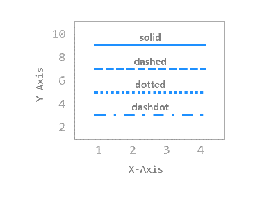
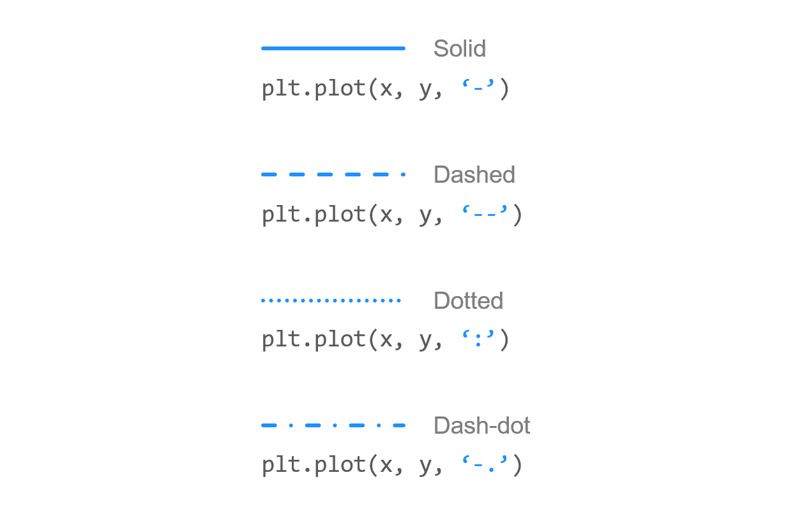
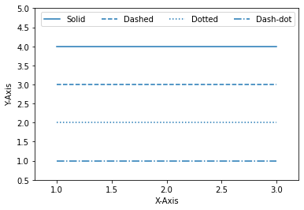
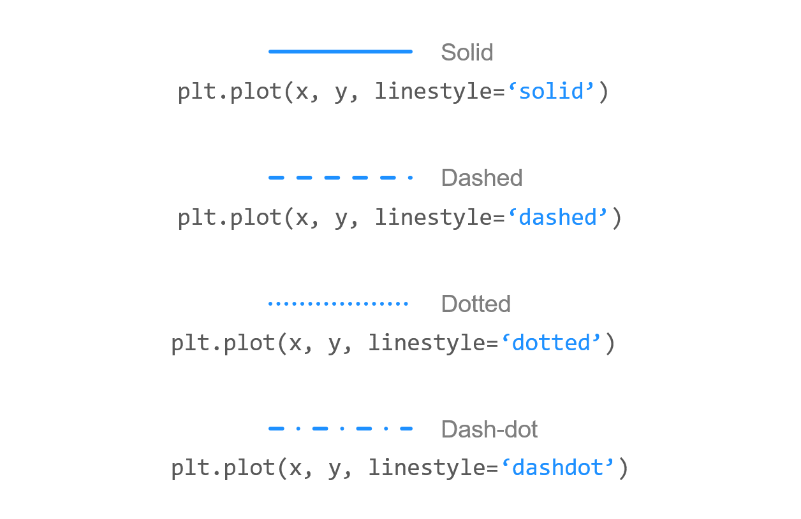
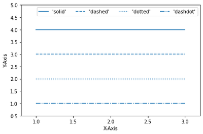
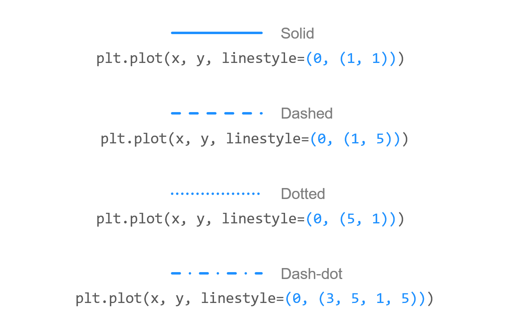
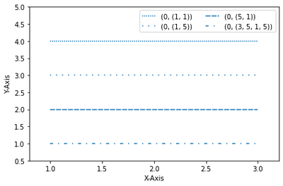
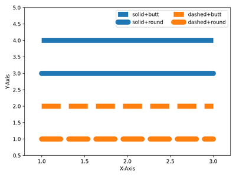
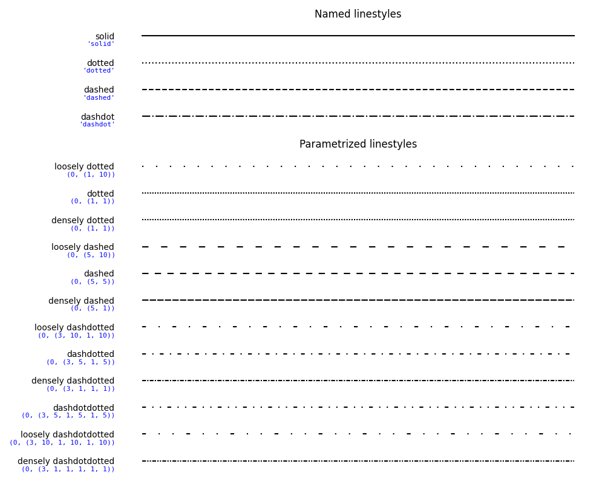

# Chapter 06. 선 종류 지정하기



## 01. 기본 사용



### 예제

```python
import matplotlib.pyplot as plt

plt.plot([1, 2, 3], [4, 4, 4], '-', color='C0', label='Solid')
plt.plot([1, 2, 3], [3, 3, 3], '--', color='C0', label='Dashed')
plt.plot([1, 2, 3], [2, 2, 2], ':', color='C0', label='Dotted')
plt.plot([1, 2, 3], [1, 1, 1], '-.', color='C0', label='Dash-dot')
plt.xlabel('X-Axis')
plt.ylabel('Y-Axis')
plt.axis([0.8, 3.2, 0.5, 5.0])
plt.legend(loc='upper right', ncol=4)
plt.show()
```

Matplotlib에서 선의 종류를 지정하는 가장 간단한 방법은 포맷 문자열을 사용하는 것입니다.

‘ - ‘ (Solid), ‘ - - ‘ (Dashed), ‘ : ‘ (Dotted), ‘ -. ‘ (Dash-dot)과 같이 네가지 종류를 선택할 수 있습니다.

아래와 같은 선이 표시됩니다.




## 02. linestyle 지정하기



### 예제

```python
import matplotlib.pyplot as plt

plt.plot([1, 2, 3], [4, 4, 4], linestyle='solid', color='C0', label="'solid'")
plt.plot([1, 2, 3], [3, 3, 3], linestyle='dashed', color='C0', label="'dashed'")
plt.plot([1, 2, 3], [2, 2, 2], linestyle='dotted', color='C0', label="'dotted'")
plt.plot([1, 2, 3], [1, 1, 1], linestyle='dashdot', color='C0', label="'dashdot'")
plt.xlabel('X-Axis')
plt.ylabel('Y-Axis')
plt.axis([0.8, 3.2, 0.5, 5.0])
plt.legend(loc='upper right', ncol=4)
plt.tight_layout()
plt.show()
```

**plot()** 함수의 **linestyle** 파라미터 값을 직접 지정할 수 있습니다.

포맷 문자열과 같이 ‘solid’, ‘dashed’, ‘dotted’, dashdot’ 네가지의 선 종류를 지정할 수 있습니다.




## 03. 튜플 사용하기



### 예제

```python
import matplotlib.pyplot as plt

plt.plot([1, 2, 3], [4, 4, 4], linestyle=(0, (1, 1)), color='C0', label='(0, (1, 1))')
plt.plot([1, 2, 3], [3, 3, 3], linestyle=(0, (1, 5)), color='C0', label='(0, (1, 5))')
plt.plot([1, 2, 3], [2, 2, 2], linestyle=(0, (5, 1)), color='C0', label='(0, (5, 1))')
plt.plot([1, 2, 3], [1, 1, 1], linestyle=(0, (3, 5, 1, 5)), color='C0', label='(0, (3, 5, 1, 5))')
plt.xlabel('X-Axis')
plt.ylabel('Y-Axis')
plt.axis([0.8, 3.2, 0.5, 5.0])
plt.legend(loc='upper right', ncol=2)
plt.tight_layout()
plt.show()
```

튜플을 사용해서 선의 종류를 커스터마이즈할 수 있습니다.

예를 들어, (0, (1, 1))은 ‘dotted’와 같고, (0, (5, 5))는 ‘dashed’와 같습니다.

또한 (0, (3, 5, 1, 5))는 ‘dashdotted’와 같습니다.

숫자를 바꿔가면서 다양한 선의 종류를 만들어보세요.

결과는 아래와 같습니다.




## 04. 선 끝 모양 지정하기


### 예제

```python
import matplotlib.pyplot as plt

plt.plot([1, 2, 3], [4, 4, 4], linestyle='solid', linewidth=10,
      solid_capstyle='butt', color='C0', label='solid+butt')
plt.plot([1, 2, 3], [3, 3, 3], linestyle='solid', linewidth=10,
      solid_capstyle='round', color='C0', label='solid+round')

plt.plot([1, 2, 3], [2, 2, 2], linestyle='dashed', linewidth=10,
      dash_capstyle='butt', color='C1', label='dashed+butt')
plt.plot([1, 2, 3], [1, 1, 1], linestyle='dashed', linewidth=10,
      dash_capstyle='round', color='C1', label='dashed+round')


plt.xlabel('X-Axis')
plt.ylabel('Y-Axis')
plt.axis([0.8, 3.2, 0.5, 5.0])
plt.legend(loc='upper right', ncol=2)
plt.tight_layout()
plt.show()
```

**plot()** 함수의 **solid_capstyle, dash_capstyle**를 사용해서 선의 끝 모양을 지정할 수 있습니다.

각각 ‘butt’, ‘round’로 지정하면 아래 그림과 같이 뭉뚝한, 둥근 끝 모양이 나타납니다.



더 다양한 선 종류는 아래 그림을 참고하세요.

