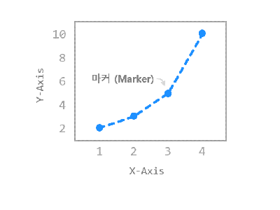
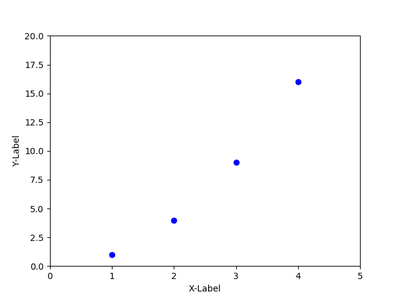
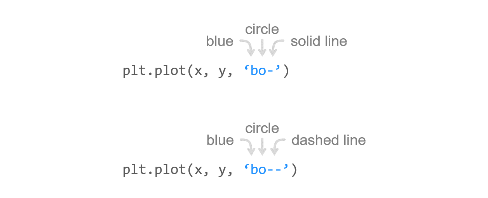
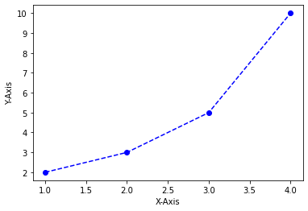
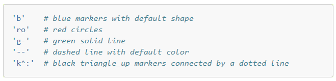
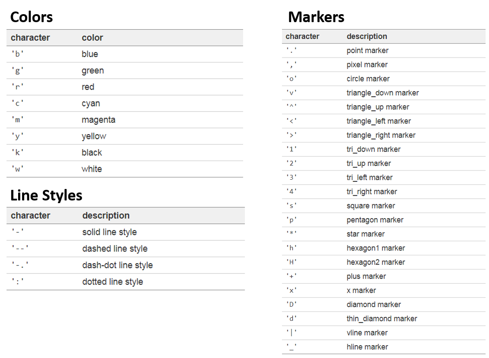
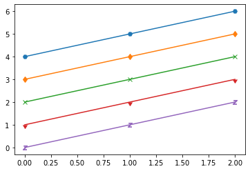
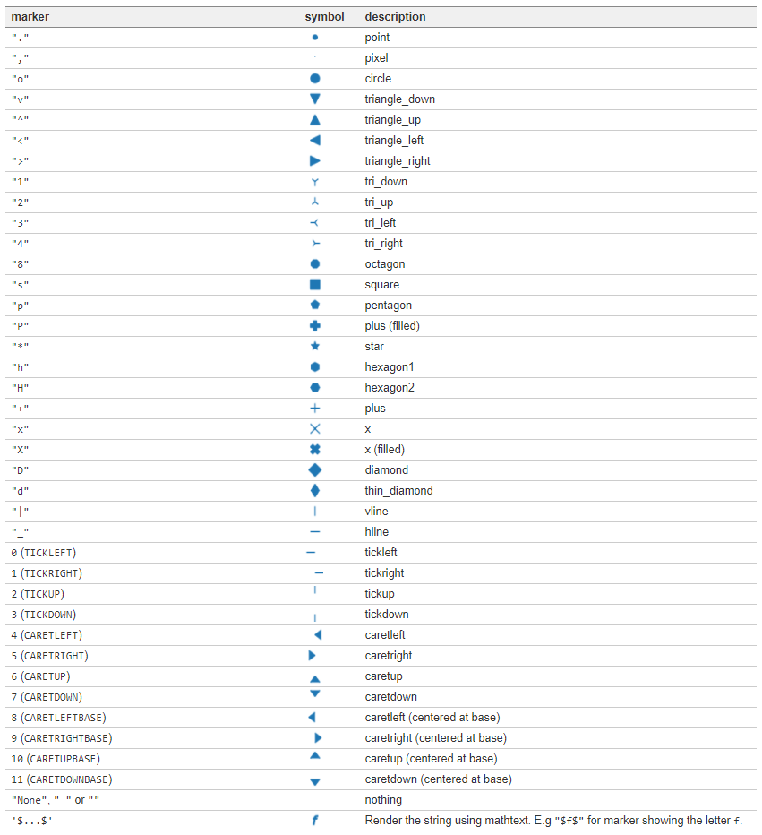

# Chapter 07. 마커 지정하기



특별한 설정이 없으면 그래프가 실선으로 그려지지만, 위의 그림과 같은 마커 형태의 그래프를 그릴 수 있습니다.

**plot()** 함수의 **포맷 문자열 (Format string)**을 사용해서 그래프의 선과 마커를 지정하는 방법에 대해 알아봅니다.


## 01. 기본 사용


### 예제

```python
import matplotlib.pyplot as plt

plt.plot([1, 2, 3, 4], [2, 3, 5, 10], 'bo')
plt.xlabel('X-Axis')
plt.ylabel('Y-Axis')
plt.show()
```

**plot()** 함수에 **‘bo’**를 입력해주면 파란색의 원형 마커로 그래프가 표시됩니다.

‘b’는 blue, ‘o’는 circle을 나타내는 문자입니다.




## 02. 선/마커 동시에 나타내기



### 예제

```python
import matplotlib.pyplot as plt

# plt.plot([1, 2, 3, 4], [2, 3, 5, 10], 'bo-')    # 파란색 + 마커 + 실선
plt.plot([1, 2, 3, 4], [2, 3, 5, 10], 'bo--')     # 파란색 + 마커 + 점선
plt.xlabel('X-Axis')
plt.ylabel('Y-Axis')
plt.show()
```

**‘bo-‘**는 파란색의 원형 마커와 실선 (Solid line)을 의미합니다.

또한 **‘bo- -‘**는 파란색의 원형 마커와 점선 (Dashed line)을 의미합니다.


Matplotlib 마커 지정하기 - 선/마커 동시에 표시하기 (실선 + 마커)



Matplotlib 마커 지정하기 - 선/마커 동시에 표시하기 (점선 + 마커)


## 03. 선/마커 표시 형식

선/마커 표시 형식에 대한 예시는 아래와 같습니다.



또한 다양한 색깔, 선 종류, 마커 종류는 아래 표에 정리되어 있습니다.




## 04. marker 파라미터 사용하기


### 예제

```python
import matplotlib.pyplot as plt

plt.plot([4, 5, 6], marker="H")
plt.plot([3, 4, 5], marker="d")
plt.plot([2, 3, 4], marker="x")
plt.plot([1, 2, 3], marker=11)
plt.plot([0, 1, 2], marker='$Z$')
plt.show()
```

**plot()** 함수의 marker 파라미터를 사용하면 더욱 다양한 마커 형태를 지정할 수 있습니다.

예제에서 다섯가지 마커를 지정했습니다.

결과는 아래와 같습니다.



Matplotlib에서 사용할 수 있는 모든 마커의 종류를 아래 표에서 참고하세요.

