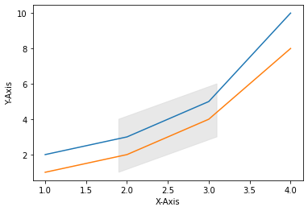

# Chapter 09. 그래프 영역 채우기


**matplotlib.pyplot** 모듈에서 그래프의 영역을 채우는 아래의 세가지 함수에 대해 소개합니다.

- fill_between() - 두 수평 방향의 곡선 사이를 채웁니다.
- fill_betweenx() - 두 수직 방향의 곡선 사이를 채웁니다.
- fill() - 다각형 영역을 채웁니다.


## 01. 기본 사용 - fill_between()


### 예제

```python
import matplotlib.pyplot as plt

x = [1, 2, 3, 4]
y = [2, 3, 5, 10]

plt.plot(x, y)
plt.xlabel('X-Axis')
plt.ylabel('Y-Axis')
plt.fill_between(x[1:3], y[1:3], alpha=0.5)

plt.show()
```

**fill_between()** 함수에 x[1:3], y[1:3]를 순서대로 입력하면,

네 점 (x[1], y[1]), (x[2], y[2]), (x[1], 0), (x[2], 0)을 잇는 영역이 채워집니다.


## 02. 기본 사용 - fill_betweenx()


### 예제

```python
import matplotlib.pyplot as plt

x = [1, 2, 3, 4]
y = [2, 3, 5, 10]

plt.plot(x, y)
plt.xlabel('X-Axis')
plt.ylabel('Y-Axis')
plt.fill_betweenx(y[2:4], x[2:4], alpha=0.5)

plt.show()
```

fill_betweenx() 함수에 y[2:4], x[2:4]를 순서대로 입력하면,

네 점 (x[2], y[2]), (x[3], y[3]), (0, y[2]), (0, y[3])을 잇는 영역이 채워집니다.


## 03. 두 그래프 사이 영역 채우기


### 예제

```python
import matplotlib.pyplot as plt

x = [1, 2, 3, 4]
y1 = [2, 3, 5, 10]
y2 = [1, 2, 4, 8]

plt.plot(x, y1)
plt.plot(x, y2)
plt.xlabel('X-Axis')
plt.ylabel('Y-Axis')
plt.fill_between(x[1:3], y1[1:3], y2[1:3], color='lightgray', alpha=0.5)

plt.show()
```

두 개의 그래프 사이 영역을 채우기 위해서 두 개의 y 값의 리스트 y1, y2를 입력해줍니다.

네 점 (x[1], y[1]), (x[1], y[2]), (x[2], y[1]), (x[2], y[2]) 사이 영역을 채웁니다.

결과는 아래와 같습니다.


## 04. 다각형 영역 채우기 - fill()


### 예제

```python
import matplotlib.pyplot as plt

x = [1, 2, 3, 4]
y1 = [2, 3, 5, 10]
y2 = [1, 2, 4, 8]

plt.plot(x, y1)
plt.plot(x, y2)
plt.xlabel('X-Axis')
plt.ylabel('Y-Axis')
plt.fill([1.9, 1.9, 3.1, 3.1], [1.0, 4.0, 6.0, 3.0], color='lightgray', alpha=0.5)

plt.show()
```

**fill()** 함수에 x, y 값의 리스트를 입력해주면,

각 x, y 점들로 정의되는 다각형 영역을 자유롭게 지정해서 채울 수 있습니다.




