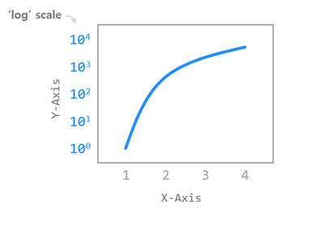
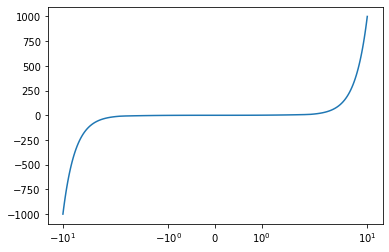
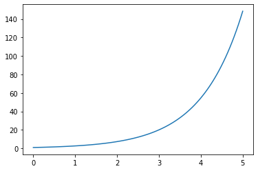
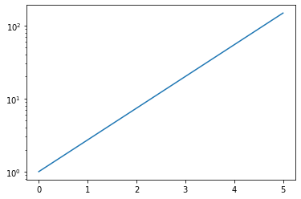

# Chapter 10. 축 스케일 지정하기



**matplotlib.pyplot** 모듈의 **xscale(), yscale()** 함수를 사용해서 그래프의 축 스케일을 다양하게 지정할 수 있습니다.

축은 기본적으로 **‘linear’** 스케일로 표시되지만 **‘log’, ‘symlog’, ‘logit’**으로 변경할 수 있습니다.


## 01. X축 스케일 지정하기


### 예제

```python
import matplotlib.pyplot as plt
import numpy as np

x = np.linspace(-10, 10, 100)
y = x ** 3

plt.plot(x, y)
plt.xscale('symlog')

plt.show()
```

**xscale()** 함수를 사용해서 X축의 스케일을 **‘symlog’**로 지정했습니다.

**‘symlog’**는 **Symmetrical Log Scale**입니다.

축의 원점을 기준으로 양, 음의 방향이 대칭적인 로그 스케일로 표시됩니다.

결과는 아래와 같습니다.




## 02. Y축 스케일 지정하기


### 예제

```python
import matplotlib.pyplot as plt
import numpy as np

x = np.linspace(0, 5, 100)
y = np.exp(x)

plt.plot(x, y)
# plt.yscale('linear')
plt.yscale('log')

plt.show()
```

**yscale()** 함수를 사용해서 Y축의 스케일을 지정했습니다.

로그 스케일은 지수함수 (Exponential function)와 같이 기하급수적으로 변화하는 데이터를 표현하기에 적합합니다.

아래의 그래프는 **Y축을 선형 스케일 (Linear scale)**로 나타낸 결과이고,



Matplotlib 축 스케일 지정하기 - Y축 스케일 지정하기 (Linear scale) 



Matplotlib 축 스케일 지정하기 - Y축 스케일 지정하기 (Log scale)