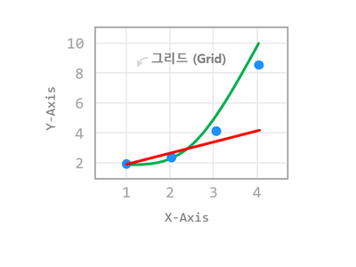
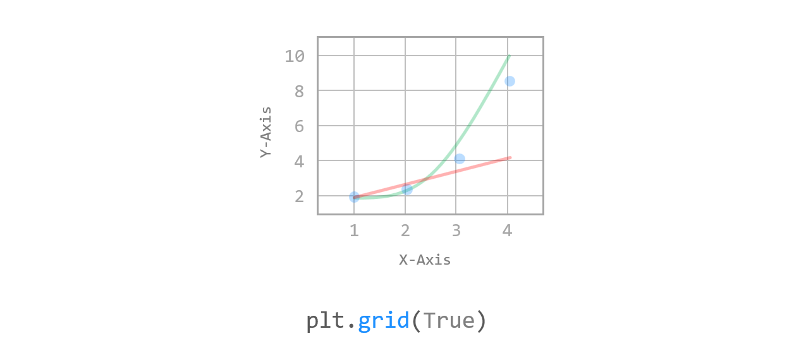
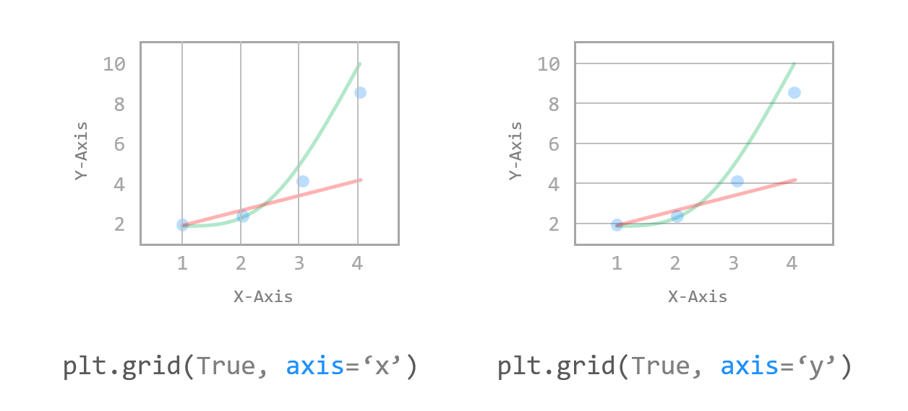
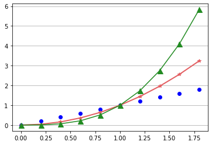
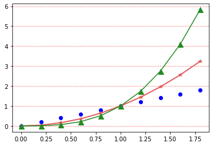

# Chapter 12. 그리드 설정하기



데이터의 위치를 더 명확하게 나타내기 위해 그래프에 **그리드 (Grid, 격자)**를 표시할 수 있습니다.


## 01. 기본 사용



### 예제

```python
import matplotlib.pyplot as plt
import numpy as np

x = np.arange(0, 2, 0.2)

plt.plot(x, x, 'bo')
plt.plot(x, x**2, color='#e35f62', marker='*', linewidth=2)
plt.plot(x, x**3, color='springgreen', marker='^', markersize=9)
plt.grid(True)

plt.show()
```

**plt.grid(True)**와 같이 설정하면, 그래프의 x, y축에 대해 그리드가 표시됩니다.


## 02. 축 지정하기



### 예제

```python
import matplotlib.pyplot as plt
import numpy as np

x = np.arange(0, 2, 0.2)

plt.plot(x, x, 'bo')
plt.plot(x, x**2, color='#e35f62', marker='*', linewidth=2)
plt.plot(x, x**3, color='forestgreen', marker='^', markersize=9)
plt.grid(True, axis='y')

plt.show()
```

**axis=y**로 설정하면 가로 방향의 그리드만 표시됩니다.

{‘both’, ‘x’, ‘y’} 중 선택할 수 있고 디폴트는 ‘both’입니다.

결과는 아래와 같습니다.




## 03. 스타일 설정하기


### 예제

```python
import matplotlib.pyplot as plt
import numpy as np

x = np.arange(0, 2, 0.2)

plt.plot(x, x, 'bo')
plt.plot(x, x**2, color='#e35f62', marker='*', linewidth=2)
plt.plot(x, x**3, color='springgreen', marker='^', markersize=9)
plt.grid(True, axis='y', color='red', alpha=0.5, linestyle='--')

plt.show()
```

**color, alpha, linestyle** 파마리터를 사용해서 그리드 선의 스타일을 설정했습니다.

또한 **which** 파라미터를 ‘major’, ‘minor’, ‘both’ 등으로 사용하면 주눈금, 보조눈금에 각각 그리드를 표시할 수 있습니다.

결과는 아래와 같습니다.



