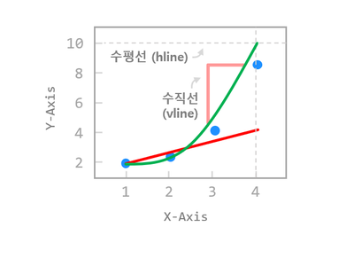
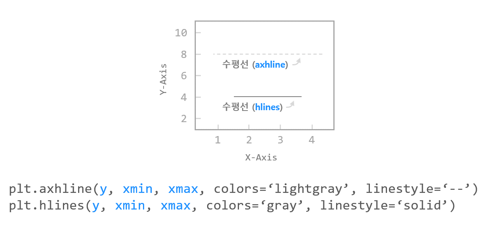
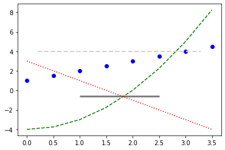
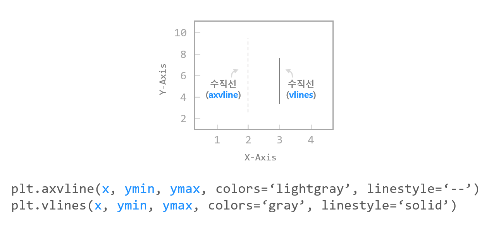
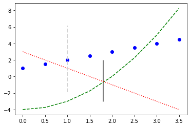

# Chapter 15. 수평선/수직선 표시하기



그래프의 특정 위치에 수직선/수평선을 표시하기 위해서 **matplotlib.pyplot** 모듈은 아래의 네가지 함수를 지원합니다.

- axhline(): 축을 따라 수평선을 표시합니다.
- axvline(): 축을 따라 수직선을 표시합니다.
- hlines(): 지정한 점을 따라 수평선을 표시합니다.
- vlines(): 지정한 점을 따라 수직선을 표시합니다.


## 01. 수평선  그리기 - axhline(), hlines()



### 예제

```python
import matplotlib.pyplot as plt

x = np.arange(0, 4, 0.5)

plt.plot(x, x + 1, 'bo')
plt.plot(x, x**2 - 4, 'g--')
plt.plot(x, -2*x + 3, 'r:')

plt.axhline(4.0, 0.1, 0.9, color='lightgray', linestyle='--', linewidth=2)
plt.hlines(-0.62, 1.0, 2.5, color='gray', linestyle='solid', linewidth=3)

plt.show()
```

**axhline()** 함수의 첫번째 인자는 y 값으로서 수평선의 위치가 됩니다.

두, 세번째 인자는 xmin, xmax 값으로서 **0에서 1 사이의 값**을 입력합니다. 0은 왼쪽 끝, 1은 오른쪽 끝을 의미합니다.

**hlines()** 함수에 y, xmin, xmax를 순서대로 입력하면, 점 (xmin, y)에서 점 (xmax, y)를 따라 수평선을 표시합니다.




## 02. 수직선 그리기 - axvline(), vlines()



### 예제

```python
import matplotlib.pyplot as plt

x = np.arange(0, 4, 0.5)

plt.plot(x, x + 1, 'bo')
plt.plot(x, x**2 - 4, 'g--')
plt.plot(x, -2*x + 3, 'r:')

plt.axvline(1.0, 0.2, 0.8, color='lightgray', linestyle='--', linewidth=2)
plt.vlines(1.8, -3.0, 2.0, color='gray', linestyle='solid', linewidth=3)

plt.show()
```

**axvline()** 함수의 첫번째 인자는 x 값으로서 수직선의 위치가 됩니다.

두, 세번째 인자는 ymin, ymax 값으로서 **0에서 1 사이의 값**을 입력합니다. 0은 아래쪽 끝, 1은 위쪽 끝을 의미합니다.

**vlines()** 함수에 x, ymin, ymax를 순서대로 입력하면, 점 (x, ymin)에서 점 (x, ymax)를 따라 수평선을 표시합니다.



