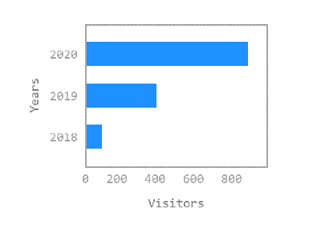
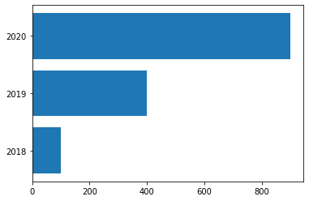
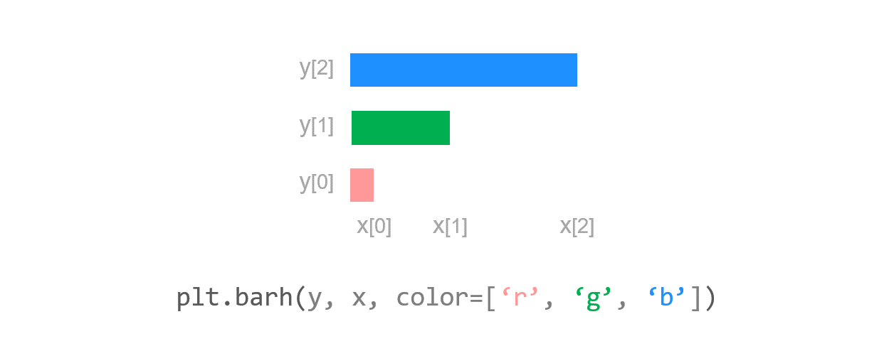
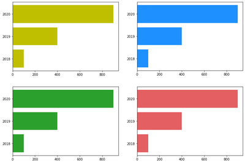
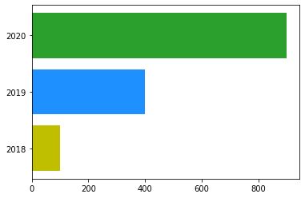
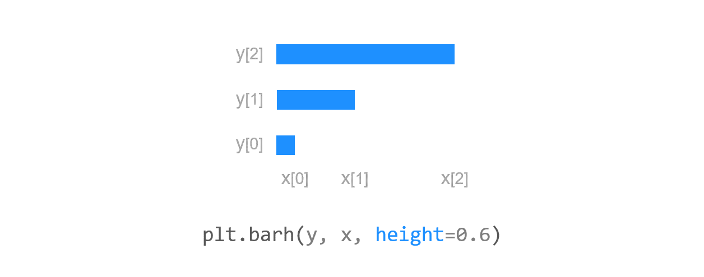
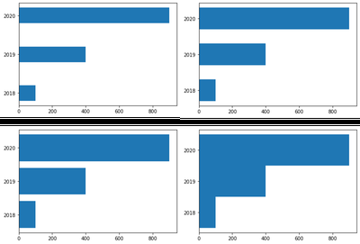
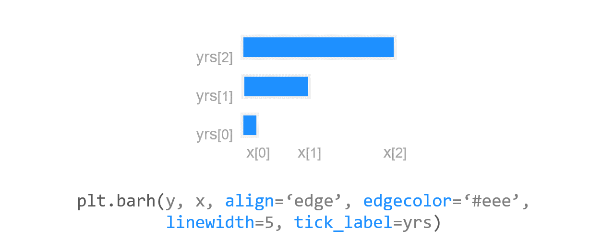
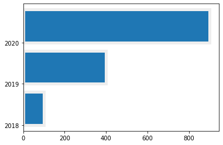

# Chapter 17. 수평 막대 그래프 그리기



**수평 막대 그래프 (Horizontal bar graph)**는 범주가 있는 데이터 값을 수평 막대로 표현하는 그래프입니다.


## 01. 기본 사용


### 예제

```python
import matplotlib.pyplot as plt
import numpy as np

y = np.arange(3)
years = ['2018', '2019', '2020']
values = [100, 400, 900]

plt.barh(y, values)
plt.yticks(y, years)

plt.show()
```

연도별로 변화하는 값을 갖는 데이터를 수평 막대 그래프로 나타냈습니다.

**years**는 Y축에 표시될 연도이고, **values**는 막대 그래프의 너비로 표시될 x 값 입니다.

먼저 **barh()** 함수에 NumPy 어레이 [0, 1, 2]와 x 값에 해당하는 리스트 [100, 400, 900]를 입력해줍니다.

다음, **yticks()**에 y와 years를 입력해주면, Y축의 눈금 레이블에 ‘2018’, ‘2019’, ‘2020’이 순서대로 표시됩니다.




## 02. 색상 지정하기



### 예제1

```python
import matplotlib.pyplot as plt
import numpy as np

y = np.arange(3)
years = ['2018', '2019', '2020']
values = [100, 400, 900]

plt.barh(y, values, color='y')
# plt.barh(y, values, color='dodgerblue')
# plt.barh(y, values, color='C2')
# plt.barh(y, values, color='#e35f62')
plt.yticks(y, years)

plt.show()
```

**plt.barh()** 함수의 **color** 파라미터를 사용해서 막대의 색상을 지정할 수 있습니다.

예제에서는 네 가지의 색상을 사용했습니다.

Matplotlib의 다양한 색상에 대해서는 [Matplotlib 색상 지정하기](https://wikidocs.net/92085) 페이지를 참고하세요.




### 예제2

```python
import matplotlib.pyplot as plt
import numpy as np

y = np.arange(3)
years = ['2018', '2019', '2020']
values = [100, 400, 900]
colors = ['y', 'dodgerblue', 'C2']

plt.barh(y, values, color=colors)
plt.yticks(y, years)

plt.show()
```

**plt.barh()** 함수의 **color** 파라미터에 색상의 이름을 리스트의 형태로 입력하면,

막대의 색상을 각각 다르게 지정할 수 있습니다.




## 03. 막대 높이 지정하기



### 예제

```python
import matplotlib.pyplot as plt
import numpy as np

y = np.arange(3)
years = ['2018', '2019', '2020']
values = [100, 400, 900]

plt.barh(y, values, height=0.4)
# plt.barh(y, values, height=0.6)
# plt.barh(y, values, height=0.8)
# plt.barh(y, values, height=1.0)
plt.yticks(y, years)

plt.show()
```

**plt.barh()** 함수의 **height** 파라미터는 막대의 높이를 지정합니다.

예제에서는 막대의 높이를 0.4/0.6/0.8/1.0으로 지정했고, 디폴트는 0.8입니다.




## 04. 스타일 꾸미기



### 예제

```python
import matplotlib.pyplot as plt
import numpy as np

y = np.arange(3)
years = ['2018', '2019', '2020']
values = [100, 400, 900]

plt.barh(y, values, align='edge', edgecolor='#eee',
         linewidth=5, tick_label=years)

plt.show()
```

이번에는 수평 막대 그래프의 테두리의 색, 두께 등 스타일을 적용해 보겠습니다.

**align**은 눈금과 막대의 위치를 조절합니다. 디폴트는 ‘center’이며, ‘edge’로 설정하면 막대의 아래쪽 끝에 눈금이 표시됩니다.

**edgecolor**는 막대의 테두리 색, **linewidth**는 테두리의 두께를 지정합니다.

**tick_label**을 리스트 또는 어레이 형태로 지정하면, 틱에 문자열을 순서대로 나타낼 수 있습니다.

