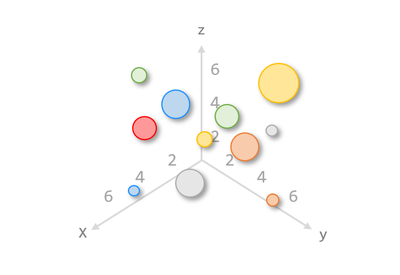
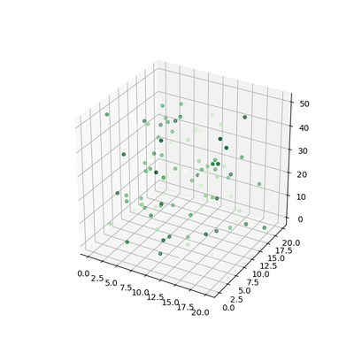

# Chapter 19. 3차원 산점도 그리기



## 기본 사용

### 예제

```python
from mpl_toolkits.mplot3d import Axes3D
import matplotlib.pyplot as plt
import numpy as np

n = 100
xmin, xmax, ymin, ymax, zmin, zmax = 0, 20, 0, 20, 0, 50
cmin, cmax = 0, 2

xs = np.array([(xmax - xmin) * np.random.random_sample() + xmin for i in range(n)])
ys = np.array([(ymax - ymin) * np.random.random_sample() + ymin for i in range(n)])
zs = np.array([(zmax - zmin) * np.random.random_sample() + zmin for i in range(n)])
color = np.array([(cmax - cmin) * np.random.random_sample() + cmin for i in range(n)])

fig = plt.figure(figsize=(6, 6))
ax = fig.add_subplot(111, projection='3d')
ax.scatter(xs, ys, zs, c=color, marker='o', s=15, cmap='Greens')

plt.show()
```


### 설명

```python
from mpl_toolkits.mplot3d import Axes3D
import matplotlib.pyplot as plt
import numpy as np
```

3차원 그래프를 그리기 위해서 **from mpl_toolkits.mplot3d import Axes3D**를 추가해줍니다.


```python
n = 100
xmin, xmax, ymin, ymax, zmin, zmax = 0, 20, 0, 20, 0, 50
cmin, cmax = 0, 2
```

xs, ys는 0에서 20 사이, zs는 0에서 50 사이의 값을 갖도록 범위를 정해줍니다.

color는 0에서 2 사이의 값을 갖는 실수이고, 이 값을 통해 각각 다른 색을 표현합니다.


```python
xs = np.array([(xmax - xmin) * np.random.random_sample() + xmin for i in range(n)])
ys = np.array([(ymax - ymin) * np.random.random_sample() + ymin for i in range(n)])
zs = np.array([(zmax - zmin) * np.random.random_sample() + zmin for i in range(n)])
color = np.array([(cmax - cmin) * np.random.random_sample() + cmin for i in range(n)])
```

**np.random.random_sample()**를 통해 각 범위 안에서 임의의 실수를 생성합니다.

이 부분은 아래와 같이 np.random.rand()를 이용해서 동일하게 만들 수 있습니다.

```python
xs = (xmax - xmin) * np.random.rand(n) + xmin
ys = (xmax - xmin) * np.random.rand(n) + ymin
zs = (xmax - xmin) * np.random.rand(n) + zmin
color = (xmax - xmin) * np.random.rand(n) + cmin
```


```python
fig = plt.figure(figsize=(6, 6))
ax = fig.add_subplot(111, projection='3d')
ax.scatter(xs, ys, zs, c=color, marker='o', s=15, cmap='Greens')
```

3D axes를 만들기 위해 **add_subplot()**에 **projection=’3d’**를 입력해줍니다.

**scatter()** 함수에 x, y, z 위치를 어레이의 형태로 입력해줍니다.

**c=color**는 color 어레이의 값들이 색으로 표현되도록 합니다.

마커 (marker)의 형태를 원형 (circle)으로 정해줍니다.

마커의 종류에 대해서는 [마커 지정하기](https://wikidocs.net/92083) 페이지에서 확인하세요.

**cmap=’Greens’**를 통해 colormap을 녹색 계열로 설정합니다.

결과는 아래와 같습니다.

