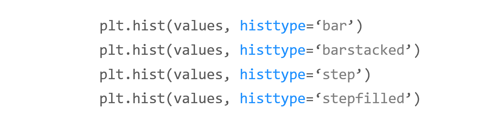

# Chapter 20. 히스토그램 그리기


**히스토그램 (Histogram)은 도수분포표를 그래프로 나타낸 것으로서, 가로축은 계급, 세로축은 도수 (횟수나 개수 등)**를 나타냅니다.


## 01. 기본 사용


### 예제

```python
import matplotlib.pyplot as plt

weight = [68, 81, 64, 56, 78, 74, 61, 77, 66, 68, 59, 71,
          80, 59, 67, 81, 69, 73, 69, 74, 70, 65]

plt.hist(weight)

plt.show()
```

weight는 몸무게 값을 나타내는 리스트입니다.

**hist()** 함수에 리스트의 형태로 값들을 직접 입력해주면 됩니다.


## 02. 구간 개수 지정하기

**hist()** 함수의 **bins** 파라미터는 히스토그램의 가로축 구간의 개수를 지정합니다.

아래 그림과 같이 구간의 개수에 따라 히스토그램 분포의 형태가 달라질 수 있기 때문에

적절한 구간의 개수를 지정해야 합니다.


### 예제

```python
import matplotlib.pyplot as plt

weight = [68, 81, 64, 56, 78, 74, 61, 77, 66, 68, 59, 71,
          80, 59, 67, 81, 69, 73, 69, 74, 70, 65]

plt.hist(weight, label='bins=10')
plt.hist(weight, bins=30, label='bins=30')
plt.legend()
plt.show()
```

첫번째 히스토그램은 **bins** 값을 지정하지 않아서 기본값인 10으로 지정되었습니다.

두번째 히스토그램은 **bins** 값을 30으로 지정했습니다.


## 03. 누적 히스토그램 그리기


### 예제

```python
import matplotlib.pyplot as plt

weight = [68, 81, 64, 56, 78, 74, 61, 77, 66, 68, 59, 71,
          80, 59, 67, 81, 69, 73, 69, 74, 70, 65]

plt.hist(weight, cumulative=True, label='cumulative=True')
plt.hist(weight, cumulative=False, label='cumulative=False')
plt.legend(loc='upper left')
plt.show()
```

**cumulative** 파라미터를 **True**로 지정하면 누적 히스토그램을 나타냅니다.

디폴트는 **False**로 지정됩니다.


## 04. 히스토그램 종류 지정하기



### 예제

```python
import matplotlib.pyplot as plt

weight = [68, 81, 64, 56, 78, 74, 61, 77, 66, 68, 59, 71,
        80, 59, 67, 81, 69, 73, 69, 74, 70, 65]
weight2 = [52, 67, 84, 66, 58, 78, 71, 57, 76, 62, 51, 79,
        69, 64, 76, 57, 63, 53, 79, 64, 50, 61]

plt.hist((weight, weight2), histtype='bar')
plt.title('histtype - bar')
plt.figure()

plt.hist((weight, weight2), histtype='barstacked')
plt.title('histtype - barstacked')
plt.figure()

plt.hist((weight, weight2), histtype='step')
plt.title('histtype - step')
plt.figure()

plt.hist((weight, weight2), histtype='stepfilled')
plt.title('histtype - stepfilled')
plt.show()
```

**histtype**은 히스토그램의 종류를 지정합니다.

{‘bar’, ‘barstacked’, ‘step’, ‘stepfilled’} 중에서 선택할 수 있으며, 디폴트는 ‘bar’입니다.

예제에서와 같이 두 종류의 데이터를 히스토그램으로 나타냈을 때, **histtype**의 값에 따라 각기 다른 히스토그램이 그려집니다.


## 05. Numpy 난수의 분포 나타내기


### 예제

```python
import matplotlib.pyplot as plt
import numpy as np


a = 2.0 * np.random.randn(10000) + 1.0
b = np.random.standard_normal(10000)
c = 20.0 * np.random.rand(5000) - 10.0

plt.hist(a, bins=100, density=True, alpha=0.7, histtype='step')
plt.hist(b, bins=50, density=True, alpha=0.5, histtype='stepfilled')
plt.hist(c, bins=100, density=True, alpha=0.9, histtype='step')

plt.show()
```

Numpy의 np.random.randn(), np.random.standard_normal(), np.random.rand() 함수를 이용해서 임의의 값들을 만들었습니다.

어레이 a는 표준편차 2.0, 평균 1.0을 갖는 정규분포, 어레이 b는 표준정규분포를 따릅니다.

어레이 c는 -10.0에서 10.0 사이의 균일한 분포를 갖는 5000개의 임의의 값입니다.

**density=True**로 설정해주면, 밀도함수가 되어서 막대의 아래 면적이 1이 됩니다.

**alpha**는 투명도를 의미합니다. 0.0에서 1.0 사이의 값을 갖습니다.


