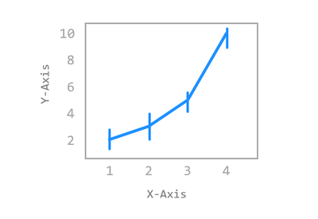
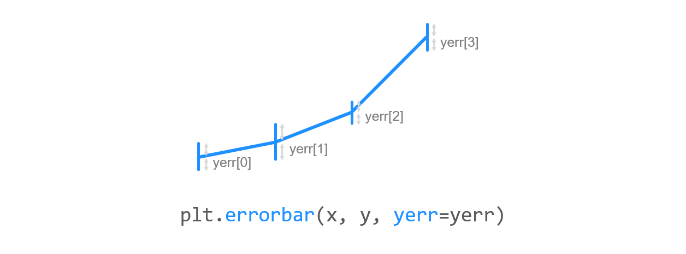
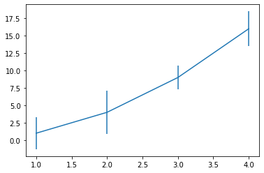
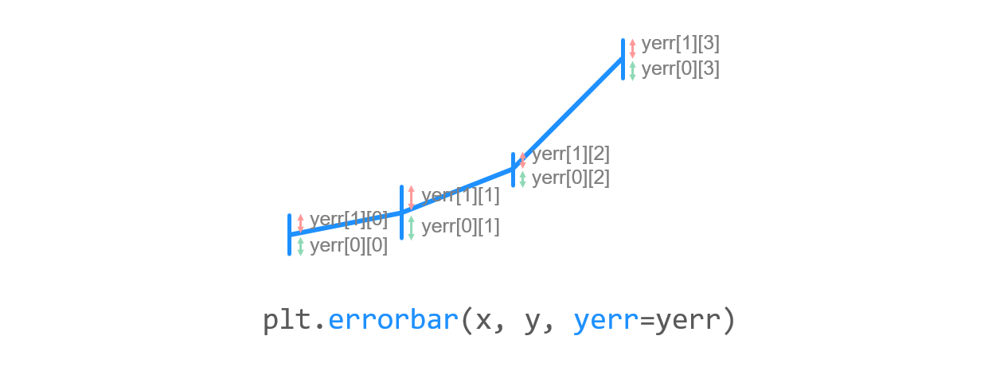
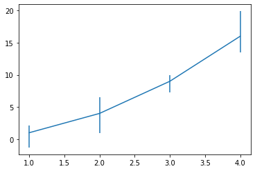
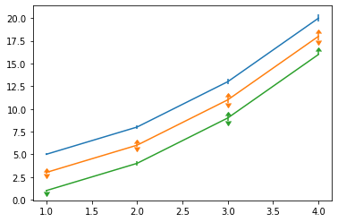

# Chapter 21. 에러바 표시하기




**에러바 (Errorbar, 오차막대)**는 **데이터의 편차를 표시하기 위한 그래프 형태**입니다.


## 01. 기본 사용



### 예제

```python
import matplotlib.pyplot as plt

x = [1, 2, 3, 4]
y = [1, 4, 9, 16]
yerr = [2.3, 3.1, 1.7, 2.5]

plt.errorbar(x, y, yerr=yerr)
plt.show()
```

**errorbar()** 함수에 x, y 값들과 함께 데이터의 편차를 나타내는 리스트인 yerr을 입력합니다.

yerr의 각 값들은 데이터 포인트의 위/아래 대칭인 오차로 표시됩니다.




## 02. 비대칭 편차 나타내기



### 예제

```python
import matplotlib.pyplot as plt

x = [1, 2, 3, 4]
y = [1, 4, 9, 16]
yerr = [(2.3, 3.1, 1.7, 2.5), (1.1, 2.5, 0.9, 3.9)]

plt.errorbar(x, y, yerr=yerr)
plt.show()
```

데이터 포인트를 기준으로 비대칭인 편차를 표시하려면,

(2, N) 형태의 값들을 입력해주면 됩니다. (N: 데이터 개수)

첫번째 튜플의 값들은 아래 방향 편차, 두번째 튜플의 값들은 위 방향 편차를 나타냅니다.




## 03. 상한/하한 기호 표시하기


### 예제

```python
import numpy as np
import matplotlib.pyplot as plt

x = np.arange(1, 5)
y = x**2
yerr = np.linspace(0.1, 0.4, 4)

plt.errorbar(x, y + 4, yerr=yerr)
plt.errorbar(x, y + 2, yerr=yerr, uplims=True, lolims=True)

upperlimits = [True, False, True, False]
lowerlimits = [False, False, True, True]
plt.errorbar(x, y, yerr=yerr, uplims=upperlimits, lolims=lowerlimits)
plt.show()
```

uplims, lolims를 사용해서 상한/하한 기호를 선택적으로 표시할 수 있습니다.

예를 들어, uplims이 **True**이고 lolims이 **False**라면, 이 값이 상한값임을 의미해서 아래 방향의 화살표가 표시됩니다.



