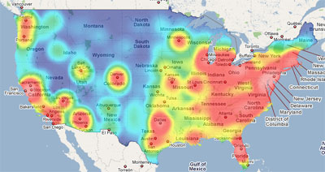
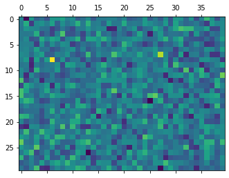
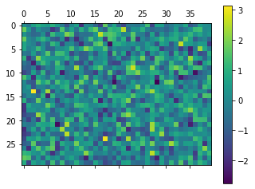
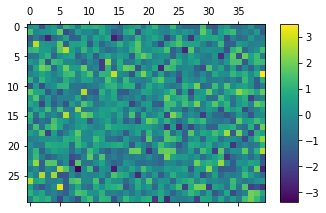
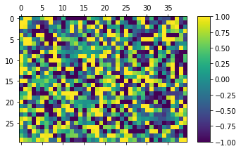
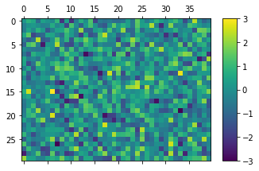
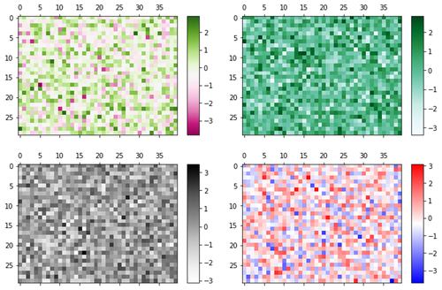

# Chapter 23. 히트맵 그리기



**히트맵 (Heatmap)은 다양한 값을 갖는 숫자 데이터를 열분포 형태와 같이 색상을 이용해서 시각화**한 것입니다.

지도 이미지 위에 인구의 분포를 표현하거나, 웹사이트 이미지 위에 마우스의 클릭 위치를 표시하는 등의 다양한 정보를 시각화할 수 있습니다.


## 01. 기본 사용


### 예제

```python
import matplotlib.pyplot as plt
import numpy as np

arr = np.random.standard_normal((30, 40))

plt.matshow(arr)

plt.show()
```

np.random.standard_normal() 로 만들어진 2차원 어레이 arr는 표준정규분포를 갖는 (30, 40) 형태의 2차원 어레이 입니다.

**matshow()** 함수에 어레이의 형태로 값들을 직접 입력하면 아래와 같은 그래프가 표시됩니다.




## 02. 컬러바 나타내기


### 예제1

```python
import matplotlib.pyplot as plt
import numpy as np

arr = np.random.standard_normal((30, 40))

plt.matshow(arr)
plt.colorbar()

plt.show()
```

히트맵에 컬러바를 함께 나타내기 위해서 **colorbar()** 함수를 사용합니다.




### 예제2

```python
plt.colorbar(shrink=0.8, aspect=10)
```

**colorbar()** 함수의 **shrink** 파라미터는 컬러바의 크기를 결정합니다.

**shrink** 파라미터의 디폴트 값은 1.0이며, 예제에서는 0.8로 지정했습니다.

**colorbar()** 함수의 **aspect** 파라미터는 컬러바의 종횡비 (Aspect ratio)를 결정합니다.

**aspect** 파라미터의 디폴트 값은 20이며, 예제에서는 10으로 지정했습니다.




## 03. 색상 범위 지정하기


### 예제

```python
import matplotlib.pyplot as plt
import numpy as np

arr = np.random.standard_normal((30, 40))

plt.matshow(arr)
plt.colorbar(shrink=0.8, aspect=10)
# plt.clim(-1.0, 1.0)
plt.clim(-3.0, 3.0)

plt.show()
```

히트맵에 표시될 색상의 범위를 지정하기 위해서 **clim()** 함수를 사용합니다.

아래 그림은 색상의 범위를 -1.0 ~ 1.0 으로 지정한 히트맵입니다.

arr의 값 중 -1.0 보다 작거나 1.0 보다 큰 값에 대해서는 각각 -1.0, 1.0과 같은 색으로 나타납니다.



아래 그림은 색상의 범위를 -3.0 ~ 3.0 으로 지정한 히트맵입니다.

arr의 값 중 -3.0 보다 작거나 3.0 보다 큰 값에 대해서는 각각 -3.0, 3.0과 같은 색으로 나타납니다.




## 04. 컬러맵 지정하기


### 예제

```python
import matplotlib.pyplot as plt
import numpy as np

arr = np.random.standard_normal((30, 40))
# cmap = plt.get_cmap('PiYG')
# cmap = plt.get_cmap('BuGn')
# cmap = plt.get_cmap('Greys')
cmap = plt.get_cmap('bwr')

plt.matshow(arr, cmap=cmap)
plt.colorbar()
plt.show()
```

cmap 키워드 인자를 통해 표시할 컬러맵의 종류를 지정할 수 있습니다.

**matplotlib.pyplot** 모듈의 **get_cmap()** 함수를 이용해서 Matplotlib 컬러맵을 가져와서 **matshow()**에 입력해줍니다.

다양한 컬러맵을 적용한 히트맵은 아래와 같습니다.

