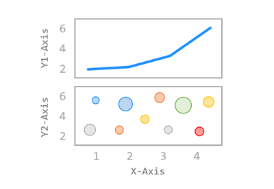
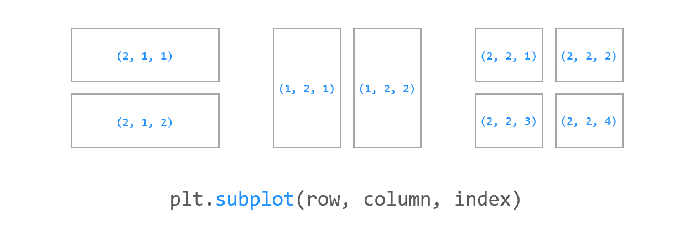
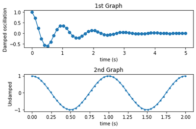
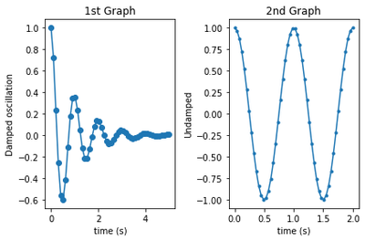
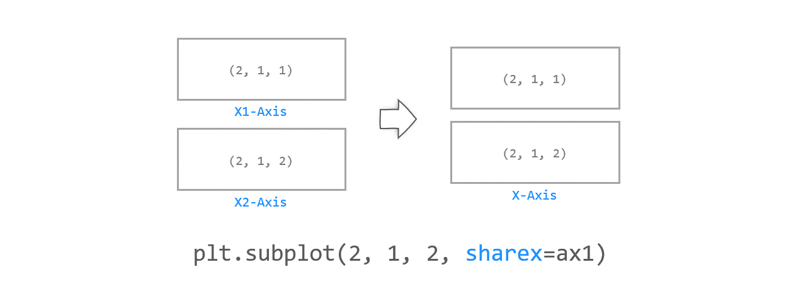
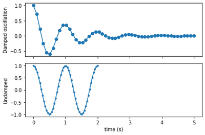

# Chapter 24. 여러 개의 그래프 그리기



**matplotlib.pyplot** 모듈의 **subplot()** 함수는 여러 개의 그래프를 하나의 그림에 나타내도록 합니다.

이 페이지에서는 **subplot()** 함수를 사용해서 여러 개의 그래프를 나타내고, 축을 공유하는 방법을 소개합니다.


## 01. 기본 사용



### 예제1

```python
import numpy as np
import matplotlib.pyplot as plt

x1 = np.linspace(0.0, 5.0)
x2 = np.linspace(0.0, 2.0)

y1 = np.cos(2 * np.pi * x1) * np.exp(-x1)
y2 = np.cos(2 * np.pi * x2)

plt.subplot(2, 1, 1)                # nrows=2, ncols=1, index=1
plt.plot(x1, y1, 'o-')
plt.title('1st Graph')
plt.ylabel('Damped oscillation')

plt.subplot(2, 1, 2)                # nrows=2, ncols=1, index=2
plt.plot(x2, y2, '.-')
plt.title('2nd Graph')
plt.xlabel('time (s)')
plt.ylabel('Undamped')

plt.tight_layout()
plt.show()
```

우선 NumPy 함수를 사용해서 두 개의 cosine 함수 y1, y2를 만듭니다.

**subplot(nrows, ncols, index)**의 순서대로 nrows=2, ncols=1을 입력하고,

y1 함수는 index=1, y2 함수는 index=2를 입력해서 각각 위, 아래에 위치하도록 합니다.

결과는 아래와 같습니다.




### 예제2

```python
import numpy as np
import matplotlib.pyplot as plt

x1 = np.linspace(0.0, 5.0)
x2 = np.linspace(0.0, 2.0)

y1 = np.cos(2 * np.pi * x1) * np.exp(-x1)
y2 = np.cos(2 * np.pi * x2)

plt.subplot(1, 2, 1)                # nrows=1, ncols=2, index=1
plt.plot(x1, y1, 'o-')
plt.title('1st Graph')
plt.xlabel('time (s)')
plt.ylabel('Damped oscillation')

plt.subplot(1, 2, 2)                # nrows=1, ncols=2, index=2
plt.plot(x2, y2, '.-')
plt.title('2nd Graph')
plt.xlabel('time (s)')
plt.ylabel('Undamped')

plt.tight_layout()
plt.show()
```

두 그래프를 수평 방향으로 배치하기 위해서 **subplot(nrows, ncols, index)**의 순서대로 nrows=1, ncols=2을 입력하고,

y1 함수는 index=1, y2 함수는 index=2를 입력해서 각각 좌우로 위치하도록 합니다.

결과는 아래와 같습니다.




## 02. 축 공유하기



### 예제

```python
import numpy as np
import matplotlib.pyplot as plt

x1 = np.linspace(0.0, 5.0)
x2 = np.linspace(0.0, 2.0)

y1 = np.cos(2 * np.pi * x1) * np.exp(-x1)
y2 = np.cos(2 * np.pi * x2)

ax1 = plt.subplot(2, 1, 1)                # nrows=2, ncols=1, index=1
plt.plot(x1, y1, 'o-')
plt.ylabel('Damped oscillation')
plt.xticks(visible=False)

ax2 = plt.subplot(2, 1, 2, sharex=ax1)    # nrows=2, ncols=1, index=2
plt.plot(x2, y2, '.-')
plt.xlabel('time (s)')
plt.ylabel('Undamped')

plt.tight_layout()
plt.show()
```

**plt.subplot()** 함수의 **sharex** 또는 **sharey** 파라미터를 사용하면 두 그래프의 축을 공유할 수 있습니다.

예제에서는 **sharex**를 사용해서 두 그래프가 X축을 공유하도록 했습니다.

X축의 범위와 눈금이 동일하게 표시됩니다.



