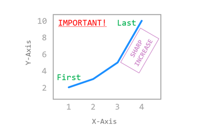
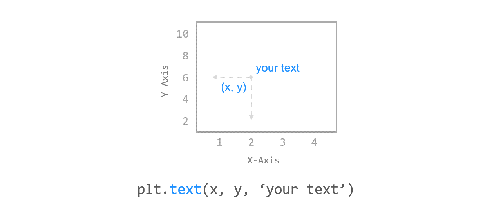
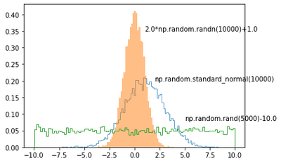
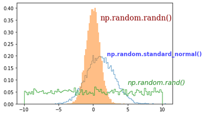
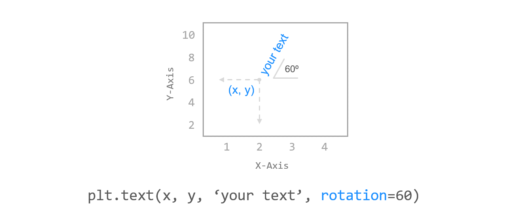
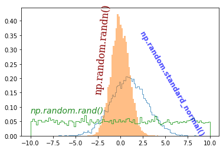
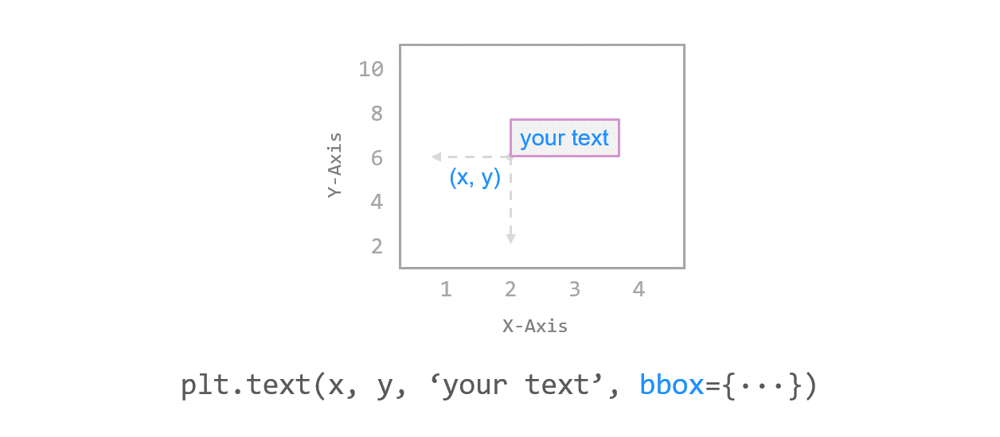
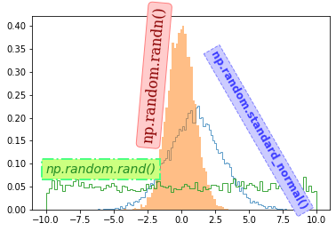

# Chapter 26. 텍스트 삽입하기



## 01. 기본 사용



### 예제

```python
import matplotlib.pyplot as plt
import numpy as np

a = 2.0 * np.random.randn(10000) + 1.0
b = np.random.standard_normal(10000)
c = 20.0 * np.random.rand(5000) - 10.0

plt.hist(a, bins=100, density=True, alpha=0.7, histtype='step')
plt.text(1.0, 0.35, '2.0*np.random.randn(10000)+1.0')
plt.hist(b, bins=50, density=True, alpha=0.5, histtype='stepfilled')
plt.text(2.0, 0.20, 'np.random.standard_normal(10000)')
plt.hist(c, bins=100, density=True, alpha=0.9, histtype='step')
plt.text(5.0, 0.08, 'np.random.rand(5000)-10.0')
plt.show()
```

**text()** 함수를 이용해서 3개의 히스토그램 그래프에 설명을 위한 텍스트를 각각 추가했습니다.

**text()**에 그래프 상의 x 위치, y 위치, 그리고 삽입할 텍스트를 순서대로 입력합니다.




## 02. 텍스트 스타일 설정하기


### 예제

```python
import matplotlib.pyplot as plt
import numpy as np

a = 2.0 * np.random.randn(10000) + 1.0
b = np.random.standard_normal(10000)
c = 20.0 * np.random.rand(5000) - 10.0

font1 = {'family': 'serif',
      'color':  'darkred',
      'weight': 'normal',
      'size': 16}

font2 = {'family': 'Times New Roman',
      'color':  'blue',
      'weight': 'bold',
      'size': 12,
      'alpha': 0.7}

font3 = {'family': 'Arial',
      'color':  'forestgreen',
      'style': 'italic',
      'size': 14}

plt.hist(a, bins=100, density=True, alpha=0.7, histtype='step')
plt.text(1.0, 0.35, 'np.random.randn()', fontdict=font1)
plt.hist(b, bins=50, density=True, alpha=0.5, histtype='stepfilled')
plt.text(2.0, 0.20, 'np.random.standard_normal()', fontdict=font2)
plt.hist(c, bins=100, density=True, alpha=0.9, histtype='step')
plt.text(5.0, 0.08, 'np.random.rand()', fontdict=font3)

plt.show()
```

**fontdict** 키워드를 이용하면 font의 종류, 크기, 색상, 투명도, weight 등의 텍스트 스타일을 설정할 수 있습니다.

font1, font2, font3과 같이 미리 지정한 폰트 딕셔너리를 fontdict 키워드에 입력해줍니다.

예제에서는 ‘family’, ‘color’, ‘weight’, ‘size’, ‘alpha’, ‘style’ 등과 같은 텍스트 속성을 사용했습니다.




## 03. 텍스트 회전하기



### 예제

```python
plt.hist(a, bins=100, density=True, alpha=0.7, histtype='step')
plt.text(-3.0, 0.15, 'np.random.randn()', fontdict=font1, rotation=85)
plt.hist(b, bins=50, density=True, alpha=0.5, histtype='stepfilled')
plt.text(2.0, 0.0, 'np.random.standard_normal()', fontdict=font2, rotation=-60)
plt.hist(c, bins=100, density=True, alpha=0.9, histtype='step')
plt.text(-10.0, 0.08, 'np.random.rand()', fontdict=font3)
plt.show()
```

rotation 키워드를 이용해서 텍스트를 회전할 수 있습니다.

첫번째, 두번째 텍스트를 각각 85도, -60도만큼 회전시켰습니다.




## 04. 텍스트 상자 스타일 설정하기



### 예제

```python
import matplotlib.pyplot as plt
import numpy as np

a = 2.0 * np.random.randn(10000) + 1.0
b = np.random.standard_normal(10000)
c = 20.0 * np.random.rand(5000) - 10.0

font1 = {'family': 'serif',
        'color':  'darkred',
        'weight': 'normal',
        'size': 16}

font2 = {'family': 'Times New Roman',
        'color':  'blue',
        'weight': 'bold',
        'size': 12,
        'alpha': 0.7}

font3 = {'family': 'Arial',
        'color':  'forestgreen',
        'style': 'italic',
        'size': 14}

box1 = {'boxstyle': 'round',
        'ec': (1.0, 0.5, 0.5),
        'fc': (1.0, 0.8, 0.8)}

box2 = {'boxstyle': 'square',
        'ec': (0.5, 0.5, 1.0),
        'fc': (0.8, 0.8, 1.0),
        'linestyle': '--'}

box3 = {'boxstyle': 'square',
        'ec': (0.3, 1.0, 0.5),
        'fc': (0.8, 1.0, 0.5),
        'linestyle': '-.',
        'linewidth': 2}

plt.hist(a, bins=100, density=True, alpha=0.7, histtype='step')
plt.text(-3.0, 0.15, 'np.random.randn()', fontdict=font1, rotation=85, bbox=box1)
plt.hist(b, bins=50, density=True, alpha=0.5, histtype='stepfilled')
plt.text(2.0, 0.0, 'np.random.standard_normal()', fontdict=font2, rotation=-60, bbox=box2)
plt.hist(c, bins=100, density=True, alpha=0.9, histtype='step')
plt.text(-10.0, 0.08, 'np.random.rand()', fontdict=font3, bbox=box3)
plt.show()
```

**bbox** 키워드를 사용해서 텍스트 상자의 스타일을 설정할 수 있습니다.

예제에서는 ‘boxstyle’, ‘ec’, ‘fc’, ‘linestyle’, ‘linewidth’ 등의 스타일을 사용했습니다.

‘ec’는 ‘edgecolor’, ‘fc’는 ‘facecolor’와 같습니다. 각각 텍스트 상자의 테두리와 면의 색을 지정하는 속성입니다.

