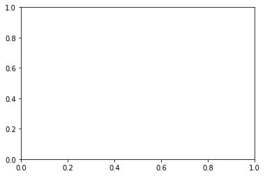
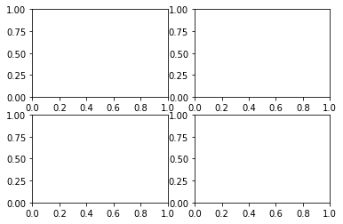
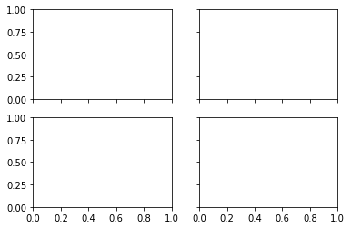

# Chapter 30. 객체 지향 인터페이스 1

지금까지 **matplotlib.pyplot** 모듈의 다양한 함수들을 이용해서 간편하게 그래프를 그렸습니다.

Matplotlib는 그래프를 다루는 두 가지의 인터페이스를 제공하는데 첫번째는 **MATLAB 스타일로 pyplot** 모듈을 사용하는 방식이고, 두번째는 **객체 지향 인터페이스**입니다.

Matplotlib 공식 문서에 의하면 더욱 커스터마이즈된 그래프를 위해 객체 지향 인터페이스를 사용하기를 권장합니다.


## 01. plt.subplots() 사용하기

### 예제1

```python
import matplotlib.pyplot as plt

fig, ax = plt.subplots()
plt.show()
```

**matplotlib.pyplot** 모듈은 **subplots()**라는 유용한 함수를 제공합니다. ([matplotlib.pyplot.subplots](https://matplotlib.org/stable/api/_as_gen/matplotlib.pyplot.subplots.html))

**subplots()** 함수를 호출하면 figure (fig)과 subplot (ax) 객체를 생성해서 튜플의 형태로 반환합니다.

아래와 같은 그림이 나타납니다.




### 예제2

```python
import matplotlib.pyplot as plt

# fig, ax = plt.subplots()
fig = plt.figure()
ax = fig.add_axes([0, 0, 1, 1])

plt.show()
```

**fig, ax = plt.subplots()**과 같이 사용하지 않고 이 예제와 같이 사용할 수도 있습니다.

plt.figure()는 **Figure 클래스의 인스턴스**를 반환합니다.

Figure 클래스의 인스턴스 fig의 메서드 **add_axes()**는 fig에 axes를 하나 추가합니다.

add_axes([left, bottom, width, height])의 형태로 0에서 1 사이의 값을 입력합니다.

이 페이지의 예제들에서는 plt.subplots() 함수를 사용합니다.


## 02. 행과 열 설정하기 (nrows, ncols)

### 예제

```python
import matplotlib.pyplot as plt

fig, ax = plt.subplots(2, 2)
plt.show()
```

**plt.subplots(nrows, ncols)**의 형태로 행과 열의 개수를 지정할 수 있습니다.

만약 지정하지 않으면 기본적으로 행과 열의 개수는 모두 1입니다.

결과는 아래와 같습니다.




## 03. X, Y축 공유하기 (sharex, sharey)

앞의 그림에서 네 개의 그래프 영역은 X, Y축의 범위가 같습니다.

이 경우에 중복해서 표시하지 않도록 X축 또는 Y축을 공유하도록 설정할 수 있습니다.

### 예제

```python
import matplotlib.pyplot as plt

fig, ax = plt.subplots(2, 2, sharex=True, sharey=True)
plt.show()
```

sharex=True, sharey=True로 설정함으로써 아래와 같이 중복된 축을 한번만 표시하도록 했습니다.

sharex, sharey에 True, False 이 외에도 ‘all’, ‘none’, ‘row’, ‘col’ 등을 지정할 수 있습니다.

결과는 아래와 같습니다.




