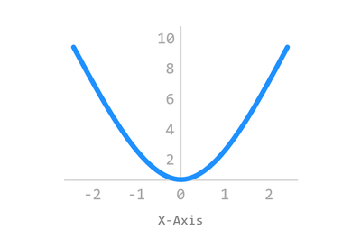
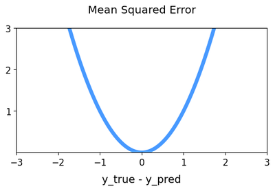
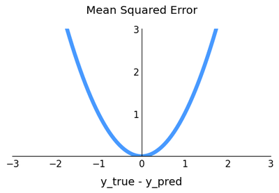

# Chapter 32. 축 위치 조절하기



Matplotlib의 기본적인 레이아웃은 그래프 상하좌우의 네 방향에 데이터 영역을 나타내는 직선이 그려지는 형태입니다.

이 페이지에서는 데이터 영역을 나타내는 직선을 필요한 위치에 선택적으로 표시하는 방법에 대해 소개합니다.


## 기본 사용


### 예제

```python
import matplotlib.pyplot as plt
import numpy as np

plt.style.use('default')
plt.rcParams['figure.figsize'] = (6, 3)
plt.rcParams['font.size'] = 12


fig, ax = plt.subplots()

ax.set_title('Mean Squared Error', pad=20)
ax.set_xlim(-3, 3)
ax.set_ylim(0, 3)
ax.set_xticks([-3, -2, -1, 0, 1, 2, 3])
ax.set_yticks([1, 2, 3])

ax.spines['left'].set_position('center')        # 왼쪽 축을 가운데 위치로 이동
ax.spines['right'].set_visible(False)          # 오른쪽 축을 보이지 않도록
ax.spines['top'].set_visible(False)            # 위 축을 보이지 않도록
ax.spines['bottom'].set_position(('data', 0))   # 아래 축을 데이터 0의 위치로 이동
ax.tick_params('both', length=0)                # Tick의 눈금 길이 0

x = np.linspace(-3, 3, 100)
ax.set_xlabel('y_true - y_pred', fontdict={'fontsize': 14}, labelpad=10)
ax.plot(x, x**2, color='#4799FF', linewidth=5)

plt.show()
```

**ax.spine[‘left’]**는 왼쪽 축의 **spine**을 가리키는 클래스입니다.

Matplotlib의 **spine**은 **데이터 영역의 경계를 나타내는 선**을 말합니다.

이 **spine** 클래스의 **set_position()** 메서드를 사용하면 이 직선의 위치를 조절할 수 있습니다.

**set_position(‘center’)**과 같이 데이터 영역의 가운데에 위치시키거나,

**set_position((‘data’, 0))**과 같이 특정 데이터 좌표의 위치에 직선을 표시할 수 있습니다.

**set_visible(False)**는 **spine**이 그래프에 표시되지 않도록 합니다.

아래 그림은 위 예제의 강조된 부분을 적용하지 않은 그래프이고,



Matplotlib 축 위치 조절하기 - 기본 레이아웃



Matplotlib 축 위치 조절하기 - 축 위치 가운데로 