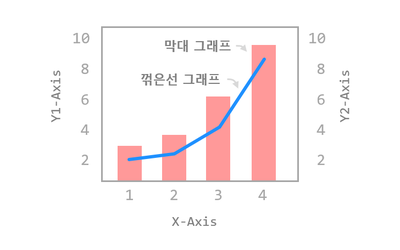
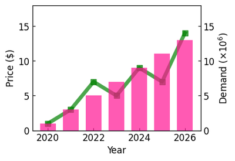
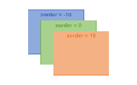
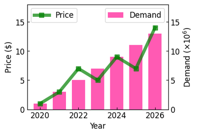

# Chapter 34.  두 종류의 그래프 그리기



앞에서 소개한 [이중 Y축 표시하기](https://wikidocs.net/141535)를 이용해서 두 종류의 그래프를 하나의 그래프 영역에 표현해보겠습니다.


## 01. 기본 사용

### 예제

```python
import matplotlib.pyplot as plt
import numpy as np

# 1. 기본 스타일 설정
plt.style.use('default')
plt.rcParams['figure.figsize'] = (4, 3)
plt.rcParams['font.size'] = 12

# 2. 데이터 준비
x = np.arange(2020, 2027)
y1 = np.array([1, 3, 7, 5, 9, 7, 14])
y2 = np.array([1, 3, 5, 7, 9, 11, 13])

# 3. 그래프 그리기
fig, ax1 = plt.subplots()

ax1.plot(x, y1, '-s', color='green', markersize=7, linewidth=5, alpha=0.7, label='Price')
ax1.set_ylim(0, 18)
ax1.set_xlabel('Year')
ax1.set_ylabel('Price ($)')
ax1.tick_params(axis='both', direction='in')

ax2 = ax1.twinx()
ax2.bar(x, y2, color='deeppink', label='Demand', alpha=0.7, width=0.7)
ax2.set_ylim(0, 18)
ax2.set_ylabel(r'Demand ($\times10^6$)')
ax2.tick_params(axis='y', direction='in')

plt.show()
```

우선 **ax1.twinx()**로 X축을 공유하는 이중 Y축을 만들고,

**ax1.plot()**과 **ax2.bar()**를 사용해서 y1, y2 데이터를 각각 꺾은선 그래프와 막대 그래프의 형태로 나타냈습니다.

(두번째 Y축의 레이블에 표현한 수학적 표현의 사용에 대해서는 [링크](https://wikidocs.net/141545)를 참고하세요.)

결과는 아래와 같습니다.




## 02. 그래프 순서 지정하기

위의 그림을 보면 녹색의 꺾은선 그래프가 막대의 뒤에 그려져 있어서 잘 보이지 않습니다.

아래 예제에서는 set_zorder() 메서드를 사용해서 그래프가 표시될 순서를 지정해 보겠습니다.


### 예제

```python
import matplotlib.pyplot as plt
import numpy as np

# 1. 기본 스타일 설정
plt.style.use('default')
plt.rcParams['figure.figsize'] = (4, 3)
plt.rcParams['font.size'] = 12

# 2. 데이터 준비
x = np.arange(2020, 2027)
y1 = np.array([1, 3, 7, 5, 9, 7, 14])
y2 = np.array([1, 3, 5, 7, 9, 11, 13])

# 3. 그래프 그리기
fig, ax1 = plt.subplots()

ax1.plot(x, y1, '-s', color='green', markersize=7, linewidth=5, alpha=0.7, label='Price')
ax1.set_ylim(0, 18)
ax1.set_xlabel('Year')
ax1.set_ylabel('Price ($)')
ax1.tick_params(axis='both', direction='in')

ax2 = ax1.twinx()
ax2.bar(x, y2, color='deeppink', label='Demand', alpha=0.7, width=0.7)
ax2.set_ylim(0, 18)
ax2.set_ylabel(r'Demand ($\times10^6$)')
ax2.tick_params(axis='y', direction='in')

ax1.set_zorder(ax2.get_zorder() + 10)
ax1.patch.set_visible(False)

ax1.legend(loc='upper left')
ax2.legend(loc='upper right')

plt.show()
```

**set_zorder()** 메서드는 z-축 방향의 순서를 지정합니다.

아래 그림과 같이 **zorder**가 낮을수록 먼저 그려지고, **zorder**가 높을수록 나중에 그려집니다.



우선 **ax2.get_zorder()** 메서드를 사용해서 **ax2**의 **zorder**를 얻고,

**ax2**의 **zorder**보다 큰 값을 **ax1**의 **zorder**로 지정함으로써 그래프가 항상 나중에 그려지도록 설정했습니다.

결과는 아래와 같습니다.



