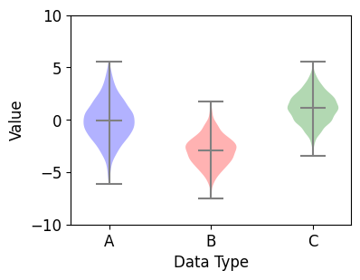

# Chapter 36.  바이올린 플롯 그리기


**바이올린 플롯 (Violin plot)**은 데이터의 분포와 범위를 한눈에 보기 쉽게 나타내는 그래프 형식입니다.

**박스 플롯 (Box plot)**과 비슷하지만 더 실제에 가까운 분포를 알 수 있다는 장점이 있습니다.

이번 페이지에서는 바이올린 플롯을 통해 데이터의 분포를 시각화하고, 다양한 방식으로 꾸미는 방법에 대해 소개합니다.


## 01. 기본 사용

### 예제

```python
import matplotlib.pyplot as plt
import numpy as np

# 1. 기본 스타일 설정
plt.style.use('default')
plt.rcParams['figure.figsize'] = (4, 3)
plt.rcParams['font.size'] = 12

# 2. 데이터 준비
np.random.seed(0)
data_a = np.random.normal(0, 2.0, 1000)
data_b = np.random.normal(-3.0, 1.5, 500)
data_c = np.random.normal(1.2, 1.5, 1500)

# 3. 그래프 그리기
fig, ax = plt.subplots()

violin = ax.violinplot([data_a, data_b, data_c], positions=[2, 3, 4])
ax.set_ylim(-10.0, 10.0)
ax.set_xticks([1, 2, 3, 4, 5])
ax.set_xlabel('Data Type')
ax.set_ylabel('Value')

plt.show()
```

**ax.violinplot()**는 주어진 데이터 어레이의 분포를 바이올린의 형태로 시각화합니다.

세 개의 난수 데이터 어레이를 리스트 형태로 입력했습니다.

**positions** 파라미터는 바이올린 플롯의 x 위치를 지정합니다. 지정하지 않으면 1, 2, 3.. 의 순서로 그래프가 그려집니다.

**ax.set_xticks([1, 2, 3, 4, 5])**를 통해 x축의 눈금을 지정했고, **[2, 3, 4]**의 위치에 그래프가 그려집니다.


## 02. 최대/최소값, 중간값, 평균값 표시하기

### 예제

```python
import matplotlib.pyplot as plt
import numpy as np

# 1. 기본 스타일 설정
plt.style.use('default')
plt.rcParams['figure.figsize'] = (4, 3)
plt.rcParams['font.size'] = 12

# 2. 데이터 준비
np.random.seed(0)
data_a = np.random.normal(0, 2.0, 1000)
data_b = np.random.normal(-3.0, 1.5, 500)
data_c = np.random.normal(1.2, 1.5, 1500)

# 3. 그래프 그리기
fig, ax = plt.subplots()

violin = ax.violinplot([data_a, data_b, data_c], showmeans=True)
ax.set_ylim(-10.0, 10.0)
ax.set_xticks(np.arange(1, 4))
ax.set_xticklabels(['A', 'B', 'C'])
ax.set_xlabel('Data Type')
ax.set_ylabel('Value')

plt.show()
```

**showmeans** 파라미터는 데이터 분포에서 평균값의 위치에 직선을 표시합니다. (Default: False)

**showextrema**는 최대/최소값에 직선을 표시합니다. (Default: True)

**showmedians**는 중간값에 직선을 표시합니다. (Default: False)


## 03. 분위수 지정하기

### 예제

```python
import matplotlib.pyplot as plt
import numpy as np

# 1. 기본 스타일 설정
plt.style.use('default')
plt.rcParams['figure.figsize'] = (4, 3)
plt.rcParams['font.size'] = 12

# 2. 데이터 준비
np.random.seed(0)
data_a = np.random.normal(0, 2.0, 1000)
data_b = np.random.normal(-3.0, 1.5, 500)
data_c = np.random.normal(1.2, 1.5, 1500)

# 3. 그래프 그리기
fig, ax = plt.subplots()

violin = ax.violinplot([data_a, data_b, data_c], quantiles=[[0.25, 0.75], [0.1, 0.9], [0.3, 0.7]])
ax.set_ylim(-10.0, 10.0)
ax.set_xticks(np.arange(1, 4))
ax.set_xticklabels(['A', 'B', 'C'])
ax.set_xlabel('Data Type')
ax.set_ylabel('Value')

plt.show()
```

**ax.violinplot()**의 **quantiles** 파라미터는 데이터 분포의 분위수를 표시합니다.

0.0에서 1.0 사이의 숫자를 리스트의 형태로 입력합니다.

위의 예제에서는 data_a에 대해 **25%, 75%**의 위치에, data_b에 대해 **10%, 90%**의 위치에,

그리고 data_c에 대해 **30%, 70%**의 위치에 분위수 직선을 표시합니다.


## 04. 색상 지정하기

### 예제

```python
import matplotlib.pyplot as plt
import numpy as np

# 1. 기본 스타일 설정
plt.style.use('default')
plt.rcParams['figure.figsize'] = (4, 3)
plt.rcParams['font.size'] = 12

# 2. 데이터 준비
np.random.seed(0)
data_a = np.random.normal(0, 2.0, 1000)
data_b = np.random.normal(-3.0, 1.5, 500)
data_c = np.random.normal(1.2, 1.5, 1500)

# 3. 그래프 그리기
fig, ax = plt.subplots()

violin = ax.violinplot([data_a, data_b, data_c], showmeans=True)
ax.set_ylim(-10.0, 10.0)
ax.set_xticks(np.arange(1, 4))
ax.set_xticklabels(['A', 'B', 'C'])
ax.set_xlabel('Data Type')
ax.set_ylabel('Value')

violin['bodies'][0].set_facecolor('blue')
violin['bodies'][1].set_facecolor('red')
violin['bodies'][2].set_facecolor('green')

violin['cbars'].set_edgecolor('gray')
violin['cmaxes'].set_edgecolor('gray')
violin['cmins'].set_edgecolor('gray')
violin['cmeans'].set_edgecolor('gray')

plt.show()
```

**ax.violinplot()**은 바이올린 플롯의 각 구성 요소에 해당하는 collection 인스턴스의 리스트를 딕셔너리의 형태로 반환합니다.

반환한 딕셔너리 (violin)는 아래와 같은 키 **(keys)**를 포함하고 있습니다.

- **bodies**: 각각의 바이올린 분포의 **채워진 영역**을 포함하는 PolyCollection 인스턴스의 리스트.
- **cmeans**: 바이올린 분포의 **평균값**을 표시하는 LineCollection 인스턴스.
- **cmins**: 바이올린 분포의 **최소값**을 표시하는 LineCollection 인스턴스.
- **cmaxes**: 바비올린 분포의 **최대값**을 표시하는 LineCollection 인스턴스.
- **cbars**: 바이올린 분포의 **중심**을 표시하는 LineCollection 인스턴스.
- **cmedians**: 바이올린 분포의 **중간값**을 표시하는 LineCollection 인스턴스.
- **cquantiles**: 바이올린 분포의 **분위값**을 표시하는 LineCollection 인스턴스.

 

**violin[‘bodies’][n]**의 **set_facecolor()** 메서드는 n번째 바이올린 분포 영역의 색상을 지정합니다.

**violin[‘cbars’]**의 **set_edgecolor()** 메서드는 중심을 표시하는 직선의 색상을 지정합니다.

**violin[‘cmaxes’]**의 **set_edgecolor()** 메서드는 분포의 최대값을 표시하는 직선의 색상을 지정합니다.

**violin[‘cmins’]**의 **set_edgecolor()** 메서드는 분포의 최소값을 표시하는 직선의 색상을 지정합니다.

**violin[‘cmeans’]**의 **set_edgecolor()** 메서드는 분포의 평균을 표시하는 직선의 색상을 지정합니다.

결과는 아래와 같습니다.

