# Chapter 02. 1차원 데이터 정리

```python
import numpy as np
import pandas as pd

# 주피터 노트북의 출력을 소수점 이하 3자리로 제한
%precision 3
# 데이터 프레임의 출력을 소수점 이하 3자리로 제한
pd.set_option('precision', 3)
```


## 데이터셋

- 학생 50명의 영어, 수학점수(df)

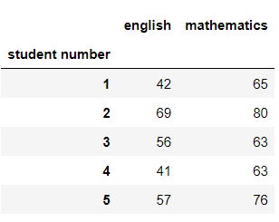


- 학생 10명의 영어점수(scores)

```python
scores = np.array(df['english'])[:10]
scores
```

```
array([42, 69, 56, 41, 57, 48, 65, 49, 65, 58], dtype=int64)
```


- 학생 10명의 영어점수(scores_df)

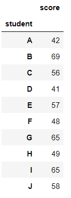


## 01. 대푯값

- 데이터를 하나의 값으로 요약한 값을 대푯값이라고 한다. 예를 들어 시험의 난이도를 알고 싶다면 전체 학생의 시험 평균 점수를 알면 파악할 수 있다.


### 1.1 평균값

- 평균은 다음과 같이 표기하고  '엑스 바'라고 읽는다.

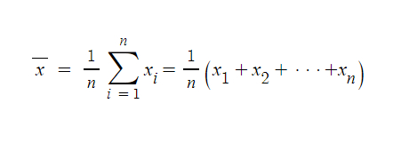

### (예시)

- 파이썬

```python
sum(scores)/len(scores)
```

```
55.0
```


- 넘파이

```python
np.mean(scores)
```

```
55.0
```


- 판다스

```python
scores_df.mean()
```

```
score    55.0
dtype: float64
```


### 1.2 중앙값

- 중앙값(median)은 데이터를 크기 순서대로 나열할 때 정확하게 중앙에 위치한 값이다. 예를 들어, [9, 1, 5, 3, 7]이라는 데이터가 있다면 중앙값은 세 번째인 5이다.
- 중앙값은 평균값에 비해 이상값에 강하다는 특성이 있다. 즉, 이상값에 영향을 덜 받는다는 의미이다. 예를들어, [1, 2, 3, 4, 5, 6, 1000]이라는 데이터가 있다고 가정하자. 이 데이터의 평균은 1000이라는 값 때문에 150에 가까운 값이 되버린다.  하지만 중앙값은 4이다. 이 경우 대푯값으로 평균보다 중앙값이 적절하다.
- 데이터의 갯수에 따라 중앙값의 정의는 다음과 같다.
  - 데이터의 개수 n이 홀수라면, (n+1)/2 번째 데이터가 중앙값
  - 데이터의 개수 n이 짝수라면, n/2번째 데이터와 (n/2)+1번째 데이터의 평균이 중앙값


### (예시)

```python
sorted_scores = np.sort(scores)
sorted_scores
```

```
array([41, 42, 48, 49, 56, 57, 58, 65, 65, 69], dtype=int64)
```


- 파이썬

```python
n = len(sorted_scores)
if n % 2 == 0:
    m0 = sorted_scores[n//2 - 1]
    m1 = sorted_scores[n//2]
    median = (m0 + m1) / 2
else:
    median = sorted_scores[(n+1)//2 - 1]
median
```

```
56.5
```


- 넘파이

```python
np.median(scores)
```

```
56.5
```


- 판다스

```python
scores_df.median()
```

```
score    56.5
dtype: float64
```


### 1.3 최빈값

- 최빈값(mode)은 데이터에서 가장 많이 나타나는 값이다.
- 최빈값은 기본적으로 질적 데이터의 대푯값을 구할 때 사용하는 지표이다. 왜냐하면 시험 점수와 같은 양적 데이터에서는 최빈값을 구하려고 해도 완전히 동일한 점수가 여러 번 나오는 경우가 거의 없어, 유일한 값이 결정되지 않을 때가 많기 때문이다
- 도수분포표를 도입하면 양적 데이터도 최빈값을 정의할 수 있다


### (예시)

```python
pd.Series([1, 1, 1, 2, 2, 3]).mode()
```

```
0    1
dtype: int64
```


```python
pd.Series([1, 2, 3, 4, 5]).mode()
```

```
0    1
1    2
2    3
3    4
4    5
dtype: int64
```


## 02. 산포도

- 대푯값으로 데이터를 이해하기에는 한계가 있다. 예를 들어 학급 평균 점수가 50점을 받은 두 학급이 있다. A반은 전원이 50점을 받았고, B반은 절반은 0점, 절반은 100점을 받았다. 이 경우 두 학급 모두 평균값과 중앙값은 동일하게 50점이 되버린다. 대푯값 이외에도 산포도를 확인할 필요가 있다.


### 2.1 분산과 표준편차


#### 1. 편차

- 편차(deviation)는 각 데이터가 평균으로부터 어느 정도 떨어져 있는가를 나타나는 지표이다. 예를 들어 반 전체 평균 50점이고,  A학생이 42점을 받았다고 하면 42-50 = -8점이 된다.


#### (예시)

- 서로 다른 편차를 가진 산포도가 있다

```python
mean = np.mean(scores)
deviation = scores - mean
deviation
```

```python
array([-13.,  14.,   1., -14.,   2.,  -7.,  10.,  -6.,  10.,   3.])
```


```python
another_scores = [50, 60, 58, 54, 51, 56, 57, 53, 52, 59]
another_mean = np.mean(another_scores)
another_deviation = another_scores - another_mean
another_deviation
```

```
array([-5.,  5.,  3., -1., -4.,  1.,  2., -2., -3.,  4.])
```


- 각 10명의 편찻값을 통해 데이터를 비교하기 어렵기 때문에, 값을 하나로 정리하고 싶다. 편차의 대푯값으로 평균을 선택해보자

```python
np.mean(deviation)
```

```
0.0
```


```python
np.mean(another_deviation)
```

```
0.0
```


* 편차 평균은 항상 0가 된다.

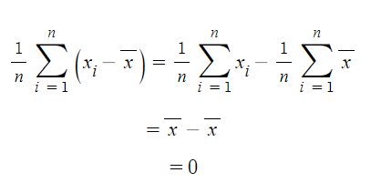

```python
summary_df = scores_df.copy()
summary_df['deviation'] = deviation
summary_df
```

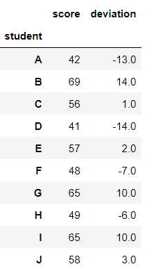

```python
summary_df.mean()
```

```
score        55.0
deviation     0.0
dtype: float64
```


#### 2. 분산

* 산포도의 지표로 편차를 사용하는 것은 바람직하지만, 편차의 평균이 항상 0이 되므로 잘 사용하지 않는다.
* B학생, D학생은 모두 14점 떨어져 있어서 동일한 정도의 산포도를 가지고 있는 것 같다. 이 때문에 이 둘을 동일하게 취급하여 편차의 제곱을 이용한다. 그리고 그 평균을 분산(variance)이라고 한다.
* 분산을 수식으로 나타내면 다음과 같다

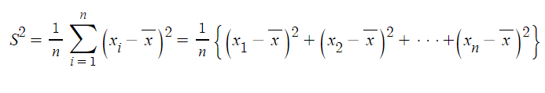


#### (예시)

* 정의에 따라 계산

```python
np.mean(deviation ** 2)
```

```
86.0
```


* 넘파이(표본분산)

```python
np.var(scores)
```

```
86.0
```


* 판다스(불편분산)
* 표본분산으로 계산하고 싶다면 ddof = 0을 설정하면 된다

```python
# 다음 두 코드는 동일한 결과를 나타낸다
scores_df.var()
scores_df.var(ddof = 1)
```

```python
score    95.556
dtype: float64

```


```python
summary_df['square of deviation'] = np.square(deviation)
summary_df
```

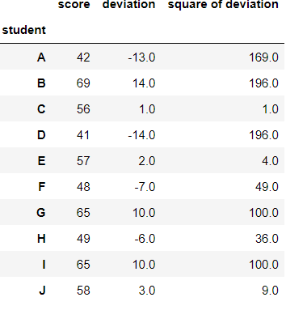

```python
summary_df.mean()
```

```
score                  55.0
deviation               0.0
square of deviation    86.0
dtype: float64
```


* 분산을 면적의 평균으로 바라보는 시각도 있다. 이는 공분산으로 이해 개념이 된다.
* A, B, C ,D점은 각 학생의 영어 평균점이다. 회색 정사각형은 편차의 제곱이다. 이러한 정사각형의 평균이 중앙에 있는 색칠된 정사각형이 되고, 이 면적이 곧 분산이 된다.

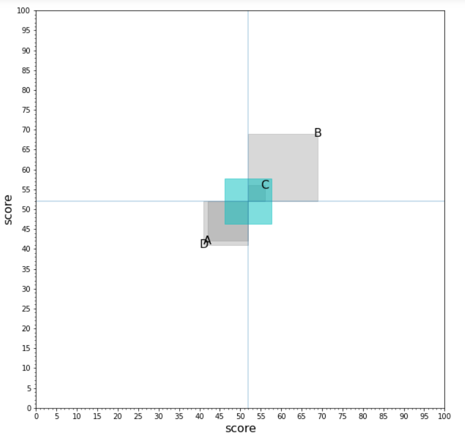


#### 3. 표준편차

* 분산은 점수의 면적으로 나타내므로 점수의 제곱이라는 이해하기 어려운 단위를 사용한다. 영어 점수의 분산이 86점^2^ 이라고 말해도 감이 오지 않는다. 이 때문에 데이터와 동일한 단위를 쓰는 산포도 지표가 있어야 한다. 분산에 제곱근을 취한 표준편차(standard deviation)를 이용한다

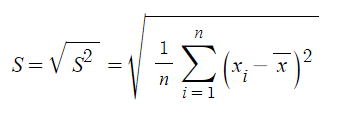

#### (예시)

```python
np.sqrt(np.var(scores, ddof = 0))
```

```
9.274
```


```python
np.std(scores, ddof = 0)
```

```
9.274
```


* 표준편차는 원래의 데이터와 동일한 단위를 쓰므로, 동일한 차원으로 그릴 수 있다. 가장 진하게 색깔이 칠해진 영역이 평균±표준편차구간, 그 다음이 평균±2 표준편차구간, 가장 옅은 영역이 평균±3 표준편차 구간이다. 각각 1시그마 구간, 2시그마 구간, 3시그마 구간이라고 부른다.

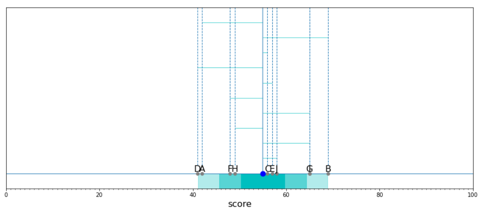


### 2.2 범위와 사분위 범위


#### 1. 범위

* 범위(range)는 분산이나 표준편차와 달리, 데이터 전체를 보는 것이 아니라 데이터의 최댓값과 최솟값만으로 산포도를 표현하는 방법이다. 최댓값과 최솟값의 차이가 크면 산포도가 크고, 그 차이가 작으면 산포도도 작다는 의미이다. 간단히 계산할 수 있지만, 값이 2개뿐이므로 개략적인 지표이고 이상값에 약하다.

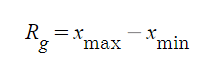


#### (예시)

```python
np.max(scores) - np.min(scores)
```

```
28
```


#### 2. 사분위 범위

* 범위는 최댓값과 최솟값밖에 보이지 않으므로, 큰 이상값이 하나라도 있으면 범위도 크게 변화한다. 이 때문에 최댓값과 최솟값이 아니라, 데이터의 상위수%에 위치하는 값과 하위수%에 위치하는 값의 차이를 취하는 방법을 생각할 수 있다.
* 특히 사분위 범위(interquartile range)에서는 데이터의 하위25%, 50%, 75%에 위치하는 값에 주목한다. 각각 제1사분위수, 제2사분위수, 제3사분위수라고 하면 Q1, Q2, Q3으로 나타낸다. 그리고 Q3-Q1을 사분위 범위 IQR로 정의한다

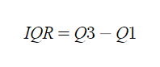


#### (예시)

* IQR을 구할 때 Q2를 사용하지 않지만 Q2는 중앙값과 일치한다. 분산은 평균에 대해서 정의되는 산포도의 지표인 반면, IQR은 중앙값에 대해서 정의되는 산포도의 지표라고 해석할 수 있다.

```python
scores_Q1 = np.percentile(scores, 25)
scores_Q3 = np.percentile(scores, 75)
scores_IQR = scores_Q3 - scores_Q1
scores_IQR
```

```
15.0
```


### 2.3 요약

```python
pd.Series(scores).describe()
```

```
count    10.000
mean     55.000
std       9.775
min      41.000
25%      48.250
50%      56.500
75%      63.250
max      69.000
dtype: float64
```


## 03. 정규화

* 시험 점수는 동일한 60점이리도, 평균 점수가 30점인 어려운 시험에서 얻은 60점과 평균점수가 90점인 쉬운 시험에서 얻은 60점은 상대적인 결과가 다르다. 점수라는 지표는 그 시험의 평균이나 분산에 따라 평가가 달라진다. 그러므로 평균이나 분산에 의존하지 않고 데이터의 상대적인 위치 관계를 알 수 있는 지표가 있다면 편리할 것이다.
* 이와 같은 대표적인 지표로 편찻값이 있다. 평균이나 분산이 어떻게 나오든, 편찻값이 50이면 평균적인 결과이고 편찻값이 60이면 상위 결과라는 통일된 평가를 할 수 있다. 이처럼 데이터를 통일된 지표로 변환하는 것을 정규화(normalization)라고 한다. 정규화를 통해 다양한 데이터를 동일한 기준으로 다룰 수 있기 때문에, 데이터를 분석할 때 정규화는 일반적으로 사용하는 수단이 된다.


### 3.1 표준화

* 데이터에서 평균을 빼고 표준편차로 나누는 작업을 표준화(standardization)라고 하며, 표준화된 데이터를 표준화 변량(standardized data)이나 Z점수(Z-score)라고 한다.

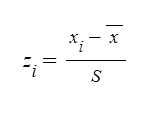


### (예시)

* 데이터와 동일한 단위를 쓰는 표준편차로 나눗셈을 하고 있기 때문에, 표준화된 데이터는 점수와 같은 단위를 쓰지 않는다는 사실에 주의하자.

```python
z = (scores - np.mean(scores)) / np.std(scores)
z
```

```
array([-1.402,  1.51 ,  0.108, -1.51 ,  0.216, -0.755,  1.078, -0.647, 1.078,  0.323])
```


* 표준화된 데이터는 평균이 0, 표준편차가 1이다.

```python
np.mean(z), np.std(z, ddof = 0)
```

```
(-1.6653345369377347e-17, 0.9999999999999999)
```


### 3.2 편찻값

* 편찻값은 평균이 50, 표준편차가 10이 되도록 정규화한 값을 말한다

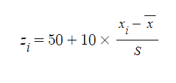


### (예시)

```python
z = 50 + 10 * (scores - np.mean(scores)) / np.std(scores)
z
```

```
array([35.982, 65.097, 51.078, 34.903, 52.157, 42.452, 60.783, 43.53 , 60.783, 53.235])
```


```python
scores_df['deviation value'] = z
scores_df
```

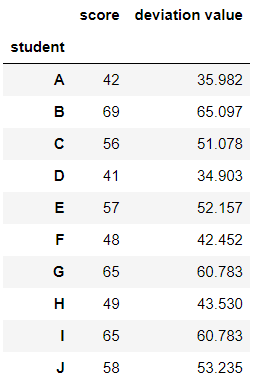


## 04. 1차원 데이터 시각화

```python
# 50명의 영어 점수 array
english_scores = np.array(df['english'])

# Series로 변환하여 describe를 표시
pd.Series(english_scores).describe()
```

```
count    50.00
mean     58.38
std       9.80
min      37.00
25%      54.00
50%      57.50
75%      65.00
max      79.00
dtype: float64
```


### 4.1 도수분포표

* describe 메서드로 출력된 평균이나 분산, 사분위수 등의 지표로 데이터의 중심이나 산포도 상태를 알 수 있지만, 데이터의 분포 상태를 세부적으로 알고 싶을 때가 있다. 그럴 때 데이터가 취하는 값을 몇개의 구간으로 나누고, 각 구간에 몇개의 데이터가 들어가는가를 세는 방법이 있다. 이처럼 분할된 구간과 데이터의 개수를 표로 정리한 것이 도수분포표(freqency distribution)이다.
* 시험 점수를 10점 간격으로 나눈 후, 각 구간의 점수를 얻은 학생이 몇 명인지 세어서 도수분포표를 작성할 수 있다. 이때 0~10점이라는 구간을 계급(class), 각 계급에 속한 학생 수를 도수(frequency)라고 한다. 또한 각 구간의 폭을 계급폭이라 하고, 계급의 수를 계급수라고 한다. 10점씩 나누고 있으므로 계급폭을 10점이고, 계급수는 10이 된다.


### (예시)

* bins로 계급수를, range로 최솟값과 최댓값을 지정할 수 있다.

```python
freq, _ = np.histogram(english_scores, bins = 10, range = (0, 100))
freq
```

```
array([ 0,  0,  0,  2,  8, 16, 18,  6,  0,  0], dtype=int64)
```


```python
# 0~10, 10~20, ... 이라는 문자열 리스트를 작성
freq_class = [f'{i}~{i+10}' for i in range(0, 100, 10)]

# freq_class를 인덱스로 DataFrame을 작성
freq_dist_df = pd.DataFrame({'frequency':freq},
                           index = pd.Index(freq_class, name = 'class'))
freq_dist_df
```

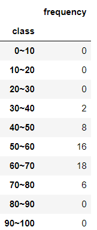


* 계급값은 각 계급을 대표하는 값으로, 계급의 중앙값이 이용된다. 60~70의 계급이면 계급값은 65점이된다.

```python
class_value = [(i+(i+10))//2 for i in range(0, 100, 10)]
class_value
```

```
[5, 15, 25, 35, 45, 55, 65, 75, 85, 95]
```


* 상대도수는 전체 데이터에 대해서 해당 계급의 데이터가 어느 정도의 비율을 차지하고 있는지를 나타낸다.

```python
rel_freq = freq / freq.sum()
rel_freq
```

```
array([0.  , 0.  , 0.  , 0.04, 0.16, 0.32, 0.36, 0.12, 0.  , 0.  ])
```


* 누적상대도수는 해당 계급까지의 상대도수의 합을 나타낸다. 

```python
cum_rel_freq = np.cumsum(rel_freq)
cum_rel_freq
```

```
array([0.  , 0.  , 0.  , 0.04, 0.2 , 0.52, 0.88, 1.  , 1.  , 1.  ])
```


```python
freq_dist_df['class value'] = class_value
freq_dist_df['relative frequency'] = rel_freq
freq_dist_df['cumulative relative frequency'] = cum_rel_freq
freq_dist_df = freq_dist_df[['class value', 'frequency', 'relative frequency', 'cumulative relative frequency']]
freq_dist_df
```

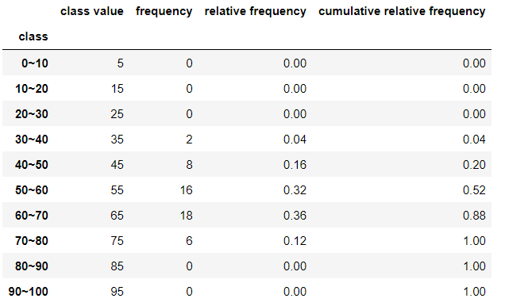


* 도수분포표로 양적 데이터에 대해서도 최빈값을 구할 수가 있다. 최대가 되는 계급의 계급값으로 최빈값을 정의한다. 60~70인 계급의 도수가 최대이므로, 이 데이터의 최빈값은 65점이다.

```python
freq_dist_df.loc[freq_dist_df['frequency'].idxmax(), 'class value']
```

```
65
```


### 4.2 히스토그램

* 히스토그램은 도수분포표를 막대그래프로 나타낸 것이다.


### (예시)

```python
import matplotlib.pyplot as plt

# 그래프가 주피터 노트북 위에 표시
%matplotlib inline
```

```python
# 캔버스를 생성
# figsize로 가로, 세로 크기를 지정
fig = plt.figure(figsize = (10, 6))
# 캔버스 위에 그래프를 그리기 위한 영역을 지정
# 인수는 영역을 1x1개 지정, 하나의 영역에 그린다는 것을 의미
ax = fig.add_subplot(111)

# 계급수를 10으로 하여 히스토그램을 그림
freq, _, _ = ax.hist(english_scores, bins = 10, range = (0, 100))
# X축에 레이블 부여
ax.set_xlabel('score')
# Y축에 레이블 부여
ax.set_ylabel('person number')
# X축을 0, 10, 20, ... , 100 눈금으로 구분
ax.set_xticks(np.linspace(0, 100, 10+1))
# Y축을 0, 1, 2, ...의 눈금으로 구분
ax.set_yticks(np.arange(0, freq.max()+1))
# 그래프 표시
plt.show()
```

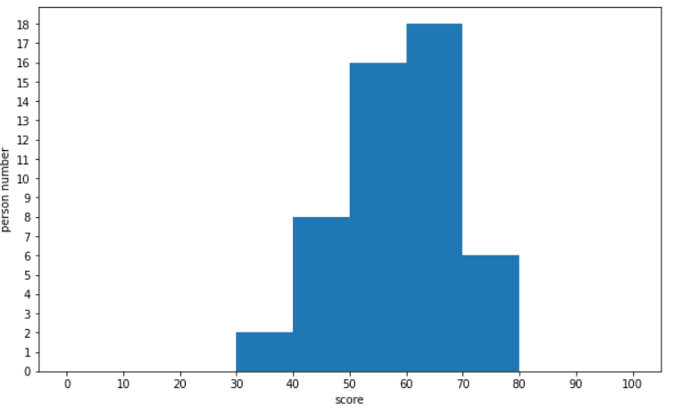


* 계급수를 늘려 더 세부적인 데이터 분포를 보자.

```python
fig = plt.figure(figsize=(10, 6))
ax = fig.add_subplot(111)

freq, _, _ = ax.hist(english_scores, bins = 25, range = (0, 100))
ax.set_xlabel('score')
ax.set_ylabel('person number')
ax.set_xticks(np.linspace(0, 100, 25+1))
ax.set_yticks(np.arange(0, freq.max()+1))
plt.show()
```

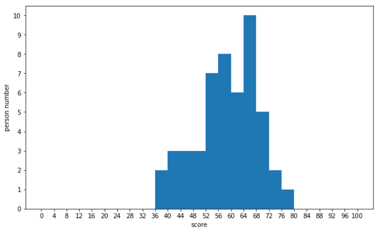


* 상대도수의 히스토그램을 누적상대도수의 꺾은선 그래프와 함께그려보자

```python
fig = plt.figure(figsize = (10, 6))
ax1 = fig.add_subplot(111)
# Y축의 스케일이 다른 그래프를 ax1과 동일한 영역에 생성
ax2 = ax1.twinx()

# 상대도수의 히스토그램으로 하기 위해서는, 도수를 데이터의 수로 나눌 필요가 있음
# 이것은 hist의 인수 weight를 지정하면 실현 가능
weights = np.ones_like(english_scores) / len(english_scores)
rel_freq, _, _ = ax1.hist(english_scores, bins = 25, range = (0, 100), weights = weights)

cum_rel_freq = np.cumsum(rel_freq)
class_value = [(i+(i+4))//2 for i in range(0, 100, 4)]
# 꺽은선 그래프를 그림
# 인수 ls를 '--'로 하면 점선이 그려짐
# 인수 marker를 'o'로 하면 데이터 점을 그림
# 인수 color를 'gray'로 하면 회색으로 지정
ax2.plot(class_value, cum_rel_freq, ls = '--', marker = 'o', color = 'gray')
# 꺽은선 그래프의 눈금선을 제거
ax2.grid(visible = False)

ax1.set_xlabel('score')
ax1.set_ylabel('relative frequency')
ax2.set_ylabel('cumulative relative frequency')
ax1.set_xticks(np.linspace(0, 100, 25+1))

plt.show()
```

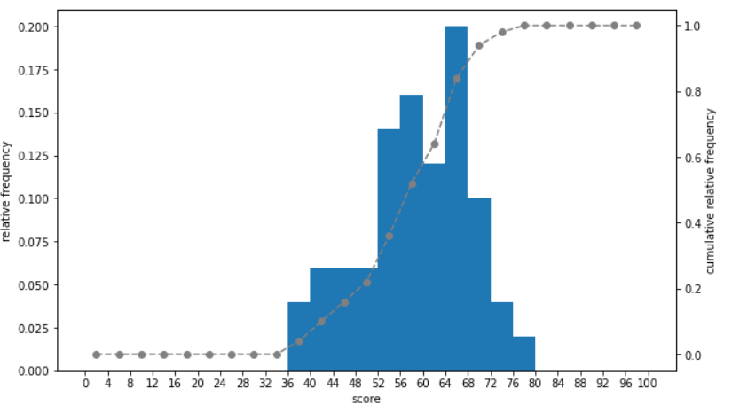


### 4.3 상자그림

* 상자그림(box plot)은 데이터의 산포도를 표현하는 그림이다. 상자그림을 그리면 데이터 분포와 이상값을 시각적으로 파악할 수 있다.
* 상자그림에서는 분위수 범위의 Q1, Q2, Q3, IQR을 사용한다. 상자는 Q1부터 Q3을 나타내고, 수염은 Q1-1.5IQR부터 Q3+1.5IQR을 나타낸다. 여기 들어가지 않은 데이터는 이상값이 된다.

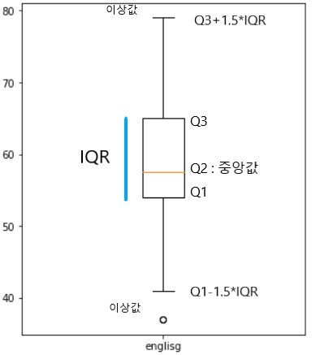


### (예시)

```python
fig = plt.figure(figsize = (5, 6))
ax = fig.add_subplot(111)
ax.boxplot(english_scores, labels = ['englisg'])

plt.show
```

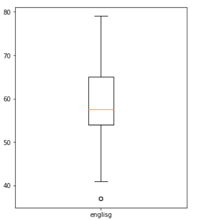