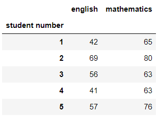

# Chapter 03. 2차원 데이터 정리

```python
import numpy as np
import pandas as pd

%precision 3
pd.set_option('precision', 3)
np.set_printoptions(precision=3)
```


## 데이터셋

* 영어와 수학 점수(df)

```python
df = pd.read_csv('ch2_scores_em.csv', index_col = 'student number')
df.head()
```




```python
en_scores = np.array(df['english'])[:10]
ma_scores = np.array(df['mathematics'])[:10]

scores_df = pd.DataFrame({'english':en_scores, 'mathematics':ma_scores},
                        index = pd.Index(['A', 'B', 'C', 'D', 'E', "F", 'G', 'H', 'I', 'J'], name = 'student'))
scores_df
```


## 01. 두 데이터 사이의 관계를 나타내는 지표

* 상관관계
  * 양의 상관관계 : 영어 점수가 높은 학생일 수록 수학 점수도 높은 경향이 있다.
  * 음의 상관관계 : 영어 점수가 높은 학생일 수록 수학 점수가 낮은 경향이 있다.
  * 무상관 :  영어 점수와 수학 점수는 서로 영향을 미치지 않는다.


### 1.1 공분산


### (예시1)

* 산점도(scatter plot)

```python
fig = plt.figure(figsize = (8, 8))
ax = fig.add_subplot(111)
# 산점도
ax.scatter(en_scores, ma_scores, alpha = 0.0)
ax.axhline(ma_scores.mean(), 0, 1, color='gray')
ax.axvline(en_scores.mean(), 0, 1, color='gray')
ax.set_xlabel('english')
ax.set_ylabel('mathematics')

names = ['A', 'B', 'C', 'D', 'E',
             'F', 'G', 'H', 'I', 'J']
for score,score2, name in zip(en_scores, ma_scores, names):
    ax.text(score,score2, name, size= 10)

plt.show()
```


### (예시2)

* 산점도를 그리고 데이터들 간에 관계성을 어떻게 수치화하면 좋을까? 여기서 공분산(covariance)라는 지표를 사용한다. 공분산은 분산에 가까운 지표이다.

* 공분산을 쉽게 이해하려면 분산의 경우와 마찬가지로 면적을 생각하면 된다.
* 다음은 A, B, C, D 학생에 대해서 각 점수에 대해서 직사각형을 그린 것이다. 여기서 직사각형의 가로 길이는 영어 점수의 편차, 세로 길이는수학 점수의 편차이다
* 공분산이 분산과 다른 점은, 가로축과 세로축의 데이터가 다르기 때문에 편차들로 만든 도형이 직사각형이 될 뿐만 아니라 음의 면적도 얻을 수 있다는 점이다. 분산은 가령 편차가 음의 값이 되어도 면적은 제곱값이므로 항상 양의 값이 된다. 그러나 공분산에서는 가로와 세로의 데이터가 다르므로 한쪽은 편차가 양의 값이고 다른 한쪽은 편차가 음의 값인 경우에 면적이 음의 값이 되어버린다.
* 이처럼 부호를 붙인 면적이라는 관점에서 밑에 그림을 살펴보면, 면적이 양의 값이 되는 것은 영어 점수와 수학 점수가 모두 평균 점수보다 높거나 모두 평균 점수보다 낮은 경우이기 때문에, 점수의 상관관계를 잘 나타낸다고 볼 수 있다. 따라서 부호를 붙인 면적의 평균은 상관의 지표가 된다. 이것이 공분산이다
* 공분산이 양의 값이면 면적이 양의 값이 되는 데이터가 많다는 뜻이므로 양의 상관관계에 있고, 반대로 공분산이 음의 값이면 면적이 음의 값이 되는 데이터가 많다는 뜻이므로 음의 상관관계에 있다고 할 수 있다. 


```python
summary_df = scores_df.copy()
summary_df['english_deviation'] = \
    summary_df['english'] - summary_df['english'].mean()
summary_df['mathematics_deviation'] = \
    summary_df['mathematics'] - summary_df['mathematics'].mean()
summary_df['product of deviations'] = \
    summary_df['english_deviation'] * summary_df['mathematics_deviation']
summary_df
```


* 영어 점수와 수학 점수는 양의 상관고나계에 있다고 할 수 있다

```python
summary_df['product of deviations'].mean()
```

```
62.800
```


* 수식으로 나타내면 다음과 같다


* 넘파이
* 넘파이는 cov 함수로 공분산을 구할 수 있다. 다만 반환값은 공분산값이 아닌 공분산 행렬(covariance matrix) 또는 분산공분산 행렬(variance-covariance matrix)이라고 부르는 행렬입니다.
* 첫번째 행과 첫번째과 첫번째 열이 첫번째 인수인 영어, 두번째 행과 두번째 열이 두번째 인수인 수학에 각각 대응하고, [0, 1] 성분과 [1, 0] 성분이 공분산이 된다.

```python
cov_mat = np.cov(en_scores, ma_scores, ddof = 0)
cov_mat
```

```python
array([[86.  , 62.8 ],
       [62.8 , 68.44]])
```


```python
cov_mat[0, 1], cov_mat[1, 0]
```

```python
(62.800, 62.800)
```


* 결국, [0, 0] 성분은 영어의 분산, [1, 1] 성분은 수학의 분산이 된다.

```python
np.var(en_scores, ddof = 0), np.var(ma_scores, ddof = 0)
```

```
(86.0, 68.440)
```


* 데이터 프레임에도 cov 메서드가 있지만 var 메서드와 달리 ddof 인수를 취하지 않고 불편분산만 계산할 수 있으므로 여기선 실행하지 않는다.


### 1.2 상관계수

* 앞에서 공분산을 계산하여 데이터의 상관관계를 표현했습니다. 이번과 같은 시험 점수들 간에 공분산은 (점수x점수)라는 단위를 사용합니다. 학생의 키와 시험 점수의 상관관계를 살펴본다면, 공분산은  (cm x 점수)라는 단위가 됩니다. 분산의 경우와 마찬가지로 이런 단위는 직감적으로 이해하기 어렵습니다.
* 따라서 단위에 의존하지 않는 상관을 나타내는 지표가 필요합니다. 공분산은 각 데이터의 단위를 곱한것이므로, 공분산을 각 데이터의 표준편차로 나누어 단위에 의존하지 않는 지표를 정의할 수 있다.


* 이와 같이 정의된 지표 r~xy~ 를 상관계수(correlation coefficient)라고 합니다. 상관계수는 반드시 -1과 1사이의 값을 취하고, 데이터가 양의 상관관계에 놓여 있을수록 1에 가까워지고, 음의 상관관계에 놓여 있을수록 -1에 가깝워집니다. 무상고나이면 0이 됩니다. 또한 상관계수가 -1일 때와 1일 때에는 데이터가 완전히 직선상에 놓입니다.


### (예시)

* 영어 점수와 수학 점수의 상관계수를 구해보자

```python
np.cov(en_scores, ma_scores, ddof = 0)[0, 1]/(np.std(en_scores) * np.std(ma_scores))
```

```
0.819
```


* 넘파이
* 넘파이의 경우 반환값은 공분산의 경우와 마찬가지로 상관행렬(correlation matrix)이라고 부르는 행렬이다.
* 상관행렬의 [0, 1] 성분과 [1, 0] 성분이 영어와 수학의 상관계수에 대응하고 있습니다. 나머지 [0, 0] 성분은 영어와 영어의 상관계수, [1, 1] 성분은 수학과 수학의 상관계수에 대응하므로 1이다.

```python
np.corrcoef(en_scores, ma_scores)
```

```
array([[1.   , 0.819],
       [0.819, 1.   ]])
```


* 판다스

```python
scores_df.corr()
```


## 02. 2차원 데이터의 시각화

```python
import matplotlib.pyplot as plt

%matplotlib inline
```


### 2.1 산점도

* scatter 메서드를 사용하여 산점도를  그릴 수 있습니다. scatter의 첫번째 인수가 x축의 데이터, 두번째 인수가 y축의 데이터입니다.


###  (예시)

```python
english_scores = np.array(df['english'])
math_scores = np.array(df['mathematics'])

fig = plt.figure(figsize = (8, 8))
ax = fig.add_subplot(111)
# 산점도
ax.scatter(english_scores, math_scores)
ax.set_xlabel('english')
ax.set_ylabel('mathematics')

plt.show()
```


### 2.2 회귀직선

* 회귀직선(regression line)은 두 데이터 사이의 관계를 더욱 잘 나타내는 직선입니다. 간단히 설명하면, np.polyfit 함수와 np.poly1d 함수를 사용하여 영어 점수를 x, 수학 점수를 y로 했을 때 회귀직선 y = β~0~ + β~1~x 를 구할 수 있습니다.


### (예시)

* 회귀직선과 산점도를 함께 그려보자

```python
# 계수 β_0과 β_1을 구한다
poly_fit = np.polyfit(english_scores, math_scores, 1)
# β_0+β_1 x를 반환하는 함수를 작성
poly_1d = np.poly1d(poly_fit)
# 직선을 그리기 위해 x좌표를 생성
xs = np.linspace(english_scores.min(), english_scores.max())
# xs에 대응하는 y좌표를 구한다
ys = poly_1d(xs)

fig = plt.figure(figsize = (8, 8))
ax = fig.add_subplot(111)
ax.scatter(english_scores, math_scores, label = 'score')
ax.plot(xs, ys, color = 'gray', label = f'{poly_fit[1]:.2f}+{poly_fit[0]:.2f}x')
ax.set_xlabel('english')
ax.set_ylabel('mathmatics')
# 범례 표시
ax.legend(loc = 'upper left')

plt.show()
```


### 2.3 히트맵

* 히트맵(heap map)은 히스토그래므이 2차원 버전으로 색을 이용해 표현할 수 있는 그래프입니다. hist2d 메서드로 작성할 수 있습니다. 인수도 hist  메서드와 거의 동일합니다.


### (예시)

```python
fig = plt.figure(figsize = (10, 8))
ax = fig.add_subplot(111)

c = ax.hist2d(english_scores, math_scores, bins = [9, 8], range = [(35, 80), (55, 95)])
ax.set_xlabel('english')
ax.set_ylabel('mathmatics')
ax.set_xticks(c[1])
ax.set_yticks(c[2])
# 컬러 바 표시
fig.colorbar(c[3], ax = ax)
plt.show()
```


## 03. 앤스컴의 예

* 앤스컴의 예는 평균, 표본 분산, 상관, 선형회귀선, 결정계수 등의 기술 통계량은 동일하지만 분포나 그래프를 이용하여 시각화하면 전혀 다른 4개의 데이터셋을 의미한다. 앤스컴의 예로 데이터 분석 전 시각화의 중요성을 보여주기 위해 만들어졌다고 한다.


### (예시)

```python
# npy 형식으로 저장된 NumPy array를 읽어 들인다
anscombe_data = np.load('ch3_anscombe.npy')
print(anscombe_data.shape)
anscombe_data[0]
```

```
(4, 11, 2)
array([[10.  ,  8.04],
       [ 8.  ,  6.95],
       [13.  ,  7.58],
       [ 9.  ,  8.81],
       [11.  ,  8.33],
       [14.  ,  9.96],
       [ 6.  ,  7.24],
       [ 4.  ,  4.26],
       [12.  , 10.84],
       [ 7.  ,  4.82],
       [ 5.  ,  5.68]])
```


* 모든 데이터가 평균부터 회귀직선 식까지 전부 일치한다.

```python
stats_df = pd.DataFrame(index = ['X_mean', 'X_variance', 'Y_mean', 'Y_variance', 'X&Y_correlation', 'X&Y_regression line'])

for i, data in enumerate(anscombe_data):
    dataX = data[:, 0]
    dataY = data[:, 1]
    poly_fit = np.polyfit(dataX, dataY, 1)
    stats_df[f'data{i+1}'] = \
        [f'{np.mean(dataX):.2f}',
         f'{np.var(dataX):.2f}',
         f'{np.mean(dataY):.2f}',
         f'{np.var(dataY):.2f}',
         f'{np.corrcoef(dataX, dataY)[0, 1]:.2f}',
         f'{poly_fit[1]:.2f}+{poly_fit[0]:.2f}x']
stats_df
```


* 산점도를 그려보자

```python
# 그래프를 그리기 위한 영역을 2x2개 생성
fig, axes = plt.subplots(nrows = 2, ncols=2, figsize = (10, 10), sharex = True, sharey = True)

xs = np.linspace(0, 30, 100)
for i, data in enumerate(anscombe_data):
    poly_fit = np.polyfit(data[:, 0], data[:, 1], 1)
    poly_1d = np.poly1d(poly_fit)
    ys = poly_1d(xs)
    # 그리는 영역을 선택
    ax = axes[i//2, i%2]
    ax.set_xlim([4, 20])
    ax.set_ylim([3, 13])
    # 타이틀 부여
    ax.set_title(f'data{i+1}')
    ax.scatter(data[:, 0], data[:, 1])
    ax.plot(xs, ys, color = 'gray')
    
# 그래프 사이의 간격을 좁힌다
plt.tight_layout()
plt.show()
```


