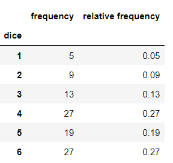
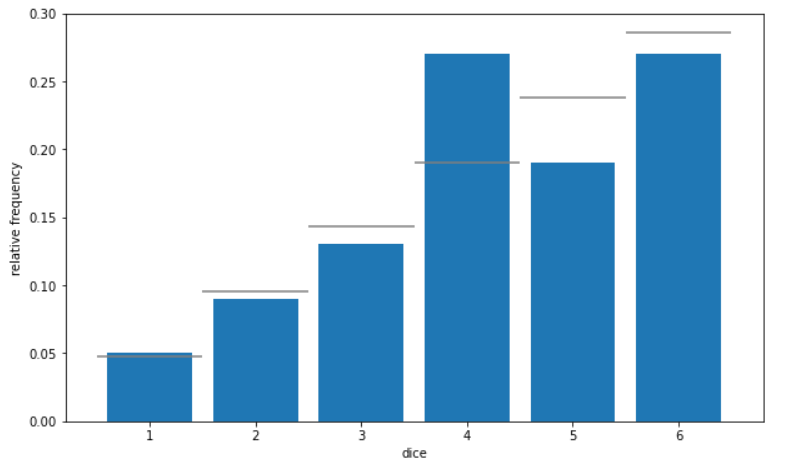
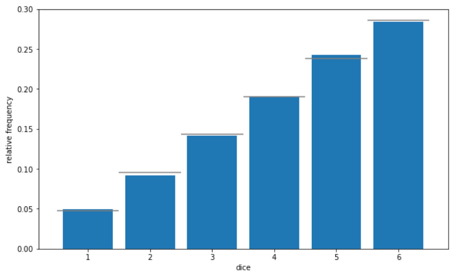

# Chapter 04. 추측통계의 기본

- 전교생이 400명이 수학 시험을 치렀다. A 학생은 이 시험에서 80점을 받았고 평균점수가 궁금하다. A학생은 우연히 만난 20명에 시험 점수를 물어보고, 그 결과로부터 전교생의 평균 점수를 추측하기로 했다.
- 일부 데이터로부터 전체의 통계적 성질을 추측하는 방식이 추측통계이다. 추측통계와 비교하여 2장 3장에서 다룬 통계를 기술통계라고 한다.


## 데이터셋

```python
import numpy as np
import pandas as pd
import matplotlib.pyplot as plt

%precision 3
%matplotlib inline
```

```python
df = pd.read_csv('ch4_scores400.csv')
scores = np.array(df['score'])
scores[:10]
```

```
array([76, 55, 80, 80, 74, 61, 81, 76, 23, 80], dtype=int64)
```


## 01. 모집단과 표본


- 추측통계에서는 관측 대상의 전체의 통계적 성질을 그 관측 대상의 일부분만 사용하여 추측한다.  이때, 추측하고 싶은 관측 대상 전체를 모집단(population)이라 하고, 추측에 사용하는 관측 대상의 일부분을 표본(sample)이라 한다. 또 모집단에서 표본을 골라내는 일을 표본추출(sampling)이라 하고, 골라낸 표본의 수를 표본 크기 또는 샘플 사이즈라고 한다. 그러나 표본을 바탕으로 계산한 평균이나 분산, 상관계수 등을 표본 통계량이라 하고, 모집단의 평균이나 분산, 상관계수 등을 모수라고 한다. 표본의 평균을 표본평균, 모집단의 평균을 모평균 등으로 부르는 경우도 있다.
- 표본평균으로 모평균을 추측할 때, 표본평균은 모평균의 추정량(estimator)이라고 한다. 그리고 실제로 표본의 데이터를 이용하여 계산한 결과를 추정값(estimate)이라고 한다. A학생은 모평균의 추정량으로 표본평균을 선택하여, 추정값을 70.4점으로 한 것이다.


### 1.1 표본추출 방법

- 임의의 표본을 추출하는 방법을 무작위 추출(random sampling) 이라 한다.
- 여러 차례 동일한 표본을 선택하는 추출 방법을 복원추출(sampling with replacement)이라 하고, 동일한 표본은 한 번만 선택하는 방법을 비복원추출(sampling without replacement)이라 한다.


### (예시1)

- 복원추출

```python
np.random.choice([1, 2, 3], 3)
```

```
array([1, 1, 2])
```


- 비복원추출

```python
np.random.choice([1, 2, 3], 3, replace = False)
```

```
array([1, 2, 3])
```


### (예시2)

- 무작위추출을 하는 방법은 알겠지만 실습에서는 같은 결과값을 공유하는 것이 좋다. 이 문제를 해결하기 위해 난수 시드를 도입한다. 난수 시드는 이제부터 발생하는 난수의 근원이 되는 숫자로, 이것을 정해두면 매번 동일한 난수를 얻을 수 있다.

```python
np.random.seed(0)
np.random.choice([1, 2, 3], 3)
```

```
array([1, 2, 1])
```


- 복원추출하여 표본평균 계산

```python
np.random.seed(0)
sample = np.random.choice(scores, 20)
sample.mean()
```

```
70.4
```


- 모평균

```python
scores.mean()
```

```
69.53
```


- 무작위추출은 실행할때 마다 결과가 달라진다.

```python
for i in range(5):
    sample = np.random.choice(scores, 20)
    print(f'{i+1}번째 무작위 추출로 얻은 표본평균', sample.mean())
```

```
1번째 무작위 추출로 얻은 표본평균 72.45
2번째 무작위 추출로 얻은 표본평균 63.7
3번째 무작위 추출로 얻은 표본평균 66.05
4번째 무작위 추출로 얻은 표본평균 71.7
5번째 무작위 추출로 얻은 표본평균 74.15
```


## 02. 확률 모형

- 불확정성을 수반한 현상을 해석하기 위해 확률(probability)을 사용한다. 확률을 사용한 무작위 추출 혹은 주사위를 모델링한 것을 확률 모형(probability model)이라고 합니다.


### 2.1 확률의 기본

- 주사위를 굴릴 때 어떤 숫자가 나올지 알아맞힐 수 없다. 그러나 주사위 눈이 숫자 1부터 6까지임을 알고 있으며, 각각은 동일한 비율로 나온다는 것도 경험적으로 알고 있다. 이와 같이 결과를 알아맞힐 수 는 없지만, 취하는 값과 그 값이 나올 확률이 결정되어 있는 것을 확률변수(random variable)라고 한다.
- 주사위를 굴릴 때까지 어떤 눈이 나올 지 알 수 없지만, 주사위를 굴리면 눈은 하나씩 확정된다. 이와 같이 확률변수의 결과를 관측하는 것을 시행(trial)이라 하고, 시행에 의해 관측되는 값을 실현값(realization)이라고 합니다. 또한 '눈이 1'이나 '눈이 홀수'처럼 시행결과로 나타날 수 있는 일을 사건(event)이라고 한다. 확률을 사건에 대해서 정의되는데. '눈이1'이라는 사건에 대한 확률을 1/6, '눈이 홀수'라는 사건에 대한 확률은 1/2이라는 식으로 대응된다.

- 다음으로 확률을 수식으로 표현하자. 주사위의 눈을 확률변수 X라고 한다.


- '눈이 홀수'라는 사건의 확률


- 사건이 서로 배반이라면, 그중에 적어도 하나 일어나는 사건은 각 사건의 확률의 합과 같다
- 사건이 상호배반(mutually exclusive)이라는 것은 각 사건이 동시에는 일어날 수 없다는 말이다. 예를 들어, '눈이 1또는 2또는 3'이라는 사건과 '눈이 6'이라는 사건은 동시에 일어 날 수 없기 때문에 상호배반이다. 
- '눈이 홀수'라는 사건의 확률이 1/2이 되는 이유는, '눈이 1'과 '눈이 3'과 '눈이 5'는 상호배반이므로 각각의 확률을 더하여 구할 수 있기 때문이다.


### 2.2 확률분포

- 확률분포(probability distribution)란 확률변수가 어떻게 움직이는지를 나타낸 것이다. 전체 확률이 1인 확률변수가 취할 수 있는 값이 어떻게 분포하고 있는지 나타낸다고 할 수 있다. 주사위의 눈이라면 다음과 같은 확률분포가 된다. 이때 주사위의 눈을 확률 변수 X, 다음 확률분포를 A라 하면 '확률변수 X는 확률분포 A를 따른다.' 수식으로 X~A로 나타낼 수 있다.

|  눈  |  1   |  2   |  3   |  4   |  5   |  6   |
| :--: | :--: | :--: | :--: | :--: | :--: | :--: |
| 확률 | 1/6  | 1/6  | 1/6  | 1/6  | 1/6  | 1/6  |


### (예시)

- 불공정한 주사위가 있다고 가정해보자. 불공정한 주사위는 다음과 같은 확률분포를 따른다.

|  눈  |  1   |  2   |  3   |  4   |  5   |  6   |
| :--: | :--: | :--: | :--: | :--: | :--: | :--: |
| 확률 | 1/21 | 2/21 | 3/21 | 4/21 | 5/21 | 6/21 |


```python
dice = [1, 2, 3, 4, 5, 6]
prob = [1/21, 2/21, 3/21, 4/21, 5/21, 6/21]
```

```python
np.random.choice(dice, p = prob)
```


```python
num_trial = 100
sample = np.random.choice(dice, num_trial, p = prob)
sample
```

```
array([4, 6, 4, 5, 5, 6, 6, 3, 5, 6, 5, 6, 6, 2, 3, 1, 6, 5, 6, 3, 4, 5, 3, 4, 3, 5, 5, 4, 4, 6, 4, 6, 5, 6, 5, 4, 6, 2, 6, 4, 5, 3, 4, 6, 5, 5, 5, 3, 4, 5, 4, 4, 6, 4, 4, 6, 6, 2, 2, 4, 5, 1, 6, 4, 3, 2, 2, 6, 3, 5, 4, 2, 4, 4, 6, 6, 1, 5, 3, 6, 6, 4, 2, 1, 6, 4, 4, 2,
4, 1, 3, 6, 6, 6, 4, 5, 4, 3, 3, 4])
```


- 도수분포표

```python
freq, _ = np.histogram(sample, bins = 6, range = (1, 7))
pd.DataFrame({'frequency': freq,
              'relative frequency': freq / num_trial},
            index = pd.Index(np.arange(1,7), name = 'dice'))
```




- 히스토그램

```python
fig = plt.figure(figsize = (10, 6))
ax = fig.add_subplot(111)
ax.hist(sample, bins = 6, range = (1, 7), density = True, rwidth = 0.8)
# 실제의 확률분포를 가로선으로 표시
ax.hlines(prob, np.arange(1, 7), np.arange(2,8), colors = 'gray')
# 막대그래프의 [1.5, 2.5, ..., 6.5]에 눈금을 표시
ax.set_xticks(np.linspace(1.5, 6.5, 6))
# 주사위 눈의 값은 [1, 2, 3, 4, 5, 6]
ax.set_xticklabels(np.arange(1, 7))
ax.set_xlabel('dice')
ax.set_ylabel('relative frequency')
plt.show()
```




- 시행 횟수 10000번

```python
num_trial = 10000
sample = np.random.choice(dice, size = num_trial, p = prob)

fig = plt.figure(figsize = (10, 6))
ax = fig.add_subplot(111)
ax.hist(sample, bins = 6, range = (1, 7), density = True, rwidth = 0.8)
# 실제의 확률분포를 가로선으로 표시
ax.hlines(prob, np.arange(1, 7), np.arange(2,8), colors = 'gray')
# 막대그래프의 [1.5, 2.5, ..., 6.5]에 눈금을 표시
ax.set_xticks(np.linspace(1.5, 6.5, 6))
# 주사위 눈의 값은 [1, 2, 3, 4, 5, 6]
ax.set_xticklabels(np.arange(1, 7))
ax.set_xlabel('dice')
ax.set_ylabel('relative frequency')
plt.show()
```




## 03. 추측통계의 확률

- 앞 절에서는 주사위를 사용하여 확률 모형에 관해 설명했다. 추측통계에서도 마찬가지로 무작위추출을 확률 모형으로 기술할 수 있고, 무작위추출로 얻은 표본은 모집단의 확률분포를 따르는 확률변수로 간주할 수 있다. 따라서 추측통계에서 다루는 데이터는 그와 같은 확률변수의 실현값이라고 생각할 수 있다.


### (예시)

- 전교생 시험 점수를 히스토그램으로 그려보자

```python
fig = plt.figure(figsize = (10, 6))
ax = fig.add_subplot(111)
ax.hist(scores, bins = 100, range = (0, 100), density = True)
ax.set_xlim(20, 100)
ax.set_ylim(0, 0.042)
ax.set_xlabel('score')
ax.set_ylabel('relative frequency')
plt.show()
```


- 69점을 얻은 학생은 전교생의 0.04를 차지하고 있다. 따라서 무작위 추출을 수행하면 4%의 확률로 69점이라는 표본 데이터를 얻게 된다. 이런 결과를 다른 점수에 관해서도 마찬가지로, 상대도수는 해당점수를 얻는 확률에 대응한다. 결국 이 히스토그램을 모집단의 확률분포로 간주 할 수 있다.


- 무작위추출은 이와 같이 확률분포를 따르는 확률변수의 시행이다.
- 주사위의 상대도수가 시행 횟수를 늘리면 실제의 확률분포에 가까워진 것처럼, 무작위추출에서도 표본의 크기가 커지면, 표본 데이터의 상대도수는 실제의 확률분포에 가까워집니다.

```python
np.random.choice(scores)
```

```
89
```

```python
sample = np.random.choice(scores, 10000)

fig = plt.figure(figsize = (10, 6))
ax = fig.add_subplot(111)
ax.hist(sample, bins = 100, range = (0, 100), density = True)
ax.set_xlim(20, 100)
ax.set_ylim(0, 0.042)
ax.set_xlabel('score')
ax.set_ylabel('relative frequency')
plt.show()
```


- 마지막으로 표본평균에 관해서 생각해보겠습니다. 표본 하나하나가 확률변수이므로, 표본들의 평균으로 계산되는 표본평균도 역시 확률변수이다. 여기서는 무작위 추출로 표본 크기가 20인 표본을 추출하여 표본평균을 계산하는 작업을 10000번 수행해서, 그 결과를 히스토그램으로 그려 표본평균이 어떻게 되는지 보자

```python
sample_means = [np.random.choice(scores, 20).mean() for _ in range(10000)]

fig = plt.figure(figsize = (10, 6))
ax = fig.add_subplot(111)
ax.hist(sample_means, bins = 100, range = (0, 100), density = True)
# 모평균을 세로선으로 표시
ax.vlines(np.mean(scores), 0, 1, 'gray')
ax.set_xlim(50, 90)
ax.set_ylim(0, 0.13)
ax.set_xlabel('score')
ax.set_ylabel('relative frequency')
plt.show()
```


## 04. 앞으로 배울 내용

- 5장부터는 확률과 추측통계에 관해 더욱 상세히 설명한다

- 5~9장에서는 확률변수의 정의와 대표적인 확률분포에 대해서 다룬다.
- 본격적인 추측통계는 10~12장에서 다룬다. 추측통계는 크게 추정과 검정으로 나눌 수 있고, 이는 각각 10장과 11장에서 다룬다.
- 추정(estimation)이란 모수를 추측하는 것 이다. 하나의 값으로 추정하는 것을 점추정, 구간으로 추정하는 것을 구간추정이라고 부른다. 예를 들어 모평균을 70.4점으로 추정하는 것을 점추정, 68~72점 사이라고 하는 것을 구간추정이라고 한다.
- 검정(test)은 모집단의 통계적 성질에 대해 가설을 세우고, 그 가성이 옳은지 여부를 판단하는 기법이다. 예를 들어, 어떤 주사위를 100번 굴린 결과가 어떤 도수분포표와 같이 되었다고 하자. 이 주사위가 각 눈의 확률이 일반적인 주사위인지 여부를 확인하고 싶을 때 검정을 사용한다. 이러한 경우, 주사위가 일반적인 주사위라는 가설을 세우고, 그 가설이 옳은지 여부를 통계학적으로 판정한다.

