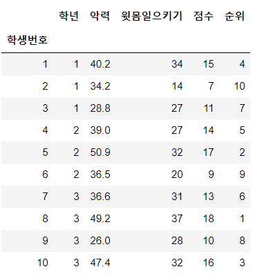

# Chapter 01. 데이터

통계분석은 데이터를 다루는 것이므로 데이터에서 본질적인 의미를 찾습니다. '데이터'로 통칭하기는 해도 데이터에는 여러 종류가 있습니다. 예를 들어, 키가 170.2cm라는 수치와 설문조사에서 '매우 만족'이라는 카테고리는 서로 다른 종류의 데이터입니다. 직감적으로 파악할 수 있듯이, 이러한 수치 데이터와 카테고리 데이터 등을 동일한 기법으로 분석하기는 어렵습니다. 따라서 본격적으로 데이터 분석 방법을 배우기 전에, 이 장에서는 데이터의 개념과 통계분석에서 사용하는 기본적인 용어 및 데이터 분류에 대해 살펴보겠습니다.

이 장에서는 csv 파일에 저장된 ch1_sport_test.csv라는 체력 테스트 결과를 예로 들어 설명합니다. 이 테스트 결과를 해석하려면 우선 csv 파일을 파이썬에서 다룰 수 있어야 합니다. 이때 사용하는 라이브러리는 Pandas입니다. Pandas는 통계분석에서 표 데이터를 처리하는데 특화된, 중요한 라이브러리 중 하나입니다.(라이브러리는 파이썬의 추가 기능입니다. Anaconda를 설치하면 Pandas, NumPy, matplotlib, SciPy, statsmodels 등 다양한 라이브러리를 사용할 수 있습니다.)

```python
# Pandas를 pd라는 이름으로 임포트한다
import pandas as pd
```


Pandas의 read_csv 함수를 사용하여 csv 파일을 읽어 들일 수 있습니다. 이 함수는 읽어 들인 데이터를 Pandas의 DataFrame이라는 데이터 구조로 반환합니다.

```python
# 학생번호를 인덱스로 csv 파일을 읽어들여, 변수 df에 저장
df = pd.read_csv('../data/ch1_sport_test.csv',
                 index_col='학생번호')
# 변수 df를 표시
df
```




체력 테스트 결과를 DataFrame으로 읽어 들입니다. 이 체력 테스트 결과를 보면 학생번호, 학년, 악력, 윗몸일으키기, 점수, 순위라는 항목이 있고, 10명의 데이터임을 알 수 있습니다.

이번에는 DataFrame에서 악력에 대한 열을 추출해봅시다.

```python
df['악력']
```

```python
학생번호
1     40.2
2     34.2
3     28.8
4     39.0
5     50.9
6     36.5
7     36.6
8     49.2
9     26.0
10    47.4
Name: 악력, dtype: float64
```


이처럼 이름을 지정하여 간단하게 특정 열을 추출할 수 있습니다. 다만, 이 경우에 반환되는 것은 DataFrame이 아닌 Series라는 데이터 구조입니다. DataFrame은 2차원의 표 데이터 구조인 반면, Series는 1차원 데이터 구조로 되어 있습니다.


## 01. 데이터의 크기

데이터가 주어지면 제일 먼저 확인하는 것이 데이터의 크기입니다. DataFrame의 크기는 shape라는 인스턴스 변수를 참조하면 알 수 있습니다.

```python
df.shape
```

```python
(10, 5)
```


일반적으로 shape를 참조하면 2개의 수가 출력됩니다. 첫 번째가 데이터에 대한 수이고 두 번째가 변수에 대한 수입니다. 데이터베이스라면 각각 레코드 수 , 칼럼 수가 됩니다. 여기서는 데이터의 수가 10, 변수의 수가 5임을 알 수 있습니다.

여기서 변수는 학년이나 악력같은 측정 대상을 가리킵니다. 이 데이터에는 변수가 5개 있으므로 5변수 또는 5차원이라고 합니다. 학생번호의 경우 여기서는 인덱스로 이용되고 있으므로 변수 개수에 포함되지 않았지만 원래 변수 중 하나입니다.

통계분석에서는 먼저 1변수씩 어떤 특징이 있는지 살펴보고, 그 다음으로 변수 사이의 관계성을 살펴봅니다. 이에 관한 구체적인 방법은 2장과 3장에서 설명하겠습니다.


## 02. 변수의 종류

변수는 그 성질에 따라 다양하게 분류할 수 있습니다.


### 2.1 질적 변수와 양적 변수

변수는 크게 질적 변수와 양적 변수 두 가지로 분류할 수 있습니다. **질적 변수**는 설문조사에서 만족도 등을 묻는 질문에 대해 

```
1.매우 좋음 2.좋음 3.보통 4.나쁨 5.매우 나쁨
```

과 같이 선택이 필요한 변수나 혈액형을 조사할 때

```
A형 B형 O형 AB형
```

같이 종류는 구별하기 위한 변수를 말합니다. 질적 변수 중에서도 남성과 여성, 흡연 여부 등 값이 2개뿐인 질적 변수를 2진 변수라 부르기도 합니다.

한편, 시험 점수나 신장과 같이 양을 표현하는 변수를 **양적 변수**라고 합니다.

여기서 주의해야 할 점이 있습니다. 남성이나 여성은 질적 변수이지만 데이터상에서 쉽게 처리하기 위해 남성은 0, 여성은 1과 같이 숫자 데이터로 표시하는 경우가 있다는 점입니다. 즉, 수치 변수라 해서 전부 양적 변수인 것은 아닙니다.


### 2.2 척도 수준

질적 변수는 **명의 척도**와 **순서척도**, 양적 변수는 **간격 척도**와 **비례 척도**로 더 세분화됩니다. 명의 척도, 순서 척도, 간격 척도, 비례척도 이 네 가지를 **척도 수준**이라고 합니다.


#### 명의 척도

명의 척도는 단순히 분류하기 위한 변수로, 학생 번호나, 성별 등이 있습니다. 명의 척도의 목적은 구별하는 것이므로, 변수의 동일성 여부에만 의미를 둡니다. 예를 들면 학생번호 4와 학생번호 8의 대소 관계는 의미가 없고, 합과 차를 계산하더라도 의미 있는 결과를 얻을 수 없습니다. 물론 그 비를 나타내는 8/4 =2에도 전혀 의미를 둘 수 없습니다.


#### 순서 척도

순서 척도는 순서 관계나 대소 관계에 의미가 있는 변수로, 성격 순위, 설문조사의 만족도 등이 있습니다. 성적 순위에서 8등은 4등보다 순위가 낮으므로 대소 관계에 의미가 있습니다. 그러나 4등과 8등의 차이가 8등과 12등의 차이와 동일하다고 비교할 수는 없고, 4등은 8등의 2배라고 주장할 수도 없습니다.


#### 간격 척도

간격 척도는 대소 관계와 함께 그 차이에도 의미를 두는 변수로, 연도나 온도를 들 수 있습니다. 60도는 30도보다 높은 온도이므로 대소 관계에 의미가 있고 그 차이에 해당하는 수치도 의미가 있습니다. 그러나 60도는 30도보다 2배 높은 온도라고 할 수 없습니다.


#### 비례 척도

비례 척도는 대소 관계, 차이. 비 모두에 의미가 있는 변수로, 길이나 무게 등이 있습니다. 길이에서 50cm와 100cm의 차이가 50cm라는 것도, 100cm는 50cm의 2배라는 것도 의미가 있습니다.


간격 척도와 비례 척도는 비슷하므로 구별하기 어려울 때가 있습니다. 두 척도를 구별하는 요령이 있습니다. 0이 '없음'을 나타내는지 여부를 판단하면 됩니다. 길이에서  0cm는 길이가 없음을 나타내지만, 온도에서 0도는 온도가 없다는 뜻이 아닙니다.

척도 수준에 관한 내용을 정리하면 다음과 같습니다.

|   척도    |    예     | 대소 관계 | 차이 |  비  |
| :-------: | :-------: | :-------: | :--: | :--: |
| 명의 척도 | 학생번호  |     X     |  X   |  X   |
| 순서 척도 | 성적 순위 |     O     |  X   |  X   |
| 간격 척도 |   온도    |     O     |  O   |  X   |
| 비례 척도 |    키     |     O     |  O   |  O   |


### 2.3 이산형 변수와 연속형 변수

변수를 질적, 양적 변수가 아닌 이산형, 연속형 변수로 나누어 분류할 수도 있습니다.

**이산형 변수**는 0, 1, 2 ... 와 같이 하나하나의 값을 취하는 변수로, 서로 인접한 숫자 사이에 값이 존재하지 않습니다. 예를 들면, 주사위의 눈은 1, 2, 3, 4, 5, 6이라는 값을 취하고, 1.3이라는 어중간한 값을 취하지 않으므로 이산형 변수로 분류됩니다. 학교를 결석한 횟수나 결석한 학생 수와 같은 계수도 이산형 변수입니다.

**연속형 변수**는 연속적인 값을 취할 수 있는 변수로, 어떤 두 숫자 사이에도 반드시 숫자가 존재합니다. 길이나 무게, 시간 등은 대표적인 연속형 변수입니다.

실제로 다루는 데이터는 연속형 변수라도 측정 정밀도에 한계가 있어 띄엄띄엄 떨어진 값을 취할 수 밖에 없다는 점에 주의할 필요가 있습니다. 예를 들어, 키를 소수점 첫 번째 자리까지의 정밀도로 측정하면, 170.3cm와 170.4cm 사이에는 숫자가 존재하지 않아 엄밀하게 말하면 이산형 변수로 분류됩니다. 이와 같이 측정 정밀도의 문제로 이산형이 되는 변수를 상당수 연속형 변수로 취급합니다.


## 03. 정리

체력 테스트의 예에서 변수가 어떻게 분류되는지 생각해봅시다.

학생번호는 인덱스로 사용된다는 사실에서 알 수 있듯이, 학생을 식별하는 데 목적이 있으며 그 대소 관계에는 의미가 없습니다. 따라서 학생번호는 명의 척도로 분류됩니다.

다음으로 학년은 어떨까요? 학년은 대소 관계는 물론 그 차이에도 의미가 있지만, 그 비는 의미가 없으므로 간격 척도로 분류됩니다. 또한 학년은 1, 2, 3이라는 띄엄띄엄 떨어진 값을 취하기 때문에 이산형 변수입니다.

악력은 양적 변수임을 쉽게 알 수 있지만 간격 척도와 비례 척도 중 어느 쪽일까요? 이럴 때 0이 '없음'을 나타내는지 여부를 생각해보면 됩니다. 악력 0kg은 악력이 전혀 없음을 나타냅니다. 따라서 악력은 비례 척도이며 연속형 변수입니다.

윗몸일으키기도 마찬가지입니다. 0회는 전혀 하지 않았음을 나타내므로 비례 척도입니다. 다만, 악력과 달리 윗몸일으키기는 1회, 2회처럼 횟수를 세므로 이산형 변수입니다.

점수도 비례 척도이지만, 이산형인지 연속형인지 판단하기 어렵습니다. 점수는 정숫값만 취하므로 겉보기에는 명백히 이산형이지만, 측정 정밀도의 문제로 이산형이 되어버린 연속형이라는 관점도 있을 수 있습니다. 명확한 기준은 없지만, 일반적으로 점수는 연속형 변수로 분류되는 경우가 많습니다.

순위는 그 순서에만 의미가 있는 지표이므로 순위 척도로 분류되고, 이산형 변수입니다.

데이터의 크기는 Pandas를 이용하면 쉽게 알 수 있지만, 변수의 분류는 변수의 성질을 파악하는 지식에 의존하므로, 분석가의 판단이 필요합니다. 변수를 분류하는 일은 꽤 어렵지만 앞으로 점점 익숙해질 것입니다.