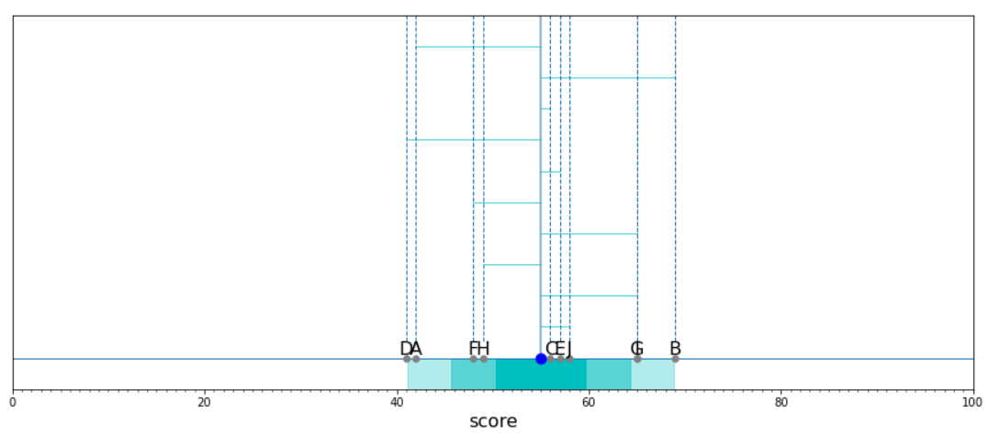

# Chapter 02. 1차원 데이터 정리

통계분석을 시작하는 첫걸음은 데이터를 정리하여 데이터의 특징을 대략적으로 파악하는 것입니다. 데이터의 개요를 파악하면 수많은 통계분석 기법 중에서 적절한 기법을 선택해 다음 걸음을 내딛을 수 있습니다.

데이터의 특징을 파악하는 방법에는 크게 두 가지가 있습니다. 하나는 평균이나 분산 등의 수치지표에 따라 데이터를 요약하는 방법이고, 다른 하나는 그림을 그려 시각적으로 데이터를 조감하는 방법입니다. 2장과 3장에서는 학생 50명의 수학과 영어 시험 점수에 대한 데이터를 예로, 데이터를 정리하는 방법에 대해 살펴보겠습니다. 시험 점수는 학생과 떼려야 뗄 수 없는 관계에 놓여 있으므로 가장 친숙한 데이터 중 하나라고 할 수 있겠습니다.

이 장에서는 그 중 영어 시험 점수만 사용합니다. 즉, 학생 1명에 대해서 하나의 점수가 대응되는 1차원 데이터입니다. 우선 2.1절부터 2.3절에 걸쳐서 1차원 데이터의 특징을 나타내는 수치 지표를 학습합니다. 여기서는 평균이라는 익숙한 지표에서 출발하여, 시험 점수에서 자주 사용되는 편찻값을 목표로 진행합니다. 그리고 2.4절에서는 데이터를 시각적으로 조감할 수 있도록 그리는 방법에 관해서 다룹니다. 파이썬을 시작한 지 얼마 되지 않았다면 아름다운 그래프를 간단히 그릴 수 있다는 사실에 놀랄 것입니다.

이 주제로 들어가기 전에, 라이브러리와 데이터를 준비합시다. 이 장에서는 1장에서 사용한 Pandas와 함께 NumPy라는 라이브러리도 사용합니다. NumPy는 수치 계산에 특화된 라이브러리로, Pandas와 함께 통계분석에 꼭 필요한 도구입니다.

그러면 NumPy와 Pandas를 임포트합시다. 결과를 쉽게 알아볼 수 있도록, 표시되는 자릿수를 소수점 이하 3자리로 설정해둡니다.(%precision 3으로 설정하는데, 이는 ipython 버전에 따라 잘 작동하지 않는 경우가 있습니다.)

```python
import numpy as np
import pandas as pd

# 주피터 노트북의 출력을 소수점 이하 3자리로 제한
%precision 3
# 데이터 프레임의 출력을 소수점 이하 3자리로 제한
pd.set_option('precision', 3)
```


이 장에서 사용하는 데이터는 ch2_scores_em.csv입니다. 이 csv 파일에는 2장과 3장에서 사용할, 학생 50명의 수학 시험 점수(mathmatics)와 영어 시험 점수(english)가 들어 있습니다.

```python
df = pd.read_csv('ch2_scores_em.csv',
           index_col = 'student number')
df.head()
```


2.1절부터 2.3절에서는 학생번호(student number) 순서대로 처음 10명의 영어 점수를 사용합니다. 이 데이터를 NumPy로 계산하기 위해, NumPy의 array 데이터 구조로 된 scores라는 이름으로 저장합니다. array는 수치 계산에 강점을 지닌 다차원 배열입니다.

```python
scores = np.array(df['english'])[:10]
scores
```

```
array([42, 69, 56, 41, 57, 48, 65, 49, 65, 58], dtype=int64)
```


마찬가지로 scores_df라는 이름으로 Pandas의 DataFrame을 작성합니다. DataFrame에는 10명의 학생 각각에 A, B, ...라는 이름을 부여했습니다.

```python
scores_df = pd.DataFrame({'score':scores},
            index = pd.Index(['A', 'B', 'C', 'D', 'E', 'F', 'G', 'H', 'I', 'J'], name = 'student'))
scores_df
```


## 01. 데이터 중심의 지표

첫 번째 주제는 데이터를 중심으로 나타내는 지표입니다. 데이터를 하나의 값으로 요약한 지표이며, 대푯값이라고 합니다. 예를 들어, 시험의 난이도를 알고 싶다면 전체 학생의 시험 점수를 확인하지 않더라도 평균 점수를 알면 파악할 수 있습니다. 평균 점수가 30점이라면 그 시험은 어려웠다는 것을, 평균 점수가 90점이라면 그 시험은 쉬웠다는 것을 의미합니다.


### 1.1 평균값

**평균값**(mean)은 가장 잘 알려진 대푯값으로, 일상생활에서도 사용할 기회가 많습니다. 평균값은 데이터를 모두 더한 뒤, 데이터의 개수로 나누어 구합니다. 시험 점수의 평균값을 구해봅시다. 계산하거나 암산으로 


라고 구해도 되지만, 파이썬에서는 간단하게 다음과 같이 나타낼 수 있습니다.

```python
sum(scores)/len(scores)
```

```python
55.0
```


파이썬을 사용하면 이처럼 간단하게 작성할 수 있고, NumPy의 함수를 사용하면 더욱 간단하게 구할 수 있습니다.

```python
np.mean(scores)
```

```python
55.0
```


DataFrame에서는 mean 메서드를 사용하여 구할 수 있습니다. 여기서는 실행하지 않지만, Series에서도 동일하게 mean 메서드를 사용하여 평균을 구할 수 있습니다.

```python
scores_df.mean()
```

```python
score    55.0
dtype: float64
```


NumPy의 array에도 mean 메서드가 있기 때문에, score.mean()으로 평균을 구할 수 있지만, 이 장에서는 NumPy의 함수를 사용하는 것으로 통일합니다. 한편, Pandas에는 pd.mean()이라는 함수가 없기 때문에, DataFrame이나 Series의 메서드를 사용합니다. 이제부터 설명하는 다른 지표에 관해서도 마찬가지입니다.

NumPy나 Pandas의 함수명은 통계 용어의 영어 단어를 그대로 쓰거나 약칭한 것이 대부분이므로, 주요 통계 용어는 영어 표현도 함께 기억해두길 권합니다. 통계 용어의 영어 표현을 기억하고 있으면 변수에 이름을 붙일 때에 편리하다는 장점이 있습니다.

평균은 시그마 기호를 사용하여 간단하게 수식으로 나타낼 수 있습니다. 시그마 기호는 데이터를 다룰 때 매우 중요하게 사용되므로, 수식이 불편한 분들도 이제부터는 조금씩 익숙해지록 합니다.


데이터의 평균은 x바라는 표기를 주로 사용하며 '엑스 바'라고 읽습니다. 앞에서 살펴본 예에 적용하면 n = 10, x~1~ = 42, x~2~ = 69, x~3~ = 56, ...입니다. 파이썬의 sum(scores)이 시그마(1~n) x~i~에, len(scores)이 n에 대응됩니다.


### 1.2 중앙값

**중앙값(median)**은 데이터를 크기 순서대로 나열할 때 정확하게 중앙에 위치한 값입니다. 예를 들어, [9, 1, 5, 3, 7]이라는 데이터가 있다면 중앙값은 세 번째인 5가 됩니다.

중앙값은 평균값에 비해 이상값에 강하다는 특성이 있습니다. 즉, 이상값에 영향을 덜 받는다는 의미입니다. 예를들어, [1, 2, 3, 4, 5, 6, 1000]이라는 큰 이상값을 포함하는 데이터가 있다고 가정해봅시다. 이 데이터의 대푯값을 구하려고 할 때, 평균값은 1000이라는 값에 크게 영향을 받아 150에 가까운 값이 되어버립니다. 150이라는 수치는 이 데이터를 적절하게 표현한다고 할 수 없습니다. 그런데 중앙값은 어떨까요? 데이터의 개수가 7이므로 4번째인 4가 중앙값이 됩니다. 이와 같이 데이터에 큰 이상값이 있는 경우, 대표값으로 평균값보다 중앙값이 적절합니다.

중앙값은 데이터를 순서대로 나열할 때 정확하게 중앙에 위치하는 값이지만, 데이터의 개수가 짝수일 대는 중앙에 위치하는 값이 2개입니다. [1, 2, 3, 4, 5, 6]이라는 데이터를 생각해봅시다. 이 데이터의 중앙에 위치하는 값은 3과 4입니다. 이 경우, 중앙값은 두 값의 평균값으로 정의됩니다. 따라서 이 데이터의 중앙값은 3.5입니다.

앞의 내용을 정리하면 중앙값의 정의는 다음과 같습니다.

- 데이터의 개수 n이 홀수라면, (n+1)/2 번째 데이터가 중앙값
- 데이터의 개수 n이 짝수라면, n/2번째 데이터와 (n/2)+1번째 데이터의 평균이 중앙값


그러면 영어 시험 점수의 중앙값을 구해봅시다. 우선 점수를 크기순으로 나열해야 합니다. 정렬을 하기 위해 np.sort를 사용합니다.

```python
sorted_scores = np.sort(scores)
sorted_scores
```

```
array([41, 42, 48, 49, 56, 57, 58, 65, 65, 69], dtype=int64)
```


이제 중앙값의 정의를 코드로 작성하기만 하면 됩니다. 파이썬 리스트의 인덱스는 0으로 시작하기 때문에, 위에서 설명한 중앙값의 정의와 1만큼 차이가 나는 것에 주의하기 바랍니다.

```python
n = len(sorted_scores)
if n % 2 == 0:
    m0 = sorted_scores[n//2 - 1]
    m1 = sorted_scores[n//2]
    median = (m0 + m1) / 2
else:
    median = sorted_scores[(n+1)//2 - 1]
median
```

```
56.5
```


NumPy에서는 median 함수가 구현되어 있으므로 간단하게 계산할 수 있습니다.

```python
np.median(scores)
```

```
56.5
```


DataFrame이나 Series에서는 median 메서드로 구할 수 있습니다.

```python
scores_df.median()
```

```
score    56.5
dtype: float64
```


### 1.3 최빈값

**최빈값(mode)**은 데이터에서 가장 많이 나타나는 값입니다. [1, 1, ,1 2, 2, 3]이라는 데이터가 있으면, 1이 가장 많이 나타나므로 최빈값은 1이 됩니다.

최빈값은 DataFrame이나 Series의 mode 메서드를 사용하여 구할 수 있습니다.

```python
pd.Series([1, 1, 1, 2, 2, 3]).mode()
```

```python
0    1
dtype: int64
```

최빈값은 기본적으로 질적 데이터의 대푯값을 구할 때 사용하는 지표입니다. 왜냐하면 시험 점수와 같은 양적 데이터에서는 최빈값을 구하려고 해도 완전히 동일한 점수가 여러 번 나오는 경우가 거의 없어, 유일한 값이 결정되지 않을 때가 많기 때문이다

```python
pd.Series([1, 2, 3, 4, 5]).mode()
```

```
0    1
1    2
2    3
3    4
4    5
dtype: int64
```

다만, 도수분포표를 도입하면 양적 데이터에서도 최빈값을 자연스럽게 정의할 수 있습니다.이에 관해서는 2.4절에서 살펴보겠습니다.


## 02. 데이터의 산포도 지표

다음 주제는 데이터의 산포도를 나타내는 지표입니다. 평균값이나 중앙값으로 데이터를 대표하는 값을 얻는 방법은 이해했습니다. 그러나 다음과 같은 경우를 가정해봅시다. 학급 전원이 50점을 받은 시험이 있고, 학급에서 절반은 0점을 받았지만, 나머지 절반은 100점을 받은 시험이 있습니다. 결과는 완전히 다르지만 두 경우 모두 평균값과 중앙값은 동일하게 50점이 되어버립니다. 전자는 개개인의 점수가 모여 있고, 후자는 개개인의 점수가 심하게 흩어져 있는 이미지를 떠올릴 수 있을 겁니다. 이와 같은 데이터의 산포도를 수치로 표현하려면 어떻게 해야 할까요?


### 2.1 분산과 표준편차


#### 편차

산포도를 구하는 첫걸음은 **편차**(deviation)를 알아보는 것입니다. 편차는 각 데이터가 평균으로부터 어느 정도 떨어져 있는가를 나타내는 지표입니다. 예를 들어, A 학생의 점수가 42점이고 학생 10명의 평균 점수가 55점이라면, A 학생의 편차는 42-55로 -13점이 됩니다. NumPy에는 브로드캐스트(브로드캐스트는 배열과 하나의 숫자와의 조합으로 이루어진 산술 연산을 수행하는 기능입니다. 숫자 하나와 배열의 원소별 계산이 각각 한 번씩 수행됩니다.)라는 기능이 있으므로, 다음과 같이 작성하면 각 학생의 편차를 구할 수 있습니다.

```python
mean = np.mean(scores)
deviation = scores - mean
deviation
```

```python
array([-13.,  14.,   1., -14.,   2.,  -7.,  10.,  -6.,  10.,   3.])
```


이것을 그림으로 나타내면 다음 그림이 됩니다. 색깔이 칠해진 점은 평균, 검은색 점은 각 학생의 점수, 색깔이 칠해진 직선은 각 학생의 편차를 나타냅니다.


여기서 학생 10명이 각각 얻은 시험 점수가 [50, 60, 58, 54, 51, 56, 57, 53, 52, 59]였다고 해봅시다. 평균값은 마찬가지로 55점입니다.

```python
another_scores = [50, 60, 58, 54, 51, 56, 57, 53, 52, 59]
another_mean = np.mean(another_scores)
another_deviation = another_scores - another_mean
another_deviation
```

```
array([-5.,  5.,  3., -1., -4.,  1.,  2., -2., -3.,  4.])
```


이 시험의 편차를 그림으로 나타내면 다음과 같습니다.


위에 두 그림을 비교하면, 첫번재 그림의 scores 쪽 점수가 더 흩어져 있는 것으로 보입니다. 편차도 scores쪽이 전체적으로 값이 큽니다. 이처럼 산포도를 표현할 때 그 지표로 편차를 사용할 수 있습니다.

하지만 10명의 편찻값을 통해 데이터를 비교하기 어렵기 때문에, 값을 하나로 정리하고 싶습니다. 편차의 대푯값으로 평균을 선택하면 어떨까요?

```python
np.mean(deviation)
```

```
0.0
```


scores의 편차 평균은 0이 됩니다. 그러면 another_scores는 어떨까요?

```python
np.mean(another_deviation)
```

```
0.0
```


이 경우애도 편차 평균은 0입니다. 그렇다면 편차 평균으로는 비교할 수 없습니다.

사실, 편차 평균은 항상 0이 됩니다. 평균을 x바라고 하면 i번째 점수의 편차는 x~i~ - x~i~ 바가 되므로, 그 평균은 다음과 같이 계산할 수 있습니다. 


조금 복잡해졌기 때문에, DataFrame을 사용하여 정리하겠습니다.

```python
summary_df = scores_df.copy()
summary_df['deviation'] = deviation
summary_df
```


```python
summary_df.mean()
```

```
score        55.0
deviation     0.0
dtype: float64
```


#### 분산

산포도의 지표로 각 데이터와 평균 간 차이를 나타내는 편차를 사용하는 것은 바람직한 생각이지만, 편차의 평균이 항상 0이 되므로 잘 사용하지 않습니다.

그렇다면 어떻게 해야 할까요? 각각의 산포도라는 의미에서 보면 B학생, D학생은 모두 평균에서 14점 떨어져 있어서 동일한 정도의 산포도를 가지고 있는 것 같습니다. 이 때문에 평균보다 14점이 크든 14점이 작든 이 둘을 동일하게 취급하여 편차의 제곱을 이용합니다.('편차의 절댓값 평균을 사용하면 안 될까?'라고 생각하는 분도 있을 수 있습니다. 물론 편차의 절댓값 평균도 산포도의 지표가 됩니다. 그러나 제곱 평균에 비해 다루기 어렵기 때문에 그다지 사용하지 않습니다.) 그리고 그 평균으로 정의되는 지표가 **분산**(variance)이 됩니다.

그렇다면 분산을 정의에 따라 계산해봅시다.

```python
np.mean(deviation ** 2)
```

```python
86.0
```


NumPy에서는 var 함수로 계산할 수 있습니다.

```python
np.var(scores)
```

```python
86.0
```


수식의 정의대로 계산한 결과와 같습니다.  DataFrame이나 Series에도 분사을 계산하는 var 메서드는 있지만, 문제가 조금 있습니다.

```python
scores_df.var()
```

```
score    95.556
dtype: float64
```


아쉽게도 Pandas에서 계산한 분산은 다른 값이 됩니다. 버그를 의심할 수 있지만 그건 아닙니다. 사실, 분산에는 표본분산과 불편분산의 두 종류가 있고, NumPy와 Pandas는 서로 다른 분산을 계산합니다. 이 장에서 설명하는 분산은 표본분산이면 NumPy에 기본으로 설정된 분산입니다. Pandas에 기본으로 설정된 분산은 불편분산입니다. 불편분산은 추측통계에서 매우 중요한 역활을 하는 지표이지만, 조금 까다롭기 때문에 10장에서 설명하려고 합니다.

Pandas로 표본분산을 계산하고 싶다면 var 메서드의 인수를 ddof = 0이라고만 설정하면 됩니다. 불편분산은 ddof = 1일 때에 해당합니다. NumPy의 var 메서드에도 ddof 인수를 설정할 수 있고, 동일하게 동작합니다. NumPy와 Pandas의 기본 설정 동작이 달라 혼란스럽기 때문에, 분산을 계산할 때에는 항상 ddof 인수를 설정하여 어떤 분산을 계산하는지 명시해두는게 좋습니다.

summary_df에 편차 제곱열을 추가합니다.

```python
summary_df['square of deviation'] = np.square(deviation)
summary_df
```


```
summary_df.mean()
```

```
score                  55.0
deviation               0.0
square of deviation    86.0
dtype: float64
```


분산을 수식으로 나타냅시다. 분산은 흔히 S^2^으로 표기합니다.


분산을 면적의 평균이라는 이미지로 바라보는 시각도 있습니다. 왜냐하면 편차 제곱은 한 변의 길이가 편차인 정사각형의 면적으로 생각 할 수 있기 때문입니다. 분산은 그렇게 한 변이 편차인 정사각형 면적의 평균에 해당합니다. 이런 해석이 언뜻 낯설게 느껴질 수 있지만, 이렇게 연상하면 3장에서 설명하는 공분산을 쉽게 이해할 수 있을 거라 생각합니다.

다음 그림에서 중앙의 가로선과 세로선은 A, B, C, D 4명의 평균점으로, A, B, C, D의 문자가 각각 시험점수를 나타내고 있습니다. 편차는 각 점수와 평균 간 차이이므로, 각 회색의 정사각형이 편차 제곱을 나타낸 것임을 알 수 있습니다. 이러한 정사각형의 평균이 중앙에 있는 색칠된 정사각형이 되고, 이 면적이 곧 분산이 됩니다. 홈페이지에서 제공하는 소스코드 중 animation 폴더 안의 파일을 실행하면 이 그림을 움직일 수 있으니 반드시 숫자를 직접 변경하면서 평균과 분산이 어떻게 변화하는지 확인하기 바랍니다.


#### 표준편차

평균의 단위는 원래의 데이터 단위와 다르지 않으므로, 영어 시험 점수라면 평균도 점수라는 단위를 씁니다. 결국 평균은 55점으로 표현할 수 있습니다. 그러나 분산은 점수의 면적으로 나타내므로 점수의 제곱이라는 이해하기 어려운 단위를 사용합니다. 영어 점수의 분산이 86점^2^ 이라고 말해도 감이 오지 않습니다. 

이 때문에 원래의 데이터와 동일한 단위를 쓰는 산포도의 지표가 있다면 도움이 될 것입니다. 그와 같은 산표도 지표로 분산에 제곱근을 취한 **표준편차**(standard deviation)를 이용합니다.


분산에 제곱근을 취하면 되므로, np.var과 np.sqrt를 사용하여 계산할 수 있습니다.

```python
np.sqrt(np.var(scores, ddof = 0))
```

```
9.274
```


NumPy의 std 함수로 계산해도 됩니다. std도 var과 마찬가지로 ddof 인수를 취하면, 동일한 동작을 나타냅니다. 예를 들어, ddof = 0으로 하면 표본분산에 제곱근을 취한 것이 출력됩니다. DataFrame과 Series도 마찬가지입니다.

```python
np.std(scores, ddof = 0)
```

```
9.274
```


표준편차는 원래의 데이터와 동일한 단위를 쓰므로, 동일한 차원으로 그릴 수 있습니다. 가장 진하게 색깔이 칠해진 영역이 평균±표준편차구간, 그 다음이 평균±2 표준편차구간, 가장 옅은 영역이 평균±3 표준편차 구간입니다. 각각 **1시그마 구간**, **2시그마 구간**, **3시그마 구간**이라고 부릅니다.

홈페이지에서 제공하는 소스코드 중 animation 폴더를 살펴보면, 이 그림을 움직일 수 있습니다. 반드시 움직여보면서 표준편차가 어떻게 변하는지 그 이미지를 분명히 확인합시다.




### 2.2 범위와 사분위 범위


#### 범위

**범위(range)**는 분산이나 표준편차와 달리, 데이터 전체를 보는 것이 아니라 데이터의 최댓값과 최솟값만으로 산포도를 표현하는 방법입니다. 최댓값과 최솟값의 차이가 크면 산포도가 크고, 그 차이가 작으면 산포도도 작다는 의미입니다. 간단히 계산할 수 있지만, 값이 2개뿐이므로 개략적인 지표이고 이상값에 약하다고 할 수 있습니다.

수식과 파이썬을 사용하여 구현하면 다음과 같습니다.


```python
np.max(scores) - np.min(scores)
```

```
28
```


#### 사분위 범위

범위는 최댓값과 최솟값밖에 보이지 않으므로, 큰 이상값이 하나라도 있으면 범위도 크게 변화합니다. 이 때문에 최댓값과 최솟값이 아니라, 데이터의 상위수%에 위치하는 값과 하위수%에 위치하는 값의 차이를 취하는 방법을 생각할 수 있습니다.

특히 **사분위 범위**(interquartile range)에서는 데이터의 하위25%, 50%, 75%에 위치하는 값에 주목합니다. 각각 제1사분위수, 제2사분위수, 제3사분위수라고 하면 Q1, Q2, Q3으로 나타냅니다. 그리고 Q3-Q1을 사분위 범위 IQR로 정의합니다.


scores의 IQR을 구해봅시다. 데이터의 25%p 등은 NumPy의 percentile 함수로 구할 수 있습니다.

```python
scores_Q1 = np.percentile(scores, 25)
scores_Q3 = np.percentile(scores, 75)
scores_IQR = scores_Q3 - scores_Q1
scores_IQR
```

```
15.0
```

IQR을 구할 때 Q2를 사용하지 않지만 Q2는 중앙값과 일치합니다. 분산은 평균에 대해서 정의되는 산포도의 지표인 반면, IQR은 중앙값에 대해서 정의되는 산포도의 지표라고 해석할 수 있습니다.

Q1, Q2, Q3이나 IQR은 2.4절에서 설명할 상자그림에서도 이용합니다.


### 2.3 데이터의 지표 정리

DataFrame이나 Series에는 지금까지 다룬 다양한 지표를 한 번에 구할 수 있는 편리한 메서드가 있습니다. 바로 describe 메서드입니다. 데이터가 주어지면 우선 describe를 사용하여 개요를 파악해보는 것도 좋습니다.

```python
pd.Series(scores).describe()
```

```
count    10.000
mean     55.000
std       9.775
min      41.000
25%      48.250
50%      56.500
75%      63.250
max      69.000
dtype: float64
```


## 03. 정규화

시험 점수는 동일한 60점이리도, 평균 점수가 30점인 어려운 시험에서 얻은 60점과 평균점수가 90점인 쉬운 시험에서 얻은 60점은 상대적인 결과가 다릅니다. 점수라는 지표는 그 시험의 평균이나 분산에 따라 평가가 달라집니다. 그러므로 평균이나 분산에 의존하지 않고 데이터의 상대적인 위치 관계를 알 수 있는 지표가 있다면 편리할 것입니다.

이와 같은 대표적인 지표로 편찻값이 있습니다. 평균이나 분산이 어떻게 나오든, 편찻값이 50이면 평균적인 결과이고 편찻값이 60이면 상위 결과라는 통일된 평가를 할 수 있습니다. 이처럼 데이터를 통일된 지표로 변환하는 것을 **정규화**(normalization)라고 한다. 정규화를 통해 다양한 데이터를 동일한 기준으로 다룰 수 있기 때문에, 데이터를 분석할 때 정규화는 일반적으로 사용하는 수단이 됩니다. 특히, 다음에 설명하는 표준화는 4장 이후에 다루는 추측통계에서도 중요하므로, 확실하게 파악해봅시다.


### 3.1 표준화

데이터에서 평균을 빼고 표준편차로 나누는 작업을 **표준화**(standardization)라고 하며, 표준화된 데이터를 **표준화 변량**(standardized data)이나 **Z점수**(Z-score)라고 합니다. 각 데이터 x~i~를 표준화한 z~i~를 수식으로 나타내면 다음과 같습니다.


시험 점수를 표준화해봅시다.

```python
z = (scores - np.mean(scores)) / np.std(scores)
z
```

```
array([-1.402,  1.51 ,  0.108, -1.51 ,  0.216, -0.755,  1.078, -0.647, 1.078,  0.323])
```


표준화된 데이터는 평균이 0, 표준편차가 1이다.

```python
np.mean(z), np.std(z, ddof = 0)
```

```
(-1.6653345369377347e-17, 0.9999999999999999)
```

데이터와 동일한 단위를 쓰는 표준편차로 나눗셈을 하고 있기 때문에, 표준화된 데이터는 점수와 같은 단위를 쓰지 않는다는 사실에 주의합니다.


### 3.2 편찻값

편찻값은 평균이 50, 표준편차가 10이 되도록 정규화한 값을 말합니다. 수식으로 나타내면 다음과 같습니다.


score의 데이터를 사용하여 각 학생의 편찻값을 계산해봅시다. 

```python
z = 50 + 10 * (scores - np.mean(scores)) / np.std(scores)
z
```

```
array([35.982, 65.097, 51.078, 34.903, 52.157, 42.452, 60.783, 43.53 , 60.783, 53.235])
```


DataFrma으로 정리하여, 점수와 편찻값의 관계를 살펴봅시다.

```python
scores_df['deviation value'] = z
scores_df
```


편찻값이라는 지표를 통하여, 어떤 학생이 평균적인 성적을 얻었고 어떤 학생이 우수한 성적을 얻었는지 한눈에 파악할 수 있습니다.


## 04. 1차원 데이터 시각화

지금까지 학생 10명의 영어 점수를 사용하여, 데이터를 활용할 수 있는 다양한 지표를 배웠습니다. 이번에는 50명의 영어 점수를 사용하여 데이터의 특징이나 분포를 표나 그림을 통해 시각적으로 파악할 수 있는 방법을 배워보고자 합니다.

우선 50명의 영어 점수에 대한 array를 작성하고, Series의 describe 메서드를 사용하여 주요지표들을 확인해둡니다.

```python
# 50명의 영어 점수 array
english_scores = np.array(df['english'])

# Series로 변환하여 describe를 표시
pd.Series(english_scores).describe()
```

```
count    50.00
mean     58.38
std       9.80
min      37.00
25%      54.00
50%      57.50
75%      65.00
max      79.00
dtype: float64
```


### 4.1 도수분포표

describe 메서드로 출력된 평균이나 분산, 사분위수 등의 지표로 데이터의 중심이나 산포도 상태를 알 수 있지만, 데이터의 분포 상태를 세부적으로 알고 싶을 때가 있습니다. 그럴 때 데이터가 취하는 값을 몇개의 구간으로 나누고, 각 구간에 몇개의 데이터가 들어가는가를 세는 방법이 있습니다. 이처럼 분할된 구간과 데이터의 개수를 표로 정리한 것이 **도수분포표**(freqency distribution)입니다.

시험 점수를 10점 간격으로 나눈 후, 각 구간의 점수를 얻은 학생이 몇 명인지 세어서 도수분포표를 작성할 수 있습니다. 이때 0~10점이라는 구간을 **계급**(class), 각 계급에 속한 학생 수를 **도수**(frequency)라고 합니다. 또한 각 구간의 폭을 **계급폭**이라 하고, 계급의 수를 **계급수**라고 합니다. 10점씩 나누고 있으므로 계급폭을 10점이고, 100점을 10점씩 구분하고 있으므로 계급은 총 10개이므로 계급수는 10이 됩니다.

바로 도수분포표를 만들어봅시다. 도수는 np.histogram 함수를 사용하면 간단하게 구할 수 있습니다. np.histogram에서는 bins로 계급수를, range로 최솟값과 최댓값을 지정할 수 있습니다. 여기서는 0점부터 100점까지의 점수를 계급수 10으로 분류하고 싶기 때문에, 다음과 같이 저장합니다.

```python
freq, _ = np.histogram(english_scores, bins = 10, range = (0, 100))
freq
```

```
array([ 0,  0,  0,  2,  8, 16, 18,  6,  0,  0], dtype=int64)
```


DataFrame으로 결과를 정리합니다. 각 계급에는 하한~상한 형태로 레이블을 붙입니다. 각 계급에는 하한 이상부터 상한 미만까지의 데이터가 분류됩니다. 예를 들면, 60점은 60~70 계급에 들어갑니다.

```python
# 0~10, 10~20, ... 이라는 문자열 리스트를 작성
freq_class = [f'{i}~{i+10}' for i in range(0, 100, 10)]

# freq_class를 인덱스로 DataFrame을 작성
freq_dist_df = pd.DataFrame({'frequency':freq},
                           index = pd.Index(freq_class, name = 'class'))
freq_dist_df
```


도수분포표가 완성되었습니다. 데이터를 도수분포표로 정리하면 점수의 분포를 쉽게 알 수 있습니다. 이 표만 봐도 50~70점에 많은 학생이 몰려 있고, 고득점도 저득점도 없으며, 점수 차가 많이 나지 않는 시험이었다는 데이터의 특징을 간단히 파악할 수 있습니다.

도수분포표에서는 계급과 도수 외에도 계급값, 상대도수, 누적상대도수도 자주 함께 사용됩니다. 하나씩 살펴봅시다.

**계급값**은 각 계급을 대표하는 값으로, 계급의 중앙값이 이용됩니다. 60~70의 계급이면 계급값은 65점이됩니다.

```python
class_value = [(i+(i+10))//2 for i in range(0, 100, 10)]
class_value
```

```
[5, 15, 25, 35, 45, 55, 65, 75, 85, 95]
```


**상대도수**는 전체 데이터에 대해서 해당 계급의 데이터가 어느 정도의 비율을 차지하고 있는지를 나타냅니다.

```python
rel_freq = freq / freq.sum()
rel_freq
```

```
array([0.  , 0.  , 0.  , 0.04, 0.16, 0.32, 0.36, 0.12, 0.  , 0.  ])
```


**누적상대도수**는 해당 계급까지의 상대도수의 합을 나타냅니다. 누적합을 계산할 때 np.cumsum 함수를 사용하면 편리합니다. 

```python
cum_rel_freq = np.cumsum(rel_freq)
cum_rel_freq
```

```
array([0.  , 0.  , 0.  , 0.04, 0.2 , 0.52, 0.88, 1.  , 1.  , 1.  ])
```


계급값과 상대도수와 누적상대도수를 도수분포표에 추가해봅시다.

```python
freq_dist_df['class value'] = class_value
freq_dist_df['relative frequency'] = rel_freq
freq_dist_df['cumulative relative frequency'] = cum_rel_freq
freq_dist_df = freq_dist_df[['class value', 'frequency', 'relative frequency', 'cumulative relative frequency']]
freq_dist_df
```


상대도수나 누적상대도수를 보면, 전체 학생의 68%가 50~70점의 점수를 얻었다는 것과 전체 학생 중 약 절반이 60점 이하의 점수를 얻었다는 것을 알 수 있습니다.


#### 최빈값 재검토

도수분포표로 양적 데이터에 대해서도 최빈값을 구할 수가 있습니다. 도수분포표를 사용한 최빈값은 최대가 되는 계급의 계급값으로 최빈값을 정의됩니다. 도수분포표를 통해 60~70인 계급의 도수가 최대인 것을 알 수 있으므로, 이 데이터의 최빈값은 65점입니다.

```python
freq_dist_df.loc[freq_dist_df['frequency'].idxmax(), 'class value']
```

```
65
```

여기서 하나 주의해야 할 것은 최빈값은 도수분포표를 만드는 방법에 의존한다는 점입니다. 예를 들어, 계급폭을 4점으로 하여 도수분포표를 계산하면 최빈값은 60점이 됩니다.


### 4.2 히스토그램

**히스토그램**(histogream)은 도수분포표를 막대그래프로 나타낸 것입니다. 히스토그램을 사용하여 데이터의 분포 상태를 더욱 시각적으로 파악할 수 있습니다.

여기서는 matplotlib이라는 라이브러리가 필요합니다. matplotlib은 파이썬으로 그래프를 그릴 때 쓰는 표준 라이브러리로, 이 책에서 사용한 시각화 자료는 모두 matplotlib을 이용해 구현한 것들입니다. 지금까지 소개한 Pandas, NumPy, Matplotlib은 통계분석의 세 가지 보물입니다. 대부분의 통계분석은 이 세 가지 라이브러리만으로 수행할 수 있습니다.

그렇다면 matplotlib을 임포트해봅시다. 여기서는 임포트에 추가하여, 그래프가 Jupyter notebook 위에 표시되도록 설정합니다.

```python
import matplotlib.pyplot as plt

# 그래프가 주피터 노트북 위에 표시
%matplotlib inline
```


바로 matplotlib을 사용하여 히스토그램을 그립니다. 히스토그램은 hist 메서드로 그립니다. 인수 등은 NumPy의 histogram 함수와 동일합니다.

```python
# 캔버스를 생성
# figsize로 가로, 세로 크기를 지정
fig = plt.figure(figsize = (10, 6))
# 캔버스 위에 그래프를 그리기 위한 영역을 지정
# 인수는 영역을 1x1개 지정, 하나의 영역에 그린다는 것을 의미
ax = fig.add_subplot(111)

# 계급수를 10으로 하여 히스토그램을 그림
freq, _, _ = ax.hist(english_scores, bins = 10, range = (0, 100))
# X축에 레이블 부여
ax.set_xlabel('score')
# Y축에 레이블 부여
ax.set_ylabel('person number')
# X축을 0, 10, 20, ... , 100 눈금으로 구분
ax.set_xticks(np.linspace(0, 100, 10+1))
# Y축을 0, 1, 2, ...의 눈금으로 구분
ax.set_yticks(np.arange(0, freq.max()+1))
# 그래프 표시
plt.show()
```


지금까지 계급수를 10으로 지정하여 도수분포표와 히스토그램을 작성했지만, 계급수를 늘리면 더 세부적인 데이터의 분포를 볼 수 있습니다. 계급수를 25, 즉 계급폭을 4점으로 하여 히스토그램을 출력해봅시다.

```python
fig = plt.figure(figsize=(10, 6))
ax = fig.add_subplot(111)

freq, _, _ = ax.hist(english_scores, bins = 25, range = (0, 100))
ax.set_xlabel('score')
ax.set_ylabel('person number')
ax.set_xticks(np.linspace(0, 100, 25+1))
ax.set_yticks(np.arange(0, freq.max()+1))
plt.show()
```


계급폭을 변경하니 히스토그램의 모양이 크게 변했습니다. 도수분포표와 히스토그램은 계급수에 따라 모양이 크게 변하기 때문에, 데이터에 따라 적절한 값으로 설정하는 것이 중요합니다.

마지막으로 상대도수의 히스토그램을 누적상대도수의 꺾은선 그래프와 함께 그립니다.

```python
fig = plt.figure(figsize = (10, 6))
ax1 = fig.add_subplot(111)
# Y축의 스케일이 다른 그래프를 ax1과 동일한 영역에 생성
ax2 = ax1.twinx()

# 상대도수의 히스토그램으로 하기 위해서는, 도수를 데이터의 수로 나눌 필요가 있음
# 이것은 hist의 인수 weight를 지정하면 실현 가능
weights = np.ones_like(english_scores) / len(english_scores)
rel_freq, _, _ = ax1.hist(english_scores, bins = 25, range = (0, 100), weights = weights)

cum_rel_freq = np.cumsum(rel_freq)
class_value = [(i+(i+4))//2 for i in range(0, 100, 4)]
# 꺽은선 그래프를 그림
# 인수 ls를 '--'로 하면 점선이 그려짐
# 인수 marker를 'o'로 하면 데이터 점을 그림
# 인수 color를 'gray'로 하면 회색으로 지정
ax2.plot(class_value, cum_rel_freq, ls = '--', marker = 'o', color = 'gray')
# 꺽은선 그래프의 눈금선을 제거
ax2.grid(visible = False)

ax1.set_xlabel('score')
ax1.set_ylabel('relative frequency')
ax2.set_ylabel('cumulative relative frequency')
ax1.set_xticks(np.linspace(0, 100, 25+1))

plt.show()
```


### 4.3 상자그림

**상자그림**(box plot)은 데이터의 산포도를 표현하는 그림입니다. 상자그림을 그리면 데이터 분포와 이상값을 시각적으로 파악할 수 있습니다.

상자그림에서는 다음 그림에 나타낸 것처럼, 분위수 범위의 Q1, Q2, Q3, IQR을 사용한다. 상자는 Q1부터 Q3을 나타내고, 수염은 Q1-1.5IQR부터 Q3+1.5IQR을 나타냅니다. 여기 들어가지 않은 데이터는 이상값이 됩니다.(이상값을 고려하지 않고 최솟값과 최댓값을 수염으로 표시하는 방법도 있습니다.)


상자그림은 boxplot 메서드를 사용하여 그릴 수 있습니다.

```python
fig = plt.figure(figsize = (5, 6))
ax = fig.add_subplot(111)
ax.boxplot(english_scores, labels = ['englisg'])

plt.show
```


상자그림에서도 60점 전후의 점수를 받은 학생이 많다는 것을 알 수 있습니다.