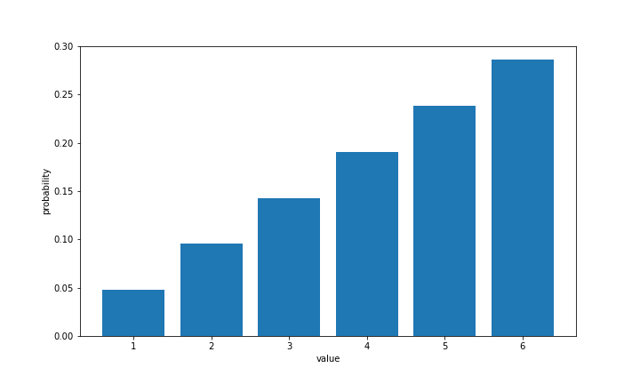

# Chapter 05. 이산형 확률변수

5장부터 9장에 걸쳐 통계분석에 필요한 확률에 대한 이야기가 이어집니다. 확률을 배우려면 수학을 완전히 피할 수는 없습니다. 이 때문에 5~9장에는 수식이 꽤 많이 나옵니다.

파이썬으로 통계분석을 하는 경우, 라이브러리가 감쪽같이 계산해주므로 그 뒤에 있는 수학을 의식할 일이 별로 없을 겁니다. 그러나 수식을 모른 채 라이브러리의 사용 방식만 배워 통계를 진행한다면 그것은 통계분석을 마스터한 것이 아니라 라이브러리의 사용 방식을 마스터한 것일 뿐입니다. 통계분석을 이해하려면 그 바탕이 되는 수학을 알아두는 것이 중요합니다.

그러나 수식으로만 설명하면 이야기가 추상적으로 흘러가기 쉽습니다. 그래서 이 장에서는 수식을 정의한 후에 구체적인 예를 제시해 파이썬으로 표현하는 형식으로 진행합니다. 라이브러리는 NumPy와 Matplotlib을 사용하고, 수식을 그대로 NumPy로 구현하여 적절한 Matplotlib으로 그려나갑니다.

확률변수는 취할 수 있는 값이 이산이냐 연속이냐에 따라 이산형 확률변수와 연속형 확률변수 두 가지로 구분됩니다. 그래서 5장과 6장에서는 이산형 확률변수를 다루고, 7장과 8장에서는 연속형 확률변수를 다룹니다. 5장과 7장은 각각 이산형 확률변수와 연속형 확률변수의 정의, 평균과 분산, 공분산이라는 지표에 대해 설명하고, 6장과 8장은 각각 이산형과 연속형의 대표적인 확률분포에 대해 설명하는 구성으로 되어 있습니다.

이 주제를 시작하기 전에, 항상 그래왔듯이 라이브러리를 임포트해둡시다.

```python
import numpy as np
import matplotlib.pyplot as plt

%precision 3 
%matplotlib inline
```


## 01. 1차원 이산형 확률변수

이산형 확률변수는 취할 수 있는 값이 이산적인 확률변수입니다. 취할 수 있는 값이 이산적이라는 말은 이 책에서는 정수로 생각해도 좋습니다. 이 절에서는 이산형 확률변수 중에서도 1차원 이산형 확률변수에 관해 설명합니다. 구체적인 예로는 4장에서 살펴본 불공정한 주사위를 사용합니다.


### 1.1 1차원 이산형 확률변수의 정의


#### 확률질량함수

4.2절에서 이미 살펴보았듯이 확률변수는 변수가 취할 수 있는 값과 그 값이 나오는 확률에 의해 정의됩니다. 이것을 이산형 확률변수에 대입하면, 확률변수 X가 취할 수 있는 값에 대한 집합을 {x~1~, x~2~, ...}으로, 확률변수 X가 x~k~라는 값을 취하는 확률을 


로 정의할 수 있습니다. 


이떄 확률은 변수가 취할 수 있는 값  x를 인수로 하는 함수로 볼 수 있기 때문에, 


로 하는 함수 f(x)를 생각할 수 있고, 이를 **확률질량함수**(probability mass function, PMF) 또는 **확률함수**라고 부릅니다.


확률변수가 취할 수 있는 값과 그 확률의 구체적인 대응을 **확률분포**(probability distribution)라고 합니다. 따라서 확률변수의 확률분포가 결정되면 그 확률변수의 움직임이 정해집니다.


여기까지의 내용을 불공정한 주사위 예를 들어, 파이썬을 사용해 확인해봅시다. 우선 확률변수가 취할 수 있는 값의 집합을 x_set으로 정의합니다. 주사위이므로 그 값은 1부터 6까지의 정수가 됩니다. 집합과 배열은 엄밀히 말하면 다르지만, 여기에서는 편의상 NumPy의 배열인 array에 저장합니다.

```python
x_set = np.array([1, 2, 3, 4, 5, 6])
```

다음은 x_set에 대응하는 확률을 정의합니다. 불공정한 주사위는 [표 5-1]의 확률분포를 따릅니다.

|  눈  |  1   |  2   |  3   |  4   |  5   |  6   |
| :--: | :--: | :--: | :--: | :--: | :--: | :--: |
| 확률 | 1/21 | 2/21 | 3/21 | 4/21 | 5/21 | 6/21 |

 

이 때문에, 확률 p~k~를 


과 같이 하나씩 정의하더라도 문제는 없지만, 여기에서는 깔끔하게 확률변수를 사용하기로 합니다. 6장에서 소개할 대표적인 확률분포는 모두 확률변수로 정의되기 때문에, 간단한 예부터 확률변수에 익숙해지는 것이 좋습니다. 


불공정한 주사위의 확률변수는 다음과 같이 정의할 수 있습니다.


이 함수는 불공정한 주사위가 취할 수 있는 값을 입력했을 때 그 확률을 반환하는 함수임을 확인하기 바랍니다.


확률변수를 파이썬으로 구현해봅시다.

```python
def f(x):
    if x in x_set:
        return x/21
    else:
        return 0
```

확률변수가 취할 수 있는 값의 집합과 확률변수의 세트가 확률분포입니다. 이 확률분포에 의해 확률변수  X의 동작이 결정됩니다. 따라서 X는 x_set과 f를 요소로 하는 리스트로 구현합니다.

```python
X = [x_set, f]
```

이것으로 확률변수 X가 정의되었습니다. 확률변수로부터 각 x~k~의 확률 p~k~를 구해봅시다. 여기서는 x~k~와  확률 p~k~의 대응을 사전식으로 표시하고 있습니다.

```python
# 확률 p_k를 구한다
prob = np.array([f(x_k) for x_k in x_set])
# x_k와 p_k의 대응을 사전식으로 표시
dict(zip(x_set, prob))
```

```python
{1: 0.047619047619047616,
 2: 0.09523809523809523,
 3: 0.14285714285714285,
 4: 0.19047619047619047,
 5: 0.23809523809523808,
 6: 0.2857142857142857}
```


확률변수가 취할 수 있는 값과 확률의 대응을 막대그래프로 표시합시다. 그래프를 그리면 확률분포가 어떻게 되어 있는지 시각적으로 이해할 수 있습니다.

```python
fig = plt.figure(figsize = (10, 6))
ax = fig.add_subplot(111)
ax.bar(x_set, prob)
ax.set_xlabel('value')
ax.set_ylabel('probability')

plt.show()
```



#### 확률의 성질

이제 확률의 중요한 성질을 살펴봅시다. 확률은 절대적으로 0이상으로, 모든 확률을 더하면 1이 되어야 합니다. 결국 확률함수는 다음 두 가지 식을 만족합니다.


확률이 모두 0이상인지는 np.all 함수를 사용하면 확인할 수 있습니다. np.all은 모든 요소가 참일 때만 참을 반환하는 함수입니다. 

```python
np.all(prob >= 0)
```

```python
True
```

확률의 총합이 1이 된다는 것을 확인해봅시다.

```python
np.sum(prob)
```

```python
0.9999999999999999
```


#### 누적분포함수

확률함수는 확률변수가 X가 x가 될 때의 확률을 반환하는 함수이지만, 확률변수 X가 x이하가 될 때의 확률을 반환하는 함수로도 자주 사용됩니다. 이와 같은 함수 F(x)를 **누적분포함수**(cumulative distribution function, CDF) 또는 간단히 **분포함수**라 하고, 다음과 같이 정의합니다.


파이썬으로 다음과 같이 작성할 수 있습니다.

```python
def F(x):
    return np.sum([f(x_k) for x_k in x_set if x_k <= x])
```


분포함수를 사용해서 눈이 3 이하가 되는 확률을 구해보면 다음과 같습니다.

```python
F(3)
```

```python
0.2857142857142857
```


#### 확률변수의 변환

마지막으로 확률변수의 변환을 생각해봅시다. 확률변수의 변환이란 확률변수 X에 2를 곱하고 3을 더한 2X+3과 같은 것으로, 확률변수를 표준화(평균을 빼고 표준편차로 나눈는 것)할 때 중요한 연산입니다.

여기서 다음과 같은 의문이 생깁니다. 변환을 수행한 2X+3은 확률변수인가? 만약 확률변수라면 그 확률분포는 어떻게 되는가?

이것은 주사위의 예로 생각해보면 이해하기 쉽습니다. 주사위의 눈은 확률변수였으므로, 이 눈을 X라고 하면 2X+3은 주사위의 눈에 2를 곱하고 3을 더한 숫자가 됩니다. 주사위의 눈에 2를 곱하고 3을 더한 숫자가 취할 수 있는 값은 {5, 7, 9, 11, 13, 15}로 결정되고 그에 따라 각각의 확률도 결정됩니다. 그러므로 이 또한 확률변수가 된다는 것을 알 수 있습니다. 

여기서 2X+3을 확률변수 Y라고 합시다. 그러면 Y의 확률분포는 다음과 같습니다.

```python
y_set = np.array([2 * x_k + 3 for x_k in x_set])
prob = np.array([f(x_k) for x_k in x_set])
dict(zip(y_set, prob))
```

```python
{5: 0.047619047619047616,
 7: 0.09523809523809523,
 9: 0.14285714285714285,
 11: 0.19047619047619047,
 13: 0.23809523809523808,
 15: 0.2857142857142857}
```

Y의 확률변수도 구할 수 있지만, 이 책에서는 거기까지 나가지 않습니다. 확률변수의 변환을 정의할 수 있고, 변환한 후도 확률변수가 된다는 것을 알았다면 그것으로 충분합니다.


### 1.2 1차원 이산형 확률변수의 지표

2장에서 1차워 데이터에는 평균과 분산이라는 지표가 있다는 것을 알아보았습니다. 마찬가지로 1차원 확률변수에서도 평균과 분산이라는 지표를 정의할 수 있고, 확률변수의 특징을 파악할 수 있습니다. 

#### 기댓값

우선 평균부터 생각해보겠습니다. 데이터의 평균과 마찬가지로, 확률변수의 평균은 확률변수의 중심을 나타내는 지표가 됩니다. 데이터의 평균은 각 데이터를 모두 더한 다음 데이터의 수로 나누는 것입니다. 이것은 우리가 잘 알고 있는 정의입니다. 하지만 확률변수의 평균은 어떻게 구할 수 있을까요?

수식으로 표현해도 이미지를 떠올리기 어렵습니다. 그래서 미리 직관적인 설명을 하자면, 확률변수의 평균이란 확률변수를 몇 번이나(무제한으로) 시행하여 얻어진 실현값의 평균을 가리킵니다. 주사위라면 무한 번 주사위를 굴려 얻는 눈의 평균입니다.(확률분포에서 한없이 큰 표본 크기로 무작위추출한 표본 데이터의 평균이라 할 수도 있습니다.)

다만, 당연한 말이지만 무제한으로 시행을 할 수는 없습니다. 이 때문에 이산형 확률변수의 경우, 확률변수의 평균은 확률변수가 취할 수 있는 값과 그 확률의 곱의 총합으로 정의됩니다.


이 식으로 계산되는 값이 확률변수를 무제한 시행하여 얻은 실현값의 평균과 일치하는 것에 대해 신기하게 생각할 수도 있지만, 이에 관해서는 조금 뒤에 확인하겠습니다.

확률변수의 평균은 **기댓값**(expected value)이라고도 부릅니다. 두 용어는 혼용하기도 하는데, 이 책에서는 기댓값이라는 용어로 통일합니다. 기호로는 μ(뮤)나 E(X)라는 표기를 주로 사용합니다.(기댓값의 연산이라는 의미가 강할 때에는 E(X), 기댓값의 값 자체를 나타낼 때는 μ로 표기합니다.)

그렇다면 불공정한 주사위의 기댓값을 앞에서 정의한 대로 계산해봅시다.

```python
np.sum([x_k * f(x_k) for x_k in x_set])
```

```python
4.333333333333333
```

앞에서 설명했듯이, 확률변수의 기댓값은 확률변수를 무제한 시행하여 얻은 실현값의 평균입니다. 이것을 파이썬으로 확인해봅시다. 파이썬이라고 해도 무제한 시행은 할 수 없기 때문에, 여기서는 100만(=10^6^)번 주사위를 굴려보겠습니다.

```python
sample = np.random.choice(x_set, int(1e6), p = prob)
np.mean(sample)
```

```python
4.333499
```

확실히 정의한 대로 계산한 기댓값과 일치합니다. 이어지는 확률변수의 분산이나 공분산 등도 마찬가지입니다. 그 값들도 모두 무제한 시행해서 얻은 실현값의 데이터에 관해 정의되는 분산이나 공분산이라 생각할 수 있습니다. 

조금 전에, 변환한 확률변수도 확률변수라고 설명했습니다. 그렇다면 변환한 확률변수의 기댓값도 생각해볼 수 있습니다. 이것은 9장 이후에 표준화한 확률분포의 기댓값을 다룰 때 중요한 요소가 됩니다.

간단한 예로, 확률변수 X를 2X+3으로 변환한 확률변수 Y의 기댓값에 관해서 생각해봅시다. 이 경우, 기댓값은 x~k~부분을 2x~k~+3으로 치환한 다음 식으로 정의됩니다.


더 일반화하면, 확률변수 X의 함수 g(X)의 기댓값을 정의할 수 있습니다.

**이산형 확률변수의 기댓값**


이 수식을 기댓값의 함수로 구현해봅시다. 인수 g가 확률변수에 대한 변환의 함수입니다.

```python
def E(X, g = lambda x:x):
    x_set, f = X
    return np.sum([g(x_k) * f(x_k) for x_k in x_set])
```

g에 아무것도 지정하지 않으면, 확률변수 X의 기댓값이 구해집니다.

```python
E(X)
```

```python
4.333333333333333
```


확률변수 Y=2X+3의 기댓값은 다음과 같이 계산할 수 있습니다.

```python
E(X, g = lambda x: 2*x + 3)
```

```python
11.666666666666664
```


기댓값에는 다음과 같은 선형성이라는 성질이 있습니다. 이 성질을 사용하여 aX+b와 같이 변환한 확률변수의 기댓값을 X의 기댓값으로 구할 수 있습니다.

**기댓값의 선형성**

a, b를 실수, X를 확률변수로 했을 때


가 성립합니다.


E(2X+3)이 2E(X)+3과 같은지 확인해보겠습니다.

```python
2 * E(X) + 3
```

```
11.666666666666666
```

확실히 선형성이 성립한다는 것을 알 수 있습니다.


#### 분산

확률변수의 분산도 데이터의 분산과 마찬가지로 산포도를 나타내는 지표가 됩니다. 이산형 확률변수의 경우, 분산은 다음 식과 같이 편차 제곱의 기댓값으로 정의됩니다. 여기서 μ는 확률변수X의 기댓값으로 E(X)입니다.


분산은 기호로 σ(시그마)를 사용하고, σ^2^이나 V(X)로 흔히 표기합니다. 다만 σ는 확률변수X의 표준편차를 나타냅니다.(기댓값과 마찬가지로, 분산이 연산으로서의 의미가 강할 때는 V(X), 분산에 대한 값 자체를 나타낼 경우에는 σ^2^으로 표기합니다.)


그렇다면 불공정한 주사위의 분산을 구해봅시다.

```python
mean = E(X)
np.sum([(x_k - mean)**2 * f(x_k) for x_k in x_set])
```

 ```python
2.2222222222222223
 ```


변환한 확률변수에 대해서도 분산을 정의할 수 있습니다. 간단한 예로, 확률변수 X를 2X+3으로 변환한 확률변수 Y를 생각해봅시다. 이때, Y의 분산은 다음 식으로 정의됩니다. 다만 μ = E(2X+3)입니다.


더 일반화하면, 확률변수 X의 함수 g(X)의 분산이 정의됩니다.

**이산형 확률변수의 분산**


이 수식을 분산의 함수로 구현해봅시다. 인수g가 확률변수에 대한 변환의 함수입니다.

```python
def V(X, g = lambda x: x):
    x_set, f = X
    mean = E(X, g)
    return np.sum([(g(x_k) - mean)**2 * f(x_k) for x_k in x_set])
```

g를 지정하지 않으면. 확률변수 X의 분산을 계산합니다.

```python
V(X)
```

```python
2.2222222222222223
```


확률변수 Y=2X+3의 분산은 다음과 같이 계산할 수 있습니다.

```python
V(X, lambda x: 2*x + 3)
```

```python
8.88888888888889
```


기댓값과 마찬가지로, 분산에도 V(2X+3)을 V(X)를 사용하여 계산할 수 있습니다. 이를 위해서는 다음 공식을 사용합니다.

**분산의 공식**

a, b를 실수, X를 확률변수라고 하면


가 성립합니다.


이 공식을 사용하면 V(2X+3)=2^2^V(X)가 됨을 알 수 있습니다.

```python
2**2 * V(X)
```

```
8.88888888888889
```


## 02. 2차원 이산형 확률변수

이 절에서는 2차원 이산형 확률변수를 설명합니다. 구체적인 예로, 2개의 불공정한 주사위를 사용합니다.


### 2.1 2차원 이산형 확률변수의 정의


#### 결합확률분포

2차원 확률변수에서는 1차원 확률분포 2개를 동시에 다룹니다(X, Y). 또한 확률변수의 움직임은 취할 수 있는 값의 조합으로 이루어진 집합과 그 확률에 의해 정해집니다. 

즉, (X, Y)가 취할 수 있는 값의 조합으로 이루어진 집합을


라고 하면, 확률은 X와 Y가 각각 취할 수 있는 값의 조합에 관해서 정의할 수 있고, 확률변수 X가 x~i~ , 확률변수 Y가 y~j~를 취하는 확률은

 

라고 나타낼 수 있습니다. 이와 같이 확률변수 (X, Y)의 움직임을 동시에 고려한 분포를 **결합확률분포**(joint probability distribution) 또는 **결합분포**라고 합니다.

2차원 확률변수의 간단한 예로, 불공정한 주사위 A와 B 2개를 굴려  A의 눈을 확률변수 X, B의 눈을 확률변수 Y라고 했을 때의 (X, Y)를 들 수 있습니다. 그러나 이와 같은 2차원 확률분포는 공분산이 0이 되어버리는 등 이 절에서 다루기에는 재미가 없습니다. 그래서 이 절에서는 주사위 A의 눈과 주사위 B의 눈을 더한 것을 X, 주사위 A의 눈을 Y로 한 2차원 확률분포를 생각해보겠습니다. 이때 X와 Y가 각각 취할 수 있는 값의 집합은 X가 {2, 3, 4, 5, 6, 7, 8, 9, 10, 11, 12}, Y가 {1, 2, 3,  4, 5, 6}입니다.

확률은 어떨까요? 예를 들어, X=9이고 Y=4일 때의 확률을 생각해봅시다. 이것은 A와 B의 눈의 합이 9이고 A의 눈이 4라는 의미이므로, B의 눈은 5임을 알 수 있습니다. 결국 A의 눈이 4, B의 눈이 5가 되는 결합확률을 구하면 되므로 4/21 × 5/21 = 20/441이라고 계산할 수 있습니다.

동일한 방법으로 모든 (X, Y)의 조합에 관한 확률을 계산하여 정리하면 [표5-2]와 같습니다.

| x, Y |   1   |   2    |   3    |   4    |   5    |   6    |
| :--: | :---: | :----: | :----: | :----: | :----: | :----: |
|  2   | 1/441 |   0    |   0    |   0    |   0    |   0    |
|  3   | 2/441 | 2/441  |   0    |   0    |   0    |   0    |
|  4   | 3/441 | 4/441  | 3/441  |   0    |   0    |   0    |
|  5   | 4/441 | 6/441  | 6/441  | 4/441  |   0    |   0    |
|  6   | 5/441 | 8/441  | 9/441  | 8/441  | 5/441  |   0    |
|  7   | 6/441 | 10/441 | 12/441 | 12/441 | 10/441 | 6/441  |
|  8   |   0   | 12/441 | 15/441 | 16/441 | 15/441 | 12/441 |
|  9   |   0   |   0    | 18/441 | 20/441 | 20/441 | 18/441 |
|  10  |   0   |   0    |   0    | 24/441 | 25/441 | 24/441 |
|  11  |   0   |   0    |   0    |   0    | 30/441 | 30/441 |
|  12  |   0   |   0    |   0    |   0    |   0    | 36/441 |


2차원 확률분포의 확률은 x와 y를 인수로 취하는 함수라고 볼 수 있습니다. 그와 같은 P(X=x, Y=y) = f~XY~(x, y)가 되는 함수 f~XY~(x, y)를 **결합확률함수**(joint probability function)라고 합니다. 

이 경우, 결합확률 함수는 

 

가 됩니다.


#### 확률의 성질

2차원 이산형 확률변수도 1차원의 경우와 마찬가지로, 확률은 반드시 0이상이어야 하며 전체 확률은 1이 되어야 합니다. 그래서 2차원 이산형 확률변수는 확률의 성질로서 다음 두 가지 식을 만족해야 합니다.


지금까지 진행한 내용을 파이썬으로 구현해봅시다. 우선 X와 Y가 취할 수 있는 값의 집합을 각각 x_set과 y_set으로 정의합니다.

```python
x_set = np.arange(2, 13)
y_set = np.arange(1, 7)
```

다음으로 결합확률함수를 정의합니다.

```python
def f_XY(x, y):
    if 1 <= y <= 6 and 1 <= x - y <= 6:
        return y * (x-y) / 441
    else:
        return 0
```

확률변수 (X, Y)의 움직임은 x_set과 y_set과 f_XY에 의해 정의되므로, 이것들을 리스트로 XY라고 합시다.

```python
XY = [x_set, y_set, f_XY]
```

확률분포를 히트맵을 사용하여 그려보겠습니다.

```python
prob = np.array([[f_XY(x_i, y_j) for y_j in y_set] for x_i in x_set])

fig = plt.figure(figsize = (10, 8))
ax = fig.add_subplot(111)

c = ax.pcolor(prob)
ax.set_xticks(np.arange(prob.shape[1]) + 1.5, minor = False)
ax.set_yticks(np.arange(prob.shape[0]) + 0.5, minor = False)
ax.set_xticklabels(np.arange(1, 7), minor = False)
ax.set_yticklabels(np.arange(2, 13), minor = False)
# y축을 내림차순의 숫자가 되게 하여, 위 아래를 역전시킨다
ax.invert_yaxis()
# x축 눈금을 그래프 위쪽에 표시
ax.xaxis.tick_top()
fig.colorbar(c, ax = ax)
plt.show()
```


확률의 성질은 만족되었나요? 우선 확률이 반드시 0이상이 되는지를 확인합니다.

```python
np.all(prob >= 0)
```

```python
True
```

확률의 총합은 1이 되었나요?

```python
np.sum(prob)
```

```python
1.0
```


#### 주변확률분포

확률변수 (X, Y)는 결합확률분포에 의해 동시에 정의되지만, 개별 확률변수에만 흥미가 있을 수 있습니다. 예를 들면, 확률변수 X만의 움직임, 즉 확률변수 X의 확률함수를 알고 싶은 상황입니다.

이럴 때 확률변수 X의 확률함수 f~X~(x)는 결합확률함수 f~XY~에서 Y가 취할 수 있는 값 모두를 대입한 다음 모두 더한


로 구할 수 있습니다. 이것은 결합확률함수 f~XY~에서 확률변수 Y의 영향을 제거하면 확률변수 X의 움직임을 나타내는 확률변수 X의 확률함수만 남는다고 생각하면 상상하기 쉽습니다. 이와 같이 해서 얻은 f~X~(x)를 X의 **주변확률분포**(marginal probability distribution)라 하고, 간단히 X의 **주변분포**라고도 표현합니다.

파이썬으로 구현해봅시다. X의 주변분포와 Y의 주변분포는 각각 다음과 같습니다.

```python
def f_X(x):
    return np.sum([f_XY(x, y_k) for y_k in y_set])
```

```python
def f_Y(y):
    return np.sum([f_XY(x_k, y) for x_k in x_set])
```

주변분포를 구해보면, X와 Y를 각각 독립이라고 생각할 수 있습니다.

```python
X = [x_set, f_X]
Y = [y_set, f_Y]
```

X와 Y의 확률분포가 각각 어떻게 되어 있는지 그려봅시다. prob_x와 prob_y가 각각 확률로서의 성질을 만족하고 있다는 것도 확인하기 바랍니다.

```python
prob_x = np.array([f_X(x_k) for x_k in x_set])
prob_y = np.array([f_Y(y_k) for y_k in y_set]) 

fig = plt.figure(figsize = (12, 4))
ax1 = fig.add_subplot(121)
ax2 = fig.add_subplot(122)

ax1.bar(x_set, prob_x)
ax1.set_title('X_marginal probability distribution')
ax1.set_xlabel('X_value')
ax1.set_ylabel('probability')
ax1.set_xticks(x_set)

ax2.bar(y_set, prob_y)
ax2.set_title('Y_marginal probability distribution')
ax2.set_xlabel('Y_value')
ax2.set_ylabel('probability')

plt.show()
```


### 2.2 2차원 이상현 확률변수의 지표

2차원 이산형 확률변수에 관해서는 기댓값이나 분산이라는 지표와 함께 3장에서 공부한 공분산이나 상관계수라는 지표를 정의할 수 있습니다.

#### 기댓값

기댓값을 구하는 방법은 1차원의 경우와 거의 같습니다. X의 기댓값이라면 x~i~와 확률의 곱의 합으로 구할 수 있습니다.


이 수식을 파이썬으로 구현하면 다음과 같습니다.

```python
np.sum([x_i * f_XY(x_i, y_j) for x_i in x_set for y_j in y_set])
```

```
8.666666666666666
```


일반적으로 X, Y의 함수 g(X, Y)의 기댓값을 정의하면, 다음과 같습니다.


이를 기댓값의 함수로 구현해봅시다.

```python
def E(XY, g):
    x_set, y_set, f_XY = XY
    return np.sum([g(x_i, y_j) * f_XY(x_i, y_j) for x_i in x_set for y_j in y_set])
```

X와 Y의 기댓값은 각각 다음과 같이 구할 수 있습니다.

```python
mean_X = E(XY, lambda x,y : x)
mean_X
```

```
8.666666666666666
```

```python
mean_Y = E(XY, lambda x,y : y)
mean_Y
```

```python
4.333333333333333
```

5.1절에서 살펴본 것처럼 기댓값에는 선형성이 있습니다. 그것은 확률변수가 2차원이 되더라도 마찬가지입니다.

**기댓값의 선형성**

a, b 를 실수, X, Y를 확률변수로 했을 때


가 성립합니다.


a, b를 각각 2, 3으로 두고 선형성이 성립하는지 확인해봅시다.

```python
a, b = 2, 3
```

```python
E(XY, lambda x,y : a*x + b*y)
```

```python
30.333333333333332
```

```python
a * mean_X + b * mean_Y
```

```python
30.333333333333332
```


#### 분산

분산을 구하는 방법도 1차원의 경우와 거의 같습니다. X의 분산이라면 X에 관한 편차 제곱의 기댓값으로 구할 수 있습니다.


파이썬으로 구현하면 다음과 같습니다.

```python
np.sum([(x_i - mean_X)**2 * f_XY(x_i, y_j) for x_i in x_set for y_j in y_set])
```

```python
4.444444444444444
```


일반적으로 X와 Y의 함수 g(X, Y)의 분산을 구할 수 있고, 수식은 다음과 같습니다.


이를 분산의 함수로 구현해봅시다.

```python
def V(XY, g):
    x_set, y_set, f_XY = XY
    mean = E(XY, g)
    return np.sum([(g(x_i, y_j) - mean)**2 * f_XY(x_i, y_j) for x_i in x_set for y_j in y_set])
```

X와 Y의 분산은 각각 다음과 같습니다.

```python
var_X = V(XY, g = lambda x,y : x)
var_X
```

```python
4.444444444444444
```

```python
var_Y = V(XY, g = lambda x,y : y)
var_Y
```

```python
2.2222222222222223
```


#### 공분산

공분산을 사용하여 2개의 확률변수 X, Y 사이에 어느 정도 상관이 있는지 알 수 있습니다.


```python
def Cov(XY):
    x_set, y_set, f_XY = XY
    mean_X = E(XY, lambda x,y : x)
    mean_Y = E(XY, lambda x,y : y)
    return np.sum([(x_i - mean_X) * (y_j - mean_Y) * f_XY(x_i, y_j) for x_i in x_set for y_j in y_set])
```

```python
cov_xy = Cov(XY)
cov_xy
```

```
2.222222222222222
```


분산과 공분산에 관해서는 다음 공식이 성립합니다.

**분산과 공부산의 공식**

a, b를 실수, X, Y를 확률변수로 했을 때


가 성립합니다. 


V(2X+3Y) = 4V(X) + 9V(Y) + 12Cov(X,Y)를 확인해봅시다.

```python
V(XY, lambda x,y : a*x + b*y)
```

 ```python
64.44444444444444
 ```

```python
a**2 * var_X + b**2 * var_Y + 2*a*b * cov_xy
```

```python
64.44444444444443
```


#### 상관계수

마지막으로, 상관계수입니다. 확률변수의 상관계수는 데이터의 상관계수와 마찬가지로 공분산을 각각의 표준편차로 나누어 구합니다. 상관계수의 기호는 ρ(로우)를 사용합니다.


```python
cov_xy / np.sqrt(var_X * var_Y)
```

```python
0.7071067811865474
```

