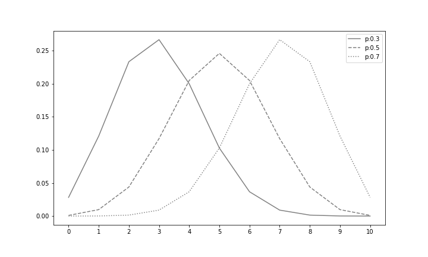

# Chapter 06. 대표적인 이산형 확률분포

```python
import numpy as np
import matplotlib.pyplot as plt
from scipy import stats

%precision 3
%matplotlib inline
```


이 장에서는 이산형  확률분포의 성질을 확인하기 쉽도록 몇 가지 함수를 미리 준비해둡니다. E(X)와 V(X)는 5.1절에서 정의한 기댓값과 분산에 대한 함수입니다. check_prob는 확률변수를 인수로 가지며, 그 확률변수가 확률의 성질을 만족하는지 확인하고, 기댓값과 분산을 계산하여 반환하는 함수입니다. plot_prob는 확률변수를 인수로 가지고, 그 확률변수의 확률함수와 기댓값을 그리기 위한 함수입니다.

```python
# 그래프레어 선의 종류
linestyles = ['-', '--', ':']

def E(X, g = lambda x : x):
    x_set, f = X
    return np.sum([g(x_k) * f(x_k) for x_k in x_set])

def V(X, g = lambda x : x):
    x_set, f = X
    mean = E(X, g)
    return np.sum([(g(x_k) - mean)**2 * f(x_k) for x_k in x_set])

def check_prob(X):
    x_set, f = X
    prob = np.array([f(x_k) for x_k in x_set])
    assert np.all(prob >= 0), 'minus probability'
    prob_sum = np.round(np.sum(prob), 6)
    assert prob_sum == 1, f'sum of probability{prob_sum}'
    print(f'expected value {E(X):.4}')
    print(f'variance {V(X):.4}')
    
def plot_prob(X):
    x_set, f = X
    prob = np.array([f(x_k) for x_k in x_set])
    
    fig = plt.figure(figsize = (10, 6))
    ax = fig.add_subplot(111)
    ax.bar(x_set, prob, label = 'prob')
    ax.vlines(E(X), 0, 1, label = 'mean')
    ax.set_xticks(np.append(x_set, E(X)))
    ax.set_ylim(0, prob.max()*1.2)
    ax.legend()
    
    plt.show()
```


## 01. 베르누이 분포

**베르누이 분포**(Bernoulli distribution)는 가장 기본적인 이산형 확률분포로, 확률변수가 취할 수 있는 값이 0과 1밖에 없는 분포입니다. 베르누이 분포를 따르는 확률변수의 시행을 베르누이 시행이라 합니다. 그리고 베르누이 시행을 하여 1이 나오면 성공, 0이 나오면 실패라고 합니다. 

확률변수가 취할 수 있는 값이 두 가지밖에 없고 확률의 합이 1이라는 성질 때문에, 어느 한쪽의 확률이 정해지면 다른 한쪽도 자동적으로 정해집니다. 이 때문에 베르누이 분포에서는 1이 나오는 확률을 p, 0이 나오는 확률을 1-p로 합니다. 이 p가 베르누이 분포의 형태를 조정할 수 있는 유일한 파라미터로, 확률의 성질을 만족하려면 0  ≤ p ≤ 1 d이라는 조건을 만족해야만 합니다. 이 책에서는 파라미터가 p인 베르누이 분포를 Bern(p)라고 표기합니다.


Bern(p)의 확률함수는 다음과 같습니다.

**베르누이 분포의 확률함수**


얼핏 복잡해 보이지만, 이 함수에 1을 대입하면 p가 반환되고, 0을 대입하면 1-p가 반환된다는 것을 알 수 있습니다. 

확률변수가 취할 수 있는 값이 두 가지 밖에 없는 것은 모두 베르누이 분포로 보면 됩니다. 구체적인 예로 다음을 들 수 있습니다.


- 동전을 던져 앞면이 나올 확률

앞면과 뒷면이 나오는 확률이 같은 일반적인 동전을 던져, 앞면이 나오면 1, 뒷면이 나오면 0으로 하는 확률변수 X는 Bern(1/2)을 따릅니다. 그러므로 동전을 던져 앞면이 나오는 확률은 


로 구할 수 있습니다.


- 주사위를 한 번 굴려 6이 나오지 않을 확률

모든 눈이 나오는 확률이 같은 일반적인 주사위를 굴려, 6이 나오면 1, 그 외의 숫자가 나오면 0으로 하는 확률변수 X는 Bern(1/6)을 따릅니다. 그러므로 주사위를 굴려 6이 나오지 않을 확률은


로 구할 수 있습니다.


베르누이 분포의 기댓값과 분산은 다음과 같습니다. 이는 베르누이 분포의 확률함수를 5.1절에서 정의한 기댓값과 분산의 식에 대입하면 구할 수 있습니다.

**베르누이 분포의 기댓값과 분산**

X~Bern(p)라고 할 때


그렇다면 베르누이 분포를 NumPy로 구현해봅시다. 파라미터를 정하면 확률분포가 확정되므로 파라미터 p를 인수로 취하고 x_set과 f를 반환하는 함수로 구현합니다.

```python
def Bern(p):
    x_set = np.array([0, 1])
    def f(x):
        if x in x_set:
            return p ** x * (1-p) ** (1-x)
        else:
            return 0
    return x_set, f
```

Bern(0.3)을 따르는 확률변수 X를 작성해보겠습니다.

```python
p = 0.3
X = Bern(p)
```

기댓값과 분산을 계산해봅시다. 기댓값은 0.3, 분산은 0.3 × 0.7 = 0.21이 될 것입니다.

```python
check_prob(X)
```

```python
expected value 0.3
variance 0.21
```

확률변수 X를 그려봅시다. 중앙의 세로선이 확률변수 X의 기대값을 나타내고 있습니다.

```python
plot_prob(X)
```


다음으로, scipy.stats를 사용하여 구현해봅시다. scopy.stats에는 베르누이 분포를 따르는 확률변수를 생성할 수 있는 bernoulli 함수가 있습니다. bernoulli 함수는 인수로 파라미터 p를 취하고, Bern(p)를 따르는 rc_frozen object를 반환합니다. rv_frozen object는 scipy.stats의 확률변수에 해당하므로, 이제부터 살펴보려는 다양한 메서드를 가지고 있습니다.

```python
rv = stats.bernoulli(p)
```

rv(Random Vriable, 확률변수)의 pmf 메서드는 확률함수를 계산할 수 있습니다. 0과 1을 각각 넘겨주면 그 값을 취하는 확률이 반환됩니다.

```python
rv.pmf(0), rv.pmf(1)
```

```python
(0.7, 0.3)
```

pmf 메서는 인수로 리스트를 넘길 수 있습니다. 이 경우, 리스트의 각 요소에 대한 확률이 저장된 NumPy의 array가 반환됩니다.

```python
rv.pmf([0, 1])
```

```python
array([0.7, 0.3])
```

cdf 메서드를 사용하면 누적밀도함수를 계산할 수 있습니다. 이 메서드도 인수로 리스트를 넘겨 줄 수 있습니다.

```python
rv.cdf([0, 1])
```

```python
array([0.7, 1. ])
```

mean 메서드나 var 메서드를 호출하여 기댓값이나 분산을 계산할 수 있습니다.

```python
rv.mean(), rv.var()
```

```python
(0.3, 0.21)
```

여기까지가 scipy.stats의 확률변수를 사용하는 기본적인 방법입니다.

마지막으로 베르누이 분포를 정리하면 [표6-1]과 같습니다.

|    파라미터     |        p         |
| :-------------: | :--------------: |
| 취할 수 있는 값 |      {0,1}       |
|    확률함수     | p^x^(1-p)^(1-x)^ |
|     기댓값      |        p         |
|      분산       |      p(1-p)      |
|   scipy.stats   |   bernoulli(p)   |


## 02. 이항분포

**이항분포**(binomial distribution)는 성공확률이 p인 베르누이 시행을 n번 했을 때의 성공 횟수가 따르는 분포입니다. 성공하는 횟수는 0번부터 n번까지이므로, 확률변수가 취할 수 있는 값은 {0, 1, ..., n}입니다.

이항분포의 파라미터에는 성공 확률인 p와 시행 횟수인 n의 두 가지가 있고, p는 0  ≤ p ≤ 1이며 n은 1 이상인 정수여야 합니다. 이 책에서는 파라미터가 n, p인 이항분포를 Bin(n, p)로 표기합니다.

Bin(n, p)의 확률함수는 다음과 같습니다. 여기서 기호 ~n~C~x~는 콤비네이션이라고 부르며, n개라는 서로 다른 것들 중에서 x개를 고를 수 있는 조합의 수를 나타내고,  ~n~C~x~= n!/x!(n-x)!로 정의됩니다.

**이항분포의 확률함수**


이항분포의 구체적인 예로는 다음을 들 수 있습니다.

- 동전을 10번 던져 앞면이 나올 확률

이는 p=1/2인 베르누이 시행을 10번 했을 때의 성공 횟수로 볼 수 있기 때문에 Bin(10, 1/2)을 따릅니다. 그러므로 동전을 10번 던져 앞면이 3번 나오는 확률은


로 구할 수 있습니다.

- 주사위를 4번 굴려 6이 나올 확률

이것은 p=1/6인 베르누이 시행을 4번 했을 때의 성공 횟수로 볼 수 있기 때문에 Bin(4, 1/6)을 따릅니다. 그러므로 주사위를 4번 던져 6이 한 번도 나오지 않는 확률은


로 구할 수 있습니다.

이항분포의 기댓값과 분산은 다음과 같습니다.

**이항분포의 기댓값과 분산**

X~Bin(n, p)라고 할 때


이항분포를 NumPy로 구현해봅시다. 조합 ~n~C~x~를 계산할때는 scipy.special에 있는 comb 함수를 사용합니다.

```python
from scipy.special import comb

def Bin(n, p):
    x_set = np.arange(n+1)
    def f(x):
        if x in x_set:
            return comb(n, x) * p**x * (1-p)**(n-x)
        else:
            return 0
    return x_set, f
```

Bin(10, 0.3)을 따르는 확률변수 X를 작성해봅시다.

```python
n = 10
p = 0.3
X = Bin(n, p)
```

기댓값은 10×0.3=3, 분산은 10×0.3×0.7=2.1이 됩니다.

```python
check_prob(X)
```

 ```python
expected value 3.0
variance 2.1
 ```

그래프를 그려봅시다. 이항분포는 기댓값이 정상이 되는 산 모양의 분포를 이룹니다.

```python
plot_prob(X)
```


scipy.stats에서 이항분포의확률변수는 binom 함수로 생성할 수 있습니다. n을 10으로 고정하고, p를 0.3, 0.5, 0.7로 변화시켜 이항분포가 어떠한 형태가 되는지 살펴봅시다. 홈페이지에서 제공하는 소스코드 중 animation 폴더 안의 파일을 실행하면 이항분포의 파라미터를 인터랙티브하게 변화시킬 수 있습니다.

```python
fig = plt.figure(figsize = (10, 6))
ax = fig.add_subplot(111)

x_set = np.arange(n+1)
for p, ls in zip([0.3, 0.5, 0.7], linestyles):
    rv = stats.binom(n, p)
    ax.plot(x_set, rv.pmf(x_set),
           label = f'p:{p}', ls = ls, color = 'gray')
ax.set_xticks(x_set)
ax.legend()

plt.show()
```

 

p가 커질수록, 정상이 되는 값이 커집니다. 또한 p=0.5일 때 좌우대칭 형태로 분포하고, p=0.3과 p=0.7이 대칭 관계에 있다는 것을 알 수 있습니다.

이항분포를 정리한 결과는 [표6-2]와 같습니다.

|    파라미터     |          n, p           |
| :-------------: | :---------------------: |
| 취할 수 있는 값 |      {0,1,..., n}       |
|    확률함수     | ~n~C~x~p^x^(1-p)^(1-x)^ |
|     기댓값      |           np            |
|      분산       |         np(1-p)         |
|   scipy.stats   |       binom(n, p)       |


## 03. 기하분포

**기하분포**(geometric distribution)는 베르누이 시행에서 처음 성공할 때까지 반복한 시행 횟수가 따르는 분포입니다. 기하분포는 첫 번재 성공하는 경우가 있으면 연달아 실패할 수도 있기 때문에, 확률변수가 취할수 있는 값은 1이상인 정수 전체 {1, 2, ...}가 됩니다. 베르누이 시행의 성공 확률 파라미터이기 때문에 p는 0  ≤ p ≤ 1을 만족해야 합니다. 이 책에서는 파라미터 p의 기하분포를 Ge(p)로 표기합니다. 기하분포의 확률함수는 다음과 같습니다.

**기하분포의 확률함수**


기하분포의 구체적인 예로는 다음을 들 수 있습니다.

- 앞면이 나올 때까지 동전을 던지는 횟수

이것은 p=1/2인 베르누이 시행이 처음 성공할 때까지 시행한 횟수가 되기 때문에 Ge(1/2)을 따릅니다. 그러므로 동전을 다섯 번째 던져 처음으로 앞면이 나오는 확률은


이라고 구할 수 있습니다.

- 6이 나올 때까지 주사위를 굴린 횟수

이것은 p=1/6인 베르누이 시행이 처음 성공할 때까지 시행한 횟수가 되기 때문에 Ge(1/6)을 따릅니다. 그러므로 주사위를 세 번째 굴려 처음으로 6이 나오는 확률은 


라고 구할 수 있습니다.

기하분포의 기댓값과 분산은 다음과 같습니다.

**기하분포의 기댓값과 분산**

X~Ge(p)라고 할 때


기하분포를 NumPy로 구현해봅시다. 기하분포가 취하는 값은 1 이상의 정수 전부이지만, 구현의 편의상 x_set을 1이상 29 이하인 정수로 합니다.

```python
def Ge(p):
    x_set = np.arange(1, 30)
    def f(x):
        if x in x_set:
            return p * (1-p) ** (x-1)
        else:
            return 0
    return x_set, f
```

여기서 확률변수 X는 Ge(1/2)을 따르는 것으로 합니다.

```python
p = 0.5
X = Ge(p)
```

기댓값은 1/(1/2)=2, 분산은 (1-(1/2))/(1/2)^2^=2가 됩니다.

```python
check_prob(X)
```

```python
expected value 2.0
variance 2.0
```

그래프를 그려봅시다. 확률변수의 값이 커질수록 확률은 지수적으로 감소합니다. 11 이상인 값을 취하는 확률은 거의 0이 되므로 그래프에서는 확인할 수 없습니다.

```python
plot_prob(X)
```

 


scipy.stats에서 기하분포는 geom 함수로 생성할 수 있습니다. 파라미터 p가 0.2, 0.5, 0.8일 때의 기하분포를 그려봅시다. 여기서는 x_set을 1이상 14이하인 정수로 하고 있습니다.

```python
fig = plt.figure(figsize = (10, 6))
ax = fig.add_subplot(111)

x_set = np.arange(1, 15)
for p, ls in zip([0.2, 0.5, 0.8], linestyles):
    rv = stats.geom(p)
    ax.plot(x_set, rv.pmf(x_set),
           label = f'p:{p}', ls = ls, color = 'gray')
ax.set_xticks(x_set)
ax.legend()

plt.show()
```


파라미터 p가 무엇이든지 간에, 값이 커질수록 확률이 지수적으로 감소하는 분포가 되는 것을 확인할 수 있습니다. 

기하분포를 정리한 결과는 [표 6-3]과 같습니다.

|    파라미터     |       p       |
| :-------------: | :-----------: |
| 취할 수 있는 값 | {1, 2, 3...}  |
|    확률함수     | (1-p)^(x-1)^p |
|     기댓값      |      1/p      |
|      분산       |  (1-p)/p^2^   |
|   scipy.stats   |    geom(p)    |


## 04.포아송 분포

**포아송 분포**(Poisson distribution)는 임의의 사건이 단위 시간당 발생하는 건수가 따르는 확률분포입니다. 발생하는 건수의 확률분포이므로, 확률변수가 취할 수 있는 값은 {0, 1, 2, ...}가 됩니다. 포아송 분포의 파라미터는 λ로 나타내고, λ는 양의 실수입니다. 이 책에서는 파라미터 λ인 포아송 분포를 Poi(λ)라고 표기합니다.

Poi(λ)의 확률함수는 다음 식과 같습니다.

**포아송 분포의 확률함수**


Poi(λ)는 단위 시간당 평균 λ번 발생하는 임의의 사건이 단위 시간에 발생하는 건수가 따르는 분포로, 구체적인 예로 다음을 들 수 있습니다.

- 하루에 평균 2건의 교통사고가 발생하는 지역에서, 하루 교통사고 발생 건수

교통사고를 완전한 임의의 사건으로 간주하면, 단위 시간(하루)당 발생하는 교통사고의 발생건수는 Poi(2)를 따릅니다. 그러므로 이 지역에서 하루에 교통사고가 한 건도 일어나지 않을 확률은 


라고 구할 수 있습니다.

- 한 시간에 평균 10번 엑세스하는 사이트에 대한 한 시간당 엑세스 건수

어떤 사이트에 대한 엑세스를 완전한 임의의 사건으로 간주하면, 단위 시간(한 시간)당 사이트에 대한 엑세스 건수는 Poi(10)을 따릅니다. 그러므로 이 사이트에서 한 시간에 정확하게 엑세스가 15건 발생하는 확률은


라고 구할 수 있습니다.

포아송 분포의 기댓값과 분산은 모두 λ가 됩니다. 기댓값과 분산이 같은 것은 포아송 분포의 특징 중 하나입니다.

**포아송 분포의 기댓값과 분산**

X~Poi(λ)라고 할 때


포아송 분포를 NumPy로 구현해봅시다. 팩토리얼 x!은 scipy.special의 factorial을 사용합니다. 취할 수 있는 값은 0이상인 정수 전부이지만, 구현의 편의상 x_set을 0이상 19이하인 정수로 합니다.

```python
from scipy.special import factorial

def Poi(lam):
    x_set = np.arange(20)
    def f(x):
        if x in x_set:
            return np.power(lam, x) / factorial(x) * np.exp(-lam)
        else:
            return 0
    return x_set, f
```

여기서 확률변수 X는 Poi(3)을 따르는 것으로 합시다.

```python
lam = 3
X = Poi(lam)
```

기댓값과 분산은 모두 3이 됩니다.

```python
check_prob(X)
```

```python
expected value 3.0
variance 3.0
```

그래프를 그려봅시다. 포아송 분포도 이항분포와 마찬가지로 기댓값이 정상이 되는 산의 형태를 이룹니다.

```python
plot_prob(X)
```


scipy.stats에서 포아송 분포는 poisson 함수로 생성할 수 있습니다. 파라미터 λ를 3, 5, 8로 변화시킬 때, 포아송 분포의 형태가 어떻게 될지 그려봅시다.

```python
fig = plt.figure(figsize = (10, 6))
ax = fig.add_subplot(111)

x_set = np.arange(20)
for lam, ls in zip([3, 5, 8], linestyles):
    rv = stats.poisson(lam)
    ax.plot(x_set, rv.pmf(x_set),
           label = f'lam: {lam}', ls = ls, color = 'gray')
ax.set_xticks(x_set)
ax.legend()

plt.show()
```


어떠한 파라미터라도 분포의 정상에는 λ가 있고, λ가 커질수록 경사면이 더욱 완만해지는 것을 확인할 수 있습니다. 

포아송 분포를 정리한 결과는 [표 6-4]와 같습니다.

|    파라미터     |        λ        |
| :-------------: | :-------------: |
| 취할 수 있는 값 | {0, 1, 2, ...}  |
|    확률함수     | λ^x^/x! · e^-λ^ |
|     기댓값      |        λ        |
|      분산       |        λ        |
|   scipy.stats   |   poisson(λ)    |

