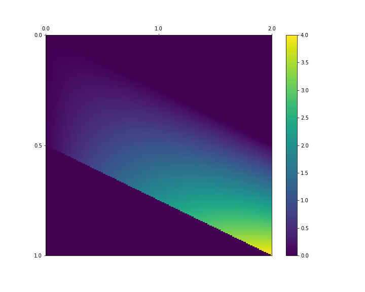

# Chapter 07. 연속형 확률변수

7장과 8장에서는 연속형 확률변수에 관해 다룹니다. 각 장의 구성은 이산형 확률변수를 다룰 때와 같습니다. 7장에서 연속형 확률변수의 정의와 지표를, 8장에서 대표적인 연속형 확률분포를 설명합니다.

이산형 확률변수와 연속형 확률변수의 주된 차이는 확률변수가 취할 수 있는 값이 이산적인가 연속적인가 이 한 가지 뿐이지만, 연속형 확률변수의 경우 계산 과정에 적분이 포함되는 등 이산형에 비해 식이 조금 까다롭습니다. 이 때문에 이 장에서는 이산형과 비교하면서 이해할 수 있도록 5장과 거의 동일한 방법으로 이야기를 전개하여 수식을 정의합니다. 5장과 비교하며 읽음으로써, 이산형과 연속형 사이에 본질적인 차이가 없다는 것을 알게 되고 복잡해 보이는 수식도 이해하기 쉬워 질 것입니다.

이번에도 NumPy와 Matplotlib을 임포트해둡니다.

```python
import numpy as np
import matplotlib.pyplot as plt

%precision 3
%matplotlib inline
```

적분은 SciPy의 integral 모듈을 사용하여 구현합니다. 이 모듈을 사용하면 integral 계산 결과에 문제가 없다는 warning이 출력됩니다.  이 장에서는 warning이 나오지 않도록 미리 막아둡니다.

```python
from scipy import integrate
import warnings

# 적분에 관한 warning을 출력하지 않도록 한다
warnings.filterwarnings('ignore', category = integrate.IntegrationWarning)
```


## 01. 1차원 연속형 확률변수

연속형 확률변수는 확률변수가 취할 수 있는 값이 연속적인 확률변수입니다. 이 절에서는 그 중에서도 1차원 연속형 확률변수에 관해 설명합니다.

구체적인 예로 룰렛을 떠올려 봅시다. 원형인 룰렛의 둘레 길이는 1이고, 룰렛의 출발점부터 룰렛을 돌려 멈춘 위치까지 측정한 호의 길이를 실현값으로 합니다. 즉, 이 룰렛이 취할 수 있는 값은 0부터 1사이의 실수입니다. 그리고 이 룰렛은 5장에서 예를 든 주사위와 마찬가지로, 큰 수일수록 나오기 쉬워지는 불공정한 구조로 되어 있습니다.

그런데 이 룰렛이 0.5라는 값을 취할 확률은 얼마일까요? 큰 수일수록 나오기 쉽다고 해서 어렵게 생각할 필요는 없습니다. 왜냐하면 룰렛이 정확하게 0.5000000....을 취할 가능성은 없으므로 그 확률은 0이 되기 때문입니다. 이와 같이 연속형 확률변수에서 확률변수가 어떤 값을 취할 때의 확률을 정의하려고 하면 어떤 경우에도 확률이 0이 되어 정의가 잘 되지 않습니다. 이 때문에 연속형 확률변수에서는 확률변수가 어느 구간에 들어가는 확률을 정의합니다. 룰렛을 예로 들면 룰렛이 0.4부터 0.6 사이의 값이 나올 확률이 0.2라는 식으로 정의됩니다.


### 1.1 1차원 연속형 확률변수의 정의


#### 확률밀도함수

이산형 확률변수는 확률변수가 취할 수 있는 값의 (이산적인) 집합과 확률함수에 의해 정의되었습니다. 연속형 확률변수도 본질적으로는 같습니다. 다만 수식 표현이 조금 다르고, 확률변수가 취할 수 있는 값은 구간 [a, b]로 정의되며, 확률은 **확률밀도함수**(probability density function, PDF)또는 간단히 **밀도함수**라고 부르는 f(x)에 의해 정의됩니다.

밀도함수는 확률함수에 가깝지만


는 '**되지않는다**'는 점에 주의하기 바랍니다. 앞에 설명했듯이, 연속형 확률변수는 어떤 값을 취하는 확률로는 잘 정의되지 않습니다.

밀도함수에 의한 확률은 확률변수 X가 x~0~ ≤ X ≤ x~1~의 구간에 들어간 확률 P(x~0~ ≤ X ≤ x~1~)로 정의되고. 다음과 같이 적분으로 계산합니다.


이 적분은 밀도함수 f(x)와 x축, 그리고 두 직선 x=x~0~, x=x~1~으로 둘러싸인 영역의 면적으로 해석할 수 있습니다. 결국 다음 그림에서 칠해진 영역의 면적이 확률 P(x~0~ ≤ X ≤ x~1~) 입니다.


독자 중에는 적분에 거부감이 있는 분도 있겠지만, 이 책에서 번거로운 계산은 SciPy가 모두 수행해줍니다. 그러므로 이 책에서는 적분을 계산하는 방법을 몰라도 괜찮습니다. 밀도함수 등으로 둘러싸인 영역의 면적이 확률이 된다는 연속형 확률변수의 개념을 파악하는 것으로 충분합니다. 

그러면 불공정한 룰렛을 예로 들어 파이썬으로 구현해봅시다. 우선 취할 수 있는 값의 구간에 대해 하한과 상한을 x_range로 정의합니다.

```python
x_range = np.array([0, 1])
```


다음으로 x_range를 정의역으로 하는 밀도함수를 구현합니다. 불공정한 룰렛은 큰 값일수록 나오기 쉽기 때문에, 다음과 같은 밀도함수로 합니다. 2를 곱하는 것은 확률의 성질을 만족하기 위한 것으로, 이것은 뒤에서 확인하겠습니다.


```python
def f(x):
    if x_range[0] <=x <=x_range[1]:
        return 2 * x
    else:
        return 0
```


이 x_range와 f의 세트가 확률분포입니다. 이 확률분포에 의해 확률변수 X의 움직임이 결정됩니다. 따라서 X는 x_range와 f 를 요소로 하는 리스트로 구현합니다.

```python
X = [x_range, f]
```


이것으로 확률변수 X가 정의되었습니다. 이어서 밀도함수 f(x)를 그려봅시다. 여기서는 확률의 이미지를 떠올리기 쉽도록 f(x)와 x축, 그리고 두 직선 x=0.4, x=0.6에 둘러싸인 영역에 색을 적용하였습니다. 조금 전에 설명했듯이, 이 영역의 면적이 불공정한 룰렛이 0.4부터 0.6 사이의 값을 취할 확률입니다.

```python
xs = np.linspace(x_range[0], x_range[1], 100)

fig = plt.figure(figsize = (10, 6))
ax = fig.add_subplot(111)

ax.plot(xs, [f(x) for x in xs], label = 'f(x)', color = 'gray')
ax.hlines(0, -0.2, 1.2, alpha = 0.3)
ax.vlines(0, -0.2, 2.2, alpha = 0.3)
ax.vlines(xs.max(), 0, 2.2, linestyle = ':', color = 'gray')

# 0.4부터 0.6까지 x좌표를 준비
xs = np.linspace(0.4, 0.6, 100)
# xs의 범위로 f(x)와 x축으로 둘러싸인 영역에 색을 적용
ax.fill_between(xs, [f(x) for x in xs], label = 'prob')

ax.set_xticks(np.arange(-0.2, 1.3, 0.1))
ax.set_xlim(-0.1, 1.1)
ax.set_ylim(-0.2, 2.1)
ax.legend()

plt.show()
```


둘러싸인 영역의 면적은 사다리꼴 면적 공식을 사용하여 구할 수 도 있지만, 여기에서는 적분으로 구해봅시다. 확률의 정의에 대한 식에 값을 각각 대입하면 다음과 같습니다.


이 적분은 integrate의 quad 함수를 사용하여, 다음과 같이 구할 수 있습니다. quad 함수는 적분값과 추정오차를 반환합니다.

```python
# 첫 번째 인수는 피적분함수, 두 번째 인수와 세 번째 인수는 적분 범위
integrate.quad(f, 0.4, 0.6)
```

```python
(0.200, 0.000)
```


첫 번째 반환값이 적분값이므로, 확률이 0.2임을 알 수 있습니다.

**확률의 성질**

연속형 확률변수에서는 확률의 성질로 다음 두 식을 만족해야 합니다.


첫 번째 f(x)가 항상 0이상의 값을 취하는 성질은 위에 적분 그림을보면 명확히 알 수 있습니다. 파이썬으로 확인할 때는 scipy.optimize의 minimize_scalar를 사용합니다. minimize_scalar는 함수의 최솟값을 구하는 함수로, 이 함수를 사용해서 f(x)의 최솟값이 0이상으로 나오면 f(x)가 항상 0 이상의 값을 취한다는 의미입니다.

```python
from scipy.optimize import minimize_scalar

res = minimize_scalar(f)
# 함수의 최솟값은 fun이라는 인스턴스 변수에
res.fun
```

```python
0
```


f(x)의 최솟값이 0이므로, 첫 번째 성질을 만족하고 있음을 확인했습니다.


두 번째 f(x)를 -∞부터 ∞까지 적분한 결과가 1이라는 것은 위에 적분한 삼각형의 면적이 1이 되는 것과 같습니다. 이 삼각형은 밑변의 길이가 1, 높이가 2이므로 면적이 1이라는 것을 간단히 알 수 있습니다.

적분 계산으로도 확인해봅시다. Numpy에서는 무한대를 np.inf로 나타낼 수 있습니다.

```python
integrate.quad(f, -np.inf, np.inf)[0]
```

 ```python
1.000
 ```


#### 누적분포함수

확률변수 X가 x 이하가 될 때의 확률을 반환하는 함수를 F(x)로 표기하고, 이산형 확률분포의 경우와 마찬가지로 **누적분포함수**(cumulative distribution function, CDF)또는 간단히 **분포함수**라고 부릅니다. 분포함수는 다음과 같이 정의합니다.


분포함수를 정의한 대로 구현해봅시다.

```python
def F(x):
    return integrate.quad(f, -np.inf, x)[0]
```


분포함수로도 확률을 구할 수 있습니다. 예를 들면, 룰렛이 0.4부터 0.6 사이의 값을 취할 확률은 다음과 같이 계산할 수 있습니다.


```python
F(0.6) - F(0.4)
```

```python
0.200
```


분포함수 F(x)를 그려봅시다. 이때 분포함수는 반드시 단조증가함수(x가 증가할 때, y는 감소하지 않는 함수)입니다.

```python
xs = np.linspace(x_range[0], x_range[1], 100)

fig = plt.figure(figsize = (10, 6))
ax = fig.add_subplot(111)

ax.plot(xs, [F(x) for x in xs], label = 'F(x)', color = 'gray')
ax.hlines(0, -0.1, 1.1, alpha = 0.3)
ax.vlines(0, -0.1, 1.1, alpha = 0.3)
ax.vlines(xs.max(), 0, 1, linestyle = ':', color = 'gray')

ax.set_xticks(np.arange(-0.1, 1.2, 0.1))
ax.set_xlim(-0.1, 1.1)
ax.set_ylim(-0.1, 1.1)
ax.legend()

plt.show()
```


#### 확률변수의 변환

이제 확률변수의 변환을 생각해봅시다. 5장과 마찬가지로, 룰렛의 예에서도 나오는 값에 2를 곱하고 3을 더한 2X + 3을 사용합니다. 이것을 Y라고 하면, Y도 연속형 확률변수가 됩니다. Y의 밀도함수를 g(y)라고 하면 다음과 같습니다.


분포함수는 G(y)라고 합시다.


```python
y_range = [3, 5]

def g(y):
    if y_range[0] <= y <= y_range[1]:
        return (y - 3) /2
    else:
        return 0
def G(y):
    return integrate.quad(g, -np.inf, y)[0]
```


밀도함수 g(y)와 분포함수 G(y)를 동시에 그려보겠습니다.

```python
ys = np.linspace(y_range[0], y_range[1], 100)

fig = plt.figure(figsize = (10, 6))
ax = fig.add_subplot(111)

ax.plot(ys, [g(y) for y in ys], label = 'g(y)', color = 'gray')
ax.plot(ys, [G(y) for y in ys], label = 'G(y)', ls = '--', color = 'gray')
ax.hlines(0, 2.8, 5.2, alpha = 0.3)
ax.vlines(ys.max(), 0, 1, linestyles = ':', color = 'gray')

ax.set_xticks(np.arange(2.8, 5.2, 0.2))
ax.set_xlim(2.8, 5.2)
ax.set_ylim(-0.1, 1.1)
ax.legend()

plt.show()
```


정의역은 다르지만, 확률변수 X의 밀도함수와 분포함수가 유사한 형태가 되었습니다.


### 1.2 1차원 연속형 확률변수의 지표

여기서는 연속형 확률분포의 평균과 분산이라는 지표를 살펴봅니다. 5장과 비교해보면 금세 알겠지만, 기본적으로 ∑가 ∫로 치환되었을 뿐입니다.

#### 기댓값

연속형 확률변수 X의 평균은 다음 식으로 정의됩니다. 이것을 확률변수 X의 기댓값이라고도 부릅니다.


불공정한 룰렛의 기댓값을 구해봅시다.

```python
def integrand(x):
    return x * f(x)

integrate.quad(integrand, -np.inf, np.inf)[0]
```

```python
0.667
```


변환한 확률변수의 기댓값도 생각할 수 있습니다. 예를 들면, 확률변수 X를 2X+3으로 변환한 확률변수 Y의 기댓값은 다음 식으로 정의됩니다.


더 일반화하면, 확률변수 X의 변환 g(X)의 기댓값을 정의할 수 있습니다.

**연속형 확률변수의 기댓값**


이 수식을 기댓값의 함수로 구현해봅시다. 인수 g가 확률변수에 대한 변환의 함수입니다.

```python
def E(X, g = lambda x: x):
    x_range, f = X
    def integrand(x):
        return g(x) * f(x)
    return integrate.quad(integrand, -np.inf, np.inf)[0]
```


g에 아무것도 지정하지 않으면 X의 기댓값이 구해집니다.

```python
E(X)
```

```python
0.667
```


확률변수 Y=2X+3의 기댓값은 다음과 같이 계산할 수 있습니다.

```python
E(X, g = lambda x: 2*x+3)
```

```python
4.333
```


5.1절에서 설명한 것처럼 연속형 확률변수에서도 기댓값의 선형성이 성립합니다. E(2X+3)과 2E(X)+3이 동일하다는 것을 확인해봅시다.

```python
2 * E(X) + 3
```

```python
4.333
```


#### 분산

연속형 확률변수 X의 분산은 다음 식으로 정의됩니다. 여기에서 μ는 확률변수 X의 기댓값 E(X)입니다.


불공정한 룰렛의 분산을 구해봅시다.

```python
mean = E(X)
def integrand(x):
    return (x - mean) **2 * f(x)

integrate.quad(integrand, -np.inf, np.inf)[0]
```

```python
0.056
```


변환한 확률변수에 대해서도 분산을 정의할 수 있습니다. 간단한 예로, 확률변수 X를 2X+3으로 변환한 확률변수 Y를 생각해봅시다. 이때 Y의 분산은 다음 식으로 정의됩니다. 다만, μ=E(2X+3)입니다.


더 일반화하면, 확률변수 X의 변환 g(X)의 분산을 정의할 수 있습니다.

**연속형 확률변수의 분산**


이 수식을 분산의 함수로 구현해봅니다. 인수 g가 확률변수에 대한 변환의 함수입니다.

```python
def V(X, g = lambda x: x):
    x_range, f = X
    mean = E(X, g)
    def integrand(x):
        return (g(x) - mean) ** 2 * f(x)
    return integrate.quad(integrand, -np.inf, np.inf)[0]
```


g를 지정하지 않으면, 확률변수  X의 분산을 계산합니다.

```python
V(X)
```

```python
0.056
```


확률변수 Y=2X+3의 분산은 다음과 같이 계산할 수 있습니다.

```python
V(X, lambda x: 2*x+3)
```

```python
0.222
```


연속형 확률변수에서도 5.1절에서 설명한 분산의 공식이 성립합니다. V(2X+3)과 2^2^V(X)가 동일하다는 것을 확인해봅시다.

```python
2**2 * V(X)
```

```python
0.222
```


## 02. 2차원 연속형 확률변수

이 절에서는 2차원 연속형 확률변수를 설명합니다. 구체적인 예로, 2개의 불공정한 룰렛을 사용합니다.


### 2.1 2차원 확률변수의 정의


#### 결합확률밀도함수

2차원 연속형 확률변수 (X, Y)는 확률변수가 취할 수 있는 값의 조합


와 이것을 정의역으로 하는 함수


에 의해 정의됩니다.

이 함수 f(x, y)를 **결합확률밀도함수**라 하고, x~0~ ≤ X ≤ x~1~, y~0~ ≤ Y ≤ y~1~이 되는 확률은 다음과 같이 정의합니다.


2차원 확률변수의 구체적인 예로, 5.2절에서 사용한 예의 룰렛 버전을 상상해봅시다. 즉 불공정한 룰렛 A, B 두 가지를 돌려, A의 값과 B의 값을 더한 것을 확률변수 X, A의 값을 확률변수 Y로 한 2차원 확률변수 (X, Y)가 있습니다.

이 확률변수 (X, Y)가 취할 수 있는 값은


이고, 결합확률밀도함수는 다음과 같습니다.


#### 확률의 성질

2차원 연속형 확률변수는 확률의 성질로서 다음의 두 가지를 만족해야 합니다.


지금까지 살펴본 내용을 파이썬으로 구현해봅시다. 우선 X와 Y가 취할 수 있는 값을 각각 x_range와 y_range로 정의합니다.

```python
x_range = [0, 2]
y_range = [0, 1]
```


다음으로 결합확률밀도 함수를 정의합니다.

```python
def f_xy(x, y):
    if 0 <= y <= 1 and 0 <= x-y <= 1:
        return 4 * y * (x-y)
    else:
        return 0
```


확률변수 (X, Y)의 움직임은 x_range와 y_range와 f_xy에 의해 정의되므로, 이것들을 리스트로 XY라고 합시다.

```python
XY = [x_range, y_range, f_xy]
```


이것으로 2차원 확률변수 (X, Y)를 구현했습니다. 결합확률밀도함수를 히트맵으로 그려보겠습니다.

```python
xs = np.linspace(x_range[0], x_range[1], 200)
ys = np.linspace(y_range[0], y_range[1], 200)
pd = np.array([[f_xy(x, y) for y in ys] for x in xs])

fig = plt.figure(figsize = (10, 8))
ax = fig.add_subplot(111)

c = ax.pcolor(pd)
ax.set_xticks(np.linspace(0, 200, 3), minor = False)
ax.set_yticks(np.linspace(0, 200, 3), minor = False)
ax.set_xticklabels(np.linspace(0, 2, 3))
ax.set_yticklabels(np.linspace(0, 1, 3))
ax.invert_yaxis()
ax.xaxis.tick_top()
fig.colorbar(c, ax = ax)

plt.show()
```



확률의 성질은 만족되었나요? f~xy~ ≥ 0을 만족하고 있다는 것은 함수의 정의와 히트맵을 통해 확인했습니다. 이는 파이썬으로 확인하려면 조금 복잡해지므로 생략합니다.

다음으로, 적분 결과가 1이 되는지 확인합니다. 이 적분은 7.1절의 경우와 다릅니다. 함수를 x와 y의 두 변수로 적분해야 하기 때문에 integrate.quad는 사용할 수 없습니다. 이와 같은 다중적분에는 integrate.nquad를 사용합니다.

```python
# 첫 번째 인수는 피적분 함수, 두 번째 인수는 x의 적분구간과 y의 적분구간
integrate.nquad(f_xy, [[-np.inf, np.inf], [-np.inf, np.inf]])[0]
```

```python
1.326
```


#### 주변확률밀도함수

확률변수 (X, Y)는 결합확률밀도함수에 의해 X와 Y가 동시에 정의되지만, 각각의 확률변수에만 흥미가 있을 수 있습니다. 예를 들면, 확률변수 X만의 움직임, 즉 확률변수 X의 밀도함수를 알고 싶을 때는 어떻게 하면 좋을까요?

이때 확률변수 X의 밀도함수를 f~X~(x)라고 하면,


가 성립합니다. 이와 같이 해서 구한 f~X~(x)를 X의 **주변확률밀도함수**라 하고, 간단히 **주변밀도함수**라고도 합니다. 

파이썬으로 구현해봅시다. X의 주변밀도함수는 결합확률밀도함수를 y로 적분하면 구할 수 있지만, 여기서는 좀 더 연구가 필요합니다. 왜냐하면 integrate에는 2변수함수 중 1변수만 적분하는 함수가 구현되어 있지 않기 때문입니다. 

이럴 때 편리하게 쓸 수 있는 함수가 파이썬의 표준 라이브러리에 있는 functools의 partial 함수입니다. partial은 인수의 일부를 고정한 새로운 함수를 만들 수 있는 함수입니다. partial(f_xy, x)라고 하면, 함수 f_xt의 인수 x, y 중 x가 고정되고, 인수가 y만으로 된 함수가 반환됩니다. 이렇게 해서 얻은 함수는 integrate.quad로 적분할 수 있는 1변수함수가 되기 때문에, 그 뒤에는 y로 적분해서 X의 주변밀도함수를 구할 수 있습니다. Y의 주변밀도함수도 마찬가지로 partial(f_xy, y=y)로 y를 고정하고 x로 적분하면 구할 수 있습니다.

```python
from functools import partial

def f_X(x):
    return integrate.quad(partial(f_xy, x), -np.inf, np.inf)[0]
def f_Y(y):
    return integrate.quad(partial(f_xy, y = y), -np.inf, np.inf)[0]
```


주변밀도함수를 구함으로써, X와 Y를 각각 독립적으로 고려할 수 있습니다.

```python
X = [x_range, f_X]
Y = [y_range, f_Y]
```


각각의 밀도함수를 그려봅시다.

```python
xs = np.linspace(*x_range, 100)
ys = np.linspace(*y_range, 100)

fig = plt.figure(figsize = (12, 4))
ax1 = fig.add_subplot(121)
ax2 = fig.add_subplot(122)
ax1.plot(xs, [f_X(x) for x in xs], color = 'gray')
ax2.plot(ys, [f_Y(y) for y in ys], color = 'gray')
ax1.set_title('X_marginal density function')
ax2.set_title('Y_marginal density function')

plt.show()
```


### 2.2 2차원 연속형 확률변수의 지표

여기서는 기댓값과 분산, 공분산이라는 지표를 정의합니다.

####  기댓값

기댓값을 구하는 방법은 1차원 연속형 확률변수의 경우와 거의 같습니다. X의 기댓값이라면 x와 밀도함수의 곱을 x와 y로 적분하여 구할 수 있습니다.


```python
def integrand(x, y):
    return x * f_xy(x, y)

integrate.nquad(integrand, [[-np.inf, np.inf], [-np.inf, np.inf]])[0]
```

```python
0.863
```


일반적으로 X, Y의 함수 g(X, Y)의 기댓값을 정의할 수 있고, 수식은 다음과 같습니다.


이를 기댓값의 함수로 구현해봅시다.

```python
def E(XY, g):
    x_range, y_range, f_xy = XY
    def integrand(x, y):
        return g(x, y) * f_xy(x, y)
    
    return integrate.nquad(integrand, [[-np.inf, np.inf], [-np.inf, np.inf]])[0]
```


X와 Y의 기댓값은 각각 다음과 같이 구할 수 있습니다.

```python
mean_X = E(XY, lambda x,y: x)
mean_X
```

```python
0.863
```

```python
mean_Y = E(XY, lambda x, y: y)
mean_Y
```

```python
0.000
```


2차원 연속형 확률변수에서도 5.2절에서 설명한 기댓값의 선형성이 성립합니다.

E(2X+3Y)=2E(X)+3E(Y)를 확인해봅시다.

```python
a, b = 2, 3
```

```python
E(XY, lambda x, y: a*x + b*y)
```

```python
4.749
```

```python
a * mean_X + mean_Y
```

```python
1.727
```


#### 분산

분산을 구하는 방법도 1차원의 경우와 거의 같습니다. X의 분산은 다음 식으로 구할 수 있습니다.


```python
def integrand(x, y):
    return (x - mean_X)**2 * f_xy(x, y)

integrate.nquad(integrand, [[-np.inf, np.inf], [-np.inf, np.inf]])[0]
```

```python
0.006
```


일반적으로 X, Y에 대한 함수 g(X, Y)의 분산을 정의할 수 있고, 수식은 다음과 같습니다.


이를 분산의 함수로서 구현해봅시다.

```python
def V(XY, g):
    x_range, y_range, f_xy = XY
    mean = E(XY, g)
    def integrand(x,y):
        return (g(x,y) - mean)**2 * f_xy(x,y)
    
    return integrate.nquad(integrand, [[-np.inf, np.inf], [-np.inf, np.inf]])[0]
```


X와 Y의 분산은 각각 다음과 같이 구할 수 있습니다.

```python
var_X = V(XY, lambda x,y: x)
var_X
```

```python
0.006
```

```python
var_Y = V(XY, lambda x, y: y)
var_Y
```

```python
1.689
```


#### 공분산

공분산을 사용하면 두 확률변수 X, Y 사이에 어느 정도 상관이 있는지 알 수 있습니다.


```python
def Cov(XY):
    x_range, y_range, f_xy = XY
    mean_X = E(XY, lambda x, y: x)
    mean_Y = E(XY, lambda x, y: y)
    def integrand(x, y):
        return (x-mean_X) * (y-mean_Y) * f_xy(x,y)
    
    return integrate.nquad(integrand, [[-np.inf, np.inf], [-np.inf, np.inf]])[0]
```

```python
cov_xy = Cov(XY)
cov_xy
```

```python
-0.000
```


분산과 공분산의 공식도 5.2절에서 설명한 내용이 그대로 성립합니다.

V(2X + 3Y) = 4V(X) + 9V(Y) + 12Cov(X, Y)를 확인해봅시다.

```python
V(XY, lambda x,y: a*x + b*y)
```

```python
0.824
```

```python
a**2 * var_X + b**2 * var_Y + 2*a*b * cov_xy
```

```python
15.223
```


#### 상관계수

상관계수도 이산형 상관계수를 구하는 방법과 같은 방법으로 구합니다.

```python
cov_xy / np.sqrt(var_X * var_Y)
```

```python
-0.0005592310657045
```

