# Chapter 08. 대표적인 연속형 확률분포

이 장에서는 정규분포를 비롯하여 추정이나 검정을 수행할 때 사용하는 분포를 다양하게 살펴봅니다. 복잡한 밀도함수를 생각할 필요는 없지만, 분포의 형태나 성질을 확실히 파악해둡시다.

구현 방법은 6장과 같습니다. Numpy의 SciPy의 stats 모듈 두 가지를 이용합니다. NumPy를 이용하면 확률변수를 취할 수 있는 값과 밀도함수로 정의하는 수식 수준에서 구협됩니다. 7장에서 다른 불공정한 룰렛의 경우와 동일하게 구현되므로, 복잡해 보이는 확률분포도 어렵지 않게 코드로 옮길 수 있습니다. SciPy의 stats 모듈을 이용해 구현하면 통계분석에 필요한 편리한 기능을 사용하면서 확률분포의 특징을 잘 파악할 수 있습니다. 

이 주제로 들어가기 전에 몇가지 준비를 합시다. 우선 라이브러리를 임포트합니다.

```python
import numpy as np
import matplotlib.pyplot as plt
from scipy import stats, integrate
from scipy.optimize import minimize_scalar

%precision 3
%matplotlib inline
```


이 장에서는 연속형 확률분포의 성질을 확인하기 쉽도록 몇 가지 함수를 미리 준비합시다. E(X)와 V(X)는 7.1절에서 정의한 기댓값과 분산에 대한 함수입니다. check_prob는 확률변수를 인수로 취하여 그 확률변수가 확률의 성질을 만족하는지 확인하고, 기댓값과 분산을 계산하여 반환하는 함수입니다. plot_prob는 확률변수와 구간을 인수로 취하고, 그 확률변수의 밀도함수와 분포함수를 그리는 함수입니다.

```python
linestyles = ['-', '--', ':']

def E(X, g = lambda x: x):
    x_range, f = X
    def integrand(x):
        return g(x) * f(x)
    return integrate.quad(integrand, -np.inf, np.inf)[0]

def V(X, g = lambda x: x):
    x_range, f = X
    mean = E(X, g)
    def integrand(x):
        return (g(x) - mean)**2 * f(x)
    return integrate.quad(integrand, -np.inf, np.inf)[0]

def check_prob(x):
    x_range, f = X
    f_min = minimize_scalar(f).fun
    assert f_min >= 0, 'density function is minus value'
    prob_sum = np.round(integrate.quad(f, -np.inf, np.inf)[0], 6)
    assert prob_sum == 1, f'sum of probability is {prob_sum}'
    print(f'expected value {E(X):.3f}')
    print(f'variance {V(X):.3f}')
    
def plot_prob(X, x_min, x_max):
    x_range, f = X
    def F(x):
        return integrate.quad(f, -np.inf, x)[0]
    
    xs = np.linspace(x_min, x_max, 100)
    
    fig = plt.figure(figsize = (10, 6))
    ax = fig.add_subplot(111)
    ax.plot(xs, [f(x) for x in xs], label = 'f(x)', color = 'gray')
    ax.plot(xs, [F(x) for x in xs], label = 'F(x)', ls = '--', color = 'gray')
    ax.legend()
    
    plt.show()
```


## 01. 정규분포

**정규분포**(normal disttibution)는 통계분석에서 매우 자주 사용되는 중요한 확률분포로, 자연계에서 일어나는 수많은 현상을 표현할 수 있습니다. **가우스 분포**(Gaussian distribution)라고도 부릅니다. 정규분포가 취할 수 있는 값은 실수 전체로, 파라미터는 μ, σ^2^ 두 가지입니다. 두 파라미터는 사용하는 기호에서 알 수 있듯이, 그대로 정규분포의 평균과 분산이 됩니다. 이 때문에 μ는 실수, σ는 양의 실수입니다. 이 책에서는 파라미터 μ, σ^2^의 정규분포를 N(μ, σ^2^)으로 표기합니다.

N(μ, σ^2^)의 밀도함수는 다음과 같습니다.

**정규분포의 밀도함수**


정규분포는 많은 현상을 근사할 수 있습니다. 구체적인 예로 다음을 들 수 있습니다.

- 남자 고등학생의 키

남자 고등학생의 키의 평균이 170cm이고 표준편차가 5cm라면, 우연히 만난 남자 고등학생의 키는 N(170, 5^2^)을 따른다고 할 수 있습니다. 이 사실을 바탕으로우연히 만난 남자 고등학생의 키가 165cm 이상 175cm 이하일 확률은

 

으로 구할 수 있습니다.


- 모의고사 점수

모의고사 평균 점수가 70점이고 표준편차가 8점이라면, 우연히 만난 학생의 점수는 N(70, 8^2^)을 따른다고 할 수 있습니다. 이 사실을 바탕으로 우연히 만난 학생의 점수가 54점 이상 86점 이하일 확률은


로 구할 수 있습니다.

정규분포의 기댓값과 분산은 앞에서 설명했듯이 파라미터로 μ와  σ^2^을 사용합니다.

**정규분포의 기댓값과 분산**

X~N(μ, σ^2^)이라고 할 때


정규분포에는 다른 확률분포에는 없는 매우 중요한 성질이 있습니다. 정규분포를 따르는 확률변수 X를 aX+ b와 같이 변환한 경우, 변환한 확률분포도 정규분포를 따른다는 것입니다. 변환한 후의 기댓값과 분산도 간단히 구할 수 있습니다. 정리하면 다음과 같습니다.

**정규분포의 변환**

X~N(μ, σ^2^)이라고 할 때, 임의의 실수 a, b에 대해서


이 성립합니다.


이 성질을 이용함으로써, X~N(μ, σ^2^)을 정규화한 확률변수 Z = X-μ / σ 는 N(0, 1)을 따른다는 것을 알 수 있습니다. 표준화한 정규분포 N(0, 1)을 **표준정규분포**(standard normal distribution)라 부릅니다. 표준정규분포의 성질만 잘 알고 있으면 어떤 파라미터에 대한 정규분포를 다루든 표준화하는 것만으로 다루기 쉬워집니다. 이 때문에 표준정규분포의 성질은 익히 잘 알려져 있습니다. 이 책에서도 10장 이후에 살펴볼 추정과 검정에서 많은 문제를 표준정규분포의 문제로 치환하여 생각합니다. 표준정규분포를 따르는 확률변수는 빈번하게 사용되므로, 이 책에서는 Z라는 기호를 사용하겠습니다.

그러면 Numpy를 사용해 구현해봅시다.

```py
def N(mu, sigma):
    x_range = [-np.inf, np.inf]
    def f(x):
        return 1 / np.sqrt(2 * np.pi * sigma**2) *\
                    np.exp(-(x-mu)**2 / (2 * sigma**2))
    return x_range, f
```


N(2, 0.5^2^)을 따르는 확률변수 X를 작성해보겠습니다.

```python
mu, sigma = 2, 0.5
X = N(mu, sigma)
```


기댓값과 분산을 계산해보겠습니다. 기댓값은 2, 분산은 0.5^2^이 될 것입니다.

```python
check_prob(X)
```

```python
expected value 2.000
variance 0.250
```


밀도함수와 분리함수를 0과 4 사이의 구간에서 그려봅시다. 정규분포의 밀도함수를 좌우대칭인 종 모양이 되는 것이 특징입니다.

```python
plot_prob(X, 0, 4)
```

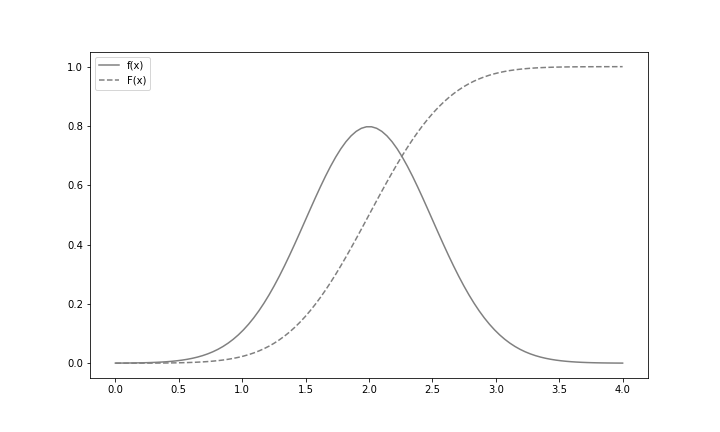


이제부터는 scipy.stats를 사용하여 구현해봅시다. 정규분포를 따르는 확률변수는 norm 함수로 생성할 수 있습니다. 첫 번째 인수에 기댓값 μ, 두 번째 인수에 표준편차 σ를 각각 지정합니다. 각각 기본 설정값이 0, 1이므로, 아무것도 지정하지 않으면 표준정규분포를 따르는 확률변수가 생성됩니다.

여기서는 조금 전과 마찬가지로, 기댓값이 2이고 표준편차가 0.5인 정규분포를 따르는 확률변수를 생성해봅시다.

```python
rv = stats.norm(2, 0.5)
```


기댓값과 분산은 각각 mean메서드와 var 메서드로 구할 수 있습니다.

```python
rv.mean(), rv.var()
```

```python
(2.0, 0.25)
```


밀도함수는 pdf 메서드로 계산할 수 있습니다. 여기서는 rv.pdf(2)를 계산해봅시다. 7장에서도 설명했듯이, 이것은 P(X=2)라는 확률을 구하는 것이 아니라는 점에 주의하기 바랍니다.

```python
rv.pdf(2)
```

```python
0.7978845608028654
```


분포함수는 cdf 메서드로 계산할 수 있습니다. 분포함수는 P(X ≤ x)를 계산하는 함수이므로, cdf(x)는 밑에 그림에서 색이 칠해진 면적을 구하는 것에 해당합니다.

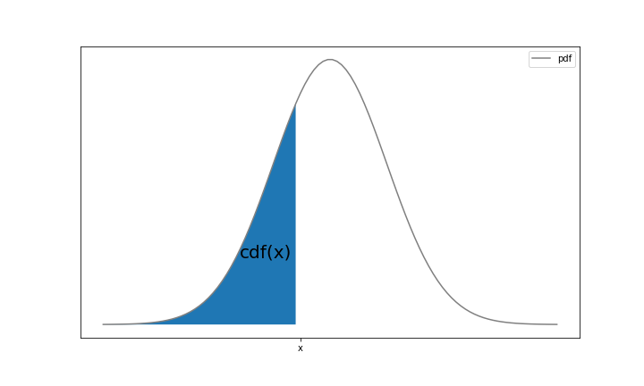

cdf 메서드를 사용하여, X가 1.7보다 작은값이 되는 확률 P(X ≤ 1.7)을 구해보겠습니다.

```python
rv.cdf(1.7)
```

```python
0.27425311775007355
```


isf 메서드를 사용하면 **상위 100α%점**(upper 100α% point)을 구할 수 있습니다. 상위 100α%점이란 P(X ≥x) = α를 만족하는 x로, 밑 그림에서 색이 칠해진 영역의 면적이 α일 때, 왼쪽 끝의 x좌표에 해당합니다.

특히 표준정규분포의 상위  100α%점은 자주 사용하므로, 이 책에서는 z~α~는 Z~N(0, 1)이라고 하면, P(X ≥x) = α를 만족합니다. 또한 표준정규분포는 x = 0을 중심으로 대칭인 형태를 띠고 있기 때문에 z~1-α~ = -z~α~가 성립합니다.

 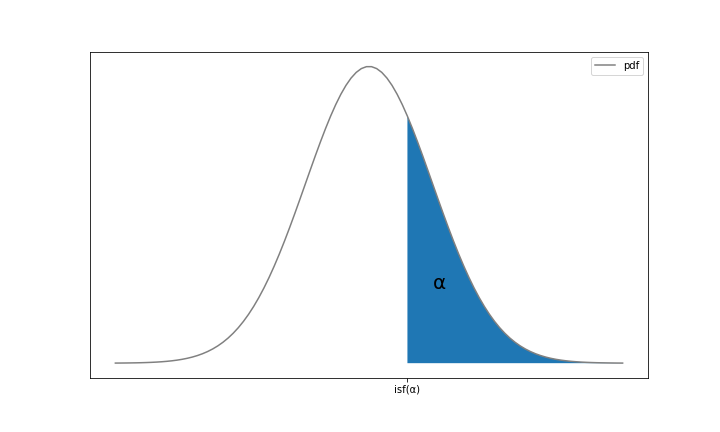

isf 메서드를 사용하여 상위 30%점을 구해보겠습니다.

```python
rv.isf(0.3)
```

```python
2.2622002563540207
```


interval 메서드로 α가 되는 가운데 부분의 구간을 구할 수 있습니다. 이는 밑에 그림에서 색이 칠해진 영역의 면적이 α가 되는 a, b를 구하는 것에 해당합니다. 이때 오른쪽과 왼쪽에서 남은 부분의 면적은 동일합니다. 즉 a와 b는 P(a ≤ X b) = α를 만족하고, P(X ≤ α) = P(X ≥ b) = (1- α)/2를 만족합니다. 이와 같은 구간 [a, b]를 이 책에서는 100α% 구간으로 표기합니다.

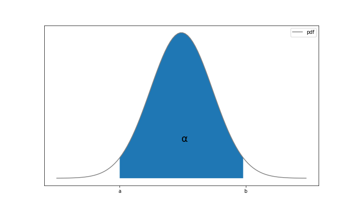

interval 메서드를 사용하여 90% 구간을 구해보겠습니다.

```python
rv.interval(0.9)
```

```python
(1.1775731865242636, 2.822426813475736)
```


오른쪽과 왼쪽에 5%씩 남아 있기 때문에 a, b를 다음과 같이 구할 수도 있습니다.

```python
rv.isf(0.95), rv.isf(0.05)
```

```python
(1.1775731865242638, 2.8224268134757367)
```


특히 표준정규분포의 경우 100(1-α)% 구간은 z~α~를 사용하여 [z~1-α/2~. z~α/2~]로 나타낼 수 있습니다.(100% 구간이 아닌 100(1-α)% 구간을 정의하는 이유는 10장 이후에 살펴볼 추정과 검정에서 왼쪽과 오른쪽에 남은 영역의 확률을 파라미터 α로 하는 경우가 많이 때문입니다.) 예를 들면, 표준정규분포의 95% 구간은 α = 0.05에 대응하는 것이므로 [z~0.975~, z~0.025~]라고 구할 수 있습니다.

stats.norm을 사용하여, 파라미터에 따라 정규분포의 형태가 어떻게 변화하는지 살펴봅시다. 여기서는 N(0, 1), N(0, 4), N(1, 1)의 세 가지 정규분포를 그립니다.

```python
fig = plt.figure(figsize = (10, 6))
ax = fig.add_subplot(111)

xs = np.linspace(-5, 5, 100)
params = [(0, 1), (0, 2), (1, 1)]
for param, ls in zip(params, linestyle):
    mu, sigma = param
    rv = stats.norm(mu, sigma)
    ax.plot(xs, rv.pdf(xs), label = f'N({mu}, {sigma**2})', ls = ls, color = 'gray')
ax.legend()

plt.show()
```

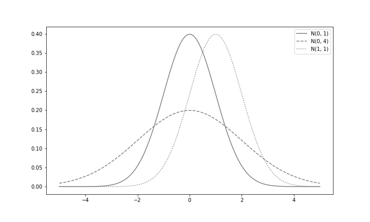

σ^2^이 커짐에 따라 분포가 넓어지고, μ가 변화하면 분포 전체가 평행이동하는 것을 확인할 수 있습니다.

마지막으로 정규분포를 정리하면 다음과 같습니다.

|    파라미터     |                μ, σ                |
| :-------------: | :--------------------------------: |
| 취할 수 있는 값 |             실수 전체              |
|    밀도함수     | 1/(루트 2π)*σ exp{-(x-u)^2^/2σ^2^} |
|     기댓값      |                 μ                  |
|      분산       |                σ^2^                |
|   scipy.stats   |             norm(μ, σ)             |


## 02. 지수분포

**지수분포**(exponential distribution)는 어떤 사건이 발생하는 간격이 따르는 분포입니다. 간격이라는 시간이 따르는 분포이므로, 확률변수가 취할 수 있는 값은 0 이상의 실수입니다. 지수분포의 파라미터는 λ로, 양의 실수입니다. 이 책에서는 파라미터가 λ인 지수분포를 Ex(λ)로 표기합니다.

Ex(λ)의 밀도함수를 다음과 같습니다.

**지수분포의 밀도함수**


Ex(λ) 는 단위시간당 평균 λ번 발생하는 사건의발생 간격을 따르는 확률분포입니다. 구체적인 예로는 다음을 들 수 있습니다.

-  하루당 평균 2건의 교통사고가 발생하는 지역에서 하루 교통사고 발생 간격

교통사고를 완전한 임의의 사건으로 인식하면, 교통사고의 발생 간격, 즉 교통사고가 일어난 뒤 다음 교통사고가 일어날 때까지의 시간은 Ex(2)를 따른다고 할 수 있습니다. 그러므로 이 지역에서 교통사고가 일어난 뒤 3일 이내에 교통사고가  일어날 확률은


로 구할 수 있습니다.


- 1시간당 평균 10번 액세스하는 사이트에 대한 액세스 간격

사이트에 대한 액세스를 완전한 임의의 사건으로 인식하면, 액세스의 간격은 Ex(10)을 따릅니다. 그러므로 이 사이트에 대한 액세스가 있은 뒤 1분 이내에 또 액세스할 확률은 


로 구할 수 있습니다.


두가지 예를 통해 이미 짐작했겠지만, 지수분포는 포아송 분포와 관련성이 강한 확률분포입니다. 왜냐하면 단위시간당 평균 λ번 발생하는 사건에 대해서 단위시간당 사건이 발생하는 횟수가 따르는 것이 Poi(λ)가 되고, 사건의 발생 간격이 따르는 것이 Ex(λ)가 되기 때문입니다.

지수분포의 기댓값과 부산은 다음과 같습니다.

**지수분포의 기댓값과 분산**

X~Ex(λ)라고 할 때


그러면 NumPy로 구현해봅시다.

```python
def Ex(lam):
    x_range = [0, np.inf]
    def f(x):
        if x >= 0:
            return lam * np.exp(-lam * x)
        else:
            return 0
    return x_range, f
```


Ex(3)을 따르는 확률변수 X를 작성해보겠습니다.

```python
lam = 3
X = Ex(lam)
```


기댓값은 1/3, 분산은 1/9이 됩니다.

```python
check_prob(X)
```

```python
expected value 0.333
variance 0.111
```


0부터 2 사이의 구간에서 밀도함수와 분포함수를 그려보겠습니다. 지수분포의 밀도함수는 값이 커질수록 지수적으로 감소합니다.

```python
plot_prob(X, 0, 2)
```

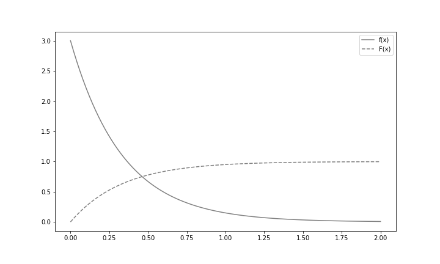

scipy.stats에서는 지수분포를 따르는 확률변수를 expon 함수로 작성할 수 있습니다. 다만 파라미터 λ를 1, 2, 3으로 변화시켜 분포 형태가 어떻게 변하는지 그려봅시다.

```python
fig = plt.figure(figsize = (10, 6))
ax = fig.add_subplot(111)

xs = np.linspace(0, 3, 100)
for lam, ls in zip([1, 2, 3], linestyles):
    rv = stats.expon(scale = 1/lam)
    ax.plot(xs, rv.pdf(xs), label = f'lambda:{lam}', ls = ls, color = 'gray')
ax.legend()

plt.show()
```

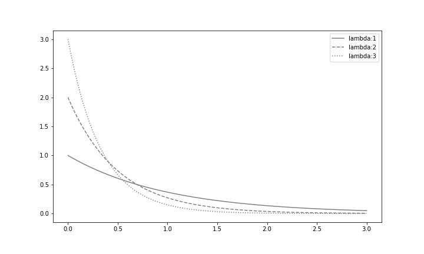

파라미터 값이 커짐에 따라 확률분포는 점점 감소하는 것을 알 수 있습니다.

지수분포를 정리한 결과는 다음과 같습니다.

|    파라미터     |         λ          |
| :-------------: | :----------------: |
| 취할 수 있는 값 |     양의 실수      |
|    밀도함수     |      λe^-λx^       |
|     기댓값      |        1/λ         |
|      분산       |       1/λ^2^       |
|   scipy.stats   | expon(scale = 1/λ) |


## 03. 카이제곱분포

이제부터 소개하는 카이제곱분포, t분포, F분포는 10장 이후에 설명할 추정과 검정에 사용하는 특수한 확률분포입니다. 이러한 분포에 대해서는 '어떠한 사건이 따른다.' 라고 하지 않고 '어떠한 형태를 하고 있다.' 라고 설명합니다. 또는 정규분포와 어떤 관련성을 맺고 있는지에 중점을 두어 설명합니다.

**카이제곱분포**(chi-square distribution)는 분산의 구간추정이나 독립성 검정에서 사용되는 확률분포입니다. 카이제곱분포는 서로 독립인 복수의 표준정규분포에 의해 다음과 같이 정의됩니다.

**카이제곱분포**

Z~1~, Z~2~, ... , Z~n~이 서로 독립이고 N(0, 1)을 따르고 있을 때, 그 제곱합


의 확률분포를 자유도가 n인 카이제곱분포라고 합니다.

이 책에서는 자유도가 n인 카이제곱분포를 X^2^(n)으로 표기합니다. 카이제곱분포가 취할 수 있는 값은 정의에서 분명히 알 수 있듯이 0이상인 실수입니다.

파이썬을 사용하여 표준정규분포로 카이제곱분포를 만들어봅시다. 여기서는 표준정규분포에서 표본 크기 10으로 무작위추출을 하여 그 제곱합을 취하는 작업을 100만 번 수행합니다. 그러면 (시그마 1~10) Z~i~^2^에서 무작위추출한 표본 크기 100만의 표본 데이터를 얻을 수 있습니다.

```python
n = 10
rv = stats.norm()
sample_size = int(1e6)
# 표준정규분포에서 표본 크기 100만으로 무작위추출한다.
Zs_sample = rv.rvs((n, sample_size))
# axis = 0에서 총합을 구하고, 표준정규분포의 제곱합 표본 데이터를 구한다
chi2_sample = np.sum(Zs_sample**2, axis = 0)
```

10개의 표준정규분포 제곱합이므로 자유도가 10인 카이제곱분포가 됩니다. scipy.stats에서는 카이제곱분포를 따르는 확률변수를 chi2 함수로 생성할 수 있습니다. 첫 번째 인수에 자유도를 지정하고, 이것을 이용하여 (시그마 1~10) Z~i~^2^에서 무작위추출한 표본 데이터의 히스토그램과 X^10^(10)의 밀도함수를 함께 그려보겠습니다.

```python
fig = plt.figure(figsize = (10, 6))
ax = fig.add_subplot(111)

rv_true = stats.chi2(n)
xs = np.linspace(0, 30, 100)
ax.hist(chi2_sample, bins = 100, density = True, alpha = 0.5, label = 'chi2_sample')
ax.plot(xs, rv_true.pdf(xs), label = f'chi2({n})', color = 'gray')
ax.legend()
ax.set_xlim(0, 30)

plt.show()
```

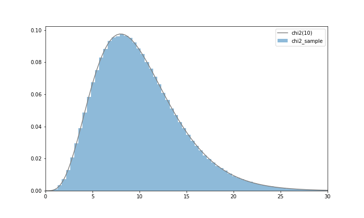

히스토그램과 밀도함수가 정확하게 일치하고, (시그마 1~10) Z~i~^2^가 X^10^(10)이 된다는 것을 확인할 수 있습니다.

다음으로 카이제곱분포가 자유도 n에 따라 어떠한 분포 형태가 되는지 살펴봅시다. 여기서는 자유도 n을 3, 5, 10으로 변화시켜 그러보겠습니다.

```python
fig = plt.figure(figsize = (10, 6))
ax = fig.add_subplot(111)

xs = np.linspace(0, 20, 500)
for n, ls in zip([3, 5, 10], linestyles):
    rv = stats.chi2(n)
    ax.plot(xs, rv.pdf(xs), label = f'chi2({n})', ls = ls, color = 'gray')

ax.legend()

plt.show()
```

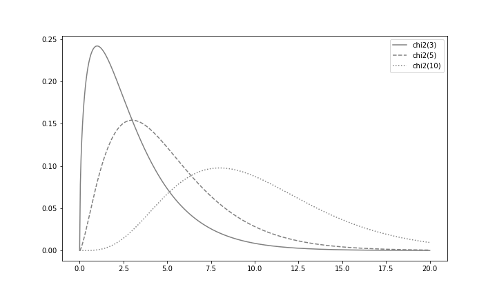

카이제곱분포의 특징으로 다음 세 가지를 파악해둡시다.

- 좌우비대칭으로, 왼쪽으로 치우치고 오른쪽으로 넓어집니다.
- 자유도가 커지면 좌우대칭에 가깝워집니다.
- 자유도의 값 가까이에 분포의 정점이 있습니다.


표준정규분포와 마찬가지로 카이제곱분포의 상위 100α%점을 X~α~^2^(n)으로 표기합니다. isf 메서드를 사용하면 X~α~^2^(n)을 계산할 수 있습니다. X~0.05~^2^(5)라면 다음과 같이 구합니다.

```python
rv = stats.chi2(5)
rv.isf(0.05)
```

```python
11.070497693516355
```


카이제곱분포를 정리하면 다음과 같습니다.

|    파라미터     |        n         |
| :-------------: | :--------------: |
| 취할 수 있는 값 | 음수가 아닌 실수 |
|   scipy.stats   |     chi2(n)      |


## 04. t 분포

**t 분포**(t distribution)는 정규분포에서 모평균의 구간추정 등에 사용하는 확률분포입니다. t 분포는 서로 독립인 표준정규분포와 카이제곱분포에 의해 다음과 같이 정의합니다.

**t 분포**

확률변수 Z, Y는 서로 독립이고, Z는 표준정규분포 N(0, 1)을, Y는 자유도가 n인 카이제곱분포 X^2^(n)을 각각 따를 때,


의 확률분포를 자유도가 n인 t 분포라고 합니다.

이 책에서는 자유도가 n인 t 분포를 t(n)으로 표기합니다. t 분포가 취할 수 있는 값은 실수 전체입니다.

표준정규분포와 카이제곱분포로 t 분포를 만들어봅시다. 여기서는 Z~N(0, 1)과 Y~X^2^(10)을 사용하여 Z/루트(Y/10)에서 무작위추출을 수행합니다.

```python
n = 10
rv1 = stats.norm()
rv2 = stats.chi2(n)

sample_size = int(1e6)
Z_sample = rv1.rvs(sample_size)
chi2_smple = rv2.rvs(sample_size)

t_sample =Z_sample / np.sqrt(chi2_smple/n)
```


자유도가 10인 카이제곱분포를 사용했으므로, 자유도가 10인 t 분포가 생성됩니다. scipy.stats에서는 t 분포를 따르는 확률변수를 t함수로 생성할 수 있고, 인수에 자유도를 지정합니다. 이를 이용하여 Z/루트(Y/10)에서 무작위추출한 표본 데이터의 히스토그램과 t(10)의 밀도함수를 함께 그려보겠습니다.

```python
fig = plt.figure(figsize = (10, 6))
ax = fig.add_subplot(111)

rv = stats.t(n)
xs = np.linspace(-3, 3, 100)
ax.hist(t_sample, bins = 100, range = (-3, 3),
       density = True, alpha = 0.5, label = 't_sample')
ax.plot(xs, rv.pdf(xs), label = f't({n})', color = 'gray')
ax.legend()
ax.set_xlim(-3, 3)

plt.show()
```

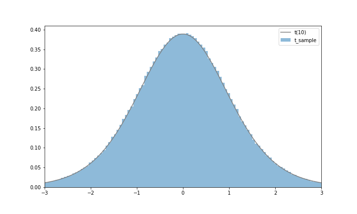

Z/루트(Y/10)가 t(10)이 되었음을 확인할 수 있습니다.

다음으로 t 분포가 자유도 n에 따라 어떤 분포 형태가 되는지 살펴봅시다. 여기서는 자유도 n을 3, 5, 10으로 변화시켜서 그려봅시다. 또한 비교를 위해 표준정규분포도 함께 그립니다.

```python
fig = plt.figure(figsize = (10, 6))
ax =  fig.add_subplot(111)

xs = np.linspace(-3, 3, 100)
for n, ls in zip([3, 5, 10], linestyles):
    rv = stats.t(n)
    ax.plot(xs, rv.pdf(xs), label = f't({n})', ls = ls, color = 'gray')
rv =stats.norm()
ax.plot(xs, rv.pdf(xs), label = 'N(0, 1)')
ax.legend()

plt.show()
```

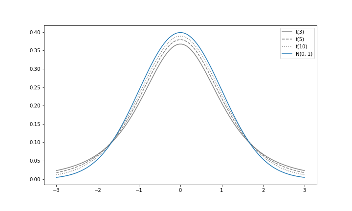

t 분포의 특징으로 다음 세 가지를 파악해둡시다.

- 좌우대칭인 분포입니다.
- 표준정규분포보다 양쪽 끝이 두껍습니다.
- 자유도가 커지면 표준정규분포에 가까워집니다.


자유도가 n인 t 분포의 상위 100α%점은 10장 이후에 자주 사용하므로, 이 책에서는 t~α~(n)으로 표기합니다. isf 메서드를 사용하면 t~α~(n)을 계산할 수 있습니다. t~0.05~(5)라면 다음과 같이 구합니다.

```python
rv = stats.t(5)
rv.isf(0.05)
```

```python
2.0150483726691575
```


t 분포를 정리하면 다음과 같습니다.

|    파라미터     |     n     |
| :-------------: | :-------: |
| 취할 수 있는 값 | 실수 전체 |
|   scipy.stats   |   t(n)    |


## 05. F 분포

**F 분포**(F distribution)는 분산분석 등에서 사용되는 확률분포입니다. F 분포를 서로 독립인 두 개의 카이제곱분포에 의해 다음과 같이 정의됩니다.

**F분포**

확률변수 Y~1~, Y~2~는 서로 독립이고, 각각 Y~1~~X^2^(n~1~), Y~2~~X^2^(n~2~)를 따를 때,


의 확률분포를 자유도가 n~1~, n~2~인 F 분포 F(n~1~, n~2~)라고 합니다.

이 책에서는 자유도가 n~1~, n~2~인 F 분포를 F(n~1~, n~2~)로 표기합니다. F 분포가 취할 수 있는 값은 0이상인 실수입니다.

2개의 카이제곱분포로 F 분포를 작성해봅시다. 여기서는 Y~1~~X^2^(5)와 Y~2~~X^2^(10)을 사용하여 (Y~1~/5)/Y~2~/10에서 무작위추출을 수행합니다.

```python
n1 = 5
n2 = 10
rv1 = stats.chi2(n1)
rv2 = stats.chi2(n2)

sample_size = int(1e6)
sample1 = rv1.rvs(sample_size)
sample2 = rv2.rvs(sample_size)

f_sample = (sample1/n1) / (sample2/n2)
```


(Y~1~/5)/Y~2~/10은 정의에 따라 F(5, 10)이 됩니다. scipy.stats에서는 F 분포를 따르는 확률변수를 f함수로 생성할 수 있고, 첫 번째 인수와 두 번째 인수에 각각 n~1~과 n~2~를 지정합니다. 이것을 이용하여 (Y~1~/5)/Y~2~/10에서 무작위추출한 표본 데이터의 히스토그램과 함께 F(5, 10)의 밀도함수를 그립니다.

```python
fig = plt.figure(figsize = (10, 6))
ax = fig.add_subplot(111)

rv = stats.f(n1, n2)
xs = np.linspace(0, 6, 200)[1:]
ax.hist(f_sample, bins = 100, range = (0, 6), density = True, alpha = 0.5, label = 'f_sample')
ax.plot(xs, rv.pdf(xs), label = f'F({n1}, {n2})', color = 'gray')
ax.legend()
ax.set_xlim(0, 6)

plt.show()
```

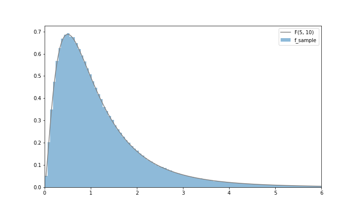

(Y~1~/5)/Y~2~/10이 F(5, 10)이 된 것을 확인할 수 있습니다.

다음으로 F 분포가 자유도 n~1~, n~2~의 변화에 따라 어떤 형태의 분포가 되는지 살펴봅시다. 여기서는 n~2~를 10으로 고정하고, n~1~을 3, 5, 10으로 변화시켜 그래프를 그립니다.

```python
fig =plt.figure(figsize = (10, 6))
ax = fig.add_subplot(111)

xs = np.linspace(0, 6, 200)[1:]
for n1, la in zip([3, 5, 10], linestyles):
    rv = stats.f(n1, 10)
    ax.plot(xs, rv.pdf(xs), label = f'F({n1}, 10)', ls = ls, color = 'gray')
ax.legend()

plt.show()
```

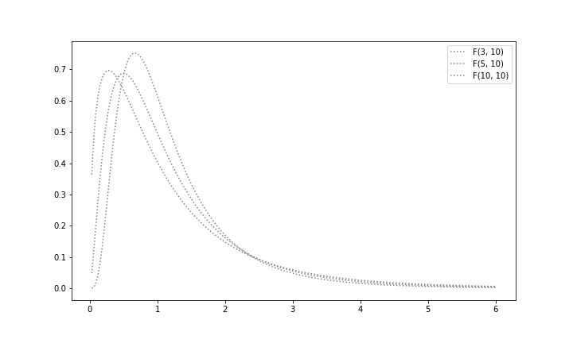

F 분포의 특징으로 다음 두 가지를 파악해둡시다.

- 좌우비대칭으로, 왼쪽으로 치우치고 오른쪽으로 넓어지는 분포입니다.
- 분포의 정점은 1에 가깝습니다.


F 분포를 정리하면 다음과 같습니다.

|    파라미터     |    n~1~, n~2~    |
| :-------------: | :--------------: |
| 취할 수 있는 값 | 음수가 아닌 실수 |
|   scipy.stats   |  t(n~1~, n~2~)   |