# Chapter 09. 독립동일분포

5.2절과 7.2절에서는 2차원 확률변수에 대해 배웠습니다. 이제부터는 더욱 차원이 높은 확률변수에 대해 살펴보겠습니다. 다만, 이 장에서 살펴보는 확률변수는 서로 독립인 다차원 확률변수입니다.

9.1절에서 상세히 설명하겠지만, 확률변수가 서로 독립이라는 것은 확률변수가 다른 확률변수에 영향을 끼치지 않는 다는 의미입니다. 독립이고 다차원인 확률변수를 다루는 이유는 통계분석에서 취급하는 데이터 중 상당수가 독립이면서 다차원인 확률변수의 실현값으로 간주될 수 있기 때문입니다.

4장에서 처음 살펴본 예를 다시 한 번 떠올려봅시다. A 학생은 전교생 400명의 평균 점수를 알고 싶어서 우연히 만난 20명에게 시험 점수를 물어보고, 그 결과로부터 전교생의 평균 점수를 추측했습니다. 4장에서 이미 살펴보았듯이, 우연히 만난 학생들의 점수 각각은 전교생의 점수 분포를 따르는 1차원 확률변수가 됩니다. 그리고 우연히 만난 학생이란, 그 학생을 만나기 직전에 우연히 만났던 학생과 전혀 관계없이 만난 학생입니다. 이 때문에 우연히 만난 20명의 점수 (X~1~, X~2~, ... , X~20~)은 서로 독립인 20차원의 확률변수라고 생각할 수 있습니다.

이 예와 같이, 서로 독립이고 각각 동일한 확률분포를 따르는 다차원 확률변수를 **독립동일분포**(independently and identically distribution, i.i.d)라 합니다. 여기서 확률분포를 F라고 하면 X~1~, X~2~, ... , X~20~~(iid) F와 같이 나타낼 수 있습니다. 독립동일분포는 동일한 조건 아래에서 수행되는 실험이나 관측을 여러 번 반복하여 데이터를 얻는 것을 수학 용어로 나타낸 것입니다. 이는 통계분석에서 가장 기본적이고 중요한 조건 설정이라 할 수 있습니다.

늘 그랬듯이 라이브러리를 임포트해둡시다.

```python
import numpy as np
import matplotlib.pyplot as plt
from scipy import stats

np.random.seed(0)
%precision 3
%matplotlib inline
```


5.2절에서 이산형 확률변수를 다룰 때 사용한 몇 가지 함수를 준비했습니다. 이 함수들은 9.1절에서 사용합니다.

```python
linestyles = ['-', '--', ':', '-.']

def E(EY, g):
    x_set, y_set, f_XY = XY
    return np.sum([g(x_i, y_j) * f_XY(x_i, y_j) for x_i in x_set for y_j in y_set])

def Cov(XY):
    x_set, y_set, f_XY = XY
    mean_X = E(XY, lambda x, y: x)
    mean_Y = E(XY, lambda x, y: y)
    return np.sum([(x_i - mean_X) * (y_j - mean_Y) * f_XY(x_i, y_j) for x_i in x_set for y_j in y_set])

def f_X(x):
    return np.sum([f_XY(x, y_k) for y_k in y_set])

def f_Y(y):
    return np.sum([f_XY(x_k, y) for x_k in x_set])
```


## 01. 독립성


### 1.1 독립성의 정의

확률변수의 **독립성**(independence)이란, 2개 이상의 확률변수가 서로 영향을 끼치지 않으며 관계가 없음을 나타내는 개념입니다. 2차원 확률변수 (X, Y)의 경우, 다음과 같은 관계가 성립할 때 X와 Y는 독립이라고 합니다.

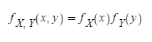

즉, 확률변수가 독립일 때 결합확률은 주변확률의 곱으로 작성할 수 있습니다.

구체적인 예로서, 불공정한 주사위 2개를 이용합시다. 불공정한 주사위 A와 B를 굴려 A의 눈을 확률변수 X, B의 눈을 확률변수 Y라고 할 때의 (X, Y)를 떠올려봅시다. A의 눈이 B의 눈에는 영향을 주지 않고, 그 역도 마찬가지이므로 X와 Y는 독립이라고 할 수 있습니다.

확률함수는 어떨까여? 이 2차원 확률변수 (X, Y)에 대한 결합확률함수는

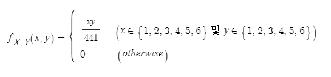

이고, 확률변수 X와 Y는 불공정한 주사위 그 자체이므로, 그 확률함수는 다음과 같습니다.

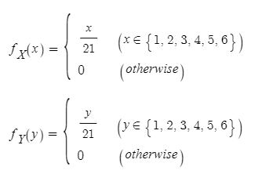

이로부터 f~X,Y~(x, y) = f~X~(x)f~Y~(y)가 성립한다는 것을 확인할 수 있습니다.

좀 더 일반화하여, n차원 확률변수로 확장해 독립성을 정의할 수 있습니다.

**독립성**

n개의 확률변수 X~1~, X~2~, ... , X~n~이 다음을 만족할 때, X~1~, X~2~, ... , X~n~은 서로 독립이라고 합니다.

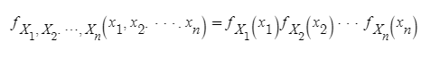

다만, 함수 f가 이산형이면 확률함수, 연속형이면 밀도함수를 나타냅니다.


### 1.2 독립성과 무상관성

5.2절과 7.2절에서는 두 확률변수의 관계성을 나타내는 지표로서 공분산과 상관계수를 학습했습니다. 공분산이나 상관계수가 0일 때 무상관이라 하고 두 확률변수 사이에는 상관성, 즉 선형 관계가 없음을 나타냅니다. 독립성도 무상관성도 두 확률변수가 서로 관계가 없다는 것을 나타내는 성질입니다. 그렇다면 두 개념의 차이는 무엇일까요?

결론부터 먼저 말하자면, 무상관성보다 독립성이 더 강한 개념입니다. 즉, 2개의 확률변수 X와 Y가 독립일 때 X와 Y는 무상관성이 되지만, X와 Y가 무상관일 때 X와 Y가 반드시 독립인 것은 아닙니다. 두 확률변수 사이에 선형 관계가 없더라도 서로 영향을 끼치는 경우가 있습니다.

이에 관해서 파이썬으로 구현하여 확인해보겠습니다. 독립인 확률변수의 예로서, 앞에서 언급한 불공정한 주사위의 예를 사용합니다.

```python
x_set = np.array([1, 2, 3, 4, 5, 6])
y_set = np.array([1, 2, 3, 4, 5, 6])

def f_XY(x, y):
    if x in x_set and y in y_set:
        return x * y / 441
    else:
        return 0 
    
XY = [x_set, y_set, f_XY]
```


이 2차원 확률변수 X와 Y는 독립이므로 무상관이 됩니다. 공분산으로 확인해보겠습니다.

```python
Cov(XY)
```

```python
-8.326672684688674e-17
```


공분산이 0이므로 무상관인 것을 알 수 있습니다. 이 예뿐 아니라, 2개의 확률변수가 독립이면 반드시 무상관이 됩니다.

다음으로 무상관인 2개의 확률변수를 생각해봅시다. 앞에서 설명했듯이, 무상관이라도 반드시 독립이라고는 할 수 없습니다. 무상관인데도 독립이 아닌 예로서, 취할 수 있는 값의 조합이 {(0, 0), (1, 1), (1, -1)}로 각각 확률이 동일한 2차원 확률변수 (X, Y)를 사용합니다. 이 확률변수 (X, Y)의 결합확률함수는 다음 식으로 나타냅니다.


이 식을 파이썬으로 구현해봅시다.

```python
x_set = np.array([0, 1])
y_set = np.array([-1, 0, 1])

def f_XY(x, y):
    if (x, y) in [(0, 0), (1, 1), (1, -1)]:
        return 1 / 3
    else:
        return 0
    
XY = [x_set, y_set, f_XY]
```


확률변수 X와 Y의 공분산을 계산해보겠습니다.

```python
Cov(XY)
```

```python
0.0
```


공분산이 0이므로 확률변수 X와 Y는 무상관임을 알 수 있습니다. 그렇다면 확률변수 X와 Y는 독립인가요? 독립성의 정의는 모든 x, y에 대해서


가 성립할 때였습니다. 여기서는 x=0, y=0을 대입하여

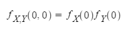

이 성립하는지 확인해보겠습니다.

```python
f_X(0) * f_Y(0), f_XY(0, 0)
```

````python
(0.1111111111111111, 0.333)
````


등식이 성립하지 않으므로 X와 Y는 독립이 아닙니다. 이로써 무상관이어도 독립성이 성립하지 않는 경우가 있다는 것을 확인했습니다.


## 02. 합의 분포

앞에서 설명했듯이, 4장에서 A 학생이 무작위추출로 얻은 표본은 서로 독립이고 동일한 확률분포를 따르는 확률변수 X~1~, X~2~, ... , X~20~입니다. 이 때문에 A학생이 모평균을 추정하기 위해 이용하는 표본평균은 X바 = (X~1~, X~2~, ... , X~20~) / 20 이라는 확률변수가 됩니다. 이 표본평균의 확률분포를 이해하는 것이 이 장의 목표이지만, 이 절에서는 사전 준비를 하는 차원에서 표본평균의 분포보다는 단순한  합의 분포에 관해서 생각해봅시다. 

이 절에서 다루는 합의 분포는 서로 독립이고 동일한 확률분포를 따르는 확률변수 X~1~, X~2~, ... , X~n~의 합 시그마(1~n) X~i~= X~1~,+X~2~+ ... + X~n~이 따르는 확률분포를 의미합니다. 합의 분포를 이해하면 확률변수의 합을 n으로 나눈 표본평균의 분포도 쉽게 이해할 수 있습니다.

합의 분포의 확률함수와 밀도함수를 X~1~, X~2~, ... , X~n~으로부터 직접 유도하기는 어렵습니다. 이 때문에, 우선 합의 분포의 기댓값과 분산에 관해 살펴봅니다.

기댓값은 5.2절에서 설명한 것처럼 선형성이 성립합니다. 이 선형성을 n차원으로 확장하면 다음과 같이 말할 수 있습니다.(이 공식은 확률변수가 서로 독립이 아니어도 성립합니다.) 다음 공식에 따라, 합의 분포 기댓값은 각 확률변수 기댓값의 합으로 계산할 수 있습니다.

**확률변수 합의 기댓값**

확률변수 X~1~, X~2~, ... , X~n~에 관해서 


이 성립합니다.

분산은 5.2절에서 설명한 분산과 공분산의 공식에서 본 것처럼, 대개 공분산이 얽혀 있기 때문에 기댓값만큼 깔끔한 결과가 나오지는 않습니다. 그러나 X~1~, X~2~, ... , X~n~은 서로 무상관이 되고, 공분산 항은 모두 0이 됩니다. 이 때문에 분산에 관해서는 다음과 같이 말할 수 있습니다.

**확률변수 합의 분산**

확률변수 X~1~, X~2~, ... , X~n~이 서로 독립이라면

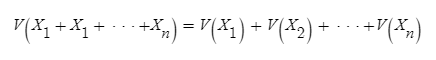

이 성립합니다.

결국 합의 분포 분산도 각 확률변수에 대한 분산의 합으로 계산할 수 있습니다.

기댓값과 분산만 알아도 출분한 경우가 있지만, 보다 세부적으로 시그마(1~n) X~i~가 어떠한 형태의 확률분포가 되는지 알고 싶은 때는 어떻게 해야 할까요? 실은 몇 가지 확률분포에서는 시그마(1~n) X~i~도 대표적인 확률분포를 따르는 것으로 알려져 있습니다. 이제부터 그와 같은 예를 몇 개 살펴봅시다.


### 2.1 정규분포의 합의 분포

서로 독립인 두 확률변수 X~N(1, 2)와 Y~N(2, 3)이 있습니다. 이때 확률변수 X+Y의 분포는 어떻게 될까요?

조금 전 공식을 이용하면, 기댓값은 E(X+Y) = E(X)+E(Y) = 3, 분산은 V(X+Y) = V(X) + X(Y) = 5가 됩니다. 우선 이 값을 파이썬으로 확인해봅시다. 여기서는 X와 Y로부터 무작위추출을 수행하여, 이들의 합을 취함으로써 X+Y의 표본 데이터를 구합니다. 표본 데이터의 평균과 분산은 표본 크기가 충분하다면 X+Y의 기댓값 및 분산과 일치할 것 입니다.

```python
rv1 = stats.norm(1, np.sqrt(2))
rv2 = stats.norm(2, np.sqrt(3))

sample_size = int(1e6)
X_sample = rv1.rvs(sample_size)
Y_sample = rv2.rvs(sample_size)
sum_sample = X_sample + Y_sample

np.mean(sum_sample), np.var(sum_sample)
```

```python
(3.0004904837060664, 4.989750326542952)
```


공식으로 구한 이론값에 가까운 값이 나왔습니다. 표본 크기를 키우면 이론값에 수렴할 것입니다.

X+Y의 기댓값과 분산은 알게 되었지만, 보다 상세한 분포의 형태를 알고 싶을 때는 어떻게 해야 할까요? 사실, 정규분포의 경우 정규분포의 합도 정규분포가 되는 성질이 있습니다. 이처럼 동일한 분포를 따르는 2개의 독립인 확률변수에 대해서, 그 합도 동일한 확률분포가 되는 성질을 **재생성**(reproductive property)이라고 합니다. 모든 확률분포가 재생성을 갖는 것은 아니니 이 점 유의하기 바랍니다.

X+Y의 기댓값과 분산, 더 나아가 정규분포의 재생성에 의해 X+Y가 N(3, 5)를 따르는 것을 알았습니다. 이것을 파이썬으로 확인해봅시다. 여기서는 X+Y로부터 무작위추출한 표본 데이터의 히스토그램과 N(3, 5)의 밀도함수를 함께 그려보겠습니다.

```python
fig  = plt.figure(figsize = (10, 6))
ax = fig.add_subplot(111)

rv = stats.norm(3, np.sqrt(5))
xs = np.linspace(rv.isf(0.995), rv.isf(0.005), 100)

ax.hist(sum_sample, bins = 100, density = True, alpha = 0.5, label = 'N(1, 2) + N(2, 3)')
ax.plot(xs, rv.pdf(xs), label = 'N(3, 5)', color = 'gray')
ax.plot(xs, rv1.pdf(xs), label = 'N(1, 2)', ls = '--')
ax.plot(xs, rv2.pdf(xs), label = 'N(2, 3)', ls = ':', color = 'gray')

ax.legend()
ax.set_xlim(rv.isf(0.995), rv.isf(0.005))
plt.show()
```

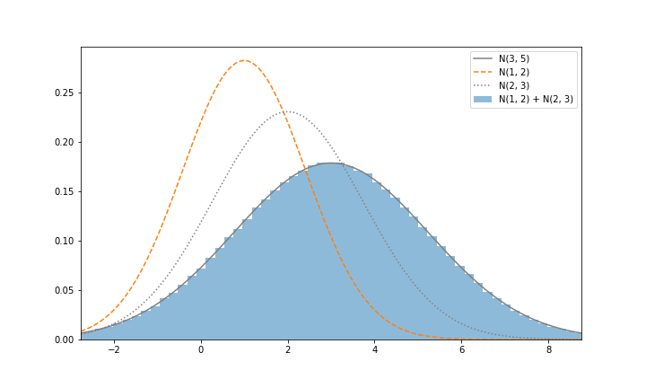

히스토그램과 밀도함수가 깨끗하게 일치합니다. X+Y~N(3, 5)를 확인할 수 있습니다.

여기서는 두 정규분포의 합을 다루었지만, n개의 정규분포의 합이 되더라도 재생성에 의해 정규분포가 됩니다. 정리하면 다음과 같습니다.

**정규분포의 합의 분포**

서로 독립인 확률변수 X~1~~N(μ~1~, σ~1~^2^), X~2~~N(μ~2~, σ~2~^2^), ... , X~n~~N(μ~n~, σ~n~^2^)에 관해서 

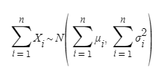

이 성립합니다.


### 2.2 포아송 분포의 합의 분포

서로 독립인 두 확률변수 X~Poi(3)과 Y~Poi(4)가 있습니다. 이때 확률변수 X+Y의 분포는 어떻게 될까요?

Poi(λ)의 기댓값과 분산은 모두 λ이므로, X+Y의 기댓값과 분산은 모두 7이 됩니다. 이 값을 X+Y로부터 무작위추출한 표본 데이터의 평균과 분산으로 확인해보겠습니다.

```python
rv1 = stats.poisson(3)
rv2 = stats.poisson(4)

sample_size = int(1e6)
X_sample = rv1.rvs(sample_size)
Y_sample = rv2.rvs(sample_size)
sum_sample = X_sample + Y_sample

np.mean(sum_sample), np.var(sum_sample)
```

```python
(6.999435, 7.001348680774999)
```


모두 이론값에 가까운 값이 되었습니다.

여기서 주의해야 할 것은 X+Y 분포의 형태이지만, 포아송 분포도 재생성을 지닌 확률분포라는 사실입니다. 이 때문에 X+Y는 포아송 분포를 따르고, X+Y~Poi(7)이 됩니다. X+Y로부터 무작위추출한 표본 데이터의 히스토그램과 함께 Poi(7)의 확률함수를 그려보겠습니다.

```python
fig = plt.figure(figsize = (10, 6))
ax = fig.add_subplot(111)

rv = stats.poisson(7)
xs = np.arange(20)
hist, _ = np.histogram(sum_sample, bins = 20, range = (0, 20), normed = True)

ax.bar(xs, hist, alpha = 0.5, label = 'Poi(3) + Poi(4)')
ax.plot(xs, rv.pmf(xs), label = 'Poi(7)', color = 'gray')
ax.plot(xs, rv1.pmf(xs), label = 'Poi(3)', ls = '--', color = 'gray')
ax.plot(xs, rv2.pmf(xs), label = 'Poi(4)', ls = ':', color = 'gray')

ax.legend()
ax.set_xlim(-0.5, 20)
ax.set_xticks(np.arange(20))
plt.show()
```

 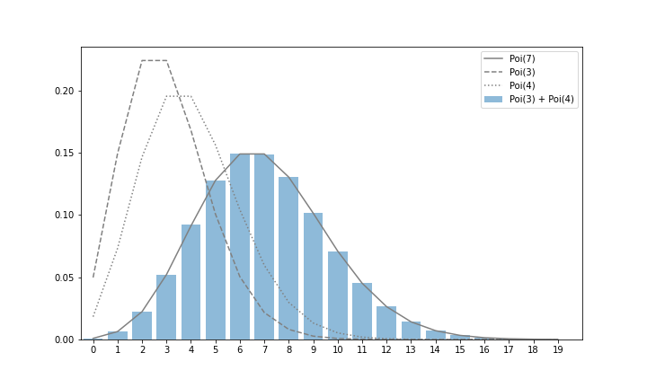

히스토그램과 밀도함수가 깨끗하게 일치합니다. X+Y~Poi(7)을 확인할 수 있습니다.

여기서는 두 포아송 분포의 합을 다루었지만, n개의 포아송 분포의 합이 되더라도 재생성에 의해 포아송 분포의 형태를 유지합니다. 정리하면 다음과 같습니다.

**포아송 분포의 합의 분포**

서로 독립인 확률변수 X~1~~Poi(λ~1~), X~2~~Poi(λ~2~), ... , X~n~~Poi(λ~n~)에 관해서

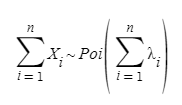

가 성립합니다.


### 2.3 베르누이 분포의 합의 분포

여기서는 X~1~, X~2~, ... , X~10~~(iid) Bern(0.3)이라고 할 때의 시그마(1~10) X~i~를 생각해봅시다. Bern(p)의 기댓값은 p, 분산은 P(1-P)이므로, 시그마(1~10) X~i~의 기댓값은 10 * 0.3 = 3, 분산은 10 * 0.3 * (1-0.3) = 2.1이 됩니다. 이 값을 시그마(1~10) X~i~로부터 무작위추출한 표본 데이터의 평균과 분산으로 확인해보겠습니다.

```python
p = 0.3
rv = stats.bernoulli(p)

sample_size = int(1e6)
Xs_sample = rv.rvs((10, sample_size))
sum_sample = np.sum(Xs_sample, axis=0)

np.mean(sum_sample), np.var(sum_sample)
```

```python
(2.999067, 2.096206129511)
```


모두 이론값에 가까운 값이 되었습니다.

주의해야할 것은 시그마(1~10) X~i~ 분포의 형태이지만, 유감스럽게도 베르누이 분포에는 재생성이 없다는 사실입니다. 베르누이 분포의 경우, 베르누이 분포의 합은 이항분포가 되는 성질이 있습니다. 이때 이항분포의 파라미터는 그래도  n, p가 됩니다. 여기서 n = 10, p = 0.3이므로 시그마(1~10) X~i~~Bin(10, 0.3)이 됩니다. 시그마(1~10) X~i~로부터 무작위추출한 표본 데이터의 히스토그램과 함께 Bin(10, 0.3)의 확률함수를 그려보겠습니다.

```python
fig = plt.figure(figsize = (10, 6))
ax = fig.add_subplot(111)

rv = stats.binom(10, p)
xs = np.arange(10)
hist, _ = np.histogram(sum_sample, bins = 10, range = (0, 10), normed = True)

ax.bar(xs, hist, alpha = 0.5, label = 'sum of 10*Bern(0.3)')
ax.plot(xs, rv.pmf(xs), label = 'Bin(10, 0.3)')
ax.legend()
ax.set_xlim(-0.5, 10)
ax.set_xticks(np.arange(10))
plt.show()
```

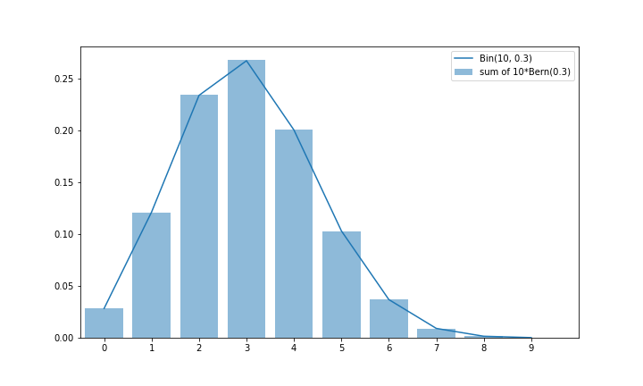

베르누이 분포의 합의 분포에 관해 정리하면 다음과 같습니다.

**베르누이 분포의 합의 분포**

 X~1~, X~2~, ... , X~n~~(iid) Bern(p)에 관해서

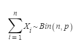

가 성립하니다.


## 03. 표본평균의 분포

표본평균의 분포란 서로 독립이고 동일한 확률분포를 따르는 확률변수 X~1~, X~2~, ... , X~n~의 표본평균 X바 = (X~1~, X~2~, ... , X~n~)/n 이 따르는 분포입니다. 10장에서 다루는 모평균의 구간추정이나 11장에서 다루는 모평균의 검정에서 사용하는 분포입니다. 이 분포는 중심극한정리나 대수의 법칙 등 추측통계에서 중요하고 흥미로운 성질을 많이 담고 있기 때문에 잘 알아두어야 합니다. 우리는 파이썬의 힘을 빌려 정확히 이해해봅시다.

우선 합의 분포 때와 마찬가지로, 기댓값과 분산이 어떻게 되는지 살펴봅시다. 표본평균의 기댓값은 기댓값의 선형성을 사용하여 다음과 같이 계산할 수 있습니다.

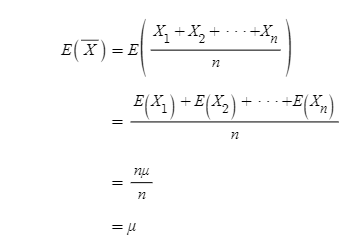

표본평균의 분산은 다음과 같이 계산할 수 있습니다. 기댓값과 계산할 때와는 달리, V(aX) = a^2^V(X)가 되는 것에 주의합시다.

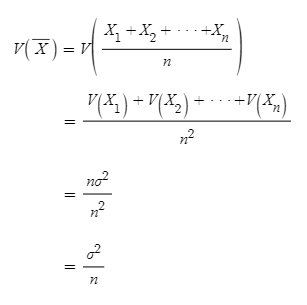

결과를 정리하면 다음과 같습니다.

**표본평균의 기댓값과 분산**

확률변수 X~1~, X~2~, ... , X~n~이 서로 독립이고, 기댓값이 μ, 분산이 σ^2^인 확률분포 F를 따를 때

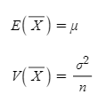

이 성립합니다.


### 3.1 정규분포의 표본평균 분포

정규분포의 표본평균에 관해 생각해봅시다. 여기서는 n=10인 X~1~, X~2~, ... , X~n~~(iid)N(1, 2)의 표본평균 X바를 알아보겠습니다. 이때 X바의 평균은 1, 분산은 2/10가 됩니다. 이것을 X바로부터 무작위추출한 표본 데이터의 평균과 분산을 확인해봅시다.

```python
mean = 1
var = 2
rv = stats.norm(mean, np.sqrt(var))

n = 10
sample_size = int(1e6)
Xs_sample = rv.rvs((n, sample_size))
sample_mean = np.mean(Xs_sample, axis = 0)

np.mean(sample_mean), np.var(sample_mean)
```

```python
(1.0002051641716674, 0.1993946545838387)
```


정규분포의 경우, 표본평균 X바도 정규분포가 됩니다. 즉, X바~N(1, 2/10)가 됩니다. X바로부터 무작위추출한 표본 데이터의 히스토그램과 함께 N(1, 2/10)의 밀도함수를 그려보겠습니다.

```python
fig = plt.figure(figsize = (10, 6))
ax = fig.add_subplot(111)

rv_true = stats.norm(mean, np.sqrt(var/n))
xs = np.linspace(rv_true.isf(0.999), rv_true.isf(0.001), 100)
ax.hist(sample_mean, bins = 100, density = True, alpha = 0.5, label = 'sample mean of 10*N(1, 2)')
ax.plot(xs, rv_true.pdf(xs), label = 'N(1, 0.2)', color = 'gray')

ax.legend()
ax.set_xlim(rv_true.isf(0.999), rv_true.isf(0.001))
plt.show()
```

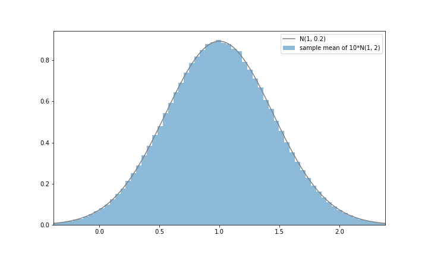

정규분포의 표본평균의 분포를 정리하면 다음과 같습니다.

**정규분포의 표본평균의 분포**

X~1~, X~2~, ... , X~n~~(iid)N(μ, σ^2^)이라고 할 때

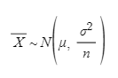

이 성립합니다.


### 3.2 포아송 분포의 표본평균 분포

포아송 분포의 표본평균에 관해 생각해봅시다. 여기서는 n = 10인 X~1~, X~2~, ... , X~10~~(iid)Poi(3)의 표본평균 X바를 알아보겠습니다. 이때 X바의 기댓값은 3, 분산은 3/10이 됩니다.

```python
l = 3
rv = stats.poisson(l)

n = 10
sample_size = int(1e6)
Xs_sample = rv.rvs((n, sample_size))
sample_mean = np.mean(Xs_sample, axis = 0)

np.mean(sample_mean), np.var(sample_mean)
```

```python
(2.9993641999999996, 0.30026229575836)
```


기댓값과 분산이 다르다는 사실에서 알 수 있듯이, X바는 이제 포아송 분포를 따르지 않습니다. 재생성이 있는 포아송 분포에서도 표본평균에 대해서는 포아송 분포를 유지할 수 없습니다. 그렇다면 X바는 어떤 분포가 되어 있을까요? 히스토그램으로 그려보겠습니다.

```python
fig = plt.figure(figsize = (10, 6))
ax = fig.add_subplot(111)

ax.hist(sample_mean, bins = 100, density = True, alpha = 0.5, label = 'sample mean of 10*Poi(3)')

ax.legend()
ax.set_xlim(0, 6)
plt.show()
```

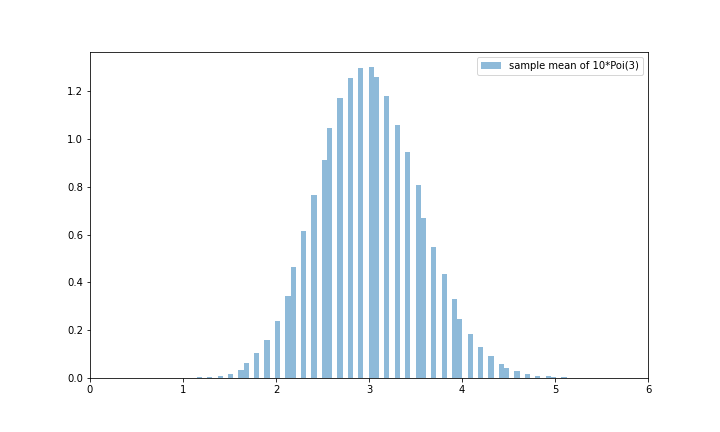

좌우대칭인 산 모양의 분포로 정규분포에 가까운 형태가 되었습니다. 실제로 포아송 분포의 표본분포는 근사적으로 정규분포를 따르고, 다음에 나오는 중심극한정리에 의해 설명할 수 있습니다.


### 3.3 중심극한정리

지금까지 합 시그마(1~n) X~i~와 표본평균 X바의 분포를 살펴보았습니다. 합의 분포나 표본평균의 분포에서 기댓값과 분산은 쉽게 계산하여 구할 수 있기 때문에, 분포 형태만 알면 확률분포를 결정할 수 있었습니다. 그러나 포아송 분포나 정규분포 같은 재생성이 있는 일부 확률분포를 제외하면, 합의분포가 어떤 형태를 보이는지 일반적으로 알 수 없습니다. 더 나아가 표본평균의 분포가 되면 재생성을 지닌 포아송 분포조차도 그 형태를 유지할 수 없습니다.

표본평균의 분포를 구하려면 꼭 번거로운 계산을 해야 할까요? 아니면 컴퓨터를 이용하여 무작위추출을 할 수 밖에 없을까요? 실은 표본평균의 분포에 관한 매우 강력하고 아름다운 정리가 있습니다. 바로 **중심극한정리**(central limit theorem)입니다.

**중심극한정리**

확률변수 X~1~, X~2~, ... , X~n~이 서로 독립이고, 기댓값이 μ, 분산이 σ^2^인 확률분포 F를 따를 때, n이 커짐에 따라 표본평균 X바의 분포는 정규분포 N(μ, σ^2^/n)에 가까워집니다.

원래 분포가 뭐였든 간에, 표본평균의 분포는 정규분포에 가까워진다는 것입니다. 이것을 포아송 분포의 표본평균으로 확인해봅시다. 여기서는 n=10000으로 X~1~, X~2~, ... , X~10000~~(iid)Poi(3)이라고 할 때의 표본평균의 분포를 생각합니다.

우선 표본평균의 계산을 10000번(즉, 포아송 분포로부터의 무작위추출은 10000*10000번) 수행합니다.

```python
l = 3
rv = stats.poisson(l)

n = 10000
sample_size = 10000
Xs_sample = rv.rvs((n, sample_size))
sample_mean = np.mean(Xs_sample, axis = 0)

rv_true = stats.norm(l, np.sqrt(l/n))
xs = np.linspace(rv_true.isf(0.999), rv_true.isf(0.001), 100)
```


중심극한정리에 의해, X바는 근사적으로 N(3, 3/10000)을 따를 것입니다. X바의 표본 데이터의 히스토그램과 N(3, 3/10000)의 밀도함수를 함께 그려보겠습니다.

```python
fig = plt.figure(figsize = (10, 6))
ax = fig.add_subplot(111)

ax.hist(sample_mean, bins = 100, density = True, alpha = 0.5, label = 'sample mean of 10000*Poi(3)')
ax.plot(xs, rv_true.pdf(xs), label = 'N(3, 3/10000)', color = 'gray')

ax.legend()
ax.set_xlim(rv_true.isf(0.999), rv_true.isf(0.001))
plt.show()
```

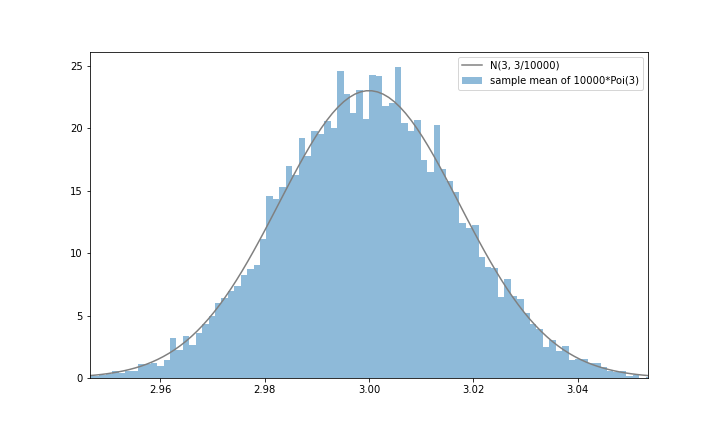

조금 울퉁불퉁하지만 정규분포 형태에 가까워지고 있음을 알 수 있습니다. 여기서는 포아송 분포에서 중심극한정리를 확인했지만, 반드시 다른 분포에서도 성립하고 있는지 확인하기 바랍니다.


### 3.4 대수의 법칙

표본평균에 관한 정리에서, 중심극한정리만큼 중요한 것이 **대수의 법칙**(law of large numbers)입니다. 대수의 법칙은 표본 크기를 키우면 표본평균은 모평균에 수렴한다고 주장하는 정리입니다.(여기에서 말하는 수렴은 확률의 수렴이지만, 이 책의 범위를 넘기 때문에 설명은 생략합니다. 여기에서는 표본 크기를 키울수록 표본 평균이 모평균에 가까워진다고만 이해하면 충분합니다)  예를 들어, 주사위를 몇 번이고 굴리면 6이 나오는 확률은 1/6에 가까워진다는 것을 직감적으로 이해할 수 있습니다. 이것을 수학적으로 증명하는 것이 대수의 법칙입니다.

**대수의 법칙**

확률변수 X~1~, X~2~, ... , X~n~이 서로 독립이고, 평균이 μ, 분산이 σ^2^일 것 같은 확률분포를 따를 때, n이 커짐에 따라 표본평균은 μ에 수렴합니다.


대수의 법칙을 주사위가 6이 나오는지 여부로 확인해봅시다. 하나하나의 시행은 Bern(1/6)을 따르므로, 표본 크기가 커짐에 따라 표본평균은 1/6에 수렴할 것입니다.

여기서는 표본 크기가 10만인 무작위추출을 네 번 합니다.

```python
p = 1/6
rv = stats.bernoulli(p)

n = int(1e5)
sample = rv.rvs((n, 4))
space = np.linspace(100, n, 50).astype(int)
plot_list = np.array([np.mean(sample[:sp], axis = 0) for sp in space]).T
```


네 번 시행한 무작위추출 각각에서 표본평균으로 사용하는 표본 크기를 서서히 키우면, 표본평균은 어떻게 변화하는지 그려보겠습니다.

```python
fig = plt.figure(figsize = (10, 6))
ax = fig.add_subplot(111)

for pl, ls in zip(plot_list, linestyles):
    ax.plot(space, pl, ls = ls, color = 'gray')
ax.hlines(p, -1, n, 'k')
ax.set_xlabel('sample size')
ax.set_ylabel('sample mean')

plt.show()
```

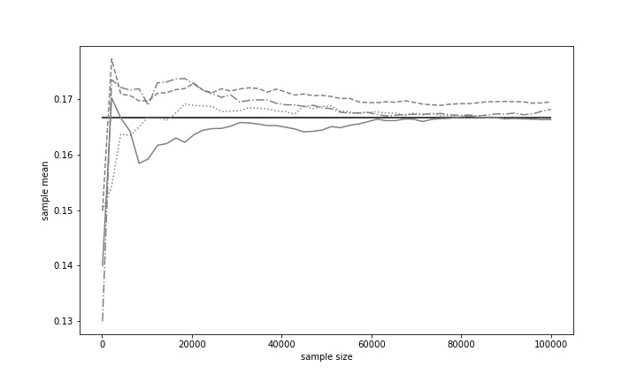

표본 크기가 작을 때는 변동이 있지만, 표본 크기가 커지면서 어떠한 무작위추출도 그 결과는 1/6에 가까워지고 있음을 알 수 있습니다.

