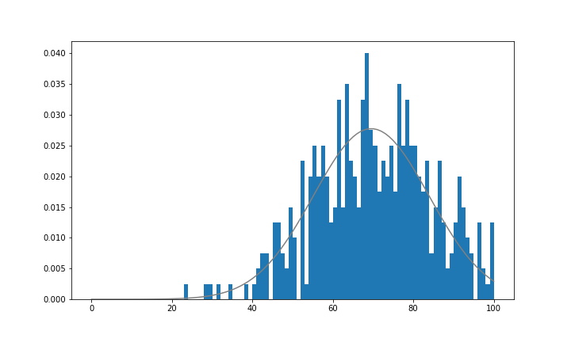
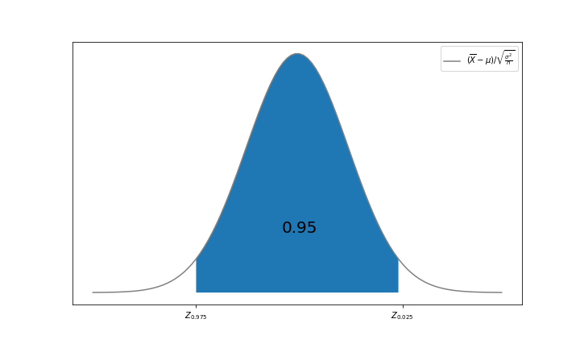
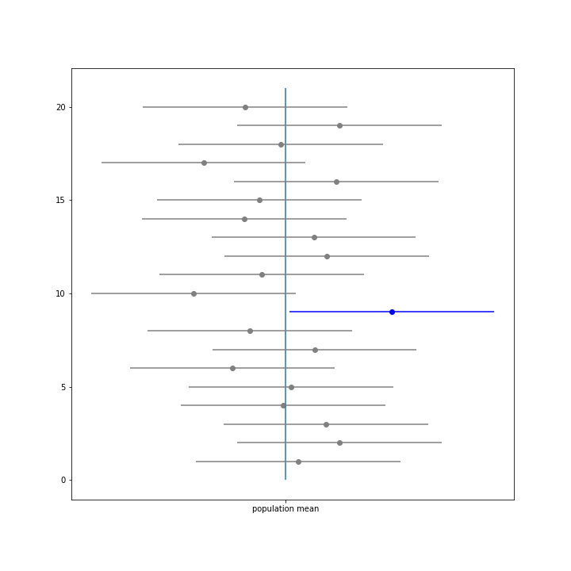
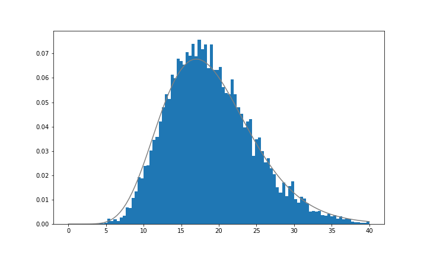
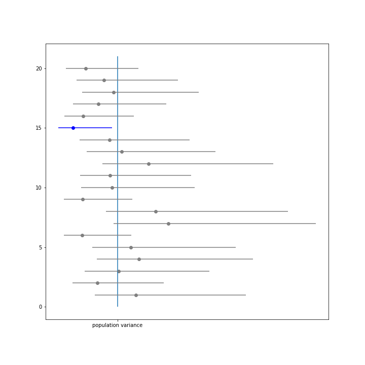

# Chapter 10. 통계적 추정

드디어 이 장부터 본격적으로 추측통계에 대한 이야기로 들어갑니다. 지금까지는 모두 추측통계를 배우기 위한 준비 과정이었기 때문에 '왜 이런 내용을 배우는 걸까?'라고 생각했을 수도 있습니다. 그러나 이 장부터 배울 추측통계에 관한 내용을 통해 지금까지 익힌 개념들이 서서히 연결되어갈 것입니다.

추측통계에는 추정과 검정이 있지만, 이 장에서는 추정을 설명합니다. 추정은 다시 점추정과 구간추정으로 구별됩니다. 10.1절에서 점추정을, 10.2절에서 구간추정을 다루겠습니다. 점추정은 추정하고 싶은 모평균이나 모분산이라는 모수를 하나의 수치로 추정하는 방법이고, 구간추정은 폭(구간)으로 모수를 추정하는 방법입니다.

이 장에서도 구체적인 예로 4장의 데이터를 이용합니다. 4장에서 A학생은 모평균에 관한 점추정을 수행했지만, 이 장에서는 더 나아가 모평균에 관한 구간추정, 모분산에 관한 점추정과 구간추정을 수행합니다. 가지고 있는 데이터가 20명뿐인 A 학생이 전교생 400명의 평균 점수나 모분산을 어느 정도 추정할 수 있을까요?

우선 늘 그랬듯이 라이브러리를 임포트합시다.

```python
import numpy as np
import pandas as pd
import matplotlib.pyplot as plt
from scipy import stats

%precision 3
%matplotlib inline
```


테스트 데이터를 주닙해둡니다.

```python
df = pd.read_csv('ch4_scores400.csv')
scores = np.array(df['score'])
```


미리 정답이 되는 모평균 μ와 모분산 σ^2^을 구해둡니다. 문장 안에서는 모평균과 모분산을 각각 μ,σ^2^으로 표기하지만, 코드 안에서는 변수명으로 p_mean과 p_var를 사용하기로 합니다.

```python
p_mean = np.mean(scores)
p_var = np.var(scores)

p_mean, p_var
```

```python
(69.53, 206.6691)
```


8.1절에서 설명한 것처럼, 응시자가 많은 시험 점수는 정규분포를 따르는 것으로 근사할 수 있습니다. 이 때문에 10.2절에서 설명하는 구간추정에서는 모집단이 정규분포를 따른다고 가정하여 추정을 수행합니다. 정규분포라는 가정이 어느 정도 타당한지 알기 위해 전교생의 히스토그램에 N(μ,σ^2^)을 중첩시켜 그려보겠습니다.

```python
fig = plt.figure(figsize = (10, 6))
ax = fig.add_subplot(111)

xs = np.arange(101)
rv = stats.norm(p_mean, np.sqrt(p_var))
ax.plot(xs, rv.pdf(xs), color = 'gray')
ax.hist(scores, bins = 100, range = (0, 100), density = True)

plt.show()
```



깨끗하게 정규분포가 된 것은 아니지만, 정규분포에 가까운 특징을 지닌 분포가 된 것 같습니다.

A 학생이 무작위추출한 20명의 표본 데이터를 준비해둡시다. A 학생이 알고 있는 것은 이 표본 데이터뿐입니다.

```python
np.random.seed(0)
n = 20
sample = np.random.choice(scores, n)
sample
```

```python
array([49, 60, 72, 86, 52, 61, 77, 91, 80, 56, 69, 67, 90, 56, 75, 79, 60,
       79, 68, 81], dtype=int64)
```


A 학생의 데이터와는 별도로, 표본 크기가 20인 표본 데이터를 1만 개 준비해둡시다. 여기서는 이 데이터를 사용하여 평균과 분산을 어느 정도의 정확도로 추측할 수 있는지 시뮬레이션합니다.

```python
np.random.seed(1111)
n_samples = 10000
samples = np.random.choice(scores, (n_samples, n))
```


## 01. 점추정

점추정에서는 모평균이나 모분산 등의 모수를 하나의 수치로 추정합니다. 4장에서 A 학생이 모평균을 추정한 방법이 바로 점추정이고, 추정량에 표본평균을 사용함으로써 모평균을 잘 추정할 수 있었습니다.

이 절에서는 어떻게 표본평균을 사용하면 모평균을 잘 추정할 수 있는지, 모분산을 점추정할 때 어떤 통계량을 사용하면 잘 추정할 수 있는지를 설명합니다.


### 1.1 모평균의 점추정

9장에서 살펴본 것처럼, 무작위추출로 얻은 20명의 시험 점수는 기댓값이 μ이고 분산이 σ^2^인 확률분포를 따르고, 서로 독립인 확률변수 X~1~, X~2~, ... , X~20~이라고 생각할 수 있습니다. 그리고 그것으로부터 계산되는 표본평균 X바 = X~1~, X~2~, ... , X~n~ / n 도 확률변수가 되고, 시행할 때마다 얻게 되는 결과는 다릅니다.

```python
for i in range(5):
    s_mean = np.mean(samples[i])
    print(f'{i+1}번째 표본평균: {s_mean:.3f}')
```

```python
1번째 표본평균: 67.000
2번째 표본평균: 72.850
3번째 표본평균: 69.200
4번째 표본평균: 64.450
5번째 표본평균: 72.650
```


이 표본평균 X바의 기댓값은 9.3절에서 확인한 것처럼 E(X바) = μ가 되고, 모평균과 일치합니다. 이렇게 추정량의 기댓값이 추측하려는 모수가 되는 성질을 **불편성**(unbiasedness)이라 하고, 불편성을 가진 추정량을 **불편추정량**(unbiased estimator)이라고 합니다.

표본평균 X바의 기댓값이 모평균 μ인 것을 대수의 법칙을 사용하여 확인해보겠습니니다. 준비해둔 1만 개의 표본 데이터 각각에 관해서 표본평균을 구하고, 그 평균을 계산해보겠습니다.

```python
sample_means = np.mean(samples, axis = 1)
np.mean(sample_means)
```

```python
69.53799999999998
```


모평균은 69.530이었으므로, 표본평균의 기댓값은 모평균이 되는 것 같습니다. 표본평균이 모평균을 잘 추정할 수 있는 근거 중 하나가 바로 이 불편성입니다.

불편성 외에도 추정량이 가지고 있으면 좋은 성질이 또 하나 있습니다. 이것으로 표본 크기 n을 증가시키면 추측하기 원하는 모수에 수렴해가는 성질입니다. 이 성질을 **일치성**(consistency)이라 하고, 일치성을 지닌 추정량을 **일치추정량**(consistent estimator)이라고 합니다. 

표본평균은 일치추정량입니다. 표본 크기 n을 100만으로 할 때의 표본평균 X바를 살펴봅시다.

```python
np.mean(np.random.choice(scores, int(1e6)))
```

```python
69.542954
```


모평군에 가까운 값이 되었습니다. 표본 크기 n을 증가시키면 표본평균은 모평균에 수렴합니다.

지금까지 확인한 불평성과 일치성은 추정량의 바람직한 성질입니다. 표본평균은 불편성과 일치성을 모두 가지고 있기 때문에, 모평균을 잘 추정한다고 말할 수 있습니다. 이 책에서는 불편성과 일치성을 지닌 추정량을 좋은 추정량이라고 부르겠습니다.(불편성과 일치성 외에도 추정량이 지닌 바람직한 성절로 **유효성**(efficiency)이 있습니다. 유효성은 불편성을 보다 강력하게 한 것이므로, 불편추정량 중에서도 분산이 최소가 되는 추정량이 지닌 성질입니다. 따라서 유효성을 지닌 추정량 쪽이 더 '좋은 추정량'이라고 할 수 있습니다. 그러나 유효성은 확인하기 어려운 성질이기 때문에, 이 책에서는 불편성과 일치성을 지닌 추정량을 '좋은 추정량'으로 다룹니다.)

새롭게 A 학생이 추출한 표본으로 표본평균을 계산해둡시다.

```python
s_mean = np.mean(sample)
s_mean
```

```python
70.4
```


10.2절에서 A 학생은 이 표본을 토대로 모평균의 구간추정을 수행합니다.


### 1.2 모분산의 점추정

표본평균은 모평균의 좋은 추정량이었습니다. 따라서 표본분산이 모분산의 좋은 추정량이 될 것이라는 생각은 자연스러운 발상입니다. 정말 그런지 확인해봅시다.

표본평균과 마찬가지로 표본분산 1/n*시그마(1~n) (X~i~-X바)^2^은 확률변수가 되었으므로, 시행할 때마다 결과가 달라집니다.

```python
for i in range(5):
    s_var = np.var(samples[i])
    print(f'{i+1}번째 표본분산: {s_var:.3f}')
```

```python
1번째 표본분산: 116.800
2번째 표본분산: 162.928
3번째 표본분산: 187.060
4번째 표본분산: 149.148
5번째 표본분산: 111.528
```


표본분산이 모분산의 불편추정량이 되는지 대수의 법칙으로 확인해봅시다. 준비해둔 1만 개의 표본 데이터 각각에 관해서 표본분산을 구하고, 그 평균을 계산해보겠습니다.

```python
sample_vars = np.var(samples, axis = 1)
np.mean(sample_vars)
```

```python
196.34417850000003
```


모분산 σ^2^ = 206.669에 비해 작은 값이 되었습니다. 아무래도 표본분산은 모분산의 불편추정량이 아닌 것 같습니다.

그렇다면 모분산의 불편추정량이 되는 표본통계량은 무엇일까요? 그것은 **불편분산**(unbiased variance)입니다. 불편분산은 표본분산에서 나누는 수 n을 n-1로 하는 다음 식으로 계산됩니다. 표본분산은 S^2^으로 나타내지만, 불편분산은 s^2^으로 나타냅니다.


여기서 나누는 수 n-1은 **자유도**(degree of freedom)라고 부르는 값으로, 자유롭게 값을 취할 수 있는 변수의 개수입니다. 표본평균이라면, 식 안의 시그마(1~n) X~i~에는 아무 제약이 없고, 각 X~i~가 자유롭게 값을 취할 수 있으므로 자유도는 n이 됩니다. 그러나 분산의 경우에는 식 안의 시그마(1~n) (X~i~ - X바)^2^에서 각 X~i~가 1/n * 시그마(1~n) X~i~ = X바를 만족해야하는 제약이 생깁니다. 이 때문에 자유도가 하나 감소되어 n-1이 되는 것입니다. (모평균 μ가 알려져 있는 경우 (1~n) (X~i~ - X바)^2^으로 계산되는 표본통계량도 분산의 불편추정량이 됩니다. 이 경우 X바에 의한 제약이 없기 때문에 자유도가 줄어들지 않습니다. 따라서 n으로 나눈 것이 불편추정량이 됩니다.) 왜 자유도로 나누면 불편성을 가지는가에 관한 이야기는 생략합니다. 다만, 불편추정량이 되기 위해 자유도로 나누는 연산은 12장에도 나오는 중요한 사고방식이라는 점만 말해둡니다.

NumPy에서는 불편분산을 var 함수의 ddof 인수에 1을 지정함으로써 계산할 수 있습니다.(ddof는 Delta Degrees Of Frrdom(자유도의 차이)이므로, 본래의 자유도 n과의 차이를 의미합니다. 그래서 자유도 n-1로 계산하기 원하는 경우에는 ddof 인수를 1로 지정하는 것 입니다.) 표본분산의 경우와 마찬가지로. 대수의 법칙을 사용하여 불편분산의 기댓값을 확인해봅시다.

```python
sample_u_vars = np.var(samples, axis = 1, ddof = 1)
np.mean(sample_u_vars)
```

```python
206.67808263157895
```


모분산에 가까운 값이 되고, 모분산의  불편추정량이 된 것 같습니다. 불편분산은 모분산의 일치 추정량도 되었습니다. 표본 크기 n을 100만으로 하여 확인해보겠습니다.

```python
np.var(np.random.choice(scores, int(1e6)), ddof = 1)
```

```python
207.08336592317
```


모분산에 가까운 값이 되고, 일치추정량이 된 것 같습니다. 이 결과로부터 불편분산은 모분산에 대해  불편성과 일치성을 지닌 좋은 추정량임을 알았습니다.


마지막으로 A학생이 추출한 표본으로 불편분산을 계산해둡니다.

```python
u_var = np.var(sample, ddof = 1)
u_var
```

```python
158.25263157894742
```


### 1.3 정리

추정량은 불편성과 일치성을 가지는 것이 바람직하고, 두 성질을 갖춘 추정량을 이 책에서는 좋은 추정량이라고 합니다. 이 성질을 간략하게 정리하면 다음과 같습니다.

- 불편성: 기댓값이 추측하기 원하는 모수가 되는 성질
- 일치성: 표본 크기를 키우면 추측하기 원하는 모수에 수렴하는 성질


모평균과 모분산의 추정량에 관해서도 정리해둡니다.

**모평균과 모분산의 점추정**

X~1~, X~2~, ... , X~n~이 서로 독립이고 기댓값이 μ, 분산이 σ^2^인 확률분포를 따를 때, 표본평균 X바와 불편분산 s^2^은 각각 모평균 μ와 모분산 σ^2^에 대해서 불편성과 일치성을 지닌 추정량이 됩니다.


## 02. 구간추정

10.1절에서는 표본평균과 불편분산이 각각 모평균과 모분산의 좋은 추정량이 된다고 배웠습니다. 그러나 표본평균이나 불편분산은 확률변수이므로, 아무리 좋은 추정량이라고 입증되어도 우연히 편향된 표본을 추출해버리는 경우 예상과 다른 추정이 될 가능성도 있습니다. 이 때문에 사전에 예상되는 오차를 예측하고 모평균이 이 범위에 있다는 주장을 할 수 있으면 보다 좋은 추정이 될 것 같습니다. 그것이 이 절에서 배우는 구간추정입니다.


### 2.1 정규분포의 모평균 구간추정 : 모분산을 알고 있는 경우

먼저 다룰 내용은 모평균의 구간추정입니다. 여기서는 모집단으로 정규분포를 가정하고, 더 나아가 그 모분산을 알고 있는 경우를 생각합니다.

모집단으로 정규분포를 가정했으므로 9.3절에서 배운 것처럼 표본평균 X바는 N(μ, σ^2^/n)을 따릅니다. 결국 표본평균이라는 추정량은 기댓값 그 자체인 모평균 μ와 표준편차 루트(σ^2^/n)으로 분산되어 있습니다. 이와 같은 추정량의 표준편차를 **표준오차**(stamdard error)라고 합니다. 여기서는 모분산 σ^2^을 알고 있는 상황을 생각하고 있으므로 표준오차 루트(σ^2^/n)을 계산할 수 있고, 추정량의 오차를 예측할 수 있습니다.

표본평균 X바는 N(μ, σ^2^/n)을 따르고 있으므로 Z = (X바 - σ) / 루트(σ^2^/n)으로 표준화하여 표준정규분포로 변환할 수 있습니다. 표준정규분포로 변환하여 8.1절에서 설명한 100(1-α)% 구간을 계산할 수 있어 좋습니다.

여기에서는 95% 구간을 생각합시다. 그러면 (X바 - σ) / 루트(σ^2^/n)에 관해서 다음 부등식을 세울 수 있습니다.


이 식은 다음 그림에 제시한 것처럼 확률변수 X바 - σ) / 루트(σ^2^/n)이 구간 [z~0.975~, z~0.25~]에 위치할 확률이 95%임을 나타냅니다.



추가로 이 식을 P안의 내용이 μ에 관한 부등식이 되도록 변환하면 다음과 같습니다.


이 식은 다음의 구간이 모평균 μ를 포함하는 확률이 95%라고 해석할 수 있습니다.


그리고 이 구간 자체가 구간추정으로 구한 것이므로, 이것을 신뢰수준 95%인 **신뢰구간**(confidence interval, CI) 또는 단순히 95% 신뢰구간이라고 합니다. 신뢰구간의 상한과 하한을 각각 **신뢰상한**(upper confidence limit), **신뢰하한**(lower confidence limit)이라고 합니다. 

보다 일반화하여 100(1-α)% 신뢰구간에 관한 식을 정리하면 다음과 같습니다. 이 결과를 보면 추정량의 표준오차 루트(σ^2^/n)이 구간 폭을 결정함을 잘 알 수 있습니다.

**모분산을 알고 있을 때 모평균의 신뢰구간**

X~1~. X~2~, ... , X~n~~(iid)N(μ, σ^2^)일 때 모분산 σ^2^을 알고 있다면, 신뢰수준 100(1-α)%인 신뢰구간은


이 됩니다.

이제 파이썬을 사용해 구현해봅시다. A 학생이 취득한 표본 데이터로 모평균의 95% 신뢰구간을 구해보겠습니다. stats.norm을 사용하여 식대로 구현하면 다음과 같습니다.

```python
rv = stats.norm()
lcl = s_mean - rv.isf(0.025) * np.sqrt(p_var/n)
ucl = s_mean - rv.isf(0.975) * np.sqrt(p_var/n)

lcl, ucl
```

```python
(64.09956018535247, 76.70043981464754)
```


모평균의 95% 신뢰구간을 [64.1, 76.7]로 구했습니다. 모평균 값은 69.53점이었으므로, 구간내에 포함되어 있음을 알 수 있습니다.

무사히 신뢰구간을 구할 수 있었지만, 신뢰구간에 대한 해석은 조금 이해하기 어렵습니다. 95% 신뢰구간이 [64.1, 76.7]일 때 일반적으로는 모평균이 95%의 확률로 구간 [64.1, 76.7]에 들어간다고 해석하고 싶겠지만 그렇게 해석하면 안 됩니다. 이 해석은 [64.1. 76.7]이라는 구간추정을 계속하면 100번 중 95번의 비율로 모평균이 포함된다는 뜻이기 때문입니다. 하지만 [64.1, 76.7]이라는 구간추정을 100번 하더라도 모평균은 실제 값이 하나로 정해져 있기 때문에 그 결과는 100번 모평균이 포함되는가, 한 번도 포함되지 않는가 어느 한 쪽으로밖에 말할 수 없습니다.

95% 신뢰구간 [64.1, 76.7]에 대한 바른 해석은 '동일한 방법으로 수차례 표본추출하여 구간추정을 하면, 그중에 95%의 구간추정에는 모평균이 포함되어 있다'입니다. 어디까지나 확률적으로 변동하는 것은 구간 쪽이지, 모평균이 아니라는 점에 주의하기 바랍니다.

여기서는 실험적 신뢰구간의 계산을 20번 수행하고, 그중에 몇 번 모평균을 포함하고 있는지 그려보겠습니다. 중앙의 세로선은 평균이고, 모평균을 포함하지 않은 구간추정은 다른 색깔로 표시되어 있습니다.

```python
fig = plt.figure(figsize=(10, 10))
ax = fig.add_subplot(111)

rv = stats.norm()
n_samples = 20
ax.vlines(p_mean, 0, 21)
for i in range(n_samples):
    sample_ = samples[i]
    s_mean_ = np.mean(sample_)
    lcl = s_mean_ - rv.isf(0.025) * np.sqrt(p_var/n)
    ucl = s_mean_ - rv.isf(0.975) * np.sqrt(p_var/n)
    if lcl <= p_mean <= ucl:
        ax.scatter(s_mean_, n_samples-i, color='gray')
        ax.hlines(n_samples-i, lcl, ucl, color='gray')
    else:
        ax.scatter(s_mean_, n_samples-i, color='b')
        ax.hlines(n_samples-i, lcl, ucl, color='b')
ax.set_xticks([p_mean])
ax.set_xticklabels(['population mean'])

plt.show()
```



20번 중 1번 모평균을 포함하지 않는 구간추정이 수행되었습니다. 이것이 바로 95% 신뢰구간의 이미지입니다.

이번에는 신뢰구간을 1만 번 계산하고, 신뢰구간에 모평균이 포함된 것은 몇 %인지 시뮬레이션으로 알아봅시다.

```python
rv = stats.norm()
cnt = 0

for sample_ in samples:
    s_mean_ = np.mean(sample_)
    lcl = s_mean_ - rv.isf(0.025) * np.sqrt(p_var/n)
    ucl = s_mean_ - rv.isf(0.975) * np.sqrt(p_var/n)
    if lcl <= p_mean <= ucl:
        cnt += 1
cnt/ len(samples)
```

```python
0.951
```


### 2.2 정규분포의 모분산 구간추정

이번에도 모분산의 구간추정을 수행합니다. 여기서는 모집단으로 정규분포를 가정하고, 모평균은 모르는 경우를 생각합니다.

모분산의 구간추정을 할 때 다음의 형태를 목표로 하고 싶습니다.


이를 위해서는 표본평균 X바를 표준화하여 표준정규분포를 따르는 확률변수로 변환한 것처럼, 불편분산 s^2^도 어떤 변환을 하여 대표적인 확률분포를 따르는 확률변수를 생성할 필요가 있습니다.

이때 사용되는 확률분포가 카이제곱분포로, 불편분산 s^2^에 Y=(n-1)s^2^/ σ^2^이라는 변환을 함으로써 Y~X^2^(n-1)이 된다고 알려져 있습니다.

이를 파이썬으로 확인해봅시다. 우선 준비해둔 1만 개의 표본 데이터에서 Y의 표본 데이터를 생성합니다.

```python
sample_y = sample_u_vars * (n-1)/p_var
sample_y
```

```python
array([11.303, 15.767, 18.102, ..., 19.435,  9.265, 18.625])
```


Y의 표본 데이터 히스토그램과 함께 X^2^(n-1)의 밀도함수를 그립니다.

```python
fig = plt.figure(figsize = (10, 6))
ax = fig.add_subplot(111)

xs = np.linspace(0, 40, 100)
rv = stats.chi2(df = n-1)
ax.plot(xs, rv.pdf(xs), color = 'gray')
hist, _, _ = ax.hist(sample_y, bins = 100, range = (0, 40), density = True)

plt.show()
```



그림 10-1에서 보듯이, 시험 점수의 분포가 정규분포와 깨끗하게 일치하는 것은 아니므로 Y의 히스토그램이 조금 울퉁불퉁하지만, 대략 X^2^(n-1)과 일치한다고 말할 수 있겠습니다. 따르는 분포를 알았기 때문에 이제 모평균의 구간추정과 마찬가지 순서로 모분산의 구간추정을 수행할 수 있습니다.

모분산의 95% 신뢰구간을 구해봅시다. 우선 X^2^(n-1)의 95% 구간을 구합니다.


이 식을 P안의 내용이 σ^2^에 관한 부등식이 되도록 변형합니다.


이것으로 모분산 σ^2^의 신뢰수준 95%의 신뢰구간을 구하면 다음과 같습니다.


일반화하여 정리하면 다음과 같습니다.

**모분산의 신뢰구간**

X~1~, X~2~, ... , X~n~~(iid) N(μ, σ^2^)이라고 합시다. 모평균 μ가 알려져 있지 않을 때, 신뢰수준 100(1-α)%의 신뢰구간은 


으로 추정됩니다.


이제 구현으로 넘어갑니다. A 학생의 표본 데이터를 사용하여 95% 신뢰구간을 구합시다.

```python
rv = stats.chi2(df = n-1)
lcl = (n-1) * u_var / rv.isf(0.025)
hcl = (n-1) * u_var / rv.isf(0.975)

lcl, hcl
```

```python
(91.52471947132238, 337.5955129124592)
```


모분산의 95% 신뢰구간은 [91.525, 337.596]이 되었습니다. 모분산은 206.669였으므로 구간 내에 포함되어 있다는 것도 확인할 수 있습니다.

모분산의 95% 신뢰구간의 이미지를 보다 명확하게 하기 위해서, 신뢰구간의 추정을 20번 수행하고, 어느 정도 모분산을 포함하고 있는지 그려보겠습니다. 카이제곱분포가 왼쪽으로 치우치고 오른쪽으로 넓어지는 분포이므로, 불편분산에 대해서 오른쪽의 폭이 길어지고, 불편분산이 클수록 구간추정의 폭이 길어지고 있다는 것을 알 수 있습니다.

```python
fig = plt.figure(figsize=(10, 10))
ax = fig.add_subplot(111)

rv = stats.chi2(df=n-1)
n_samples = 20
ax.vlines(p_var, 0, 21)
for i in range(n_samples):
    sample_ = samples[i]
    u_var_ = np.var(sample_, ddof=1)
    lcl = (n-1) * u_var_ / rv.isf(0.025)
    ucl = (n-1) * u_var_ / rv.isf(0.975)
    if lcl <= p_var <= ucl:
        ax.scatter(u_var_, n_samples-i, color='gray')
        ax.hlines(n_samples-i, lcl, ucl, 'gray')
    else:
        ax.scatter(u_var_, n_samples-i, color='b')
        ax.hlines(n_samples-i, lcl, ucl, 'b')
ax.set_xticks([p_var])
ax.set_xticklabels(['population variance'])

plt.show()
```



이번에는 신뢰구간을 1만 번 계산하여 신뢰구간에 모분산이 포함된 것은 몇 %인지 시뮬레이션해보겠습니다.

```python
rv = stats.chi2(df = n-1)
cnt = 0
for sample_ in samples:
    u_var_ = np.var(sample_, ddof = 1)
    lcl = (n-1) * u_var_ / rv.isf(0.025)
    ucl = (n-1) * u_var_ / rv.isf(0.975)
    if lcl <= p_var <= ucl:
        cnt += 1
        
cnt / len(samples)
```

```python
0.964
```

신뢰구간의 약 96%가 모분산을 포함하고 있음을 확인할 수 있습니다.


### 2.3 정규분포의 모평균 구간추정 : 모분산을 모르는 경우

조금 전에 정규분포의 모평균 구간추정을 할 때 모분산은 알고 있는 상황으로 생각했습니다. 그러나 실제로는 모평균을 모르고 모분산만 알고 있는 상황은 별로 없고, 모분산을 모르는 상황에서 모평균의 구간추정을 하는 경우가 많습니다.

여기서는 모분산을 모르는 상황에서 모평균의 구간추정에 관해 설명합니다. 모분산을 모르면 구간추정이 더욱 복잡해질 것 같은 생각이 들지만 그렇지도 않습니다. 사용하는 확률분포는 달라도, 모분산을 알고 있는 경우와 거의 동일하게 구간추정을 알 수 있습니다.

모분산 σ^2^을 알고 있는 상황에서는 표본평균 X바의 표준오차 루트(σ^2^/n)으로 구간추정을 했습니다. 모분산 σ^2^을 알지 못하는 상황의 문제점은 이 표준오차 루트(σ^2^/n)을 계산할 수 없다는 점에 있습니다. 이 때문에, 여기서는 모분산 σ^2^ 대신 그 추정량인 불편분산 s^2^을 사용한 루트(s^2^/n)을 표준오차로 대신 사용합니다.

그렇다면 모분산을 알고 있는 상황과 마찬가지로, 루트(s^2^/n)을 사용하여 표본평균 X바에 대해서 다음과 같은 변환을 합시다.


이것은 표준화와 동일한 변환이지만, 실제의 표준오차를 사용하지 않기 때문에, t는 표준정규분포를 따르지 않습니다. 표준정규분포 Z = (X바 - μ) / 루트(σ^2^/n) 와 비교해보면, T = Z/ 루트(s^2^/σ^2^)가 되어 루트(s^2^/σ^2^)만 차이가 생기는 것 같습니다. 이 s^2^/σ^2^은 앞의 항에서 확인한 카이제곱분포의 관계식 Y = (n-1)s^2^/σ^2^을 사용함으로써 s^2^/σ^2^ = Y/n-1가 되는 것을 알았습니다.

결국 t는 표준정규분포 Z와 자유도 n-1인 카이제곱분포 Y에 의해


 나타낼 수 있습니다. 이것은 8.4절에서 설명한 t분포의 정의식과 같습니다. 결국 t는 자유도가 n-1인 t분포를 따르는 것을 알 수 있습니다(t분포의 정의에서 Y와 Z는 독립이 되어야 합니다. 증명은 생략하지만, 여기서 계산된 Y와 Z는 독립이 되어 있습니다.)

t=(X바 - μ) / 루트(s^2^/n)가 t(n-1)을 따른다고 알려져 있으므로, 모평균의 95% 신뢰구간을 구해봅시다. 우선 t(n-1)의 95% 구간을 구합니다.


이 식을 P안의 내용이 μ에 관한 부등식이 되도록 변형합니다.


이 식에 의해 모평균 μ의 신뢰수준 95%의 신뢰구간은


이라고 구할 수 있습니다. 사용하는 확률분포는 표준정규분포에서 자유도가 n-1인 t 분포로 바뀌었을 뿐 신뢰구간의 식은 거의 동일합니다.

**모분산을 알지 못할 때 모평균의 신뢰구간**

X~1~, X~2~, ..., X~n~~(iid) N(μ, σ^2^)이라고 합시다. 모분산 σ^2^이 알려져 있지 않을 때, 신뢰수준 100(1-α)%의 신뢰구간은


으로 추정됩니다.

이제 구현으로 넘어갑니다. A 학생이 추출한 표본으로 구간추정을 해봅시다.

```python
rv = stats.t(df = n-1)
lcl = s_mean - rv.isf(0.025) * np.sqrt(u_var/n)
ucl = s_mean - rv.isf(0.975) * np.sqrt(u_var/n)

lcl, ucl
```

```python
(64.51244886603887, 76.28755113396114)
```


모평균의 95% 신뢰구간은 [64.512, 76.288]입니다. 모평균의 값은 69.53점이었으므로, 구간 내에 포함되어 있다는 것도 확인했습니다.


### 2.4 베르누이 분포의 모평균 구간추정

지금까지는 시험점수라는 모집단에 정규분포를 가정할 수 있는 데이터를 사용하여 구간추정을 해보았습니다. 그러나 이 세상에는 정규분포를 가정할 수 있는 데이터만 있는 건 아닙니다.

예를 들어, 정권의 지지율이나 국민의 흡연율이라는 모집단의 비율 p를 추정하고 싶은 상황을 가정해봅시다. 이때의 표본 데이터는 출구조사나 길거리 설문조사에서 얻은 찬성/반대나 흡엽/금연이라는 2진 변수가 됩니다. 찬성은 1, 반대는 0과 같이 숫자에  대응시킨다 해도, 실수전체를 정의역으로 하는 정규분포를 이와 같이 2진 변수로 가정하는 것은 무리가 있습니다.

그렇다면 어떤 확률분포를 가정하면 좋은까요? 2진 변수에는 6.1절에서 살펴본 베르누이 분포가 사용됩니다. 모집단의 비율을 p라고 하면 출구조사나 길거리 설문조사에서 얻은 2진 변수의 표본은 Bern(p)를 따르는 확률변수라고 생각할 수 있습니다. 그리고 Bern(p)의 기댓값이 p가 되는 사실로부터 모집단의 비율 p는 모평균의 추정과 같은 구조라고 추정할 수 있습니다. 이 추정을 모비율의 추정이라고도 부릅니다.

실제로 모비율의 추정을 해봅시다. 여기에서 사용하는 데이터는 '어느 기업이 출시한 상품 A를 알고 있는가?'라는 길거리 설문조사를 전국적으로 수행하여 1000명에게 응답을 받은 것으로, ch10_enquete.csv에 있습니다. 이 데이터를 통해 상품 A에 대한 국민 전체의 인지도 p를 조사하는 것이 목표입니다.

```python
enquete_df = pd.read_csv('ch10_enquete.csv')
enquete = np.array(enquete_df['known'])
n = len(enquete)
enquete[:10]
```

```python
array([1, 0, 1, 1, 1, 1, 1, 0, 0, 1], dtype=int64)
```


'상품 A를 알고 있다.'가 1에, '상품 A를 알지 못한다'가 0에 각각 대응합니다. 각 데이터를 X~1~, X~2~, ... , X~n~이라고 하면, 이들은 서로 독립인 Bern(p)를 따릅니다. Bern(p)의 기댓값이 p, 분산이 p(1-p)이므로 표본평균 X바의 기댓값은 p, 분산은 p(1-p) / n가 됩니다.

우선 점추정을 해봅시다. 10.1절에서 살펴본 것처럼, 표본평균은 모평균의 좋은 추정량이 됩니다.

```python
s_mean = enquete.mean()
s_mean
```

```python
0.709
```


상품 A의 인지도는 70.9%라고 추정할 수 있습니다.

다음은 모평균의 95% 신뢰구간을 구해봅시다. 지금까지 해온 방법대로 표본평균 X바를 사용하여


의 형식으로 작성하고 싶지만, 우리는 베르누이 분포의 표본평균이 따르는 확률분포를 모릅니다.

그럴 때 힘을 발휘하는 것이 중심극한정리입니다. 중심극한정리에 따라 표본평균 X바는 근사적으로 N(p, p(1-p)/n)를 따릅니다. 이 정규분포를 표준화, 즉 Z=(X바 - p) / 루트(p(1-p) / n)로 변환하면, Z는 표준정규분포를 따르는 것으로 간주합니다.


지금까지 수행한 식의 변형과 거의 동일하지만, 첫 번째 줄에서 중심극한정리에 의해, 세 번째 줄에서 p(1-p)를 X바(1-X바)로 각각 근사하고 있다는 것에 주의하기 바랍니다. 결국, 모평균 p의 신뢰수준 95%의 신뢰구간은 [X바 - z~0.025~루트(X바(1-X바)/)]로 구할 수 있습니다.

일반화하여 정리하면 다음과 같습니다.

**베르누이 분포의 모평균의 신뢰구간**

X~1~, X~2~, ... , X~n~ ~(iid)Bern(p)라고 합시다. 모평균의 신뢰수준 100(1-α)%의 신뢰구간은


로 추정됩니다.

이제 파이썬으로 구현해봅시다.

```python
rv = stats.norm()
lcl = s_mean - rv.isf(0.025) * np.sqrt(s_mean*(1-s_mean)/n)
ucl = s_mean - rv.isf(0.975) * np.sqrt(s_mean*(1-s_mean)/n)

lcl, ucl
```

```python
(0.6808474522924337, 0.7371525477075662)
```


상품 A에 대한 인지도 p의 95% 신뢰구간은 [0.681, 0.737]이라는 것을 알 수 있습니다.


### 2.5 포아송 분포의 모평균 신뢰구간

모집단에 정규분포를 가정할 수 없는 예를 또 하나 살펴보고 가겠습니다. 여기서는 어떤 사이트에 대한 1시간당 액세스 수가 과거 72시간 분량이 들어 있는 데이터 ch10_access.csv를 사용하여, 이 사이트에 대한 1시간당 평균 액세스 수를 추정합니다.

```python
n_access_df = pd.read_csv('ch10_access.csv')
n_access = np.array(n_access_df['access number'])
n = len(n_access)
n_access[:10]
```

```python
array([10, 11,  9,  9, 18, 13,  4, 10, 10,  8], dtype=int64)
```


이와 같이 단위시간당 발생하는 건수에는 6.4절에서 설명한 포아송 분포를 사용합니다. 각 데이터를 X~1~, X~2~, ... , X~n~이라고 하면, 이들은 서로 독립이고 Poi(λ)를 따릅니다. Poi(λ)의 기댓값과 분산은 모두 λ이었기 때문에 이 표본평균 X바의 기댓값은 λ, 분산은 λ/n가 됩니다. 우선 모평균 λ를 추정합시다.

```python
s_mean = n_access.mean()
s_mean
```

```python
10.444444444444445
```


1시간당 평균 액세스 수는 10.444건임을 알았습니다.


다음으로 구간추정을 해봅시다. 포아송 분포의 표본평균이 따르는 확률분포는 알지 못하므로 중심극한정리를 사용합시다. 중심극한정리에 의해 표본평균 X바는 근사적으로 N(λ, λ/n)를 따릅니다. 이 정규분포를 표준화, 즉 Z = (X바 - λ) / 루트(λ/n)로 변환하면, Z는 표준정규분포를 따르는 것으로 간주합니다.

모평균 λ의 95% 신뢰구간을 구해봅시다.


첫 번째 줄에서 중심극한정리에 의해, 세 번째의 λ를 X바로 각각 근사하고 있습니다. 결국 모평균 λ의 신뢰수준 95%의 신뢰구간은 [X바 - z~0.025~루트(X바/n) ≤ λ ≤ X바 - z~0.975~루트(X바/n)]라고 구할 수 있습니다.

일반화하여 정리하면 다음과 같습니다.

**포아송 분포의 모평균의 신뢰구간**

X~1~,X~2~, ... , X~n~~(iid)Poi(λ)라고 합시다. 모평균의 신뢰수준 100(1-α)%의 신뢰구간은


로 추정됩니다.

파이썬으로 구현해봅시다.

```python
rv = stats.norm()
lcl = s_mean - rv.isf(0.025) * np.sqrt(s_mean/n)
ucl = s_mean - rv.isf(0.975) * np.sqrt(s_mean/n)

lcl, ucl
```

```python
(9.697953549598202, 11.190935339290688)
```


사이트에 대한 평균 액세스 수의 95% 신뢰구간은 [9.698, 11.191]임을 알 수 있습니다.

