# Chapter 11. 통계적 가설검정

이 장에서는 통계적 가설검정에 대해서 다룹니다. 통계적 가설검정이란 모집단의 모수에 관한 가설을 세우고 표본의 정보를 이용해 그 가설을 검증하는 기법입니다. 통계적 가설검정의 간단한 예로서 다음과 같은 상황을 생각해봅시다.


A 학생은 학교에서 돌아오는 길에 종종 편의점에 들러 감자튀김을 구매한다. 이 감자튀김의 무게는 평균 130g으로 알려져 있지만, 어느 날 A 학생이 감자튀김의 무게를 측정해보았더니 122.02g밖에 되지 않았다. 이 편의점에서 파는 감자튀김의 무게가 실제로는 평균인 130g보다 적게 나가는게 아닌가 의구심이 들기 시작한 A 학생은, 그날부터 2주간 매일 감자튀김을 사서 무게를 측정하였다. 그리고 2주 후, 그동안 구매한 14개 표본의 평균을 계산한 결과 128.451g이 나왔다. 14개 표본의 평균 무게가 130g보다 적다고 확신한 A학생은 편의점에 항의했지만, 편의점 측은 그저 우연일 뿐이라고 일축해버렸다. 14개 표본의 평균이 128.451g으로 나온 건 정말 우연이었을까?


이런 상황에서 우연인지 여부를 판단하는 편리한 도구가 통계적 가설검정입니다. 11.1절에서는 감자튀김 무게의 평균값을 검증하는 방법으로 통계적 가설검정의 개념을 설명합니다. 뒤이어 11.2절과 11.3절에서는 다양한 상황에서의 가설검정을 다룹니다.

언제나 그랬듯이, 먼저 라이브러리를 임포트합니다.

```python
import numpy as np
import pandas as pd
from scipy import stats

%precision 3
np.random.seed(1111)
```


감자튀김의 무게 데이터는 ch11_potato.csv에 있습니다.

```python
df = pd.read_csv('../data/ch11_potato.csv')
sample = np.array(df['무게'])
sample
```

```python
array([122.02, 131.73, 130.6 , 131.82, 132.05, 126.12, 124.43, 132.89,
       122.79, 129.95, 126.14, 134.45, 127.64, 125.68])
```


표본평균을 구해봅시다.

```python
s_mean = np.mean(sample)
s_mean
```

```python
128.4507142857143
```


## 01. 통계적 가설검정

**통계적 가설검정**(statistical hypothesis testing)이란 모집단의 모수에 관하여 두 가지 가설을 세우고, 표본으로부터 계산되는 통계량을 이용하여 어느 가설이 옳은지 판단하는 통계적인 방법입니다. 간단하게 가설검정이나 검정으로 부르기도 합니다. 이 절에서는 가설검정의 개념을 쉽게 이해할 수 있도록 감자튀김의 예를 사용해 관련된 용어들을 설명합니다.


### 1.1 통계적 가설검정의 기본

A 학생이 감자튀김에 관해 확인하고 싶은 것은 모평균이 130g보다 적은지 여부입니다. 여기서는 감자튀김의 모집단이 정규분포를 따르고 있고, 모분산이 9임을 알고 있다고 전제합니다.

이 경우의 가설검정에서는 우선 '모평균이 130g'이라는 가정을 합니다. 이 가정을 기초로, 감자튀김 14개의 표본은 X~1~, X~2~, ... , X~14~~(iid) N(130.9)를 따르고, 표본평균 X바는 N(130, 9/14)를 따르는 것이 됩니다. 표본평균 X바는 확률변수이므로, 125g이라는 작은 값이 되기도 하고 135g이라는 큰 값이 되기도 합니다.

여기서 표본평균  X바가 P(X바 ≤ x) = 0.05를 만족하는 x를 생각합시다.

```python
rv = stats.norm(130, np.sqrt(9/14))
rv.isf(0.95)
```

```python
128.68118313069039
```


P(X바 ≤ 128.681) = 0.05가 되고, 표본평균이 128.681g 이하의 무게가 되는 것은 5%의 확률로 발생한다는 것을 알았습니다. 이 결과로 보면, A 학생이 추출한 표본평균이 128.451g이 되었던 것은 5%의 확률로 발생하는 드문 사건이라고 할 수 있습니다. 

감자튀김을 구매했는데 표본평균이 128.451g이 된 경우, 이런 상황은 5%의 확률로만 일어나므로 그저 운이 나빴다고 생각하는 너그러운 사람도 있을 겁니다. 하지만 가설검정을 수행한 A학생은 그것을 우연이라고 여기지 않고 가정이 이상하다고 생각합니다. 결국 표본평균이 128.681g 이하인 128.451g이 되었다는 것은 '모평균이 130g'이라는 가설 아래에서 5%의 확률로 발생하는 사건이 우연히 일어난 것이 아니라, 원래 '모평균이 130g보다 작은게 아닐까?'라는 생각을 하게 합니다. 이에 따라 '모평균이 130g보다 작다.'라고 결론을 내리는 것이 가설검정의 큰 흐름입니다.

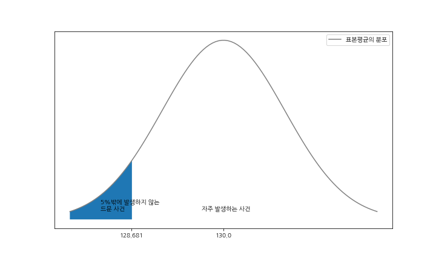

가설검정의 흐름을 이해했으리라 생각합니다. 그러면 이제부터 용어를 설명합니다. 가설검정에서는 모수에 관한 두 가설, **귀무가설**(null hypothesis)과 **대립가설**(alternative hypothesis)을 사용합니다. 대립가설이 주장하고 싶은 가설로 '차이가 있다.'나 '효과가 있다.'라는 내용이 됩니다. 귀무가설은 대립가설과는 반대로 '차이가 없다.'나 '효과가 없다.'라는 내용이 됩니다. 귀무가설과 대립가설은 각각 H~0~, H~1~으로 표기합니다.

대립가설과는 반대로 '차이가 없다.'나 '효과가 없다.'라는 내용이 됩니다. 귀무가설과 대립가설은 각각 H~0~, H~1~으로 표기합니다.

이 두 가설을 검정하기 위해, 표본으로부터 통계량을 계산하여 가설검정을 수행하는 것입니다. 그에 따른 결론은 '귀무가설을 기각한다.(reject the null hypothesis)'나 '귀무가설을 채택한다.(accept the null hypothesis)'중 하나입니다. '귀무가설을 기각한다.'는 귀무가설을 옳지 않다는 결론입니다. 한편 '귀무가설을 채택한다.'는 귀무가설이 옳지 않다고 말할 수 없다고 해석합니다. 즉, 귀무가설이 옳은지 여부를 알 수 없다고 보류하는 결론이 됩니다.

'귀무가설을 기각한다/채택한다.'의 판단은 귀무가설의 가정을 바탕으로 했을 때 표본으로부터 계산되는 통계량이 드문 값인지 여부로 결정합니다. 드문 값을 얻으면, 그것은 우연이 아니라 어떤 의미있는 값이라고 생각하여 귀무가설을 기각하고, 그렇지 않으면 귀무가설을 채택합니다. 여기에서 우연이 아니라 어떤 의미가 있는 것을 **유의하다**(significant)라고 합니다.

앞에서 배운 용어들을 감자튀김의 사례에 적용해보겠습니다. 가설검정에서는 주장하고 싶은 가설이 대립가설이 되므로, 여기서 대립가설은 '모평균은 130g보다 작다.'입니다. 한편 귀무가설은 '모평균은 130g'입니다. 그리고 이 가설검정으로 얻게 될 결론은 둘 중 하나입니다. '귀무가설을 기각한다.' 즉, '모평균은 130g보다 작다.'가 되거나 '귀무가설을 채택한다.' 즉, '모평균은 130g보다 작다고 말할 수 없다.'가 됩니다. 귀무가설을 채택한다고 해서, '모평균은 130g이다.'라는 결론이 되는 것은 아니라는 점에 주의하기 바랍니다.

조금 전에 확인했듯이, 귀무가설 '모평균은 130g이다.'라는 가정을 바탕으로 했을 때 표본평균이 128.451g이 되는 것은 유의하므로 귀무가설은 기각됩니다. 혹시 표본평균이 129g이었다면, 그것은 유의하지 않기 때문에 귀무가설은 채택됩니다.

정리하면 표본평균이 128.681g보다 작다면 귀무가설은 기각되고, 128.681g보다 크다면 귀무가설은 채택됩니다. 이처럼 귀무가설이 기각되는 구간을 **기각역**(rejection region)이라 하고, 채택되는 구간을 **채택역**(acceptance region)이라고 합니다. 위에 그림에서는 색깔이 칠해진 구간이 기각역이고, 그렇지 않은 구간이 채택역입니다. 위에 그림에서 색깔이 진하게 칠해진 영역의 면적이 기각역에 들어가는 확률이 되므로, 가설검정에서는 이 확률을 정하고 나서 검정을 수행합니다. 이 확률을 **유의수준**(level of significance)이라 하고, 경계선상의 값을 **임곗값**(critical value)이라고 합니다. 또한 검정에 사용되는 통계량을 **검정통계량**(test statistic)이라고 합니다. 감자튀김의 예에서는 유의수준을 5%로 설정했고, 검정통계량으로 표본평균을 사용했으며, 이때의 임곗값은 128.681이었습니다.(유의수준은 어느 정도의 확률로 발생하는 사건을 드물다고 인식하여 설정한 것으로, 5%나 1%라는 값이 자주 사용됩니다. 그러나 이 값들은 어디까지나 관습적인 값이라는 점에 유의하기 바랍니다. 이 책에서 수행하는 가설검정은 유의수준을 모두 5%로 설정했지만, 그 값에 특별한 근거는 없습니다.)

검정통계량이 임곗값보다 작으면 다음 그림과 같은 상태가 됩니다. 다음 그림의 임곗값보다 왼쪽에 있는 영역의 면적은 유의수준에 해당합니다. 마찬가지로 검정통계량보다 왼쪽에 있는 영역의 면적에는 **p값**(p-value)이라는 이름이 붙습니다.

가설검정은 검정통계량과 임곗값의 비교가 아닌, p값과 유의수준의 비교로 수행될 수도 있습니다. 그 경우 p값이 유의수준보다 작을 때에는 귀무가설을 기각하고, 그렇지 않을 때에 귀무가설을 채택합니다.

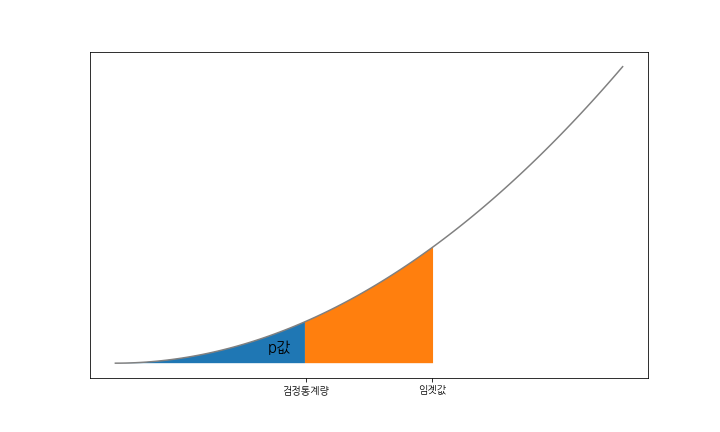

다시 한 번 감자튀김 무게의 평균값에 대한 가설검정을 생각해봅시다. 귀무가설 '모평균은 130g'이라고 가정한 것을 바탕으로, A학생이 구매한 14개의 감자튀김은 서로 독립이고 N(130, 9)를 따르며, 표본평균은 N(130, 9/14)을 따릅니다. 조금 전에는 검정통계량으로 표본평균 X바를 사용했지만, 여기서는 일반화하여 설명하고 싶기 때문에, 표본평균 X바를 표준화한 Z = (X바 - 130) / 루트(9/14)을 사용합니다. 표준화함으로써 상위 100α%점을 z~α~로 나타낼 수 있고, 임곗값을 P((X바 - 130) / 루트(9/14) ≤ x) = 0.05를 만족하는 x, 즉 x = z~0.95~를 구할 수 있습니다. 

이 가설검정에서는 검정통계량이 임곗값보다 작을 때 귀무가설을 기각하고 그렇지 않을 때 귀무가설을 채택하므로, 정리하면 다음과 같습니다.

-  (X바 - 130) / 루트(9/14) < z~0.95~이면 귀무가설을 기각
- (X바 - 130) / 루트(9/14) ≥ z~0.95~이면 귀무가설을 채택

파이썬으로 계산해봅시다. 우선 검정통계량 값을 구합니다.

```python
z = (s_mean - 130) / np.sqrt(9/14)
z
```

```python
-1.932298779026813
```


다음으로 임곗값을 구합니다.

```python
rv = stats.norm()
rv.isf(0.95)
```

```python
-1.6448536269514722
```


검정통계량과 임곗값을 비교하면 검정통계량 쪽이 작은 값입니다. 이 결과에 따라 귀무가설은 기각되고 평균은 130g보다 작다는 결론에 이릅니다. 당연하지만, 이 결론은 검정통계량으로 표본평균을 사용했을 때와 동일한 결론입니다.

p값을 사용한 가설검정에 대해서도 확인해보겠습니다. 우선 검정통계량으로부터 p값을 구합니다. 위에 그림을 보면 알 수 있듯이, p값은 누적분포함수를 사용해서 구할 수 있습니다.

```python
rv.cdf(z)
```

```python
0.026661319523126635
```


p값은 0.027로 유의수준 0.05보다 작은 값입니다. 따라서 귀무가설은 기각됩니다. p값을 기준으로 한 가설검정에서도 동일한 결론을 얻을 수 있습니다.

마지막으로 p값을 기준으로 수행하는 가설검정의 흐름을 순서도로 정리해둡니다.

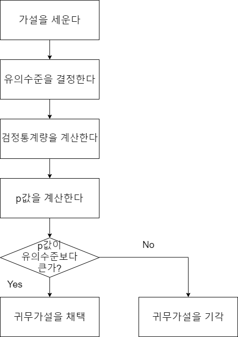


### 1.2 단측검정과 양측검정

A 학생은 감자튀김이 공식적으로 알려진 값인 130g보다 적은지 여부에만 흥미가 있기 때문에, '모평균은 130보다 작다.'라는 대립가설로 가설검정을 수행했습니다. 그러나 '모평균은 130g'이 아니다.' 라는 대립가설로 가설검정을 수행할 수도 있습니다. 이 경우, 모평균이 130g보다 작은 경우뿐 아니라 모평균이 130g보다 큰 경우도 고려하게 됩니다. 이와 같은 검정을 **양측검정**이라 합니다. 한편 A 학생이 수행했던 것처럼 한쪽만 수행하는 방법을 단측검정이라고 합니다.

 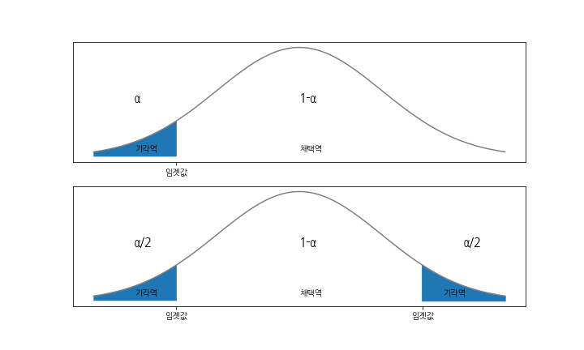

단측검정과 양측검정에서는 기각역이 다르다는 점에 주의하기 바랍니다. 동일한 유의수준 α의 검정이라도 위에 그림처럼 단측검정 쪽의 기각역이 넓어집니다. 단측검정은 양측검정보다 귀무가설을 기각하기 쉽습니다.

감자튀김의 예에서 유의수준 5%의 양측검정을 수행해봅시다. 검정통계량은 단측검정 때와 다르지 않습니다.

```python
z = (s_mean - 130) / np.sqrt(9/14)
z
```

```python
-1.932298779026813
```


양측검정이므로 임곗값은 표준정규분포의 95% 구간에 따라 구할 수 있습니다.

```python
rv = stats.norm()
rv.interval(0.95)
```

```python
(-1.959963984540054, 1.959963984540054)
```


임곗값과 검정통계량을 비교해보면, 검정통계량이 채택역에 들어 있다는 것을 알 수 있습니다. 즉, 양측검정에서는 귀무가설이 기각되지 않습니다. 이와 같이 양측검정과 단측검정을 비교하면, 단측검정 쪽이 귀무가설을 기각하기 쉽다는 사실을 기억해두기 바랍니다.

양측검정의 p값을 구할 때는 상단과 하단의 양쪽 면적을 고려할 필요가 있으므로 누적밀도함수의 값을 2배로 합니다.

```python
rv.cdf(z) * 2
```

```python
0.05332263904625327
```


### 1.3 가설검정의 두 가지 오류

가설검정은 표본을 이용하여 확률적으로 결론을 유도해가기 때문에, 판단을 잘못하는 경우가 있습니다. 가설검정의 잘못(오류)은 다음의 두 가지입니다.

- 제1종 오류: 귀무가설이 옳을 때, 귀무가설을 기각하는 오류
- 제2종 오류: 대립가설이 옳을 때, 귀무가설을 채택하는 오류

이것만으로는 이해하기 어려우므로 감자튀김의 예로 설명해보겠습니다.


#### 제1종 오류

감자튀김의 예에서 제1종 오류는 실제로 '평균이 130g'인데도 '평균은 130g보다 작다.'라는 결론을 내리는 상황입니다. 이것은 본래 검출하지 말아야 할 것을 검출한 것미으로 **오탐**(false positive)이라고도 부릅니다.

이와 같은 제1종 오류가 어느 정도의 비율로 발생하는지 시뮬레이션해봅시다. 실제로'평균은 130g'인 상황을 고려하고 있으므로, 모집단의 확률분포는 N(130, 3^2^)입니다.

```python
rv = stats.norm(130, 3)
```


이 모집단에서 14개의 표본을 추출하여 가설검정을 수행하는 작업을 10000번 합니다. 그리고 제1종 오류를 범하는 비율, 즉 '평균이 130g'인데도 '평균은 130g보다 작다.'라는 결론을 내려버리는 비율을 계산해봅니다.

```python
c = stats.norm().isf(0.95)
n_samples = 10000
cnt = 0
for _ in range(n_samples):
    sample_ = np.round(rv.rvs(14), 2)
    s_mean_ = np.mean(sample_)
    z = (s_mean_ - 130) / np.sqrt(9/14)
    if z < c:
        cnt += 1
cnt / n_samples
```

```python
0.053
```


제1종 오류를 범한 비율은 0.053입니다. 대략 5%의 비율로 '130g보다 작다.'라고 잘못 탐지(오탐)하는 것 같습니다.

제1종 오류를 범하는 확률을 **위험률**이라 부르고, 기호로는 α를 사용합니다. 위험률은 유의수준과 일치하므로 분석가가 제어할 수 있는 확률입니다. 결국 제1종 오류가 발생하는 확률을 1%로 하고 싶다면 분석가는 유의수준 1%에서 가설검정을 수행하면 됩니다.


#### 제2종 오류

감자튀김의 예에서 제2종 오류는, 실제로는 '모평균이 130g보다 작다.'인데도 '모평균은 130g보다 작다.'라는 결론을 얻을 수 없는 상황입니다. 이것은 본래 검출해야 하는 것을 검출하지 못했으므로 **미탐**(false negative)이라고도 합니다.

제2종 오류를 범하는 비율을 시뮬레이션하기 위해 '모평균은 130g보다 작다.'라는 상황을 생각해봅시다. 여기서는 A 학생이 편의점에서 비밀문서를 입수하여 감자튀김의 평균이 128g으로 설정되어 있는 것을 알고 있다고 가정합니다. 그러면 모집단의 확률분포는 N(128, 3^2^)이 됩니다.

```python
rv = stats.norm(128, 3)
```


제2종 오류를 범하는 비율, 즉 '모평균은 130g보다 작다.'인데도 '모평균은 130g보다 작다.'라는 결론을 얻을 수 없는 비율을 조금 전과 동일한 방법으로 계산해보겠습니다.

```python
c = stats.norm().isf(0.95)
n_samples = 10000
cnt = 0
for _ in range(n_samples):
    sample_ = np.round(rv.rvs(14), 2)
    s_mean_ = np.mean(sample_)
    z = (s_mean_ - 130) / np.sqrt(9/14)
    if z >= c:
        cnt += 1
        
cnt / n_samples
```

```python
0.197
```


제2종 오류를 범하는 비율은 0.197입니다. 대략 20%의 비율로 미참이 발생하는 것 같습니다. 제2종 오류를 범하는 확률에는 기호 β를 사용하고, 1-β를 검정력(power)이라고 부릅니다. 동일하게 '모평균이 130g보다 작다.'라는 상황이라도 평균이 120g으로 설정되면 미탐이 발생할 확률은 낮아진다는 것은 직관적으로 알 수 있을 겁니다. 이와 같이 β는 모집단의 정보에 의존합니다. 이번에는 A학생이 비밀문서를 입수했다는 특수한 상황을 고려했기 때문에 β를 계산할 수 있지만, 본래 모집단의 정보는 알 수 없는 것이므로 β는 분석가가 제어할 수 없는 확률입니다.(모집단의 정보를 알 수 없기 때문에 추측통계를 사용하여 알아보려는 것입니다. 만약 A학생처럼 비밀문서를 입수할 수 있는 능력이 있다면 추측통계를 사용할 필요가 없습니다.)

이와 같이 통계적 가설검정에서는 제1종 오류는 제어할 수 있지만, 제2종 오류는 제어할 수 없는 비대칭성이 있다는 것을 기억해두기 바랍니다.


## 02. 기본적인 가설검정

이 절에서는 정규분포의 모평균과 모분산에 대한 기본적인 가설검정에 관해서 살펴봅니다. 여기서는 모두 양측검정으로 설명하지만, 단측검정이라도 기각역과 채택역이 다를 뿐 동일한 방법으로 검정을 수행할 수 있습니다.


### 2.1 정규분포의 모평균에 대한 검정 : 모분산을 알고 있는 경우

모평균에 대한 검정이란 모평균이 어떤 값 μ~0~이 아니라고 주장하기 위한 검정입니다. 특히 모집단에 정규분포를 가정하고 그 모분산 σ^2^도 알고 있는 상황은 매우 단순한 설정입니다. 이는 11.1절에서 감자튀김의 모평균이 130g이 아니라고 주장했을 때와 동일한 상황입니다.

이때의 가설검정은 다음과 같습니다.

**정규분포의 모평균에 대한 가설검정 : 모분산을 알고 있는 경우**

X~1~, X~2~, ... , X~n~~(iid)N(μ, σ^2^)이라고 합시다. 이때 모평균 μ에 관한 유의수준 α의 양측검정

- 귀무가설 : μ = μ~0~
- 대립가설 : μ ≠ μ~0~

은, 검정통계량으로 Z = (X바 - μ~0~) / 루트(σ^2^/n)을 사용하여


으로 수행됩니다.

이 식을 그대로 파이썬에서 함수로 구현합니다.

```python
def pmean_test(sample, mean0, p_var, alpha=0.05):
    s_mean = np.mean(sample)
    n = len(sample)
    rv = stats.norm()
    interval = rv.interval(1-alpha)

    z = (s_mean - mean0) / np.sqrt(p_var/n)
    if interval[0] <= z <= interval[1]:
        print('귀무가설을 채택')
    else:
        print('귀무가설을 기각')

    if z < 0:
        p = rv.cdf(z) * 2
    else:
        p = (1 - rv.cdf(z)) * 2
    print(f'p값은 {p:.3f}')
```


감자튀김의 표본 데이터로 구현해봅시다.

```python
pmean_test(sample, 130, 9)
```

```python
귀무가설을 채택
p값은 0.053
```

당연하지만, 11.1절의 양측검정으로 계산한 것과 동일한 결과를 얻었습니다.


### 2.2 정규분포의 모분산에 대한 검정

모분산에 대한 검정은 모분산이 어떤값 σ~0~^2^이 아닌 것을 주장하기 위한 검정입니다. 이 검정에는 Y = (n-1)s^2^ / σ~0~^2^을 검정통계량으로 사용하여, 10.2절에서 살펴본 것처럼 Y~X^2^(n-1)이 되는 것을 이용합니다.

**정규분포의 모분산에 대한 검정**

X~1~, X~2~, ... , X~n~ ~(iid) N(μ,σ^2^)이라고 합니다. 이때 모분산 σ^2^에 관한 유의수준α의 양측검정

- 귀무가설 : σ^2^ = σ~0~^2^
- 대립가설 : σ^2^ ≠ σ~0~^2^

은, 검정통계량으로 Y = (n-1)s^2^ / σ~0~^2^ 을 사용하여


으로 수행됩니다.

```python
def pvar_test(sample, var0, alpha=0.05):
    u_var = np.var(sample, ddof=1)
    n = len(sample)
    rv = stats.chi2(df=n-1)
    interval = rv.interval(1-alpha)
    
    y = (n-1) * u_var / var0
    if interval[0] <= y <= interval[1]:
        print('귀무가설을 채택')
    else:
        print('귀무가설을 기각')

    if y < rv.isf(0.5):
        p = rv.cdf(y) * 2
    else:
        p = (1 - rv.cdf(y)) * 2
    print(f'p값은 {p:.3f}')
```


감자튀김의 표본 데이터로 실행해봅시다. 여기서는 σ~0~^2^ = 9로 합니다.

```python
pvar_test(sample, 9)
```

```python
귀무가설을 채택
p값은 0.085
```


### 2.3 정규분포의 모평균에 대한 검정 : 모분산을 모르는 경우

모분산을 알지 못하는 상황에서 정규분포의 모평균에 대한 검정을 **1표본 t 검정**(1-sample t-test)이라 부르고, **t 검정통계량**이라고 하는 t = (X바 - μ~0~) / 루트(s^2^/n)을 검정통계량으로 사용합니다. 이 t 검정통계량은 10.2절에서 설명한 것처럼 자유도가 n-1인 t 분포를 따릅니다.

**정규분포의 모평균에 대한 가설검정 : 모분산을 모르는 경우**

X~1~, X~2~, ... , X~n~ ~(iid) N(μ,σ^2^)이라고 합니다. 이때 모평균 μ에 관한 유의수준α의 양측검정

- 귀무가설 : μ = μ~0~

- 대립가설 : μ ≠ μ~0~

은, 검정통계량으로 t = (X바 - μ~0~) / 루트(s^2^/n)을 사용하여

 

이 식을 함수 형식으로 구현합니다.

```python
def pmean_test(sample, mean0, alpha=0.05):
    s_mean = np.mean(sample)
    u_var = np.var(sample, ddof=1)
    n = len(sample)
    rv = stats.t(df=n-1)
    interval = rv.interval(1-alpha)

    t = (s_mean - mean0) / np.sqrt(u_var/n)
    if interval[0] <= t <= interval[1]:
        print('귀무가설을 채택')
    else:
        print('귀무가설을 기각')

    if t < 0:
        p = rv.cdf(t) * 2
    else:
        p = (1 - rv.cdf(t)) * 2
    print(f'p값은 {p:.3f}')
```


감자튀김의 표본 데이터로 실행해봅시다.

```python
pmean_test(sample, 130)
```

```python
귀무가설을 채택
p값은 0.169
```


1표본 t 검정은 scipy.stats에 ttest_1samp 함수로 구현되어 있습니다. 이 함수의 반환값은 t 검정통계량과 p값입니다.

```python
t, p = stats.ttest_1samp(sample, 130)
t, p
```

```python
(-1.4551960206404198, 0.16933464230414275)
```

구현한 함수와 동일한 p값을 얻었습니다.


## 03. 2표본 문제에 관한 가설검정

지금까지는 감자튀김의 무게라는 하나의 모집단에 관한 검정을 다루었습니다. 이제부터는 두 모집단에 관한 검정을 생각해봅시다. 이와 같은 문제를 **2표본 문제**(two-sample problem)라고도 부르는데, 2표본 사이의 다양한 관계성을 살펴볼 수 있습니다.

이 절에서는 우선 2표본 각각의 대푯값 사이에 차이가 있는지 살펴보고, 대푯값의 차이에 대한 검정을 다룹니다. 대푯값의 차이에 대한 검정은 모집단에 정규분포를 가정할 수 있는가, 데이터가 대응이 되는가의 여부로 다음과 같이 네 가지로 분류할 수 있습니다. 각각 검정 방법이 다르기 때문에 이 절에서는 하나씩 설명하고자 합니다.

|          | 정규분포를 가정할 수 있음 | 정규분포를 가정할 수 없음 |
| :------: | :-----------------------: | :-----------------------: |
| 대응표본 |      대응비교 t 검정      |   윌콕슨의 부호순위검정   |
| 독립표본 |      독립비교 t 검정      |    만.위트니의 U 검정     |


여기서 데이터에 대응이 있다는 것, 즉 대응표본은 두 데이터에서 서로 대응하는 동일한 개체에 대해 각각 다른 조건으로 측정한 것을 말합니다. 예를 들면, 피검자에게 약을 투여하기 전후에 측정한 혈압은 동일한 피검자에 대해서 투약 전후라는 두 조건으로 측정한 것이므로 대응표본입니다. 따라서 어떤 시약이 혈압을 상승시키는 효과가 있는지 확인하려면 대응표본인 대푯값의 차이에 대한 검정을 수행합니다.

한편, 데이터에 대응이 없다는 것은 두 데이터에서 개체가 다른 데이터로 되어 있는 독립표본을 말합나다. 예를 들면, A조 학생의 시험 점수와 B조 학생의 시험 점수는 서로 다른 학생의 시험 점수를 비교하는 데 쓰이므로 독립표본의 데이터입니다. 따라서 두 학급의 평균 점수에 차이가 있는지 확인하려면 독립표본인 대푯값의 차이에 대한 검정을 수행합니다.

이 절의 마지막 부분에서는 독립성 검정을 다룹니다. 독립성 검정은 Web 마케팅에서 A/B 테스트로도 자주 사용되는 검정 기법입니다. 예를 들어, 광고 A와 광고 B에 대해 상품 구입 비율이 변했는지 여부를 조사할 수 있습니다.

또한 이 절에서 수행하는 검정은 모두 유의수준 5%로 수행하겠습니다.


### 3.1 대응비교 t 검정

**대응비교 t 검정**(paired t - test)이란 대응하는 데이터가 있고, 데이터 차이에 정규분포를 가정할 수 있는 경우의 평균값 차이에 대한 검정입니다. 이 검정은 다음과 같은 상황일 때 사용할 수 있습니다.


최근 A 학생의 학급에서는 근력운동을 하면 집중력이 향상된다는 이야기가 돌았습니다. 이 이야기에 대해 깊은 의구심을 가진 A 학생은 근력운동을 시작하기 전에 정말로 근력운동이 효과가 있는지 확인해보기로했습니다. 우선 A 학생은 친구 20명에게 1주일간 근력운동을 하게 하고, 운동 전후에 집중력을 측정하는 테스트를 받게 했습니다. 이 데이터로부터 어떠한 검정을 수행해야 근력운동이 집중력 테스트에 유의한 차이를 내는지 확인할 수 있을까요?


이 데이터는 ch11_training_rel.csv에 있습니다.

```python
training_rel = pd.read_csv('../data/ch11_training_rel.csv')
print(training_rel.shape)
training_rel.head()
```

 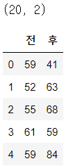


근력운동이 집중력을 향상시키는 효과가 있는지 여부는 근력운동 전과 근력운동 후의 집중력 테스트의 평균 점수를 비교하면 될 것 같습니다. 이를 위해 μ~before~를 근력운동 전의 집중력 테스트 평균 점수, μ~after~를 근력운동 후의 집중력 테스트 평균 점수로 하고, 다음과 같은 가설검정을 수행합니다. 이와 같은 검정은 평균값의 차이에 대한 검정입니다.

- 귀무가설 : μ~after~ - μ~before~ = 0
- 대립가설 : μ~after~ - μ~before~ ≠ 0

이 검정은 대응되는 데이터가 있는 대응비교이므로, 각각의 데이터에서 차이를 생각할 수 있습니다.

```python
training_rel['차'] = training_rel['후'] - training_rel['전']
training_rel.head()
```

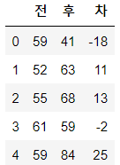


혹시 근력운동이 집중력 테스트에 끼치는 영향이 없다면, 그 차이는 임의로 분산되어 평균이 0인 분포가 될 것입니다. 이 때문에, 이 가설검정에서는 차이의 평균을 μ~diff~로 하여 

- 귀무가설 : μ~diff~ = 0
- 대립가설 : μ~diff~ ≠ 0

이라고 바꿔 말할 수 있습니다. 더 나아가 그 차이가 각각 독립이고 동일한 정규분포를 따르고 있다고 가정할 수 있으면, 이 검정은 모분산을 모르는 경우의 정규분포의 모분산에 대한 검정, 즉 1표본 t 검정으로 귀착될 수 있습니다.

지금까지 설명한 내용을 이해했으면 가설검정을 수행하는 것은 간단합니다. 11.2절에서 설명한 것처럼, 1표본 t 검정은 scipy.stats의 ttest_1samp 함수로 계산할 수 있습니다.

```python
t, p = stats.ttest_1samp(training_rel['차'], 0)
p
```

```python
0.04004419061842953
```


p값이 유의수준보다 작기 때문에 귀무가설은 기각되었습니다. 어쨌든 근력운동은 집중력에 유의한 차이를 가져오는 것 같습니다.

여기서는 diff에 의해 가설검정을 수행했지만, ttest_rel 함수를 사용하면 before와 after의 데이터로 동일한 검정을 수행할 수 있습니다. 일부러 차이를 구하지 않아도 되므로, 실제 데이터에 대한 검정을 수행할 때는 이 함수 쪽이 편리할 수 있습니다.

```python
t, p = stats.ttest_rel(training_rel['후'], training_rel['전'])
p
```

```python
0.04004419061842953
```


### 3.2 독립비교 t 검정

**독립비교 t 검정**(independent t-test)이란 대응하는 데이터가 없고 독립된 2표본 모집단에 정규분포를 가정할 수 있는 경우 평균값의 차이에 대한 검정입니다. 이 검정은 다음과 같은 상황에서 사용할 수 있습니다.


A 학생의 학급에서는 근력운동을 하는 학생이 부쩍 늘었습니다. 그런데 이 학급에는 사실 인문 계열 학생이 많은 편입니다. 한편, B 학생이 소속된 옆 학급에는 체육 계열 학생이 많아, 이 학생들은 평소에도 근력운동을 하고 있습니다. A 학생은 혹시 근력운동이 집중력을 향상하는 효과가 있다면 자신의 학급과 B 학생의 학급 사이에 집중력 테스트의 평균에서 차이가 나지 않을까 생각하여, B학생의 학급에도 집중력 테스트를 받게 했습니다. 이 데이터로부터 어떤 검정을 수행해야 A 학생과 B 학생 학급의 집중력에 유의한 차이가 있는지 확인할 수 있을까요?


이 데이터는 ch11_training_ind.csv에 있습니다.

```python
training_ind = pd.read_csv('../data/ch11_training_ind.csv')
print(training_ind.shape)
training_ind.head()
```

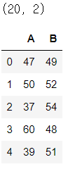


근력운동이 집중력을 향상하는 효과가 있는지 여부는 A 학생의 학급과 B 학생의 학급에서 진행한 집중력 테스트에서 평균 점수를 비교하면 될 것 같습니다. 이를 위해 μ~1~을 A 학생의 학급 평균점수, μ~2~를 B 학생의 학급 평균 점수로 하고, 다음과 같은 가설검정을 수행합니다.

- 귀무가설 : μ~1~ - μ~2~ = 0
- 대립가설 : μ~1~ - μ~2~ ≠ 0

대응이 없는 데이터, 즉 독립표본이므로 이번에는 차이를 구해도 아무 의미가 없습니다. 여기서 A 학생의 학급표본과 B 학생의 학급 표본은 별개의 모집단에서 추출된 것입니다. 이러한 모집단에 정규분포를 가정하면, A 학생의 학급 점수 X~1~, X~2~, ... , X~n~은 N(μ~1~, σ~1~^2^)을 따르고, B 학생의 학급 점수 Y~1~, Y~2~, ... , Y~n2~는 N(μ~1~, σ~1~^2^)을 따르고 있다고 할 수 있습니다.

이러한 가정을 바탕으로 검정통계량에는


으로 나타내는 t를 사용합니다. 이 t는 자유도가


인 t 분포를 따릅니다. 이것을 **웰치의 방법**이라고 합니다.

매우 복잡한 수식으로 구현이 어려울 것 같지만, stats.ttest_ind 함수를 사용하면 간단히 계산할 수 있습니다. equal_var = False를 지정하면 웰치의 방법으로 계산됩니다.

```python
t, p = stats.ttest_ind(training_ind['A'], training_ind['B'],
                       equal_var=False)
p
```

```python
0.08695731107259361
```

p값이 유의수준보다 크기 때문에 귀무가설이 채택되었습니다. 따라서 A 학생의 학급과 B 학생의 학급사이에는 평균 점수에 유의한 차이가 있다고 말할 수 없다는 결론을 내렸습니다.


### 3.3 윌콕슨의 부호순위검정

**윌콜슨의 부호순위검정**(Wilcoxon signed-rank test)은 대응표본에서 차이에 정규분포를 가정할 수 없는 경우, 중앙값의 차이에 대한 검정입니다. 대응비교 t 검정 때와 달리 중앙값의 차이에 대한 검정인 것에 주의하기 바랍니다.

앞서 대응비교 t 검정에서 사용한 예를 동일하게 쓰겠습니다. 여기서는 ch11_training_rel.csv를 두 번 사용합니다. 다만 처음에는 구조를 이해하기 쉽도록 ch11_training_rel.csv의 첫 6줄을 사용하여 설명합니다.

```python
training_rel = pd.read_csv('../data/ch11_training_rel.csv')
toy_df = training_rel[:6].copy()
toy_df
```

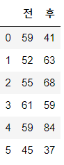


대응표본이므로, 역시 데이터의 차이에 주목합니다.

```python
diff = toy_df['후'] - toy_df['전']
toy_df['차'] = diff
toy_df
```

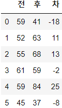


이제부터 지금까지와는 전혀 다른 방법으로 진행됩니다. 윌콕슨의 부호순위검정에서는 그 이름대로 순위에 의해 검정을 수행합니다.

우선 차이의 절댓값이 작은 것부터 순서대로 순위를 부여합니다. 순위 부여에는 scipy.stats의 rankdata 함수를 쓰는게 편리합니다.

```python
rank = stats.rankdata(abs(diff)).astype(int)
toy_df['순위'] = rank
toy_df
```

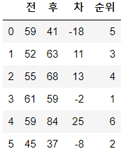

그리고 차이의 부호가 마이너스인 것의 순위합과, 차이의 부호가 플러스인 것의 순위합을 각각 구합니다. 각각 r_minus와 r_plus라고 합시다. 이 경우, r_minus는 5+1+2 = 8, r_plus는 3+4+6 = 13이 됩니다.

```python
r_minus = np.sum((diff < 0) * rank)
r_plus = np.sum((diff > 0) * rank)

r_minus, r_plus
```

```python
(8, 13)
```


이 r_minus와 r_plus 중에서 작은 쪽이 검정통계량이 됩니다. 여기서는 r_minus 쪽이 작기 때문에 검정통계량은 8입니다. 윌콕슨의 부호순위검정에서는 이 검정통계량이 임곗값보다 작은 경우에 귀무가설이 기각되는 단측검정을 수행합니다.

왜 이러한 검정통계량에서 중앙값의 차이에 대한 검정이 가능한 것일까요? 조금 극단적인 예를 살펴봅시다. 다음의 데이터는 근력운동 후의 테스트 결과가 전원 향상된 상황을 보여줍니다. 이것은 명백히 중앙값의 차이가 있는 경우라고 할 수 있습니다.

```python
toy_df['후'] = toy_df['전'] + np.arange(1, 7)
diff = toy_df['후'] - toy_df['전']
rank = stats.rankdata(abs(diff)).astype(int)
toy_df['차'] = diff
toy_df['순위'] = rank
toy_df
```

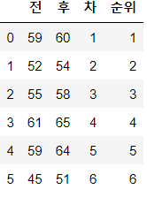

차이가 마이너스인 것의 순위합과 플러스인 것의 순위합을 각각 계산해보겠습니다.

```python
r_minus = np.sum((diff < 0) * rank)
r_plus = np.sum((diff > 0) * rank)

r_minus, r_plus
```

```python
(0, 21)
```


차이가 마이너스인 데이터는 하나도 없으므로 검정통계량은 0입니다. 차이에 편차가 있으면 검정통계량이 작아진다는 것을 알았습니다.

한편, 근력운동 후에 테스트 결과가 올라간 사람도 있고 내려간 사람도 있는 상황을 생각해봅시다.

```python
toy_df['후'] = toy_df['전'] + [1, -2, -3, 4, 5, -6]
diff = toy_df['후'] - toy_df['전']
rank = stats.rankdata(abs(diff)).astype(int)
toy_df['차'] = diff
toy_df['순위'] = rank
toy_df
```

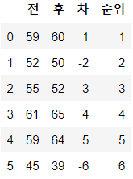

차이가 마이너스인 것의 순위합과 플러스인 것의 순위합을 각각 계산해보겠습니다.

```python
r_minus = np.sum((diff < 0) * rank)
r_plus = np.sum((diff > 0) * rank)

r_minus, r_plus
```

```python
(11, 10)
```


테스트 결과가 올라간 사람도 내려간 사람도 동일하게 분산되어 있기 때문에, r_minus와 r_plus는 비슷한 값이 됩니다. 즉, 검정통계량은 그런 대로 큰 값이 됩니다.

이와 같이 차이에 편향이 있을수록 r_minus와 r_plus에도 편향이 생기고, 검정통계량은 작은 값이 됩니다. 이러한 이론에 따라 검정통계량이 임곗값보다 작으면 중앙값에 차이가 있다는 주장을 할 수 있습니다.

손으로 계산할 때는 나중에 부호순위검정표라는 전용표에서 임곗값을 찾아 검정을 수행하지만, 이 책에서는 그런 과정을 생략하고 scipy.stats에 맡기겠습니다. scipy.stats에서는 윌콕슨의 부호순위검정을 wilcoxon 함수로 계산할 수 있습니다. 이 함수는 부호의 순위합을 계산하고 나서 표준화를 수행하고 정규분포로 검정을 하기 때문에, 여기서 설명한 검정통계량과는 다른 값이 반환되지만 기본 원리에는 차이가 없습니다.

그렇다면 training_rel에 대해서 wilcoxon 함수를 실행해보겠습니다. wilcoxon 함수의 인수에 2표본 데이터를 넣어도, 차이의 데이터를 넣어도 문제는 없습니다. 모두 동일한 결과가 출력됩니다.

```python
T, p = stats.wilcoxon(training_rel['전'], training_rel['후'])
p
```

```python
0.037999792729223686
```

```python
T, p = stats.wilcoxon(training_rel['후'] - training_rel['전'])
p
```

```python
0.037999792729223686
```


귀무가설은 기각되었습니다. 이 결과는 대응비교 t 검정의 경우와 동일한 결론입니다.

윌콕슨의 부호순위검정은 모집단이 정규분포를 따르는 경우에도 사용할 수 있습니다. 다만 모집단이 정규분포를 따르는 경우, 윌콕슨의 부호순위검정은 대응비교 t 검정에 비해 검정력이 낮습니다. 이것을 시뮬레이션으로 확인해봅시다.

차이는 N(3, 4^2^)을 따르는 것으로 하고, 표본 크기가 20인 표본 데이터를 1만 개 준비해둡니다.

```python
n = 10000
diffs = np.round(stats.norm(3, 4).rvs(size=(n, 20)))
```


차이가 0이 아니므로 귀무가설이 완전히 기각되면 좋겠습니다. 우선 대응비교 t 검정의 검정력을 알아보겠습니다.

```python
cnt = 0
alpha = 0.05
for diff in diffs:
    t, p = stats.ttest_1samp(diff, 0)
    if p < alpha:
        cnt += 1
cnt / n
```

```python
0.883
```


윌콕슨의 부호순위검정의 경우는 어떨까요?

```python
cnt = 0
alpha = 0.05
for diff in diffs:
    T, p = stats.wilcoxon(diff)
    if p < alpha:
        cnt += 1
cnt / n
```

```python
0.874
```

근소한 차이지만 대응비교 t 검정 쪽의 검정력이 큽니다. 모집단이 정규분포를 따르고 있는 경우에는, 대응비교 t 검정 쪽의 검정력이 크다는 것을 기억합시다.


### 3.4 만.위트니의 U 검정

**만.위트니의 U 검정**(Mann-Whitney rank test)은 대응되는 데이터가 없는 2표본 모집단에 정규분포를 가정할 수 없는 경우, 중앙값의 차이에 대한 검정입니다. 윌콕슨의 순위합검정이라고도 부릅니다.(윌콕슨의 부호순위검정과는 전혀 다른 검정입니다.)

앞서 독립비교 t 검정에서 사용한 예를 동일하게 쓰겠습니다. 여기서는 ch11_training_ind.csv를 두 번 사용합니다. 다만 처음에는 U 검정의 구조를 이해하기 쉽도록, ch11_training_ind.csv의 첫 5줄을 이용하여 설명합니다.

```python
training_ind = pd.read_csv('../data/ch11_training_ind.csv')
toy_df = training_ind[:5].copy()
toy_df
```

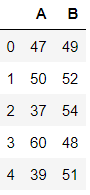


U 검정에서는 데이터 전체에 대해서 값이 작은 순서대로 순위를 부여합니다.

```python
rank = stats.rankdata(np.concatenate([toy_df['A'],
                                      toy_df['B']]))
rank_df = pd.DataFrame({'A': rank[:5],
                        'B': rank[5:10]}).astype(int)
rank_df
```

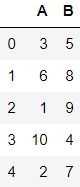

그리고 검정통계량에는 A의 순위합을 사용합니다.(B의 순위합을 사용해도 상관없습니다.) 여기서 A의 순위합은 3+6+1+10+2 = 22입니다. 순위합을 사용하는 직관적인 이유가 있습니다. A에 좋은 순위가 모여 있으면 순위합이 작아지고 반대로 A에 나쁜 순위가 모여 있다면 순위합이 커지는 것처럼, 순위합은 2표본 사이의 데이터 편향을 잘 반영하기 때문입니다.

정확하게 말하면, U 검정의 검정통계량은 A에 관한 순위합에서 A의 크기를 n~1~로 해서 n~1~(n~1~+1) / 2을 뺀 것입니다.

```python
n1 = len(rank_df['A'])
u = rank_df['A'].sum() - (n1*(n1+1))/2
u
```

```python
7.0
```


n~1~(n~1~+1) / 2은 검정통계량의 최솟값을 0으로 하기 위한 수입니다. 왜냐하면 A의 순위합이 최소가 되는 것은 A에 좋은 순위가 모두 모여 있는 경우인데, 이때의 순위합이 n~1~(n~1~+1) / 2과 일치하기 때문입니다.(시그마(1~n) i = n(n+1)/2이라는 공식을 알고 있다면 이 결과를 확실히 이해할 수 있습니다.) A에 좋은 순위가 모두 모여 있는 경우의 데이터를 작성하여 확인해봅시다.

```python
rank_df = pd.DataFrame(np.arange(1, 11).reshape(2, 5).T,
                       columns=['A', 'B'])
rank_df
```

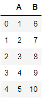


이때의 검정통계량을 계산해보겠습니다.

```python
u = rank_df['A'].sum() - (n1*(n1+1))/2
u
```

```python
0.0
```


확실히 0이 되었습니다.

반대로 A에 나쁜 순위가 모여 있는 경우는 어떨까요?

```python
rank_df = pd.DataFrame(np.arange(1, 11).reshape(2, 5)[::-1].T,
                       columns=['A', 'B'])
rank_df
```

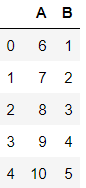

```python
u = rank_df['A'].sum() - (n1*(n1+1))/2
u
```

```python
25.0
```


이번에는 큰 순서로 되었습니다. A에 좋은 순위만 모여 있는 겨우에도, 나쁜 순위가 모여 있는 경우에도, 2표본의 중앙값에 편향이 있다는 사실에는 변함이 없습니다. 이 때문에 U 검정은 양측검정을 수행하게 됩니다.

임곗값은 U 검정표라는 전용표를 사용하여 조사할 수 있지만, 이 책에서는 scipy.stats에 맡기도록 합시다. scipy.stats에서는 U 검정을 mannwhitneyn 함수로 실행할 수 있습니다.

그렇다면 training_ind에 대해 U 검정을 수행해봅시다. 인수로는 2표본 각각의 데이터를 설정하고, alternative를 'two-sided'로 설정합니다.

```python
u, p = stats.mannwhitneyu(training_ind['A'], training_ind['B'],
                          alternative='two-sided')
p
```

```python
0.05948611166127324
```

독립비교 t 검정과 마찬가지로 귀무가설이 채택되는 결과가 나왔습니다.

윌콕슨의 부호순위검정 때와 마찬가지로, U 검정은 모집단이 정규분포를 따르는 경우 독립비교 t 검정에 비해 검정력이 낮아집니다.


### 3.5 카이제곱검정

이번에는 **독립성 검정**(test for independence)을 다룹니다. 독립성 검정이란 두 변수 X와 Y에 관해서 'X와 Y가 독립이다.'라는 귀무가설과 'X와 Y가 독립이 아니다.'라는 대립가설에 의해 수행되는 검정입니다. 독립성 검정에는 카이제곱분포가 사용되기 때문에 **카이제곱검정**(chi-square test)이라고도 부릅니다. 구체적인 예로 다음과 같은 상황을 가정합시다.


어떤 상품의 광고 전략으로 광고 A와 광고 B가 만들어졌고, 어느 광고가 더 구매 욕구를 촉진하는지 논의되고 있습니다. 이를 위해 광고 A와 광고 B를 모두 내보내고 실제로 상품 구입 여부에 대한 데이터를 수집했습니다. 이 데이터로부터 광고 A와 광고 B를 내보냈을 때 구입 비율에 유희한 차이가 있는지 확인하려면 어떻게 하면 좋을까요?


만약 광고의 종류와 상품 구입 유무가 독립이라면, 광고 A를 내보내든 광고 B를 내보내든 구입 비율에 변화가 없을 것입니다. 그러나 광고의 종류와 상품 구입 유무가 독립이 아니라면, 광고 A와 광고 B를 내보냈을 때 상품 구입 비율에 유의한 차이가 나옵니다. 그렇기 때문에 이와 같은 상황에서 독립성 검정을 사용합니다.

이 데이터는 ch11_ad.csv에 있고, 내보낸 광고와 상품 구입 유무가 기록되어 있습니다.

```python
ad_df = pd.read_csv('../data/ch11_ad.csv')
n = len(ad_df)
print(n)
ad_df.head()
```

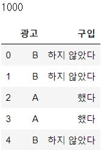


이대로는 각각의 광고를 통해 어느 정도의 상품을 구입했는지 알 수 없기 때문에 **교차집계표**(cross table)를 작성합니다. 교차집계표는 **분할표**라고도 부르며, 도수분포표의 2변수 버젼과 같은 것 입니다. 교차집계표는 Pandas의 crosstab 함수로 작성할 수 있습니다.

```python
ad_cross = pd.crosstab(ad_df['광고'], ad_df['구입'])
ad_cross
```

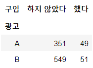


교차집계표로 정리하면, 각각의 광고를 통해 어느 정도의 상품을 구입했는지 한눈에 알 수 있습니다. 교차집계표를 기초로 광고 A와 광고 B 각각을 통해 상품을 구입한 비율이 어떻게 되는가를 알아봅시다.

```python
ad_cross['했다'] / (ad_cross['했다'] + ad_cross['하지 않았다'])
```

```python
광고
A    0.1225
B    0.0850
dtype: float64
```

상품 구입 비율은 광고 A쪽이 큰 것 같습니다. 과연 이것은 유의한 차이라고 할 수 있을까요?

카이제곱검정을 수행하려면 몇 가지 준비가 필요합니다. 우선 상품을 구입한 사람의 합계, 상품을 구입하지 않은 사람의 합계, 광고 A를 본 사람의 합계, 광고 B를 본 사람의 합계를 구합니다.

```python
n_not, n_yes = ad_cross.sum()
n_not, n_yes
```

```python
(900, 100)
```

```python
n_adA, n_adB = ad_cross.sum(axis=1)
n_adA, n_adB
```

```python
(400, 600)
```

광고와 상관없이 상품을 구입한 비율은 10%이며, 광고 A를 본 사람은 400명이고 광고 B를 본 사람은 600명이라는 사실을 알 수 있습니다.

여기서 혹시 광고와 구입이 독립이어서 광고에 따라 상품을 구입한 비율이 변하지 않는다면, 교차집계표는 어떤 결과가 되는 것이 타당한지 고려합니다. 예를 들어 광고 A를 보고 상품을 구입하는 경우, 광고에 따라 상품을 구입한 비율이 변하지 않는다면 400명 중 10%, 즉 40명이 상품을 구입하나고 기대할 수 있을 것입니다. 이와 같이 광고와 구입이 독립인 변수일 때 기대되는 도수를 **기대도수**(expected frequency)라고 합니다. 한편, 실제로 관측된 데이터는 **관측도수**(observed frequency)라고 합니다.

모든 셀에서 기대도수의 계산을 수행합시다.

```python
ad_ef = pd.DataFrame({'했다': [n_adA * n_yes / n,
                              n_adB * n_yes / n],
                    '하지 않았다': [n_adA * n_not /n,
                                n_adB * n_not /n]},
                      index=['A', 'B'])
ad_ef
```

 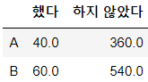


카이제곱검정에서는 기대도수와 관측도수의 차이를 측정함으로써 검정을 수행합니다. 구체적으로는 다음과 같이 계산되는 Y를 검정통계량으로 합니다.


여기서 O~ij~와 E~ij~는 각각 관측도수와 기대도수의 i번째 행과 j번째 열의 성분입니다.

```python
y = ((ad_cross - ad_ef) ** 2 / ad_ef).sum().sum()
y
```

```python
3.75
```


이 Y는 자유도가 1인 카이제곱분포를 근사적으로 따른다고 알려져 있습니다. 따르는 분포를 알고 있으면 p값을 구하는 것은 간단합니다.

```python
rv = stats.chi2(1)
1 - rv.cdf(y)
```

```python
0.052807511416113395
```

이 결과로 귀무가설은 채택되고, 광고 A와 광고 B에 유의한 차이가 인정되지 않는다는 결론을 내립니다.

이처럼 카이제곱검정을 순서대로 계산하려면 조금 번거로운데, scipy.stats에서는 chi2_coningency 함수를 사용하여 간단하게 계산할 수 있습니다. 인수에는 고차집계표를 전달하고, correction은 False로 합니다. 이 함수의 반환값은 검정통계량, p값, 자유도, 기대도수가 됩니다.

```python
chi2, p, dof, ef = stats.chi2_contingency(ad_cross,
                                          correction=False)
chi2, p, dof
```

```python
(3.75, 0.052807511416113395, 1)
```

```python
ef
```

```python
array([[360.,  40.],
       [540.,  60.]])
```

앞서 ch2_contingency 함수를 사용하지 않고 계산한 결과와 모두 일치함을 확인했습니다.