# Chapter 12. 회귀분석

이 장에서는 회귀분석에 관해서 다룹니다. 회귀분석에 의해 변수 사이의 인과관계가 명확해지고, 한 변수가 다른 변수에 끼치는 영향을 추정할 수 있습니다. 회귀분석의 예로 다음과 같은 상황을 가정합니다.

A학생이 속한 학급의 수학 수업에서는 매번 쪽지 시험이 실시되고 있습니다. 이 쪽지 시험의 평균 점수와 기말고사 점수 사이에 인과관계가 있는지 여부에 관심이 있는 A학생은 같은 반 학생 20명에게 기말고사 결과와 쪽지 시험 결과를 차례로 물어보았습니다. 또한 A학생은 쪽지 시험 외에 기말고사에 영향을 끼칠 것으로 보이는 기말고사 전날의 수면 시간과 통학 방법도 함께 데이터로 수집했습니다. 이들 변수 중 어느 변수가 기말고사에 영향을 끼칠까요? 어떤 변수를 도입하면 좋은 모형이 될까요?

여기서 모형이란 4.2절에서도 설명한 것처럼, 현실 세계에서 발생하는 복잡한 현상의 특징을 잘 포착하여 단수화한 것을 가리킵니다. 기말고사 결과는 당일의 컨디션이나 운 등 여러 오인이 영향을 주는 복잡한 현산으로, 이런 요인들을 모두 고려하기는 어렵습니다. 가령 기말시험 결과에 관한 완전한 방정식을 유도했다고 해도, 그 방정식을 해석하기는 힘듭니다.

이 때문에 회귀분석에서는 '기말고사에 영향을 끼치는 주요 요인은 쪽지 시험의 평균 점수'라고 현상을 단순화합니다. 물론 쪽지 시험이 기말고사에 영향을 끼치는 유일한 요인이 아닌 것은 분명합니다. 그러나 이 모형을 통해 얻은 '쪽지 시험은 기말고사에 이 정도 영향을 끼친다.'라는 결론은 사람이 이해할 수 있는 간단한 구조로 되어 있습니다.

그렇다 해도, 쪽지 시험만으로 문제를 너무 단순화해서는 기말고사의 결과라는 현상에 관해 충분히 설명할 수 없는지도 모르므로 수면 시간이나 통학 방법을 고려한 모형도 고려합니다. 이와 같이 회귀분석에서는 복잡한 현상을 사람이 이해할 수 있을 정도의 간단한 구조로 충분히 설명할 수 있는 모형을 찾는 것이 목적입니다.

늘 그랬듯이 라이브러리를 임포트해둡니다. 이 장에서는 지금까지 사용한 라이브러리에 statsmodels를 추가합니다. statsmodels는 회귀분석을 포함한 다양한 모형에 대해 계산을 간단하게 실행할 수 있는 라이브러리입니다.

```python
import numpy as np
import pandas as pd
import matplotlib.pyplot as plt
from scipy import stats
import statsmodels.formula.api as smf

%precision 3
%matplotlib inline
```


A학생이 취득한 데이터는 ch12_scores_reg.csv에 있습니다.

```python
df = pd.read_csv('ch12_scores_reg.csv')
n = len(df)
print(n)
df.head()
```

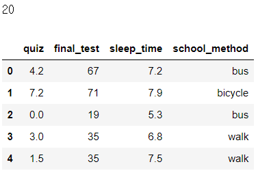


## 01. 단순회귀모형

**회귀분석**(regression analysis)이란 인과관계가 의심되는 복수의 변수를 사용하여 어느 변수로부터 다른 변수의 값을 예측하는 기법입니다. 이때 원인이 되는 변수를 **설명변수**(explanatory variable)라 하고, 결과가 되는 변수는 **반응변수**(response variable)라고 합니다. 설명변수와 반응변수를 각각 **독립변수**(independent variable)와 **종속변수**(dependent variable)라고 부르기도 합니다.

회귀분석에서 설명변수와 반응변수가 1개씩인 가장 단순한 모델을 **단순회귀모형**(simple regreesion model)이라고 합니다. 이 절에서는 반응변수를 기말고사 점수, 설명변수를 쪽지 시험의 평균 점수로 하는 단순회귀모형을 예로 들어 설명합니다.

단순회귀분석을 하기 위해 반응변수인 기말고사 점수를 y, 설명변수인 쪽지 시험의 평균 점수를 x, 그리고 설명변수의 수를 p로 설정해둡니다.

```python
x = np.array(df['quiz'])
y = np.array(df['final_test'])
p = 1
```


이 2차원 데이터에 대해서 3.2절에서 설명한 산점도와 회귀직선을 그려봅시다. 단순회귀분석에서는 이 회귀직선을 그리는 것이 목표 중 하나입니다.

```python
poly_fit = np.polyfit(x, y, 1)
poly_1d = np.poly1d(poly_fit)
xs = np.linspace(x.min(), x.max())
ys = poly_1d(xs)

fig = plt.figure(figsize=(10, 6))
ax = fig.add_subplot(111)
ax.set_xlabel('quiz')
ax.set_ylabel('final test')
ax.plot(xs, ys, color='gray', 
        label=f'{poly_fit[1]:.2f}+{poly_fit[0]:.2f}x')
ax.scatter(x, y)
ax.legend()

plt.show()
```

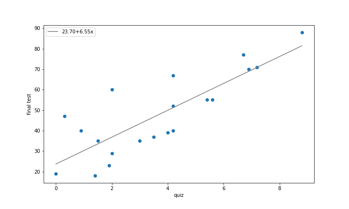


### 1.1 회귀분석에서의 가설

회귀직선을 그리는 것이 목표 중 하나라는 점에서 알 수 있듯이, 단순회귀모형에서는 설명변수 x와 반응변수 y사이에 다음과 같은 관계를 가정합니다.


그러나 산점도에 그린 회귀직선을 보면 알 수 있듯이, 데이터는 직선과 완전히 일치하지 않습니다. 처음에도 설명했듯이 기말고사는 당일의 컨디션 등 다양한 요인에 좌우되기 때문에, 쪽지 시험과 완전히 직선 관계가 되는 일은 아마 없을 겁니다. 그러므로 기본적인 관계는 직선상에 있다고 생각하고, 다른 요인에 관해서는 예측할 수 없는 확률적인 것이라고 생각하겠습니다.

이 예측할 수 없는 부분을 **오차항**(error term)이라 하고 ε~i~로 나타내면, 기말고사 결과 Y~i~는 다음과 같이 작성할 수 있습니다.


추가로 회귀분석에서는 다음의 두 가지를 가정합니다.

- 설명변수가 확률변수는 아니다.
- ε~i~는 서로 독립이고 N(0, σ^2^)을 따른다.

이 가정에 의해 확률변수 Y~i~는 서로 독립이고 N(β~0~+β~1~x~i~, σ^2^)을 따르는 것을 알 수 있습니다. 이번예에서라면, 쪽지 시험의 평균 점수가 4점인 학생의 기말고사 점수는 N(β~0~+4β~1~, σ^2^)을 따르는 확률변수로 간주한다는 것입니다. 

회귀분석은 이러한 가정을 기초로 표본인 (x~1~, Y~1~), (x~2~, Y~2~), ... , (x~n~, Y~n~)으로부터 모수 β~0~과 β~1~을 추정합니다. 이 β~0~과 β~1~의 추정값이 β~0~햇 과 β~1~햇에 의해 생성되는 직선


가 **회귀직선**(regression line)이라고 부르는 것으로, 그 계수인 β~0~햇 과 β~1~햇을 **회귀계수**(regression coefficient)라고 합니다.

데이터에서 실제의 인과관계 y = β~0~+ β~1~x~1~과 회귀직선 y = β~0~햇+ β~1~햇x를 그린 것이 다음 그림입니다. 이 그림에서는 β~0~+ β~1~x~1~을 기댓값으로 하는 정규분포에서 표본 데이터를 얻는 것으로 나타내고 있습니다. 그리고 그 표본 데이터로부터 추정된 인과관계가 회귀직선입니다.

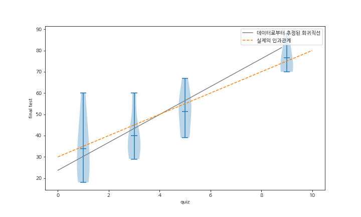

### 1.2 statsmodels에 의한 회귀분석

statsmodels에서는 회귀분석을 smf.ols라는 함수에 설명변수와 반응변수의 관계를 나타낸 문자열과 DataFrame을 전달하고, 추가로 fit 메서드를 호출하여 실행할 수 있습니다.(ols는 뒤에서 설명할 최소제곱법(Ordinary Least Squares)입니다.) 여기서는 쪽지 시험을 설명변수, 기말고사를 반응변수로 하는 회귀분석을 수행하고 싶으므로 'final_test ~ quiz'라는 문자열을 전달합니다. 그리고 summary 메서드를 호출하여 분석 결과를 모두 표로 출력합니다.(이 책에 실린 표는 print(result.summary())라고 했을 때의 출력 결과이지만, result.summary의 내용과 같습니다.)

```python
formula = 'final_test ~ quiz'
result = smf.ols(formula, df).fit()
print(result.summary())
```

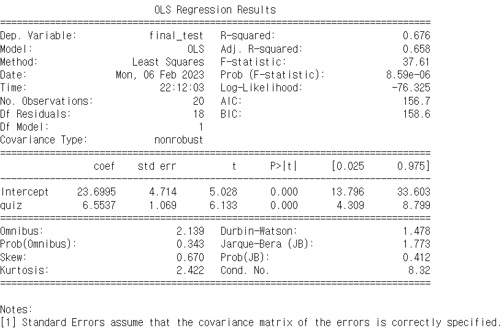

매우 충분한 양의 분석 결과가 나왔습니다. 이처럼 분석 결과는 summary 메서드로 간단히 구할 수 있지만, 각 항목이 무엇을 나타내는지 이해하지 못한다면 아무 의미가 없습니다. 이 장에서는 각 항목이 무엇을 나타내는지 하나씩 설명하고, 추가로 Numpy나 SciPy를 사용하여 계산 결과를 확인합니다.

분석 결과는 겹선에 의해 크게 세 부분으로 구분되어 있으므로, 이 책에서도 이 구분에 따라 설명하겠습니다. 분석결과로 출력된 내용과 이 책의 내용이 대응하는 순서대로 정리하면 다음과 같습니다.

- 모형의 개요와 데이터에 대한 모형의 적합도 - 12.3절
- 회귀계수의 추정 결과 - 12.1.3
- 모형에 주어진 오차항이 정규분포를 따르고 있다는 가정의 타당성 - 12.4절


### 1.3 회귀계수

여기서는 회귀계수의 추정 결과에 대해서 설명합니다. 회귀계수는 실제 인과관계의 계수 β~0~, β~1~의 추정값 β~0~햇,  β~1~햇 이었지만, 이 출력 결과에는 점추정뿐이 아니라 구간추정이나 가설검정의 결과도 나와 있습니다. 다음 표는 위의 결과의 가운데 부분을 다시 실은 것입니다.

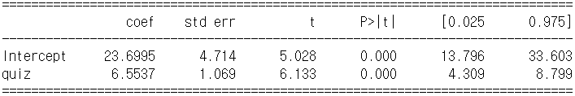


이 표의 각 행은 다음에 관한 분석 결과임을 나타냅니다.

- Intercept : 절편 β~0~
- quiz : 기울기 β~1~

각 열은 다음을 나타냅니다.

- coef : 회귀계수의 추정값
- std err : 추정값의 표준오차
- t : 회귀계수에 관한 t 검정통계량
- P>|t| : t 검정통계량의 p값
- [0.025와 0.975] : 회귀계수의 95% 신뢰구간


#### 점추정

여기서는 coef에 출력된 회귀계수의 추정량 β~0~햇,  β~1~햇을 실제로 구합니다. 이 추정값이 생성한 직선 y = β~0~햇 + β~1~햇x, 즉 회귀직선은 데이터 (x~1~, y~1~), (x~2~, y~2~), ... , (x~n~, y~n~)에 가장 잘 들어맞는 직선입니다.

여기서 데이터에 가장 잘 들어맞는 직선이란 x~i~로부터 예측된 모형의 **예측값**(predicted value) y햇 = β~0~햇 + β~1~햇x와 실제의 데이터 y~i~의 차이가 가장 작은 직선입니다. 엄밀하게는 y~i~와 y~i~햇의 차이인 y~i~-y~i~햇를 **잔차**(residual, ε~i~햇)로 하고, 그 제곱합인 **잔차제곱합**(residual sum of squares, RSS, 시그마(1~n) ε~i~^2^햇)이 더욱 작은 직선으로 정의됩니다.

아래 그림은 회귀직선과 데이터, 더 나아가 그 차이인 잔차를 나타내고 있습니다. 수많은 직선 중에서, 이 회귀직선이 데이터에 대해 잔차제곱합을 가장 작게 하는 직선이 되는 것입니다.

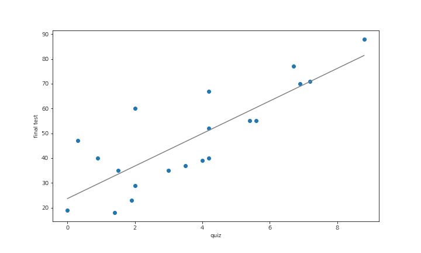

(보충 필요)

잔차제곱합을 최소화하는 β~0~햇과 β~1~햇을 구하는 방법을 **최소제곱법**(ordinary least squares)이라고 합니다. 최소제곱법으로 구한 β~0~햇과 β~1~햇은 β~0~과 β~1~의 불편일치추정량이 된다고 알려져 있습니다.

그렇다면 실제로 최소제곱법으로 β~0~햇과 β~1~햇을 구해봅시다. 상세한 이론은 선형대수학이나 편미분에 관한 지식이 필요하기 때문에 이 책에서는 설명하지 않지만, NumPy로 구현하면 간단합니다. 우선 첫 번재 열은 전부 1, 두 번째 열은 X인 행렬을 생성합니다.

```python
X = np.array([np.ones_like(x), x]).T
X
```

```python
array([[1. , 4.2],
       [1. , 7.2],
       [1. , 0. ],
       [1. , 3. ],
       [1. , 1.5],
       [1. , 0.9],
       [1. , 1.9],
       [1. , 3.5],
       [1. , 4. ],
       [1. , 5.4],
       [1. , 4.2],
       [1. , 6.9],
       [1. , 2. ],
       [1. , 8.8],
       [1. , 0.3],
       [1. , 6.7],
       [1. , 4.2],
       [1. , 5.6],
       [1. , 1.4],
       [1. , 2. ]])
```

이제 최소제곱법을 실행하기만 하면 됩니다. 최소제곱법은 np.linalg.lstsq로 구현되어 있고, 첫 번째 인수가 설명변수인 X, 두 번재 인수가 반응변수인 y가 됩니다. 이 함수의 첫 번째 반환값이 우리가 구하려는 β~0~햇과 β~1~햇입니다.

```python
beta0_hat, beta1_hat = np.linalg.lstsq(X, y)[0]
beta0_hat, beta1_hat
```

```python
(23.699495346731215, 6.5537326060430825)
```


β~0~햇과 β~1~햇을 구했기 때문에, 예측값 y~i~햇 = β~0~햇+ β~1~햇x~i~와 잔차 ε~i~햇 = y~i~ - y~i~ 햇을 계산할 수 있습니다. 이것들을 구현해봅시다.

```python
y_hat = beta0_hat + beta1_hat * x
eps_hat = y - y_hat
```


잔차 ε~i~햇는 오차항 ε~i~에 대응하고 있기 대문에, 잔차의 분산으로부터 모분산 σ^2^을 추정할 수 있습니다. 다만, 잔차의 자유도는 회귀계수의 수 p+1만큼 감소하여 n-p-1이 되므로, 모분산의 불편추정량 σ^2^햇은 n-p-1로 나누어 계산되는 값입니다.


이번에는 회귀계수의 수가 2이므로, 자유도는 n-2입니다.

```python
s_var = np.var(eps_hat, ddof = p+1)
s_var
```

```python
134.290434734959
```


#### 구간추정

여기서는 β~0~과 β~1~ 의 구간추정에 관해서 설명합니다. 이를 위해서는 앞서 살펴보았듯이 β~0~햇과 β~1~햇의 표준오차가 필요합니다.

이 β~0~햇과 β~1~햇의 표준오차를 구하는 것은 복잡하지만, 결과만 기록하면 각각 루트(C0σ^2^햇)과 루트(C1σ^2^햇)이 됩니다. 다만 (XX^T^)^-1^의 대각성분의 첫 번째가 C~0~, 두 번째가 C~1~이 됩니다. C~0~과 C~1~은 NumPy에서 다음과 같이 구할 수 있습니다.

```python
C0, C1 = np.diag(np.linalg.pinv(np.dot(X.T, X)))
```


C~0~, C~1~, σ^2^햇을 구했기 때문에 β~0~햇과 β~1~햇의 표준오차를 계산할 수 있습니다.

```python
np.sqrt(s_var * C0), np.sqrt(s_var * C1)
```

```python
(4.713837012645705, 1.0685841387335373)
```


표준오차를 구했으므로, 지금까지와 동일한 순서로 구간추정을 수행할 수 있습니다. σ^2^햇의 자유도가 n-2이므로, 회귀계수의 신뢰구간은 자유도가 n-2인 t 분포를 사용하여 다음과 같이 구할 수 있습니다.

**회귀계수의 신뢰구간**

회귀계수 β~0~, β~1~의 신뢰수준 100(1-α)%의 신뢰구간은


실제로 β~0~햇의 신뢰구간을 구해봅니다.

```python
rv = stats.t(n-2)

lcl = beta0_hat - rv.isf(0.025) * np.sqrt(s_var * C0)
hcl = beta0_hat - rv.isf(0.975) * np.sqrt(s_var * C0)
lcl, hcl
```

```python
(13.796091272760249, 33.60289942070218)
```


β~1~햇의 95% 신뢰구간도 마찬가지입니다.

```python
rv = stats.t(n-2)

lcl = beta1_hat - rv.isf(0.025) * np.sqrt(s_var * C1)
hcl = beta1_hat - rv.isf(0.975) * np.sqrt(s_var * C1)
lcl, hcl
```

```python
(4.308720637125891, 8.798744574960274)
```

모두 statsmodel의 분석 결과와 일치하고 있음을 확인할 수 있습니다.


#### t 검정

이번에는 회귀계수에 대한 가설검정을 설명합니다. 여기서 고려하는 것은 다음과 같은 가설검정입니다.

- 귀무가설: β~1~ = 0
- 대립가설: β~1~ ≠ 0

다음에 β~0~에 대해서도 동일한 가설검정을 고려하겠지만, β~1~에 대한 가설검정에는 중요한 의미가 하나 더 들어 있습니다.

β~1~ = 0인 경우

 

와 같이 설명변수가 반응변수에 전혀 영향을 끼치지 않는 모형이 되므로, 귀무가설이 기각되어 β~1~ ≠ 0이라는 결론을 얻게 됩니다. 따라서 설명변수가 반응변수에 영향을 끼치지 않는다고 주장할 수 있게 됩니다.

이 가설검정의 검정통계량은 다음과 같습니다.


이 t도 역시 잔차의 제약으로부터 자유도가 n-2인 t분포를 따릅니다. 더 나아가 귀무가설은 β~1~ = 0이므로, 결국 다음을 계산하면 됩니다.


```python
t = beta1_hat / np.sqrt(s_var * C1)
t
```

```python
6.133099274532022
```


p값을 구해봅시다.

```python
(1 - rv.cdf(t)) * 2
```

```python
8.590875866687497e-06
```


귀무가설은 기각되어, 쪽지 시험 평균 점수와 기말고사 점수 사이에는 인과관계가 있다고 말할 수 있을 것 같습니다.

β~0~에 대한 다음의 가설검정도 동일하게 수행할 수 있습니다.

- 귀무가설: β~0~ = 0
- 대립가설: β~0~ ≠ 0

```python
t = beta0_hat / np.sqrt(s_var * C0)
t
```

```python
5.027644206440128
```

```python
(1 - rv.cdf(t)) * 2
```

```python
8.745298393186829e-05
```

이 값도 statsmodels의 분석 결과와 일치하고 있음을 확인할 수 있습니다.


## 02. 중회귀모형

앞 절에서는 기말고사라는 반응변수를 쪽지 시험이라는 설명변수 하나로 회귀분석을 수행하는 단순회귀모형을 살펴보았습니다. 이 절에서는 쪽지 시험 외에, 시험 전날의 수면 시간이나 통학 방법도 설명변수에 추가한 모형을 살펴봅니다. 이와 같이 설명변수가 2개 이상인 모형은 **중회귀모형**(multiple regression model)이라고 합니다.

중회귀모형은 p개의 설명변수 x~1~, x~2~, ..., x~p~와 반응변수 y사이에 다음과 같은 관계를 가정한 모형이라고 할 수 있습니다.


우선 p=2로서, 설명변수로 쪽지 시험 평균 점수와 시험 전날의 수면 시간을 이용하는 모형을 살펴봅니다. 결국 i번째 학생의 기말고사 점수 Y~i~가, 쪽지 시험의 평균 점수 x~i1~과 전날의 수면 시간 x~i2~에 의해


로 표현되는 모형입니다.

statsmodels로 회귀분석을 수행해봅시다. 중회귀분석의 경우에는 smf.ols 함수에 설명변수를 +로 연결한 문자열을 전달합니다.

```python
formula = 'final_test ~ quiz + sleep_time'
result = smf.ols(formula, df).fit()
result.summary()
```

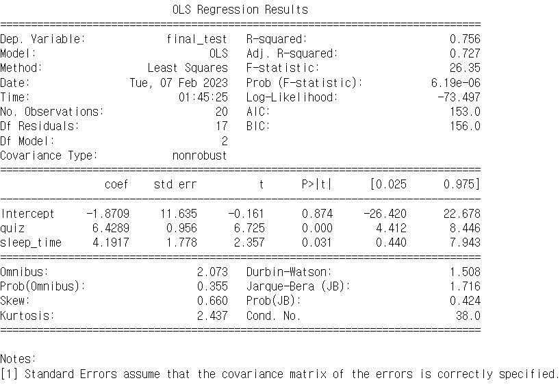


### 2.1 회귀계수

여기서는 중회귀모형의 회귀계수를 NumPy로 구합니다. 중회귀모형의 회귀계수를 구하는 방법은 단순회귀모형의 회귀계수를 구하는 방법과 거의 같습니다.

우선 설명변수인 쪽지 시험과 수면 시간의 데이터를 각각 x1과 x2, 반응변수인 기말고사를 y로 설정합니다. 설명변수의 수 p는 2입니다.

```python
x1 = df['quiz']
x2 = df['sleep_time']

y = df['final_test']
p = 2
```


β~0~, β~1~, β~2~의 추정값인 β~0~햇, β~1~햇, β~2~햇를 구합시다. 단순회귀모형의 경우와 마찬가지로 첫 번째 열은 전부 1, 두 번째 열은 x1, 세 번째 열은 x2가 되는 행렬 X를 생성하고, 최소제곱법을 실행함으로써 구할 수 있습니다.

```python
X = np.array([np.ones_like(x1), x1, x2]).T
beta0_hat, beta1_hat, beta2_hat = np.linalg.lstsq(X, y)[0]
beta0_hat, beta1_hat, beta2_hat
```

```python
(-1.8709143470995935, 6.428878343002369, 4.191706546398685)
```


β~0~햇, β~1~햇, β~2~햇을 사용하여 예측값 y~i~햇 = β~0~햇 + β~1~햇x~i1~ + β~2~햇x~i2~와 잔차 ε~i~햇 = y~i~ - y~i~햇를 구해보겠습니다.

```python
y_hat = beta0_hat + beta1_hat * x1 + beta2_hat * x2
eps_hat = y - y_hat
```


표준오차도 단순회귀모형의 경우와 동일합니다.

```python
s_var = np.sum(eps_hat ** 2) / (n - p - 1)
C0, C1, C2 = np.diag(np.linalg.pinv(np.dot(X.T, X)))
```


이것들은 사용하여, 수면 시간에 대한 계수인 β~2~의 95% 신뢰구간을 구해보겠습니다.

```python
rv = stats.t(n-p-1)

lcl = beta2_hat - rv.isf(0.025) * np.sqrt(s_var * C2)
hcl = beta2_hat - rv.isf(0.975) * np.sqrt(s_var * C2)
lcl, hcl
```

```python
(0.4402533325435001, 7.94315976025387)
```

statsmodels의 결과와 일치하고 있음을 확인할 수 있습니다.


### 2.2 가변수

A학생이 수집한 데이터에는 학생의 통학방법도 기록되어 있습니다. 통학 방법이 기말고사 결과에 영향을 끼치는지는 몰라도, 기왕이면 통학 방법을 포함하는 모형으로 회귀분석을 수행해보고 싶습니다.

다만, 통학 방법은 쪽지 시험이나 수면 시간과는 다른 질적변수이므로, 데이터 처리를 어떻게 해야 할지 조금 생각해봐야 합니다. 왜냐하면 질적변수인 '버스', '자전거', '도보'와 같은 문자를 그대로 수식에 집어넣는 것은 불가능하기 때문입니다. 이 문제를 해결하려면 질적변수를 변환하여 양적변수와 동일하게 취급할 수 있게 하는 기법을 도입하는 것이 좋습니다. 이런 기법이 바로 **가변수**(dummy variable)입니다.

가변수는 0과 1을 취하는 2진 변수로, 변환하고 싶은 질적변수의 카테고리 수에서 하나를 줄인 수만큼 필요합니다. 이번 예에서 통학 방법은 '버스', '자전거', '도보'의 세 가지입니다. 따라서 카테고리 수가 3이므로, 가변수는 여기에서 1을 뺀 2개가 필요합니다. 여기서는 이러한 가변수를 x~도보~, x~자전거~로 합시다. 이 가변수에 의해 도보를 (x~도보~=1, x~자전거~=0), 자전거를 (x~도보~=0, x~자전거~=1), 버스를 (x~도보~=0, x~자전거~=0)으로 나타낼 수 있습니다.

질적변수를 일부러 가변수로 변환하는 것은 조금 번거로울 수 있는데, statsmodels에서는 이러한 작업을 자동으로 수행해줍니다. 설명변수를 쪽지 시험과 수면 시간과 통학 방법으로 한 중회귀모형으로 회귀분석을 수행해봅시다. 이 경우의 회귀모형은 다음이 됩니다.


```python
formula = 'final_test ~ quiz + sleep_time + school_method'
result = smf.ols(formula, df).fit()
print(result.summary())
```

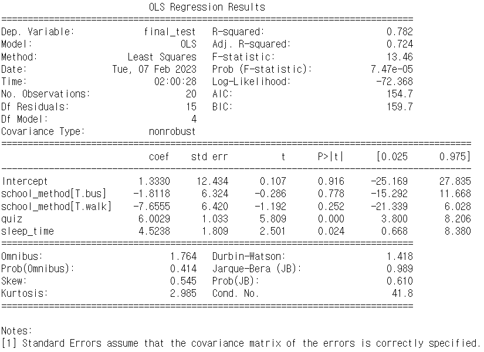

회귀계수의 결과를 부분적으로 살펴보면, 통학 방법 [T. 도보]와 통학 방법 [T. 자전거]라는 행이 생겼습니다. 이것들은 각각 앞에서 기술한 x~도보~와 x~자전거~에 대응하는 변수가 됩니다.


## 03. 모형의 선택

지금까지는 설명변수에 넣는 것에 따라 3종류의 모형을 작성했습니다. 이 절에서는 어느 모형이 가장 좋은 모형인지 살펴보겠습니다.

도대체 좋은 모형이란 무엇일까요? 회귀분석으로 만든 모형은 크게 두 가지로, 적합이 좋은 것과 예측이 좋은 것을 들 수 있습니다.

적합이 좋다는 것은 모형이 주변에 있는 데이터에 어느 정도 들어맞다는 것입니다. 회귀직선이 데이터에 완전하게 들어맞고 잔차가 작으면 그 모형은 좋은 모형이라고 할 수 있습니다.

한편, 예측이 좋다는 것은 주변에 있는 데이터로 만든 모형이 미지의 데이터를 어느 정도 예측할 수 있다는 것 입니다. 모르는 데이터의 설명변수라도 모형이 반응변수를 정확하게 예측할 수 있다면 그것은 좋은 모형이라고 할 수 있습니다.

이제부터 살펴보겠지만, 적합이 좋다는 것은 설명변수를 증가시켜 가는 것만으로 간단하게 달성됩니다. 그러나 이렇게 만든 모형은 일반적으로 예측 정확도가 떨어집니다. 이것은 **과적합**(overfitting)이라고 부르는 문제로, 매우 복잡한 모형은 표현력이 너무 높은 나머지 주변 데이터에 지나치게 적합되어 일반적인 예측성을 잃어버리는 것입니다. 이 때문에 모형을 고를 때는 보통 적합도가 좋은 것보다 예측 정확도가 좋은 것을 고르게 됩니다.

이제부터 모형의 좋고 나쁨을 측정하는 여러 지표를 살펴보겠습니다. 해당 정보는 statsmodels의 분석 결과 윗부분에 출력되어 있습니다. 이 장에서는 단순회귀분석 결과의 출력을 예로 들어 statsmodels의 분석결과를 보는 방법과 그러한 지표가 어떻게 계산되어 있는지를 설명하겠습니다.

데이터를 준비하기 위해, 다시 쪽지 시험을 설명변수로 한 단순회귀분석을 실행합니다. 또한 여기서도 summary의 출력 윗부분만 제시합니다.

```python
x = np.array(df['quiz'])
y = np.array(df['final_test'])
p = 1

formula = 'final_test ~ quiz'
result = smf.ols(formula, df).fit()
result.summary()
```

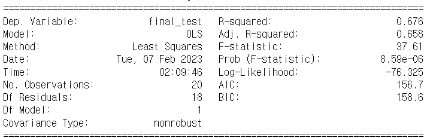


이 절에서는 모형의 예측값 y~i~햇와 그 잔차 ε~i~햇가 필요합니다. 단순회귀분석으로 수행한 계산을 또 다시 실행해서 구해도 되지만, 이번에는 result에서 가져옵니다. 예측값 y~i~햇는 result의 fittedvalues라는 인스턴스 변수에 저장되어 있습니다. Series로 저장되어 있기 때문에 계산하기 쉽도록 array로 변환해둡니다.

```python
y_hat = np.array(result.fittedvalues)
y_hat
```

```python
array([51.225, 70.886, 23.699, 43.361, 33.53 , 29.598, 36.152, 46.638,
       49.914, 59.09 , 51.225, 68.92 , 36.807, 81.372, 25.666, 67.61 ,
       51.225, 60.4  , 32.875, 36.807])
```


잔차 ε~i~는 resid에 저장되어 있습니다. 이것도 마찬가지로 Series로 저장되어 있기 때문에 array로 변환합니다.

```python
eps_hat = np.array(result.resid)
eps_hat
```

```python
array([ 15.775,   0.114,  -4.699,  -8.361,   1.47 ,  10.402, -13.152,
        -9.638, -10.914,  -4.09 , -11.225,   1.08 ,  -7.807,   6.628,
        21.334,   9.39 ,   0.775,  -5.4  , -14.875,  23.193])
```


모형 적합도를 측정하는 지표 중 하나로, 회귀직선을 구하기 위해 사용한 잔차제곱합을 고려합니다. 왜냐하면 잔차제곱합은 데이터와 회귀직선의 적합도를 나타내는 지표였기 때문입니다. 계산해봅시다.

```python
np.sum(eps_hat ** 2)
```

```python
2417.2278252292626
```

2417.228이 되었습니다. 이 값이 적합도가 좋은 것을 나타내는지 판단하기 어렵습니다. 실제로 잔차제곱합 자체는 동일한 모형 중에서 상대적으로만 사용할 수 있습니다. 그렇다면 다른 모형끼리 비교할 때 사용할 수 있는 지표에는 어떤 것이 있는지 살펴봅시다.


### 3.1 결정계수

제일 먼저 설명하려는 것은 **결정계수**(R-squared)입니다. 결정계수는 모형의 데이터에 대한 적합도를 나타내는 기본적인 지표입니다. 결정계수는 흔히 R^2^으로 표기하고, statsmodels의 결과에는 R-squared로 출력되어 있습니다. 결정계수는 0과 1사이의 값을 취하고, 1에 가까울수록 모델은 데이터레 잘 들어맞는다고 생각할 수 있습니다. 

결정계수는 어떻게 구할 수 있을까요? 결정계수를 구하려면 총변도, 회귀변동, 잔차변동이라는 세 가지 변동에 대해 알아야 합니다.


#### 총변동(total variation)

관측값 y~i~가 어느 정도 분산되어 있는지를 나타내는 지표입니다. 시그마(1~n) (y~i~ - y햇)^2^에 의해 계산됩니다.


#### 회귀변동(regression variation)

예측값 y~i~햇가 관측값의 평균값 y햇에 대해서 어느 정도 분산되어 있는지를 나타내는 지표입니다. 시그마(1~n) (y~i~ - y햇)^2^에 의해 계산되고, 예측값 y~i~햇가 관측값 y~i~에 가까울수록 총변동에 가까워집니다.


#### 잔차변동(residual variation)

잔차의 산포도를 나타내는 지표입니다. 시그마(1~n) ε~i~햇^2^에 의해 계산되고, 잔차제곱합과 동일합니다. 예측값 y~i~햇가 관측값 y~i~에 가까울수록 0에 가까워집니다.


이 세 가지 변동에는 다음과 같은 관계가 성립합니다.


앞에 설명한 것처럼, 예측값 y~i~햇가 관측값 y~i~에 가까울수록 회귀변동은 총변동에 가까운 값이 됩니다. 그렇다면 총변동 중 회귀변동이 차지하는 비율이 클수록 좋은 모형이라고 할 수 있을 것 같습니다 이러한 생각에 따라 결정계수는 다음과 같이 계산할 수 있습니다.


이제 구현으로 넘어갑시다. 우선 각 변동을 구합니다.

```python
total_var = np.sum((y - np.mean(y))**2)
exp_var = np.sum((y_hat - np.mean(y))**2)
unexp_var = np.sum(eps_hat ** 2)
```


'총변동=회귀변동+잔차변동'의 관계가 성립하는지 확인해봅시다.

```python
total_var, exp_var + unexp_var
```

```python
(7468.55, 7468.5499999999965)
```


문제는 없는 것 같습니다. 그렇다면 결정계수를 구해보겠습니다.

```python
exp_var / total_var
```

```python
0.6763457665504996
```


단순회귀의 결정계수는, 설명변수와 반응변수의 상관계수 제곱 r~xy~^2^에 일치한다고 알려져 있습니다.

```python
np.corrcoef(x, y)[0, 1] ** 2
```

```python
0.6763457665505004
```


여기서는 결정계수가 큰 모형이 데이터에 대한 적합도가 좋은 모형이라고 설명했습니다. 그렇다면 지금까지 살펴본 모형 중에서 데이터 적합도가 가장 좋은 모형은 어느 것일까요? statsmodels의 분석 결과 R-squared로부터 얻은 각 회귀계수 값을 정리해보겠습니다.

- 기말고사~쪽지 시험 : 0.676
- 기말고사~쪽지 시험 + 수면 시간 : 0.756
- 기말고사~쪽지 시험 + 수면 시간 + 통학 방법 : 0.782

결정계수를 기준으로 하면, 변수가 전부 들어간 모형의 적합도가 가장 좋습니다. 통학 방법과 같이, 얼핏 보면 기말고사 결과에 영향을 끼치지 않을 것 같은 변수가 들어간 모형이 가장 좋은 결과로 나온 것은 의외입니다.

실은 별 의미 없는 변수가 들어간다 해도 설명변수가 증가하면 결정계수가 증가하는 것으로 알려져 있습니다. 즉, 설명변수에 청와대 주변 날씨 같은 기말고사와 명백히 관계없는 변수가 들어가도, 결정계수를 기준으로 하면 그 설명변수를 추가한 모형이 선택됩니다. 이와 같은 문제를 해결하는 것이 다음에 설명할 조정결정계수입니다.


### 3.2 조정결정계수

**조정결정계수**(adjusted R-square)는 설명변수를 추가했을 때 그 설명변수에 어느 정도 이상의 설명력이 없는 경우 결정계수의 값이 증가하지 않도록 조정하는 결정계수입니다. 조정결정계수는 R^2^햇으로 표기하고, statsmodels의 분석 결과에는 Adj . R-squred로 출력됩니다.

조정결정계수는 **자유도조정 결정계수**라고도 하는데, 이름 그대로 자유도를 고려한 결정계수입니다. 잔차변동과 총변동을 각각 자유도로 나누어, 다음과 같이 계산합니다.


더욱이, 총변동의 자유도는 회귀계수의 수에 상관없이 항상 n-1이 됩니다. 그리고 잔차변동의 자유도는 n-p-1, 회귀변동의 자유도는 회귀계수의 수가 됩니다. 자유도에 관해서도


를 만족합니다. 또한 회귀변동의 자유도는 모형의 자유도라고도 부르고, statsmodels의 분석결과에는 Df Model로 출력됩니다. 잔차변동의 자유도는 잔차의 자유도라고도 부르고 Df Residual로 출력됩니다.

그렇다면 단순회귀모형의 조정결정계수를 정의한 대로 구해봅시다.

```python
1 - (unexp_var / (n - p - 1)) / (total_var / (n-1))
```

```python
0.6583649758033057
```

각 모형의 조정결정계수는 다음과 같습니다.

- 기말고사~쪽지 시험 : 0.658
- 기말고사~쪽지 시험+수면 시간 : 0.727
- 기말고사~쪽지 시험+통학 방법 : 0.724

조정결정계수를 기준으로 하면, 설명변수를 쪽지 시험과 수면 시간으로 한 모델의 적합도가 가장 높습니다.


### 3.3 F 검정

**F 검정**(F test)은 절편 β~0~이외의 회귀계수에 관해서 다음과 같은 가설로 수행되는 검정입니다.

- 귀무가설 : β~1~ = β~2~ = ... = β~p~ = 0
- 대립가설 : 적어도 하나의 β~1~은 0이 아닙니다.


F 검정은 t 검정과 같이 개개의 회귀계수에 대해서가 아니라, 모형 전체에 대해서 수행됩니다. 이 검정에서 사용되는 검정통계량인 F 검정통계량은 statsmodels 분석 결과의 F-statistic에, 그 p값은 Prob(F-statistic)에 출력됩니다.

F 검정통계량은 다음과 같이 계산되고, 자유도가 (p, n-p-1)인 F 검정을 따릅니다.


F 검정의 이론은 회귀분석의 경우와 비슷하게, 모형의 적합도가 좋을수록 잔차변동보다 회귀변동이 커지는 것을 이용합니다. 이에 따라 F 검정통계량이 어떤 값보다 커진 경우, 모형이 데이터에 적합됭 있다고 생각할 수 있고, 상단의 단측검정을 수행하여 모형 전체에 관한 가설검정을 수행할 수 있습니다.

또한 F 검정통계량의 분모와 분자는 각각 잔차변동을 그 자유도로 나눈 것과 회귀변동을 그 자유도로 나눈 것으로 되어 있습니다. 이것들은 각각 잔차의 분산과 모형의 분산이라고 생각할 수 있고, F 검정통계량은 분산의 비를 검정하고 있다고 해석할 수 있습니다. 이 때문에 이 검정을 **분산분석**(analysis of variance, ANOVA)이라고도 부릅니다.

그러면 F 검정통계량을 구해봅시다.

```python
f = (exp_var / p) / (unexp_var / (n - p - 1))
f
```

```python
37.61490671126521
```


대응하는 p값을 구해보겠습니다.

```python
rv = stats.f(p, n-p-1)
1 - rv.cdf(f)
```

```python
8.590875866687497e-06
```


귀무가설은 기각되고, 설명변수 중 적어도 하나는 반응변수에 영향을 주는 것을 알 수 있습니다.


### 3.4 최대로그우도와 AIC

지금까지 모형의 데이터에 대한 적합도를 나타내는 지표를 살펴보았습니다. 여기서는 모형의 예측 성능에 관한 중요한 지표인 **아카이케의 정보량 기준**(Akaike's information criterion, AIC)을 설명합니다. AIC를 설명하려면 우도나 최대로그우도라는 개념을 먼저 알아야 하므로 순서대로 설명하겠습니다.


#### 우도

**우도**(likelihood)는 어떤 관측값을 얻을 확률입니다. 간단한 예로, 0.3의 확률로 앞면이, 0.7의 확률로 뒷면이 나오는 뒤틀린 동전을 생각합니다. 앞면을 1, 뒷면을 0이라고 했을 때, 이 동전을 5번 던젼더니 결과가 [0, 1, 0, 0, 1]로 나왔습니다. 이때 이 결과를 얻을 확률은


이라고 구할 수 있습니다. 보통 결합확률로 생각하지만, 여기서는 이것을 우도라고 합니다.

조금 일반화하여 살펴봅시다. 동전의 확률함수를 f(x), 얻은 관측값을 x~1~, x~2~, x~3~, x~4~, x~5~라고 하면 우도 L은


이 됩니다. 지금까지 설명한 내용을 구현해보겠습니다.

```python
prob = 0.3
coin_result = [0, 1, 0, 0, 1]

rv = stats.bernoulli(prob)
L = np.prod(rv.pmf(coin_result))
L
```

```python
0.030869999999999995
```


그렇다면 동전의 앞면이 나올 확률 p를 알지 못하는 상황에서 [0, 1, 0, 0, 1]이라는 결과를 얻은 경우의 우도는 어떻게 될까요? 마찬가지로


이라고 작성할 수 있습니다. 다만, 여기서는 모수 p를 알지 못하므로 우도 L은 p에 대한 함수로 표현되는 것을 볼 수 있습니다. 이 때문에 이것을 **우도함수**(likelihood function)라 부르고, L(p)라고 표기합니다.

p를 0에서 1로 변화시킬 때의 우도함수를 그려보겠습니다.

```python
ps = np.linspace(0, 1, 100)
Ls = [np.prod(stats.bernoulli(prob).pmf(coin_result)) for prob in ps]

fig = plt.figure(figsize = (10, 6))
ax = fig.add_subplot(111)
ax.plot(ps, Ls, label = 'likelihood function', color = 'gray')
ax.legend(fontsize = 16)
plt.show()
```

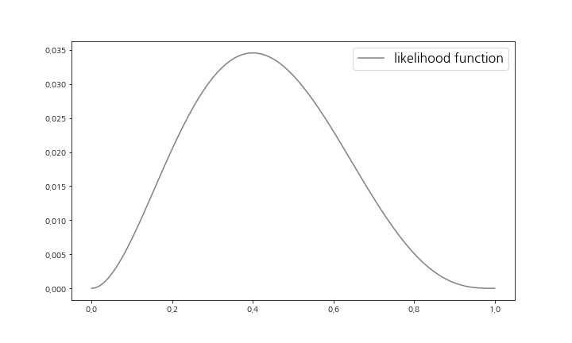

위 그림에서 우도함수는 p가 0.4일 때 최대가 되는 것 같습니다. 이것은 관측값에 의해 p=0.4가 가장 그럴 듯한 모수라고 바꿔 말할 수 있습니다. 이와 같이 관측값에서 가장 그럴 듯 하다는 이유로 모수 p를 추정하는 방법을 **최우추정법**(method of maximum likelihood)이라고 합니다. 또한 최우추정법에 의해 추측되는 추정량을 **최우추정량**(maximum likelihood estimator), 그 추정값을 **최우추정값**(maximum likelihood estimate)이라고 합니다.

여기에서는 이산형 확률변수를 다루지만, 연속형 확률변수에서도 우도를 정의할 수 있습니다. f(x)가 이산형 확률변수에서는 확률함수, 연속형 확률변수에서는 확률밀도함수라고 하면, 다음 정의는 어떤 경우에도 대응되는 우도의 정의입니다.


우도는 확률의 곱이 되므로, 곱하면 곱할수록 0에 가까워집니다. 이와 같은 작은 값은 손으로 계산하기도 어렵고, 컴퓨터로도 다루기 어렵기 때문에, 우도에 로그를 취한 **로그우도**(log-likelihood)가 대신 사용되곤 합니다. 결국 로그우도는


로 정의됩니다. 우도함수가 최대로 될 때 로그우도함수도 최대가 되므로, 최우추정은 로그우도함수가 최대가 될 때의 파라미터로서 구할 수 있습니다. 그때의 로그우도의 값을 **최대로그우도**(maximum log-likelihood)라고 합니다.

동전의 최대로그우도를 구해봅시다. p의 최우추정값은 0.4였으므로 p=0.4로 했을 때의 로그우도가 최대로그우도가 됩니다.

```python
prob = 0.4
rv = stats.bernoulli(prob)
mll = np.sum(np.log(rv.pmf([0, 1, 0, 0, 1])))
mll
```

```python
-3.365058335046282
```


#### 최대로그우도

다시 회귀분석에 대한 이야기로 돌아가봅시다. 단순회귀모형에서는 Y~i~~N(β~0~ + β~1~x~1~, σ^2^)이라는 함수를 가정했습니다. 이 가정을 토대로 관측값 (x~1~, y~1~), (x~2~, y~2~), ... , (x~n~, y~n~)에 대한 최대로그우도는 모형의 데이터에 대한 적합이 좋다는 것을 나타낸다고 생각할 수 있습니다. 이 최대로그우도는 분석 결과의 Log-Likelihood에 출력됩니다.

그렇다면 구체적으로 단순회귀모형의 최대로그우도를 구해봅시다. 단순회귀모형에서 β~0~, β~1~, σ^2^ 의 최우추정량은 β~0~햇, β~1~햇, 1/n 시그마(1~n) ε~i~햇가 된다고 알려져 있습니다. 최대로그우도는 파라미터는 최우추정량으로 했을 때의 관측값의 로그우도였으므로, 최대로그우도는 N(y햇, 1/n 시그마(1~n) ε~i~햇)의 밀도함수를 f(x)로 하여

 

라고 구할 수 있습니다.

```python
rv = stats.norm(y_hat, np.sqrt(unexp_var / n))
mll = np.sum(np.log(rv.pdf(y)))
mll
```

```python
-76.32521428624038
```


최대로그우도는 값이 클수록 모형의 적합도가 높다고 생각할 수 있습니다. 각 모형의 로그우도는 다음과 같습니다.

- 기말고사~쪽지시험 : -76.325
- 기말고사~쪽지시험 + 수면시간 : -73.497
- 기말고사~쪽지시험 + 수면시간 + 통학방법 : -72.368

최대로그우도를 기준으로 하면, 변수가 모두 들어있는 모형이 가장 적합도가 높습니다. 최대로그우도도 설명변수를 늘리면 값이 증가하는 특징이 있습니다.


#### AIC

로그우도는 모형의 적합도를 나타내지만, 그 지표는 의미 없는 설명변수를 늘림으로써 값이 증가합니다. 이 절의 앞부분에서 설명했듯이, 로그우도와 같이 적합도를 기준으로 하면 일반 성능이 나쁜 모형이 선택되고 맙니다. 이 때문에 모형의 복잡도(설명변수의 수)와 데이터에 대한 적합도의 균형을 잡는 지표가 필요했졌습니다. 이것이 **AIC**(Akaike's information criterion)입니다. AIC는 일반적인 성능도 고려하여 넣은 지표이므로, 예측이 좋은 것을 나타내는 지표라고 할 수 있습니다. 실제로 모형을 선택할 때 이 AIC에 의해 수행되는 경우가 많습니다. 

AIC를 구하는 방식은 다양하지만, 여기서는 statsmodels의 출력에 맞추어 다음과 같이 정의합니다.


AIC는 최대로그우도에 회귀계수의 수를 패널티로 부가하여 무턱대고 설명변수를 늘린 모형이 좋은 모형으로 선택되니 않게끔 한다고 해석할 수 있습니다.

그렇다면 정의한대로 AIC를 구해봅시다.

```python
aic = -2 * mll + 2 * (p+1)
aic
```

```python
156.65042857248076
```


AIC는 값이 작을수록 모형의 예측 정확도가 좋다고 생각할 수 있습니다. 각 모형의 AIC는 다음과 같습니다.

- 기말고사~쪽지시험 : 156.7
- 기말고사~쪽지시험+수면시간 : 153.0
- 기말고사~쪽지시험+수면시간+통학 방법 : 154.7

AIC를 기준으로 하면, 설명변수에 쪽지 시험과 수면 시간을 이용하는 모형이 가장 좋은 모형이 됩니다.


#### 베이지안 정보 기준

**베이지안 정보 기준**(Bayesian information criterion, BIC)은 AIC와 유사한 지표입니다. BIC는 회귀계수의 수에 더해 표본 크기 n에 대해서도 패널티를 부가한 것 입니다.


```python
bic = -2 * mll + np.log(n) * (p+1)
bic
```

```python
158.64189311958876
```


BIC도 AIC와 마찬가지로 값이 작을수록 모형의 예측 정확도가 좋다고 생각합니다. 각 모형의 BIC는 다음과 같습니다.

- 기말고사~쪽지시험 : 158.6
- 기말고사~쪽지시험+수면시간 : 156.0
- 기말고사~쪽지시험+수면시간+통학방법 : 159.7

BIC를 기준으로 하면, 설명변수로 쪽지 시험과 수면 시간을 이용하는 모형이 가장 좋은 모형이 됩니다.


## 04. 모형의 타당성

마지막으로 모형의 타당성에 관해서 설명합니다. 모형의 타당성이란 처음에 회귀분석에 관해서 세운 '오차항 ε~i~는 서로 독립이고 N(0, σ^2^)을 따른다.'라는 가정을 만족하고 있는지 여부를 체크하는 것입니다. statsmodels에서는 분석 결과의 아래 부분에 모형의 타당성에 관한 정보가 출력되어 있습니다. 이 절에서는 그 표를 보는 방법에 대해 설명합니다.

여기서는 앞 절에서 설명한 AIC를 기준으로 좋은 모형이라고 판단된 모형 즉, 설명변수에 쪽지시험과 수면시간을 사용한 중회귀모형의 결과를 사용하여 설명합니다. 중회귀모형의 결과를 두 차례 출력합시다. 여기서는 출력 결과의 아래 부분만 제시합니다.

```python
formula = 'final_test ~ quiz + sleep_time'
result = smf.ols(formula, df).fit()
print(result.summary())
```

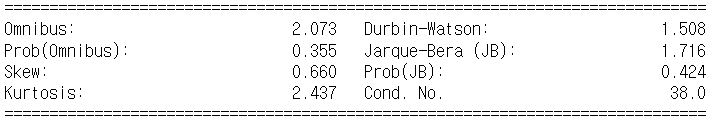


오차항 ε~i~에 관한 체크이므로, 분석 대상이 되는 것은 잔차 ε~i~햇 입니다.

```python
eps_hat = np.array(result.resid)
```


### 4.1 정규성 검정

여기서는 오차항 ε~i~가 N(0, σ^2^)을 따른다는 가정이 타당했는지 알아뵈 위해, 잔차 ε~i~햇가 정규분포를 따르고 있는지를 확인하는 정규성 검정을 수행합니다.

statsmodels에서는 정규성 검정으로 Omnibus 검정과 Jarque-Bera 검정이 사용됩니다. 이러한 검정통계량은 Omnibus와 Jarque-Bera( JB )에 각각 출력되어 있습니다. 상세한 검정 방법을 기술하지만 , 이러한 검정은 모두

- 귀무가설 : 잔차항은 정규분포를 따릅니다.
- 대립가설 : 잔차항은 정규분포를 따르지 않습니다.

라는 가설검정을 수행합니다. 결국 이러한 검정의 p값인 Prob(Omnibus)나 Prob( JB )가 유의수준인 0.05보다 크면 문제될 게 없습니다.

Skew와 Kurtosis는 각각 왜도와 첨도를 나타냅니다. 평균이나 분산과 마찬가지로 데이터의 특징을 나타내는 지표입니다. 이러한 지표를 살펴보는 것으로도 정규성을 확인할 수 있습니다.

**왜도**(skewness)는 분포의 좌우대칭을 측정하는 지표로, 다음 식으로 계산할 수 있습니다.


왜도는 정규분포와 같이 좌우대칭인 분포이면 0이 되고, 카이제곱분포와 같이 왼쪽으로 치우친 분포이면 0보다 크고, 반대로 오른쪽으로 치우친 분포일 때에는 0보다 작은 값이 됩니다. 이 때문에 왜도를 살펴봄으로써 분포가 좌우대칭인지 여부를 판단할 수 있습니다. 왜도는 stats.skew로 계산할 수 있습니다.

```python
stats.skew(eps_hat)
```

```python
0.660
```


**첨도**(kurtosis)는 분포의 뾰족한 정도를 측정하는 지표이며, 다음 식으로 계산할 수 있습니다.


첨도는 정규분포이면 3이 되고, 정규분포보다 뾰족한 정점을 가진 분포라면 3보다 크고, 정규분포보다 둥근 정점을 가진 분포라면 3보다 작은 값이 됩니다. 정규분포의 첨도가 3이므로 경우에 따라서는 위에 제시한 정의에서 3을 뺀 것을 첨도로 하는 경우가 있습니다. 여기서는 statsmodels의 출력에 맞추어 정규분포의 첨도가 3이 되는 정의를 했습니다. 여기서 정의된 첨도는 stats.kurtosis의 인수 fisher를 False로 함으로써 정의할 수 있습니다.

```python
stats.kurtosis(eps_hat, fisher = False)
```

```python
2.437
```


### 4.2 더빈-왓슨비

**더빈-왓슨비**(Durbin-Watson ratio)는 다른 오차항이 서로 무상관인지 여부를 체크하는 지표입니다. 다루고 있는 데이터가 시계열 데이터인 경우에 특히 중요한 데이터입니다. 더빈-왓슨비는 다음 식으로 계산됩니다.


더빈-왓슨비는 0부터 4의 값이 되고, 0에 가까우면 양의 상관, 4에 가까우면 음의 상관, 2 앞뒤의 값이면 무상관이라고 판단합니다.

```python
np.sum(np.diff(eps_hat, 1) ** 2) / np.sum(eps_hat ** 2)
```

```python
1.5082185264423011
```


### 4.3 다중공선성

마지막 지표는 Cond. No. 입니다. 이것은 조건수라고 부르는 것이므로 **다중공선성**을 체크하는 지표입니다. 조건수의 값이 크면 다중공선성과 설명변수 사이에 강한 상관이 생겼다는 것을 의미합니다. 다중공선성이 크면 회귀계수의 분산이 커져 모형의 예측 결과가 나빠진다고 알려져 있습니다.

여기서는 극단적인 예로서, 쪽지 시험의 결과를 단지 2배로 한 것뿐인 중간고사라는 변수를 추가해봅시다. 당연하지만, 쪽지 시험과 중간고사의 상관관계는 1이 되고 이 데이터는 큰 다중공선성을 가집니다.

```python
df['mid_test'] = df['quiz'] * 2
df.head()
```

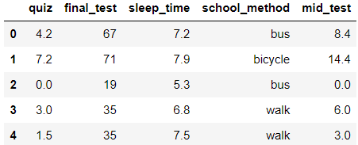


이때 설명변수를 쪽지 시험과 중간고사로 하여 분석해보겠습니다. 이때의 조건수는 어떻게 될까요? 여기서는 분석 결과의 아래 부분만 싣겠습니다.

```python
formula = 'final_test ~ quiz + mid_test'
result = smf.ols(formula, df).fit()
print(result.summary())
```

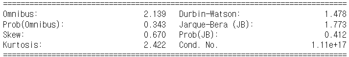


조건수가 1.22e+17이라는 매우 큰 값이 되었습니다. 이와 같이 다중공선성이 생기면 조건수는 매우 큰 값이 됩니다. 조건수가 꽤 큰 값이 되어 있을 때는 다중공선성을 의심해보는 것이 좋습니다. 그리고 그 경우에는 설명변수 중에서 한쪽 변수를 모형에서 제외하는 것을 해결책으로 생각 할 수 있습니다. 