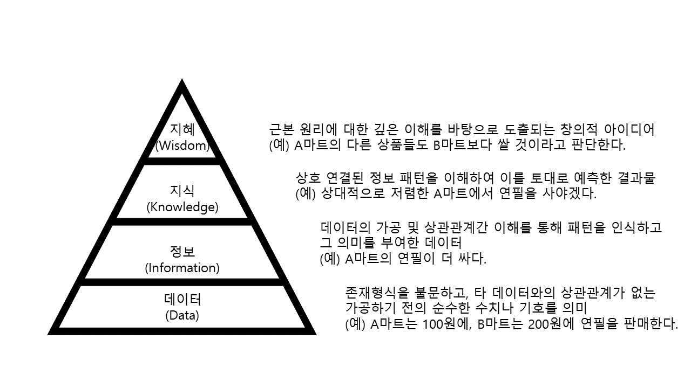

# ①-1. 데이터와 정보

## 01. 데이터의 정의와 특성

### 가. 데이터의 정의

1. 데이터라는 용어는 1646년 영국 문헌에 처음 등장하였으며 라틴어인 Dare(주다)의 과거분사형으로 '주어진 것'이란 의미로 사용되었다.
2. 1940년대 이후 컴퓨터 시대 시작과 함께 자연과학뿐만 아니라 경영학, 통계학 등 다양한 사회 과학이 진일보하며, 데이터의 의미는 과거의 관념적이고 추상적인 개념에서 기술적이고 사실적인 의미로 변화되었다.
3. 데이터는 추론과 추정의 근거를 이루는 사실이다.(옥스퍼드 대사전)
4. 데이터는 단순한 객체로서의 가치뿐만 아니라 다른 객체와의 상호관계 속에서 가치를 갖는 것으로 설명되고 있다.

### 나. 데이터의 특성

|    구분     |                  특성                  |
| :---------: | :------------------------------------: |
| 존재적 특성 |    객관적 사실(Fact, Raw Material)     |
| 당위적 특성 | 추론/예측/전망/추정을 위한 근거(Basis) |

## 02. 데이터의 유형

|                  구분                  |        형태         |          예           |                특징                 |
| :------------------------------------: | :-----------------: | :-------------------: | :---------------------------------: |
| 정성적 데이터 (Qualitative Data)  |    언어, 문자 등    | 회사 매출이 증가함 등 | 저장/검색/분석에 많은 비용이 소모됨 |
| 정량적 데이터 (Quantitative Data) | 수치, 도형, 기호 등 | 나이, 몸무게, 주가 등 | 정형화된 데이터로 비용 소모가 적음  |

## 03. 지식경영의 핵심 이슈

- 데이터는 지식경영의 핵심 이슈인 암묵지(Tacit Knowledge)와 형식지(Explicit Knowledge)의 상호작용에 있어 중요한 역활을 한다.(Polany, 1966)

|  구분  |                             의미                             |              예              |                        특징                         |    상호작용    |
| :----: | :----------------------------------------------------------: | :--------------------------: | :-------------------------------------------------: | :------------: |
| 암묵지 | 학습과 경험을 통해 개인에게 체화되어 있지만 겉으로 드러나지 않는 지식 | 김장김치 담그기, 자전거 타기 | 사회적으로 중요하지만 다른 사람에게 공유되기 어려움 | 공통화, 내면화 |
| 형식지 |               문서나 매뉴얼처럼 형상화된 지식                |      교과서, 비디오, DB      |                전달과 공유가 용이함                 | 표출화, 연결화 |

- 암묵지와 형식지의 상호작용 관계
  - 1단계 : 공통화
    - 암묵지를 타인에게 알려주기
  - 2단계 : 표출화
    - 암묵지를 책 등 형식지로 만들기
  - 3단계 : 연결화
    - 책 등에 자신이 아는 새로운 지식 추가하기
  - 4단계 : 내면화
    - 책 등을 보고 타인들이 암묵적 지식 습득

## 04. 데이터와 정보의 관계

### 가. DIKW의 정의

| 구분              | 특성                                                         |
| ----------------- | ------------------------------------------------------------ |
| 데이터(Data)      | 개별 데이터 자체로는 의미가 중요하지 않은 객관적인 사실      |
| 정보(Information) | 데이터의 가공, 처리와 데이터간 연관관계 속에서 의미가 도출된 것 |
| 지식(Knowledge)   | 데이터를 통해 도출된 다양한 정보를 구조화하여 유의미한 정보를 분류하고 개인적인 경험을 결합시켜 고유의 지식으로 내재화 된것 |
| 지혜(Wisdom)      | 지식의 축적과 아이디어가 결합된 창의적인 산물                |

### 나. DIKW 피라미드

- DIKW 피라미드에서는 데이터, 정보, 지식을 통해 최종적으로 지혜를 얻어내는 과정을 계층구조로 설명하고 있다.

