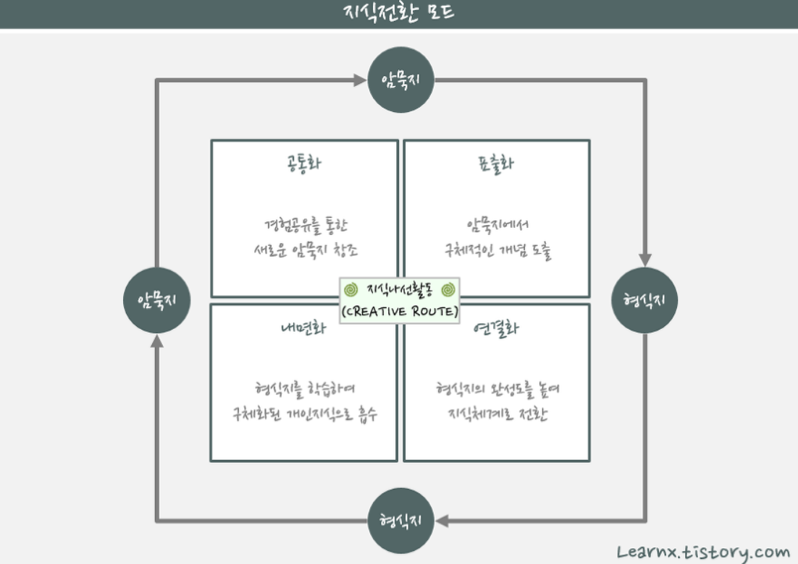
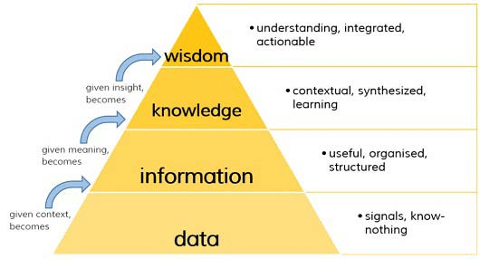

# Chapter 01. 데이터의 이해


## 01. 데이터와 정보


### 1.1 데이터의 정의

- 데이터는 '객관적 사실(fact)'이라는 존재적 특성을 가진다.
  - 개별 데이터 자체로는 의미가 중요하지 않는 사실
- 동시에 '추론, 예측, 전망, 추정을 위한 근거(bias)'로 기능하는 당위적 특성을 가진다.
  - 다른 객체와의 상호관계 속에서 가치를 갖는다.

```
결국, 데이터는 개별로는 의미가 없다
```


### 1.2 데이터의 유형


#### 정성적 데이터(Qualitative data)

- 언어, 문자 등 형태와 형식이 정해져 있지 않음
- 비정형 데이터 형태로 저장, 분석에 시간과 비용이 필요
- 숫자나 금액으로 환산할 수 없는 것
- 설문 조사 주관식 응답, 트위터, 페이스북 등이 해당

```
- 설문조사가 정성적 데이터는 맞지만 문제에서 설문조사는 비정형 데이터라고 한다면 틀린 보기
- 객관식 설문문항은 수치로 처리가 가능하면 정량적 데이터로도 가능
```


#### 정량적 데이터(Quantiative data)

- 수치, 기호, 도형으로 표시
- 데이터양이 증가하더라도 저장, 분석용이
- 숫자나 금액으로 환산 가능한 것
- 온도, 풍속, 강수량 등이 해당

```
정성적 vs 정량적 데이터 구분 문제 출제
```


### 1.3 지식경영 핵심 이슈


#### 암묵지와 형식지

데이터는 지식경영의 핵심 이슈인 암묵지와 형식지의 상호작용에 있어 중요한 역활은 함

- 암묵지 : 학습과 체험을 통해 개인에게 습득되어 있지만, 겉으로 드러나지 않은 지식, 시행착오와 오랜 경험을 통해 개인에게 습득된 무형의 지식 (개인에게 체화되어 있으므로 외부에 표출되어 공유가 어려움.)
- 형식지 : 교과서, 메뉴얼, 비디오, DB와 같이 형상화된 지식을 의미, 유형의 대상이 있어서 지식의 전달과 공유가 쉬움

```
형식지와 암묵지 개념과 사례 구분이 출제
```


#### 암묵지와 형식지의 상호작용(SECI 모델)

- 공통화(Socialization) : 암묵지 지식 노하우를 다른 사람에게 알려줌
- 표출화(Externalization) : 암묵지 지식 노하우를 책, 교본 형식으로 전환함
- 연결화(Combination) : 책, 교본에 자신이 알고 있는 새로운 지식을 추가함
- 내면화(Internalization) : 만들어진 책, 교본을 보고 다른 직원의 암묵적 지식을 습득함



```
상호작용의 4가지 개념이 출제
```

위의 그림과 같이, 개인의 암묵지와 집단에서의 형식지가 나선형의 형태로 회전하면서 생성, 발전, 전환되는 지식의 발전을 기반으로 한 기업의 경영을 지식경영이라 한다.


### 1.4 데이터와 정보의 관계

DIKW 피라미드에서는 데이터, 정보, 지식을 통해 최종적으로 지혜를 얻어내는 과정을 계층구조로 설명하고 있다.



- Data : 존재 형식을 불문하고, 타 데이터와의 상관관계가 없는 가공하기 전의 순수한 수치나 기호
  - 연필 가격 : A 마트 100원, B 마트 200원
- Information : 데이터의 가공 및 상관관계 간 이해를 통해 패턴을 인식하고 의미 부여
  - A 마트의 연필 가격이 더 싸다
- Knowledge : 상호 연결된 정보 패턴을 이해하여 이를 토대로 예측한 결과물
  - 상대적으로 저렴한 A 마트에서 연필을 사야겠다.
- Wisdom : 근본 원리에 대한 깊은 이해를 바탕으로 도출되는 아이디어
  - A 마트의 다른 상품들도 B 마트보다 쌀 것이라고 판단

```
DKIW 개념 구분과 사례 등이 출제
```


## 02. 데이터베이스 정의와 특징


### 2.1 데이터베이스 정의

- 동시에 복수의 적용 업무를 지원할 수 있도록 복수 이용자의 요구에 대응해서 받아들이고 저장, 공급하기 위하여 일정한 구조에 따라서 편성된 데이터의 집합
- 데이터베이스관리시스템(DBMS : DataBase Management System)은 소프트웨어르 의미함.

```
데이터베이스와 DBMS 개념이 출제
```


### 2.2 데이터베이스 특징

- 통합된 데이터 : 데이터베이스에서 동일한 내용의 데이터가 중복되어 있지 않다는 것을 의미한다.
- 저장된 데이터 : 자기 디스크나 자기 테이프 등과 같이 컴퓨터가 접근할 수 있는 저장매체에 저장되는 것을 의미한다.
- 공용 데이터 : 여러 사용자가 서로 다른 목적으로 데이터베이스의 데이터를 공동 이용한다.
- 변화되는 데이터 : 새로운 데이터의 추가, 기존 데이터의 삭제, 갱신으로 항상 변화하면서도 항상 현재의 정확한 데이터를 유지해야 한다는 것을 의미한다.

```
4가지 특징이 출제, 특히 데이터웨어하우스 특징과 구분하는 것이 포인트
```


### 2.3 데이터베이스 특성

- 정보의 축적 및 전달 측면 : 대량의 정보를 정보처리기기가 읽고 쓸 수 있는 기계가독성과 필요한 정보를 검색할 수 있는 검색가능성, 정보통신망을 이용하여 원거리에서도 온라인으로 이용할 수 있는 원격조작서을 갖는다.
- 정보이용 측면 : 이용자의 정보 요구에 따라 다양한 정보를 신속하게 획득하고, 원하는 정보를 경제적으로 찾아낼 수 있다.
- 정보관리 측면 : 방대한 양의 정보를 체계적으로 축적하고 새로운 내용 추가나 갱신이 용이하다.
- 정보기술발전 측면 : 데이터베이스는 정보처리, 검색, 관리 소프트웨어 등 네트워크 발전 기술을 견인할 수 있다.
- 경제/산업적 측면 : 데이터베이스는 인프라로서 특성을 가지고 있어 경제, 산업, 사회활동의 효율성을 제고하고 편의를 증진하는 수간으로 의미를 가진다.

```
데이터베이스 특성 출제
```


### 2.4 데이터베이스 관리시스템 등장 배경

- 같은 내용의 데이터가 여러 파일에 중복저장 및 응용프로그램이 데이터 파일에 종속되는 파일시스템 문제점 발생
- 파일 시스템의 문제를 해결하기 위해 제시된 소프트웨어인 DBMS이 등장


### 2.5 데이터베이스 관리시스템의 발전과정


#### DBMS의 발전과정

- 1세대 : 네트워크 DBMS, 계층 DBMS

  - 복잡하고 변경이 어려움

- 2세대 : 관계(Relation) DBMS

  - 데이터베이스를 테이블 형태구성
  - (예) 오라큰, 액세스, MySQL

- 3세대

  - 객체 지향(Objected) DBMS

    멀티미디어 데이터의 확산으로 관계형 데이터 모델 표현하기 어려움. 같은 행위를 갖는 객체는 한 클래스에 속하며, 클래스 연산을 나타내기 위해 메소드 함수를 정의함

  - 객체 관계형 모델(ORDBMS)

    기존의 관계형 모델에 객체 지향형 모델의 장점을 선별하여 관계형모델에 통합한 새로운 개념의 데이터 모델

- 4세대 : NoSQL DBMS

  - 데이터구조를 미리 정해두지 않기 때문에 비정형 데이터를 저장하고 처리함

```
관계형 DBMS와 객체 지향 DBMS 개념 출제
```


#### RDBMS vs ODBMS

- 관계형 데이터베이스 관리시스템(RDBMS )
- 객체 지향 데이터베이스 관리시스템(ODBMS)

| 구분 | RDBMS                                                        | ODBMS                                              |
| ---- | ------------------------------------------------------------ | -------------------------------------------------- |
| 장점 | 검증된 시스템<br />대규모 정보처리 가능                      | 복잡한 정보 구조의 모델링 가능                     |
| 단점 | 제한된 형태의 정보만 처리 가능<br />복잡한 정보 구조의 모델링이 어려움 | 사용자 정의 타입 및 비정형 복합 정보 타입 지원가능 |

```
RDBMS와 ODBMS 차이 구분 출제
```


#### 데이터 유형 분류

|  데이터 유형  |                             특징                             |                  데이터의 종류                   |
| :-----------: | :----------------------------------------------------------: | :----------------------------------------------: |
|  정형 데이터  |      RDBMS의 고정된 필드에 저장<br />데이터 스키마 지원      |              RDB<br />스프레드시트               |
| 반정형 데이터 | 데이터 속성인 메타데이터를 가지며, 일반적으로 스토리지에 저장되는 데이터 파일 |   HTML<br />JSON<br />웹문서<br />센서 데이터    |
| 비정형 데이터 |  형태, 구조가 복잡한 이미지, 동영상 같은 멀티미디어 데이터   | 소셜 데이터<br />문서 이미지<br />오디오, 비디오 |

```
데이터의 유형 특징 구분, 종류가 출제
```


#### 스키마와 인스턴스

- 스키마(schema) : 구조를 만드는 것

  구체적으로 데이터베이스의 구조와 제약조건을 기술

| 상품  아이디 | 카테고리 | 상품명 | 상품가격 | 상품재고 |
| :----------: | :------: | :----: | :------: | :------: |
|    문자형    |  숫자형  | 문자형 |  숫자형  |  숫자형  |

- 인스턴스(Instance) : 특정 시점의 데이터베이스 내용


### 2.6 데이터베이스 설계 절차

- 요구조건 분석 : 데이터베이스의 사용자, 사용목적, 사용범위, 제약조건 등에 대한 내용을 정리하고 명세서를 작성

- 개념적 설계(E-R모델) : 정보를 구조화하기 위해 추상적 개념으로 표현하는 과정으로 개념 스키마 모델링과 트랜잭션 모델링을 병형하고, 요구조건 분석을 통해 DBMS 독립적인 E-R 다이어그램을 작성
- 논리적 설계(데이터 모델링) : 자료를 컴퓨터가 이해할 수 있도록 특정 DBMS의 논리적 자료 구조로 변환하는 과정
- 물리적 설계(데이터 구조화) : 논리적 구조로 표현된 데이터를 무리적 구조의 데이터로 변환하는 과정


### 2.7 데이터웨어하우스(Data Warehouse, DW)


#### 정의

- 데이터웨어하우스는 업무 트랜잭션을 처리하는 데이터베이스 시스템에서 사용자들이 필요로 하는 정보를 추출해서 가공된 데이터 형태로 구성되는 업무 분석을 위한 데이터베이스이다.
- 이는 데이터베이스 관련자들이 업무 처리와 관련된 데이터들은 잘 저장하지만 저장된 데이터들은 제대로 활용하지 못한다는 점에 착안하여 어떻게 하면 데이터베이스에 저장되어 있는 데이터들은 보다 유익하게 효율적으로 활용할지에 대한 관점에서 시작된 개념이다.


#### 데이터베이스와 데이터웨어하우스 비교

- OLTP(On-Line Transaction Processing) : 네트워크 상의 여러 이용자가 실시간으로 데이터베이스의 데이터를 갱신하거나 조회하는 등의 단위작업을 처리하는 방식
  - 은행에서 수많은 입출금 등이 일어날 때
- OLAP(On-Line Analytic Processing) : 정보 위주의 처리분석을 의미한다. 의사결정에 확룔할 수 있는 정보를 얻을 수 있게 해주는 기술
  - 판매추이, 구매성향 파악, 재무회계 분석 등을 프로세싱하는 것

```
두 개념의 차이가 출제
```


#### 데이터웨어하우스 특징

- 데이터의 주제지향성
  - 데이터웨어하우스는 의사결정에 필요한 주제와 관련된 데이터만 유지하는 주제지향적인 특징을 가진다.
- 데이터의 통합성
  - 데이터웨어하우스는 데이터가 항상 일괄된 상태를 유지하도록 여러 데이터베이스에서 추출한 데이터를 통합하여 저장하는 특징을 가진다.
- 데이터의 시계열성
  - 데이터웨어하우스는 과거와 현재의 데이터를 동시에 유지하여 데이터 간의 시간적 관계나 동향을 분석해 의사결정에 반영할 수 있도록 하는 특징을 가진다.
  - 데이터웨어하우스의 시계열성은 어떤 자료가 시간에 따라 변경되어야 하는 것이 아니고, 시간에 따른 변경을 항상 반영하고 있어야 함을 의미한다.
- 데이터의 비휘발성
  - 데이터베이스의 저장된 데이터는 삽입, 삭제, 수정 작업이 자주 발생하지만 데이터웨어하우스는 검색작업만 수행되는 읽기 전용의 데이터를 유지한다.


#### 데이터웨어하우스 vs 데이터 마트

- 데이터 마트는 데이터웨어하우스 환경에서 정의된 집단 계층으로, 데이터웨어하우스에서 데이터를 꺼내 사용자에게 제공하는 역활을 함

* 데이터 마트는 데이터웨어하우스의 부분이며, 대개 특정한 조직, 혹은 팀에서 사용하는 것을 목적으로 함

```
데이터마트와 데이터웨어하우스의 개념 구분이 출제
```


#### 데이터베이스 언어 SQL

- SQL(Structure Query Language)은 관계 데이터베이스는 위한 표준 질의어로 많이 사용하는 언어이다.
- SQL은 기능에 따라 데이터 정의어(DDL), 데이터 조작어(DML), 데이터 제어어(DCL)로 나눈다.
  - 데이터 정의어(DDL) : 데이터를 생성(Create)하고 변경(Alter), 제거(Drop)하는 기능을 제공
  - 데이터 조작어(DML) : 데이터를 검색(Select), 데이터 삽입(Insert), 데이터 수정(Update), 데이터 삭제(Delete)하는 기능 제공
  - 데이터 제어어(DCL) : 보안을 위해 데이터에 대한 접근 및 사용권한을 사용자별로 부여하거나 취소하는 기능을 제공


## 03. 데이터베이스 활용


### 3.1 기업 내부 데이터베이스

| 구분     | 주요 특징                                                    |
| -------- | ------------------------------------------------------------ |
| 1980년대 | - OLTP(On-Line Transaction Processing)<br />- OLAP(On-Line Analytic Processing) |
| 2000년대 | - CRM (Customer Relationship Management) <br />- SCM (Supply Chain Manegement) |

- CRM : 선별된 고객으로부터 수익을 창출하고 장기적인 고객 관계를 가능케 함으로써 보다 높은 이익을 창출할 수 있는 솔루션
- SCM : 제조, 물류, 유통업체 등 유통 공급망에 참여하는 모든 업체가 협력을 바탕으로 정보기술을 활용, 재고를 최적화하기 위한 솔루션
- SCM과  CRM은 연동되기 때문에 상호 밀접한 관계 오늘날 CRM은 기존의 목적은 변화되지 않고 방법론에서만 변화하고 있음

```
CRM과 SCM의 개념을 묻는 문제 출제
```


#### 실시간 기업(RTE : Real-Time Enterprise)

가트너는 RTE를 '최신 정보를 사용해 자사의 핵심 비지니스 프로세스들의 관리와 실행 과정에서 생기는 지연 사태를 지속해서 제거함으로써 경쟁하는 기업'으로 정의


### 3.2 분야별 기업 내부 데이터베이스

|   분야   |                         주요 솔루션                          |
| :------: | :----------------------------------------------------------: |
| 제조부문 | **DW**(Data warehouse) <br />**ERP**(Enterprise Resource Planning) <br />**BI**(Business Intelligence)<br />**CRM**(Customer Relationship Management) |
| 금융부문 | **EAI**(Enterprise Architecture Integration)<br />**EDW**(Enterprise Data Warehouse)<br />**블록체인**(Blockchain)<br />이밖에 ERP, e-CRM 등 |
| 유통부문 | **KMS**(Knowledge Management System)<br />**RFID**<br />이 밖에 CRM, SCM 등 이용 |


#### 제조부문

- ERP : 제조업을 포함한 다양한 비지니스 분야에서 생산, 구매, 재고, 주문, 공급자와의 거래, 고객서비스 제공 등 주요 프로세스 관리를 돕는 여러 모듈로 구성된 통합솔루션
- BI(Business Intelligence) : 데이터 기반 의사결정을 지원하기 위한 리포트 중심의 도수
- BA(Business Analytics)는 소프트웨어로 데이터를 분석해 미래를 예측하거나(예측분석), 특정 접근법을 적용했을 때 발생할수 있는 일을 내다보는 (처방적 분석) 기술의 도움을 받는 과정이다. 그래서 BA는 '고급 분석(advanced analytics)'이라고도 불린다.
  - 의사결정을 위한 통계적이고 수학적인 분석에 초점

```
ERP 정의, BI와 BA 개념 구분 출제
```


#### 금융부문

- EAI : 기업 애플리케이션 통합을 의미, 기업 내의 ERP(전사적 자원관리), CRM(고객관계관리), SCM(공급망계획) 시스템이나 인트라넷 등의 시스템 간에 상호 연동이 가능하도록 통합하는 솔루션
- EDW : 기존 DW를 전사적으로 확장한 모델인 동시에 BPR과 CRM, BSC 같은 다양한 분석 애플리케이션들을 위한 원천이 됨. 따라서 EDW를 구축하는 것은 단순히 정보를 빠르게 전달하는 대형 시스템을 도입한다는 의미가 아니라 기업 리소스의 유기적 통합, 다원화된 관리체계 정비, 데이터의 중복 방지 등을 위해 시스템을 재설계하는 것.
- 블록체인 : 데이터 분산 처리 기술, 네트워크 참여하는 모든 사용자가 모든 거래내용 등의 데이터를 분산, 저장하는 기술을 말함. 블록들을 체인 형태로 묶는 형태이기 때문에 블록체인이라는 명칭이 생겨남. 기존 거래 방식에서 데이터를 위.변조하기 위해는 은행의 중앙 서버를 공격하면 가능했으나 최근 은행 전산망 해킹 사건이 발생했으나 블록체인인 경우 사실 상 해킹이 불가능함

```
각 솔루션의 정의가 출제
```


### 3.3 사회 기반 구조로서의 데이터베이스

1990년대에 사회 각 부문의 정보화가 본격화되면서 데이터베이스 구축이 활발하게 추진되었다. 특히 정부부처를 중심으로 사회간접자본 차원에서 전자문서교환(EDI)의 활용이 본격화되었고, 부가가치통신망(VAN)을 통한 정보망이 구축되기 시작하였다. 인터넷의 보편화로 인해 일반 국민들도 가정에서 손쉽게 생활에 필요한 정보를 습득할 수 있게 되었고, 이로 인해 데이터베이스는 사회 전반의 기간제로서 자리매김하게 되었다.

- EDI(Electronic Data Interchange) : 표준화된 상거래 서실 또는 공공 서식을 서로 합의된 표준에 따라 전자문서를 만들어 컴퓨터 및 통신을 매개로 상호 교환하는 것을 의미한다.
- CALS : 광속상거래(Commerce At Lighted Speed)의 약칭이다. 각종 기술 자료를 디지털화해 관련 데이터를 통합 운영하는 업무 환경을 의미한다.


### 3.4 분야별 사회기반 구조로서의 데이터베이스

| 분야     | 주요 솔루션                                                  |
| -------- | ------------------------------------------------------------ |
| 물류부문 | - 종합물류정보망 : 실시간 차량추적<br />- 부가가치통신망(VAN, Value Added Network) |
| 지리부문 | 국가지리정보체계(NGIS), RS, GPS                              |
| 교통부문 | 지능형교통시스템(ITS)                                        |
| 의료부문 | 의료 EDI                                                     |
| 교육부문 | 교육행정정보시스템(NEIS)                                     |

- 부가가치통신망(VAN, Value Added Network): 일반적인 의미는 통신회선을 소유 또는 임차하여 구성한 네트워크에 단순한 전송 기능 이상의 부가가치를 첨가하여 정보를 축적, 가공, 변환 처리하여 음성 또는 데이터 정보를 제공해주는 광범위하고도 복합적인 통신 서비스의 집합을 말한다.