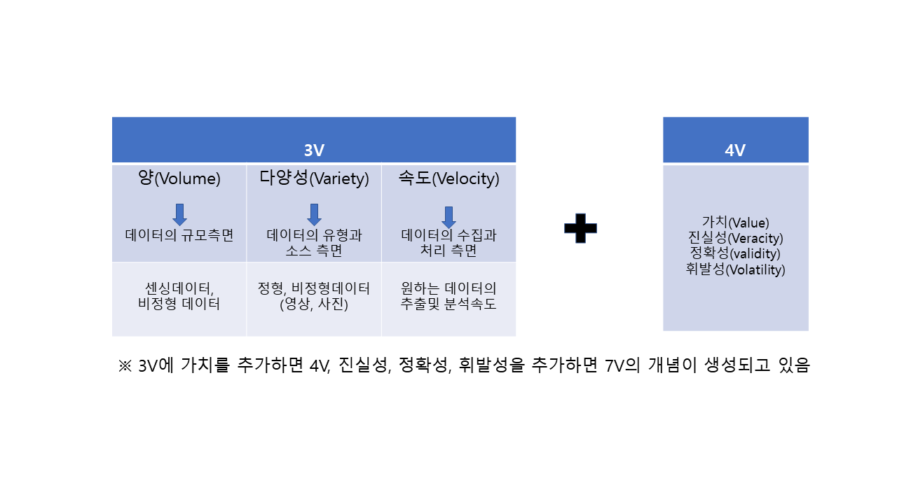
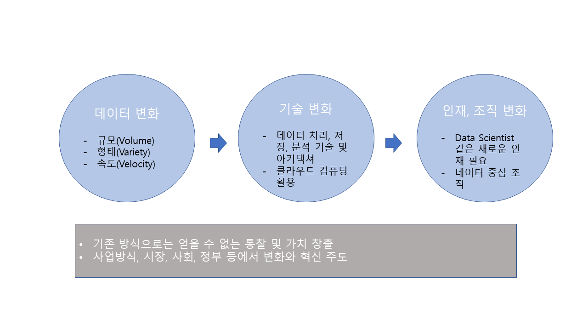
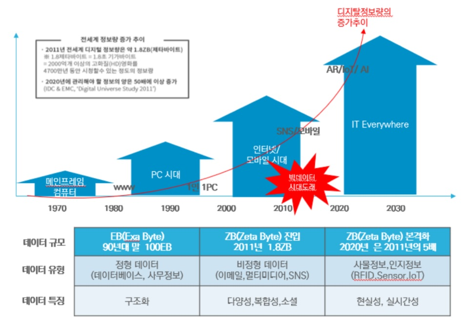
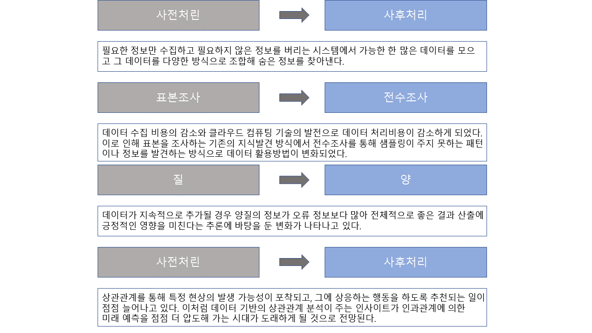

# Chapter 02-1. 빅데이터의 이해

## 01. 빅데이터의 이해

### 가. 관점에 따른 정의

- 빅데이터의 정의는 빅데이터를 보는 **관점에 따라 3가지**로 정의한다.
  - 첫째, **3V**로 요약되는 데이터 자체의 특성 변화에 초점을 맞춘 **좁은 범위의 정의**가 있다.
  - 둘째, 데이터 자체뿐 아니라 처리, 분석 기술적 변화까지 포함되는 **중간 범위의 정의**가 있다.
  - 셋째, 인재, 조직 변화까지 포함한 **넓은 관점에서의 빅데이터에 대한 정의**가 있다.

- 가트너 그룹(Gartner Group)의 더그 래니(Doug Laney)의 3V

### 나. 빅데이터의 정의의 범주 및 효과

## 02. 출현 배경과 변화

### 가. 출현 배경

- 빅데이터 현상은 없었던 것이 새로 등장한 것이 아니라 기존의 데이터, 처리 방식, 다루는 사람과 조직 차원에서 일어나는'변화'를 말한다.
- 3가지 출현 배경

|   분야   |          출현배경           | 내용                                                         |
| :------: | :-------------------------: | :----------------------------------------------------------- |
|  산업계  |      고객 데이터 축적       | 고객 데이터를 축적하여 보유함으로써 **데이터에 숨어있는 가치를 발굴**해 새로운 성장동력원으로의 기술 확보 |
|   학계   | 거대 데이터 활용, 과학 확산 | 거대 데이터를 다루는 학문 분야가 늘어나면서 필요한 기술 **아키텍처 및 통계 도구들이 발전** |
| 기술발전 |      관련 기술의 발달       | 디지털화, 저장 기술의 발달, 인터넷 보급, 모바일 혁명, 클라우드 컴퓨팅 |

- ICT의 발전과 빅데이터의 출현

## 03. 빅데이터에 거는 기대를 표현한 비유

| 산업혁명의 석탄, 철 | 제조업 뿐만 아니라 서비스 분야의 생산성을 획기적으로 끌어올려 사회/경제/문화/생활 전반에 혁명적 변화를 가져올 것으로 기대됨. |
| :-----------------: | ------------------------------------------------------------ |
|    21세기의 원유    | 경제 설장에 필요한 정보를 제공함으로써 산업 전반의 생산성을 한 단계 향상시키고, 기존에 없던 새로운 범주의 산업을 만들어낼 것으로 전망됨 |
|        렌즈         | 렌즈를 통해 현미경이 생물학 발전에 미쳤던 영향만큼이나 데이터가 산업 발전에 영향을 미칠 것으로 기대됨. (예)Ngram Viewer |
|       플랫폼        | '공동 활용의 목적으로 구축된 유무형의 구조물'로써의 다양한 서드파티 비지니스에 활용되면서 플랫폼 역활을 할 것으로 전망됨. (예) 카카오톡, 페이스북 |

## 04. 빅데이터가 만들어 내는 본질적인 변화

- 과거에서 현재로의 변화

