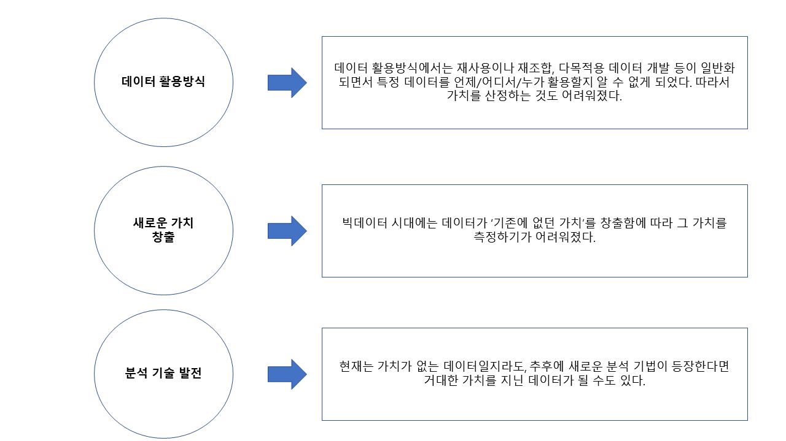
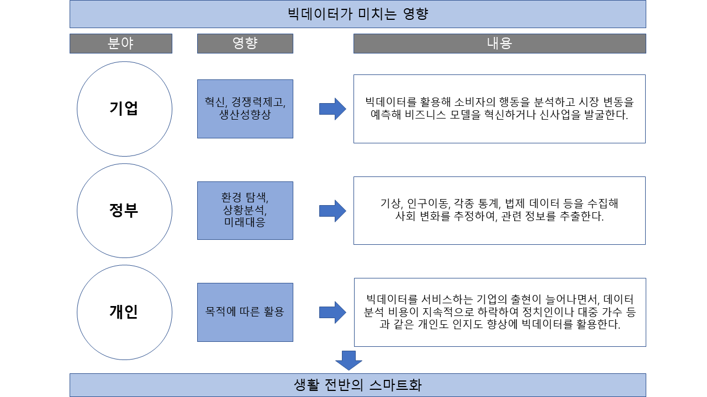

# Chapter 02-2. 빅데이터의 가치와 영향

## 01. 빅데이터의 가치

### 가. 빅데이터 가치 산정이 어려운 이유

- 여러가지 변수로 인해 빅데이터 시대에서는 가치를 측정하는 것이 쉽지 않다.

## 02. 빅데이터의 영향

- 다양한 시장 주체들이 빅데이터를 활용함에 따라 소비자이면서 국민인 일반인들은 맞춤형 서비스를 저렴한 비용으로 이용하게 되고, 적시에 필요한 정보를 얻음으로써 다양한 형태로 기회비용을 절약할 수 있어 사람들의 생활이 점점 스마트해지고 있다.

