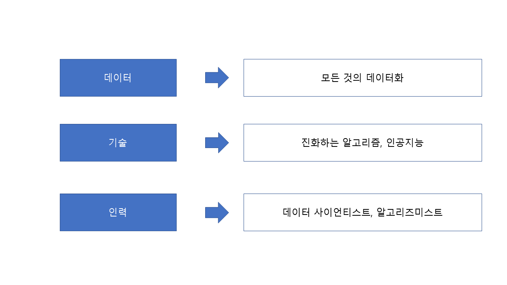

# Chapter 02-5. 미래의 빅데이터

## 01. 빅데이터 활용의 3요소

### 가. 기본 3요소

#### 데이터

- 모든 것을 데이터화(Datafication) 하는 현 추세로 특정 목적없이 축적된 데이터를 통한 창의적인 분석이 가능해져, 새로운 가치로 부상하고 있다.

#### 기술

- 대용량의 데이터를 빠르게 처리하기 위한 알고리즘의 진화와 함께 스스로 학습하고 데이터를 처리할 수 있는 인공지능 기술이 출현하였다.

#### 인력

- 빅데이터를 처리하기 위한 데이터 사이언티스트와 알고리즈미스트의 역활을 통해 빅데이터의 다각적 분석을 통한 인사이트 도출이 중요해지고 있다.

### 참고

- **데이터 사이언티스트**  

  빅데이터에 대한 이론적 지식과 숙련된 분석 기술을 바탕으로 통찰력, 전달력, 협업 능력을 두루 갖춘 전문인력으로써 빅데이터의 다각적 분석을 통해 인사이트를 도출하고 이를 조직의 전략 방향제시에 활용할 줄 아는 기획자

- **알고리즈미스트**  

  데이터 사이언티스트가 한 일로 인해 부당하게 피해가 발생하는 것을 막는 역활을 하며 알고리즘 코딩 해석을 통해 빅데이터 알고리즘에 의해 부당하게 피해를 입은 사람을 구제하는 전문인력