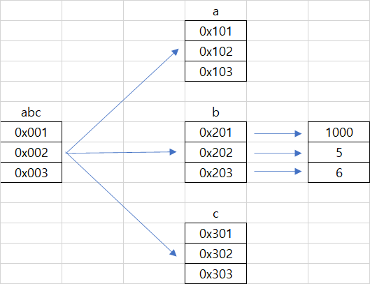

# Chapter 3. 화면 입출력과 리스트


## 01. 화면 입출력


### 1.1 사용자 인터페이스


컴퓨터에 명령을 입력할 때 사용하는 환경을 **사용자 인터페이스**라고 한다.  대표적인 2가지 방식이 있다.

* GUI (Graphical User Interface) : 마우스와 아이콘같은 도구로 명령을 하는 방식

* CLI (Command Line Interface) :  키보드와 같은 타이핑으로 명령을 입력하는 방식


### 1.2 화면 입출력

| 함수    | 설명           |
| ------- | -------------- |
| input() | 표준 입력 함수 |
| print() | 표준 출력 함수 |


## 02. 리스트의 이해


### 2.1 리스트의 개념

리스트는 하나의 변수에 여러 값을 할당하는 자료형이다. 이러한 기법을 시퀀스 자료형이라고 한다. 리스트는 하나의 자료형으로만 저장하지 않고, 정수형이나 실수형 같은 다양한 자료형을 포함할 수 있다.


### 2.2 인덱싱과 슬라이싱


####  1. 인덱싱

* 인덱싱이란 리스트에 값에 접근하기 위해, 이 값의 상대적인 주소를 사용하는 것이다.

* ```python
  colors = ['red', 'blue', 'green']
  colors[0] # 'red'
  colors[1] # 'blue'
  colors[2] # 'green'
  ```


#### 2. 슬라이싱

* 리스트의 인덱스를 사용하여 전체 리스트에서 일부를 잘라내어 반환한다.

* ```python
  cities = ['서울', '부산', '인천', '대구', '대전', '광주', '울산', '수원']
  
  # 변수명[시작 인덱스: 마지막 인덱스]
  # 마지막 인덱스 -1 이 반환된다.
  
  cities[0:5] # [''서울', '부산', '인천', '대구', '대전'']
  cities[5:] # ['광주', '울산', '수원']
  ```

  

  


#### 3. 리버스 인덱싱

* 리버스 인덱싱은 기존 인덱스와 달리 마지막 값부터 -1을 할당하여 첫 번째 값까지 역순으로 올라오는 방식이다.

* ```python
  cities = ['서울', '부산', '인천', '대구', '대전', '광주', '울산', '수원']
  cities[-8:] # ['서울', '부산', '인천', '대구', '대전', '광주', '울산', '수원']
  ```

  

  


#### 4. 인덱스 범위를 넘어가는 슬라이싱

* 슬라이싱을 할때 인덱스의 첫 번째 값이나 마지막 값이 비어 있어도 잘 작동한다.

* ```python
  cities = ['서울', '부산', '인천', '대구', '대전', '광주', '울산', '수원']
  
  # cities 변수의 처음부터 끝까지
  cities[:] # ['서울', '부산', '인천', '대구', '대전', '광주', '울산', '수원']
  
  # 범위를 넘어갈 경우 자동으로 최대 범위를 지정
  cities[-50:50] # ['서울', '부산', '인천', '대구', '대전', '광주', '울산', '수원']
  ```

  

#### 5 .증가값

* ```python
  cities = ['서울', '부산', '인천', '대구', '대전', '광주', '울산', '수원']
  
  # 2칸 단위로
  cities[::2] # ['서울', '인천', '대전', '울산']
  
  # 역으로 슬라이싱
  cities[::-1] # ['수원', '울산', '광주', '대전', '대구', '인천', '부산', '서울']
  ```


### 2.3 리스트의 연산


#### 1. 덧셈 연산

* ```python
  coror1 = ['red', 'blue', 'green']
  coror2 = ['orange', 'black', 'white']
  
  coror1+coror2 # ['red', 'blue', 'green', 'orange', 'black', 'white']
  ```

  

#### 2. 곱셈 연산

* ```
  coror1*2 # ['red', 'blue', 'green','red', 'blue', 'green']
  ```

  

#### 3. in 연산

* in 연산은 포함 여부를 확인하는 연산으로, 하나의 값이 해당 리스트에 들어 있는지 확인할 수 있다.

* ```python
  'blue' in color2 # False
  ```


### 2.4 리스트의 추가 및 삭제

| 함수     | 기능                                                         | 용례                              |
| -------- | ------------------------------------------------------------ | --------------------------------- |
| append() | 새로운 값을 기존 리스트의 맨 끝에 추가                       | color.append('white')             |
| extend() | 새로운 리스트를 기존 리스트에 추가(덧셈 연산과 같은 효과)    | color.extend(['black', 'purple']) |
| insert() | 기존 리스트의 i번째 인덱스에 새로운 값을 추가, i번째 인덱스를 기준으로 뒤쪽의 인덱스는 하나씩 밀림 | color.insert(0, 'orange')         |
| remove() | 리스트 내의 특정 값을 삭제                                   | color.remove('white')             |
| del      | 특정 인덱스값을 삭제                                         | del color[0]                      |


### 2.5 패킹과 언패킹

* 패킹과 언패킹은 리스트에서만 사용하는 개념은 아니다. 다른 시퀀스 자료형에서 일반적으로 사용할 수 있는 방법이다.

* 패킹은 한 변수에 여러개의 데이터를 할당하는 것, 그 자체를 패킹이라고 하며, 리스트 자체를 뜻하기도 한다.

* 언패킹은 한 변수에 여러개의 데이터가 들어 있을 때, 그것을 각각의 변수로 반환하는 방법이다.

* ```python
  # 1, 2, 3 을 변수 t에 패킹
  t = [1, 2, 3]
  
  # t에 있는 값을 a, b, c에 언패킹
  a, b, c = t
  ```

  

### 2.6 이차원 리스트

* 리스트 안에 리스트를 넣는 것

* ```python
  a = [1, 2, 3]
  b = [4, 5, 6]
  c = [7, 8, 9]
  
  abc = [a, b, c] # [[1, 2, 3], [4, 5, 6], [7, 8, 9]]
  abc[0][2] # 3 
  ```

  

## 03. 리스트의 메모리 관리 방식


### 3.1 리스트의 메모리 저장

* ```python
  a = [1, 2, 3]
  b = [4, 5, 6]
  c = [7, 8, 9]
  
  abc = [a, b, c] # [[1, 2, 3], [4, 5, 6], [7, 8, 9]]
  
  # b 리스트에 값을 바꿨지만 abc 리스트의 값이 바뀌었다. 리스트는 값을 저장하는 것이 아닌 주소를 저장하기 때문이다.
  b[0] =1000
  abc # [[1, 2, 3], [1000, 5, 6], [7, 8, 9]]
  ```

  

  


* ```python
  a = 300
  b = 300
  
  a is b # False is 는 메모리 주소를 비교하는 연산
  a == b # True == 는 값을 비교하는 연산
  
  a = 1
  b = 1
  
  a is b # True 
  a == b # True
  # 파이썬의 정수형 저장 방식의 특성은 -5 ~ 256까지의 정수는 특정 메모리 주소 값에 저장되기에 a is b 는 True 로 나타난다.
  ```


### 3.2 메모리 저장 구조로 인한 리스트의 특징


#### 1. 하나의 리스트에 다양한 자료형 포함 가능


* 파이썬의 리스트가 값이 아닌 메모리의 주소를 저장해 다양한 자료형을 포함할 수 있다. 


#### 2. 리스트의 저장 방식

* ```python
  a = [5, 4, 3, 2, 1]
  b = [1, 2, 3, 4, 5]
  
  b = a # [5, 4, 3, 2, 1]
  a.sort()
  b # [1, 2, 3, 4, 5]
  # b=a를 입력하는 순간 b 리스트도 a 리스트의 메모리 주소와 연결이 된다. 두 변수가 같은 메모리 주소와 연결되어 있으므로, 하나의 변수 값만 바뀌더라도 둘 다 영향을 받는 것이다.
  ```


* ```python
  b = [6, 7, 8, 9, 10]
  ```


