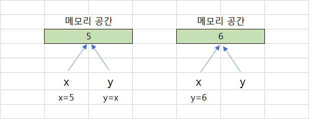
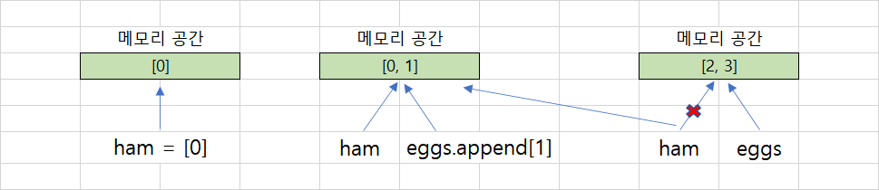

# Chapter 05. 함수


## 01. 함수 기초


### 1.1 함수의 개념과 장점

* 함수는 어떤 일을 수행하는 코드의 묶음
* 함수의 장점
  * 1.  필요할때 마다 호출 가능
    2.  논리적인 단위로 분할 가능
    3.  코드의 캡슐화 : 만들어 둔 함수는 다른 사람이 쉽게 사용할 수 있다


### 1.2 함수의 선언

```python
def 함수이름 (매개변수 #1 ...):
	수행문 1
    수행문 2      
    return <반환값>      
```


### 1.3 함수의 실행 순서

```python
def sum_abc (a,b,c):
    return a+b+c

sum_abc(1,2,3)

# 1행과 2행을 함수로 정의된 부분으로 실행하지 않는다. 하지만 정확히 말하면 실행되지 않는 것처럼 보일 뿐, 해당 코드를 메모리에 업로드하여 다른 코드를 호출해 사용할 수 있도록 준비 과정을 거친다. 만약 함수의 선언 부분을 함수 호출의 뒤에 둔다면 코드 호출은 되질 않는다.
```


### 1.4 매개변수와 인수

|   구분   |                             설명                             |         예시         |
| :------: | :----------------------------------------------------------: | :------------------: |
| 매개변수 | 함수의 인터페이스 정의에 있어 어떤 변수를 사용하는지를 정의하는 것 | sum_abc() 에서 a,b,c |
|   인수   |                 실제 매개변수에 대입되는 값                  | sum_abc() 에서 1,2,3 |


### 1.5 함수의 형태

| 구분        | 매개변수 없음                                 | 매개변수 있음                                       |
| ----------- | --------------------------------------------- | --------------------------------------------------- |
| 반환값 없음 | 함수 안 수행문만 수행                         | 매개변수를 사용하여 수행문만 수행                   |
| 반환값 있음 | 매개변수 없이 수행문을 수행한 후, 결과값 반환 | 매개변수를 사용하여 수행문을 수행한 후, 결과값 반환 |

```python
def sum_abc_1 (): # 매개변수x, 반환값x
    print('테스트')
    
def sum_abc_2 (a,b,c): # 매개변수o, 반환값x
    print(a,b,c)
    
def sum_abc_3 (): # 매개변수x, 반환값o
    return a+b+c

def sum_abc_4 (a,b,c): # 매개변수o, 반환값o
    return a+b+c

# 반환값이 없는 함수 자체는 None 값을 가진다.
```


## 02. 함수 심화


### 2.1 함수의 호출 방식

* 전통적인 프로그래밍에서 함수가 변수를 호출하는 방식

|             종류              |                             설명                             |
| :---------------------------: | :----------------------------------------------------------: |
| 값에 의한 호출(call by value) | * 함수에 인수를 넘길 때 값만 넘김<br /> * 함수 안의 인수값 변경 시, 호출된 변수에 영향을 주지 않음 |
| 참조 호출(call by reference)  | * 함수에 인수를 넘길 때 메모리 주소를 넘김<br />* 함수 안의 인수값 변경 시, 호출된 변수값도 변경됨 |


* 파이썬은 전통적인 두 가지 방식을 혼합한, 객체 호출(call by object reference) 을 사용한다.



```python
def spam(eggs):
    eggs.append(1) # 기존 객체의 주소값에 [1] 추가
    eggs = [2,3] # 새로운 객체 생성
    
ham = [0]
spam(ham)
print(ham)

# [0,1]
```

* 먼저 ham 이라는 리스트를 만들고, 함수 spam에 ham 을 인수로 넣었다. 이때 함수 안에서는 이름이 ham에서 eggs로 바뀐다.  ham과 eggs는 함수의 호출 방식이 객체 호출이므로 같은 주소를 공유한다. 따라서 2행의 `eggs.append(1)`에 의해 해당 리스트에 1이 추가되면, ham과 eggs 모두의 영향을 받는다.
* `eggs = [2,3] `은 새로운 리스트를 만드는 코드이다. 그래서 이 경우, 더는 ham과 eggs와 같은 메모리 주소를 가리키지 않고 eggs는 자기만의 메모리 주소를 가지게 된다. 그리고 함수를 빠져나가 7행의 `print(ham)`이 실행되면 2행의  `eggs.append(1)`에 의해 [0,1] 이 화면에 출련된다. 이것이 바로 객체 호출이라는 파이썬의 함수 안 변수 호출 방식이다.




### 2.2 변수의 사용 범위

|   구분    |          설명          |
| :-------: | :--------------------: |
| 지역 변수 |   함수 안에서만 사용   |
| 전역 변수 | 프로그램 전체에서 사용 |

```python
def f():
    s = 'I love London!'
    print(s)
    
s = 'I love Paris!'
f()
print(s)

# I love London!
# I love Paris!
# 함수 안에 s는 지역 변수, 함수 밖에 s는 전역 변수
```

```python
def f():
    global s
    s = 'I love London!'
    print(s)
    
s = 'I love Paris!'
f()
print(s)

# I love London!
# I love London!
# 함수 안에 전역 변수로 선언된 변수를 사용하기 위해서는 global 을 사용하면 된다.
```


### 2.3 재귀 함수

* 재귀 함수는 함수가 자기 자신을 다시 부르는 함수이다.

```python
# 팩토리얼
def factorial(n):
    if n == 1:
        return 1
    else:
        return n * factorial(n-1)    
```


## 03. 함수의 인수


|       종류       |                             내용                             |
| :--------------: | :----------------------------------------------------------: |
|   키워드 인수    | 함수의 인터페이스에 지정된 변수명을 사용하여 함수의 인수를 지정하는 방법 |
|   디폴트 인수    | 별도의 인수값이 입력되지 않을 때, 인터페이스 선언에서 지정한 초깃값을 사용하는 방법 |
|    가변 인수     | 함수의 인터페이스에 지정된 변수 이외의 추가 변수를 함수에 입력할 수 있게 지원하는 방법 |
| 키워드 가변 인수 |      매개변수의 이름을 따로 지정하지 않고 입력하는 방법      |


### 3.1 키워드 인수

```python
def print_something(name, age, city):
	print(name, age, city)
    
print_something('summer', 4, 'busan' ) # 변수의 입력 순서를 알아야한다.
print_something(city = 'busan', age = 4, name = 'summer') 
# 키워드 인수를 사용하면 순서를 알아야 할 필요가 없다. 일반적으로 `변수 = 값`으로 사용한다.

# 'summer' 4 'busan'
```


### 3.2 디폴트 인수

```python
def print_something(name, age = '4', city = 'busan'): # age = '4', city = 'busan' 디폴트값
	print(name, age, city)
    
print_something('summer')    
# 'summer' 4 'busan'
```


### 3.3 가변 인수

* 코드를 작성할 때, 가끔 함수의 매개변수 개수가 정해지지 않고 진행해야하는 경우가 있다. 이때 사용하는 것이 가변 인수이다. 가변 인수는 *(asterisk라고 부름) 로 표현할 수 있는데, *는 파이썬에서 기본적으로 곱셈 또는 제곱 연산 외에도 변수를 묶어 주는 가변 인수를 만든다.
* 가변 인수* 는 반드시 일반적인 키워드 인수가 모두 끝난 후 넣어야 한다.  리스트와 비슷한 튜플 형태로 함수 안에서 사용할 수 있으므로 인덱스를 사용하여, 즉 args[0], args[1] 등으로 변수에 접근할 수 있다.

```python
def asterisk_test(a, b, *args):
    print(a, b)
    print(args)
    
asterisk_test(1,2,3,4,5)

# 1, 2
# (3,4,5)
```


### 3.4 키워드 가변 인수

* 가변 인수는 변수의 순서대로 튜플 형태로 저장한다. 사용할 때는 매우 간단하지만, 변수의 이름을 지정할 수 없다는 단점이 있다. 이러한 단점을 보완하는 방법이 키워드 가변인수이다. 이 방법은 매개변수의 이름을 따로 지정하지 않고 입력하는 방법으로,  ** 를 사용하여 함수의 매개변수를 표시한다. 그리고 입력된 값은 딕셔너리 자료형으로 사용할 수 있다.

```python
def kwargs_test(a, b, *args, **kwargs):
    print(a, b)
    print(args)
    print(kwargs)
    
kwargs_test(1,2,3,4,5, name = 'summer', age = 4)

# 1 2
# (3,4,5)
# {'name': 'summer', 'age':4}
```


## 04. 좋은 코드를 작성하는 방법


### 4.1 코딩 규칙(PEP 8, Python Enhance Proposal 8)

PEP 8 은 아름다운 코딩을 위한 규칙이다.

* 들여쓰기는 4 스페이스
* 한줄은 최대 79자까지
* 불필요한 공백은 피함
* = 연산자는 1칸 이상 띄우지 않는다.
* 주석은 항상 갱신하고, 불필요한 주석은 삭제한다.
* 소문자 l, 대문자 O, 대문자 I는 사용을 금한다.
* 함수명은 소문자로 구성하고, 필요하면 밑줄로 나눈다


### 4.2 함수 개발 가이드 라인


#### 1. 함수 이름

* 함수는 가능하면 잛게 작성할 것 (줄 수를 줄일 것)

* 함수 이름에 함수의 역활과 의도를 명확히 드러낼 것


#### 2. 함수의 역활

```python
# 함수는 한 가지 역활에 충실해야 한다.

def add_ab(a, b):
    return a+b

def add_ab_2(a, b): # 굳이 print로 보여줄 필요는 없다.
    print(a+b)
    return a+b
```


#### 3. 함수를 만드는 경우

* 반복되는 코드를 함수로 변환
* 복잡한 로직의 함수화
  * 함수를 개발하는 입장에서 복잡한 로직을 다 작성해야 하지만, 함수를 사용하는 입장에서는 인수에 대한 정보만 알면 되므로 매우 유용하다.


